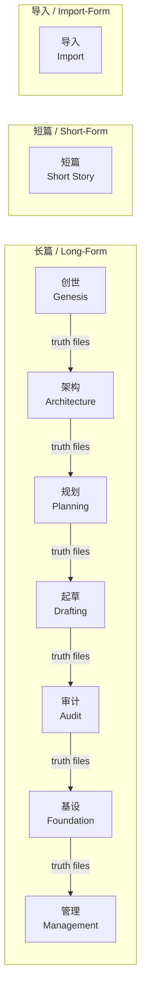
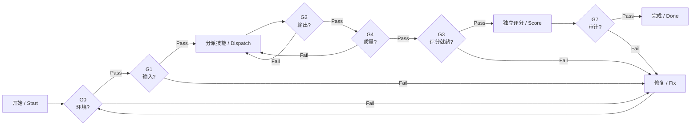
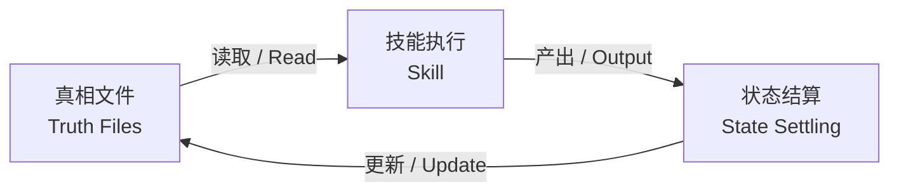

# 架构概览

# Architecture Overview

---

## 流水线

Shenbi 的长篇小说创作沿一条多阶段流水线推进：创世 → 架构 → 规划 → 起草 → 审计 → 基设 → 管理。短篇与导入形态各自走独立的单阶段路径。阶段之间不直接传递数据——所有上下文都通过**真相文件**流动，确保每个技能都能从持久化项目状态中读取一致的输入。

框架定义了三条 T3 端到端流水线（源自 `tests/tiers/deps.json` 的 `t3-pipelines`）：

| 流水线 | 阶段序列 |
|--------|----------|
| 长篇 Long-form | genesis → architecture → planning → drafting → audit → foundation → management |
| 短篇 Short-form | short-story |
| 导入 Import-form | import |

> 数据在阶段之间通过真相文件流转。

### The Pipeline

Shenbi's long-form novel writing advances along a multi-stage pipeline: genesis → architecture → planning → drafting → audit → foundation → management. Short-form and import-form each follow their own single-stage paths. Phases never hand data directly to each other — all context flows through **truth files**, ensuring every skill reads consistent input from a persistent project state.

The framework defines three T3 end-to-end pipelines (from `tests/tiers/deps.json`, key `t3-pipelines`):

| Pipeline | Phase Sequence |
|----------|----------------|
| Long-form | genesis → architecture → planning → drafting → audit → foundation → management |
| Short-form | short-story |
| Import-form | import |

> Data flows between phases via truth files.

---

## 门控链

质量不是事后的打分，而是门控（Gate）的强制保证。八道门（G0–G7）分布在创建、分派、产出、评分、阶段边界、流水线完整性和收尾审计各环节。G0 环境门若未通过，必须修复后重新检查；G2 或 G4 未通过的产出不会进入评分；而评分**必须**由独立子代理完成（G3.4），分派方自行评分的结果无效。

| 门控 | 检查点 | 职责 |
|------|--------|------|
| G0 | 创建轮次 | 环境完整性：工具哈希、夹具纯净度、progress.json 一致性 |
| G1 | 分派前 | 输入文件验证 |
| G2 | 产出验证 | 产出文件结构与内容验证 |
| G3 | 评分就绪 | 评分前置条件检查 |
| G4 | 技能质量 | 技能专属结构检查 + 门控标记生成 |
| G5 | 阶段边界 | T2 阶段过渡验证 |
| G6 | 流水线完整性 | T3 端到端验证 |
| G7 | 轮次后审计 | 轮次收尾审计：工具篡改、门控不匹配 |

> 注：此图展示的是每次分派的质量循环。G5（阶段边界）与 G6（流水线完整性）分别在 T2 阶段过渡与 T3 流水线边界触发，处于该逐技能循环之外。

### The Gate Chain

Quality is not a retrospective score; it is enforced by Gates. Eight gates (G0–G7) sit at creation, dispatch, output, scoring, phase boundaries, pipeline integrity, and post-round audit. A blocked G0 environment gate must be fixed and re-checked; output that fails G2 or G4 is never scored; and scoring **must** be performed by an independent sub-agent (G3.4) — dispatcher-scored results are invalid.

| Gate | Checkpoint | Purpose |
|------|-----------|---------|
| G0 | Round creation | Environment integrity: tool hashes, fixture purity, progress.json consistency |
| G1 | Pre-dispatch | Input file validation |
| G2 | Output validation | Output file structure and content validation |
| G3 | Scoring readiness | Scoring precondition check |
| G4 | Skill quality | Skill-specific structural check + gate marker generation |
| G5 | Phase boundary | T2 phase transition validation |
| G6 | Pipeline integrity | T3 end-to-end validation |
| G7 | Post-round audit | Round closure audit: tool tamper, gate mismatch |

> Note: This diagram shows the per-dispatch quality loop. G5 (phase boundary) and G6 (pipeline integrity) fire at T2 phase transitions and T3 pipeline boundaries respectively, outside this per-skill loop.

---

## 评分层级

Shenbi 采用三层测试，全部以 **94 分**为通过门槛（源自 `tests/tiers/acceptance.json`），收敛目标为满分 100。三种测试类型各有侧重：generative 生成产出并评分；bug-hunt 检测注入缺陷；clean 审查干净输入，幻觉出的缺陷直接记 0 分。

| 层级 | 范围 | 门槛 |
|------|------|------|
| T1 | 单技能 | ≥ 94 |
| T2 | 单阶段（9 个阶段） | ≥ 94 |
| T3 | 端到端（3 条流水线） | ≥ 94 |

三种测试类型：generative（生成产出并评分）、bug-hunt（检测注入缺陷）、clean（审查干净输入；幻觉出的缺陷记 0 分）。

收敛目标为 100。低于 94 时进入修复循环：阅读评分报告，定位根因（缺失模板 / 评分细则冲突 / 产出缺陷），修复后重新运行。

### The Scoring Tiers

Shenbi uses a three-tier testing scheme, all gated at a **94** pass threshold (from `tests/tiers/acceptance.json`), with a convergence target of a perfect 100. Three test types each probe a different dimension: generative generates output and scores it; bug-hunt detects injected defects; clean reviews clean input, where a hallucinated defect scores 0.

| Tier | Scope | Threshold |
|------|-------|-----------|
| T1 | Per-skill | ≥ 94 |
| T2 | Per-phase (9 phases) | ≥ 94 |
| T3 | End-to-end (3 pipelines) | ≥ 94 |

Three test types: generative (generate output and score), bug-hunt (detect injected defects), clean (review clean input; a hallucinated defect scores 0).

Convergence target: 100. A repair loop handles scores below 94: read the scoring report, identify the root cause (missing template / rubric conflict / output defect), fix, and re-run.

---

## 真相文件

**真相文件**是技能之间共享项目状态的唯一通道。每个技能读取真相文件获取当前状态，执行任务，再由状态结算环节提取变更并更新真相文件，形成闭环。这使得阶段之间无需直接通信即可保持上下文一致。

`docs/framework/truth-files.yaml` 共定义了 15 种 `kind` 值。以下为核心五类：

| 类别 | 示例文件 |
|------|----------|
| Config 配置 | `novel.json`, `genre-config.json` |
| World 世界 | `world/story_bible.md`, `world/rules.md`, `world/locations.md`, `world/power_system.md`, `world/factions.md` |
| Character 角色 | `characters/protagonist.md`, `characters/relationships.md` |
| Outline 大纲 | `outline/story_frame.md`, `outline/volume_map.md`, `outline/rhythm_principles.md`, `outline/thread_map.md` |
| Truth 状态 | `truth/current_state.md`, `truth/pending_hooks.md`, `truth/chapter_summaries.md`, `truth/character_matrix.md`, `truth/emotional_arcs.md` |

> 完整 15 类见 `docs/framework/truth-files.yaml`。

工作流：读取（技能读取真相文件获取当前状态）→ 执行（技能执行任务）→ 更新（状态结算提取变更并更新真相文件）。

### Truth Files

**Truth files** are the sole channel through which skills share project state. Each skill reads truth files for current state, performs its task, and a state-settling step extracts the changes and updates the truth files — a closed loop. This lets phases stay contextually consistent without communicating directly.

`docs/framework/truth-files.yaml` defines 15 `kind` values in total. The five core categories:

| Category | Example Files |
|----------|---------------|
| Config | `novel.json`, `genre-config.json` |
| World | `world/story_bible.md`, `world/rules.md`, `world/locations.md`, `world/power_system.md`, `world/factions.md` |
| Character | `characters/protagonist.md`, `characters/relationships.md` |
| Outline | `outline/story_frame.md`, `outline/volume_map.md`, `outline/rhythm_principles.md`, `outline/thread_map.md` |
| Truth | `truth/current_state.md`, `truth/pending_hooks.md`, `truth/chapter_summaries.md`, `truth/character_matrix.md`, `truth/emotional_arcs.md` |

> The full 15 categories live in `docs/framework/truth-files.yaml`.

Workflow: Read (the skill reads truth files for current state) → Execute (the skill performs its task) → Update (state settling extracts changes and updates the truth files).
