# Shenbi Phase 1: Core Pipeline Implementation Plan

> **For agentic workers:** REQUIRED SUB-SKILL: Use superpowers:subagent-driven-development (recommended) or superpowers:executing-plans to implement this plan task-by-task. Steps use checkbox (`- [ ]`) syntax for tracking.

**Goal:** Build the minimum viable Shenbi pipeline — from worldbuilding to chapter drafting, anti-AI review, and revision — so a human can create a novel project and produce a reviewed chapter.

**Architecture:** Pure SKILL.md skill framework. Each skill is a markdown file with YAML frontmatter, DOT flowcharts, anti-rationalization tables, and detailed prompt instructions. Skills communicate through a shared file system (the novel project directory). The `using-shenbi` dispatcher loads at session start and routes to appropriate skills.

**Tech Stack:** Markdown (SKILL.md), YAML frontmatter, DOT/GraphViz flowcharts, bash (hooks)

**Spec:** `docs/specs/2026-06-08-shenbi-design.md` (v0.1.1)

**Scope:** Phase 1 only — 11 skills that form the end-to-end writing pipeline. Phases 2-5 get separate plans.

**Phase 1 Limitations:**
- No foreshadowing lifecycle management (plant→track→resolve chain requires Phase 3)
- State-settling only updates hook `last_reinforced`/`subtlety`, does not advance hook states
- Only 1 of 18 audit skills (review-anti-ai). No continuity, pacing, character, or foreshadowing review
- No style learning, no import pipeline, no length normalizing
- No volume management or consolidation
- These gaps are by design — Phase 1 proves the core workflow, Phases 2-5 fill the gaps

---

## File Structure

```
shenbi/
├── CLAUDE.md
├── skills/
│   ├── using-shenbi/
│   │   └── SKILL.md
│   ├── shenbi-writing-skills/
│   │   └── SKILL.md
│   ├── shenbi-worldbuilding/
│   │   └── SKILL.md
│   ├── shenbi-character-design/
│   │   └── SKILL.md
│   ├── shenbi-story-architecture/
│   │   └── SKILL.md
│   ├── shenbi-chapter-planning/
│   │   └── SKILL.md
│   ├── shenbi-context-composing/
│   │   └── SKILL.md
│   ├── shenbi-chapter-drafting/
│   │   ├── SKILL.md
│   │   └── anti-ai-reference.md
│   ├── shenbi-state-settling/
│   │   ├── SKILL.md
│   │   └── truth-files-reference.md
│   ├── shenbi-review-anti-ai/
│   │   ├── SKILL.md
│   │   └── checklist.md
│   └── shenbi-chapter-revision/
│       ├── SKILL.md
│       └── revision-modes.md
├── docs/
│   ├── specs/
│   │   └── 2026-06-08-shenbi-design.md
│   └── shenbi/
│       └── plans/
│           └── 2026-06-08-phase1-core-pipeline.md
└── tests/
    └── pressure-tests/
        └── prompts/
```

---

## Task 1: Project Scaffold + CLAUDE.md

**Files:**
- Create: `CLAUDE.md`

- [ ] **Step 1: Create CLAUDE.md**

```markdown
# Shenbi (神笔) 贡献者指南

## 项目定位

Shenbi 是一套小说写作 AI 技能框架。每个技能是一个 SKILL.md 文件，指导 AI agent 完成小说创作的特定环节。

## 技能规范

- 每个技能位于 `skills/<skill-name>/SKILL.md`
- Frontmatter: `name`（仅字母数字连字符）+ `description`（只描述触发条件，≤500字符）
- 描述陷阱：description 绝不描述技能做什么，只描述何时使用
- 关键技能使用 DOT 流程图定义权威流程（DOT 是规范文档，不需要自动化渲染；如需渲染，添加 `charset="utf-8"` 和 CJK 字体声明）
- 每个纪律性技能包含反理性化表格

## 术语约定

- "your human partner" — 与 agent 协作的人类创作者，不用 "the user"
- "truth files" — 小说项目中的真相文件（世界状态、伏笔池等）
- "chapter memo" — 8段式章节备忘

## 提交规范

使用 [Conventional Commits](https://www.conventionalcommits.org/) 格式：
- `feat: add shenbi-worldbuilding skill`
- `fix: correct anti-rationalization table in review-anti-ai`
```

- [ ] **Step 2: Create directory structure**

```bash
mkdir -p skills/using-shenbi
mkdir -p skills/shenbi-writing-skills
mkdir -p skills/shenbi-worldbuilding
mkdir -p skills/shenbi-character-design
mkdir -p skills/shenbi-story-architecture
mkdir -p skills/shenbi-chapter-planning
mkdir -p skills/shenbi-context-composing
mkdir -p skills/shenbi-chapter-drafting
mkdir -p skills/shenbi-state-settling
mkdir -p skills/shenbi-review-anti-ai
mkdir -p skills/shenbi-chapter-revision
mkdir -p tests/pressure-tests/prompts
```

- [ ] **Step 3: Commit**

```bash
git add -A
git commit -m "feat: initialize project scaffold with CLAUDE.md"
```

---

## Task 2: shenbi-writing-skills (Meta-Skill)

**Files:**
- Create: `skills/shenbi-writing-skills/SKILL.md`

- [ ] **Step 1: Write SKILL.md**

```markdown
---
name: shenbi-writing-skills
description: Use when creating or modifying any shenbi skill — guides the design, testing, and iteration of new novel-writing skills
---

# 编写 Shenbi 技能

YOU MUST follow this skill when creating or modifying any `skills/shenbi-*/SKILL.md` file.

## 技能设计流程

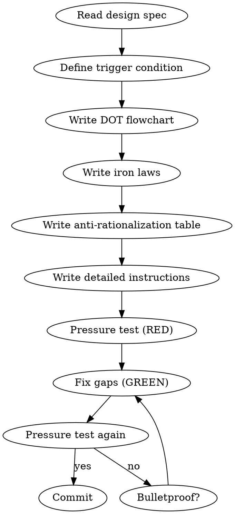

## Frontmatter 规则

```yaml
---
name: skill-name          # 仅字母、数字、连字符
description: Use when ...  # 只描述触发条件，≤500字符
---
```

### 描述陷阱

description 如果包含流程摘要，agent 会只读描述而跳过技能主体。

| Thought | Reality |
|---------|---------|
| "Brief description helps the agent" | Agent skips the full skill if description answers "what does it do" |
| "I should explain the workflow here" | Description = trigger condition only. Workflow goes in the body. |

## 技能必须包含的元素

### 1. DOT 流程图

关键技能必须用 DOT 定义权威流程。叙述文本作为补充，不是权威来源。

### 2. 铁律

关键规则使用绝对语言，不使用"通常"、"建议"、"推荐"：

```
NO WORLD RULES WITHOUT CHECKING EXISTING TRUTH FILES FIRST
```

### 3. 反理性化表格

每个纪律性技能列举 AI 的偷懒借口及反驳：

| Excuse | Reality |
|--------|---------|
| "This chapter doesn't need foreshadowing" | Simple chapters are the best time to plant hooks |
| "Readers won't notice" | Web novel readers have exceptional memory for details |

### 4. 红旗检查表

自我检查触发器：

```markdown
## Red Flags — Stop and Check

- [ ] Did I skip reading truth files before writing?
- [ ] Did I proceed without human approval at a gate?
- [ ] Did I assume something instead of asking?
```

## 说服心理学

使用以下原则（基于 Meincke et al. 2025, N=28,000）：

| 原则 | 应用 |
|------|------|
| **Authority** | "YOU MUST"、"No exceptions" |
| **Commitment** | TodoWrite 追踪、要求公开声明 |
| **Scarcity** | "Before proceeding"、"IMMEDIATELY after" |
| **Social Proof** | "Every chapter"、"X without Y = failure" |
| **Unity** | "your human partner"、"we're creating together" |

**不使用** Liking（导致谄媚）和 Reciprocity（感觉操控）。

## 压力测试方法论

### RED 阶段

1. 选择一个该技能应覆盖的场景
2. 不加载技能，让 agent 面对场景
3. 记录 agent 的 rationalization（偷懒借口）
4. 这些 rationalization 就是技能必须堵住的漏洞

### GREEN 阶段

1. 将记录的 rationalization 转化为反理性化表格条目
2. 编写最小技能内容来应对那些特定的 rationalization
3. 重新运行场景，验证行为改善

### REFACTOR 阶段

1. 发现新的 rationalization 漏洞
2. 补充反制措施
3. 重复直到 bulletproof

## 领域特有理性化模式

以下是小说写作领域的常见理性化借口，每个纪律性技能必须覆盖相关的条目：

| 借口 | 现实 |
|------|------|
| "这章太简单了，不需要伏笔" | 简单章节恰好是埋伏笔的最佳时机 |
| "读者不会注意到这个小矛盾" | 网文读者会逐章追更，记忆力极强 |
| "先写完再检查一致性" | 等写到20章再回来修，改动的代价是10倍 |
| "这个角色不需要这么复杂" | 配角降智是网文最大毒点之一 |
| "爽点不需要铺垫，直接给" | 没有压制的爆发是白开水 |
| "这章字数不够，加段描写凑一下" | 无功能的水文比字数不足更致命 |
| "前面已经提过了，读者记得" | 5章前的细节读者记不住，需要自然提醒 |
| "文风不重要，故事好就行" | AI味一重，平台检测直接降权 |
| "主角不能在这里失败" | 无挫折的成功 = 无张力的流水账 |
| "这条伏笔太久了，算了放弃" | 放弃伏笔 = 违背读者信任，Chase Power 债务暴增 |
```

- [ ] **Step 2: Commit**

```bash
git add skills/shenbi-writing-skills/SKILL.md
git commit -m "feat: add shenbi-writing-skills meta-skill"
```

---

## Task 3: using-shenbi (Skill Dispatcher)

**Files:**
- Create: `skills/using-shenbi/SKILL.md`

- [ ] **Step 1: Write SKILL.md**

```markdown
---
name: using-shenbi
description: Use when starting any conversation — establishes skill discovery and trigger rules for the shenbi novel writing skill system
---

# Using Shenbi

YOU MUST check for applicable shenbi skills before responding to your human partner — even before asking clarifying questions.

## 1% Rule

If there is a 1% chance that a shenbi skill could apply to the current task, you MUST check it. Checking costs seconds; skipping costs chapters.

## Skill Check Order

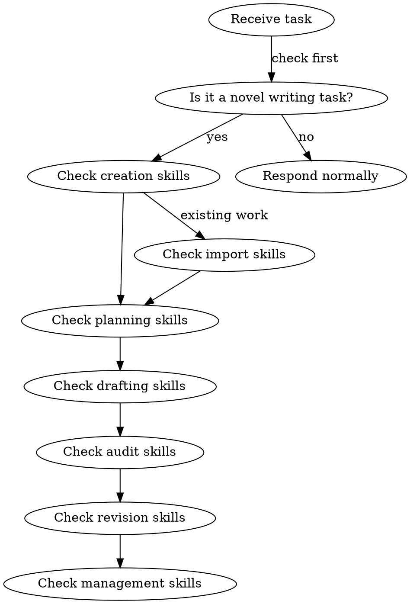

## Skill Trigger Map

| Your human partner says... | Load skill |
|---------------------------|------------|
| "我要写一本小说" / "帮我建世界观" / "创建小说" | shenbi-worldbuilding |
| "设计角色" / "角色卡" / "人物" | shenbi-character-design |
| "故事框架" / "大纲" / "整体架构" | shenbi-story-architecture |
| "写下一章" / "章节规划" / "下一章写什么" | shenbi-chapter-planning |
| "组装上下文" / "准备写作素材" / "收集上下文" | shenbi-context-composing |
| "帮我写这章" / "起草" / "写正文" | shenbi-chapter-drafting |
| "结算" / "更新状态" / "提取变化" | shenbi-state-settling |
| "字数调整" / "扩写" / "压缩" / "字数不够" | shenbi-length-normalizing |
| "检查这章" / "审计" / "审查" | shenbi-review-anti-ai (default) + activated audit skills |
| "修改这章" / "修订" / "这段有问题" | shenbi-chapter-revision |
| "润色" / "打磨" / "文字" | shenbi-style-polishing |
| "去AI味" / "反检测" | shenbi-anti-detect |
| "建地点" / "场景设计" | shenbi-location-builder |
| "力量体系" / "修炼等级" | shenbi-power-system |
| "势力" / "门派" / "组织" | shenbi-faction-builder |
| "关系" / "角色关系" | shenbi-relationship-map |
| "节奏" / "张弛" | shenbi-pacing-design |
| "线索" / "主线支线" | shenbi-plot-thread-weaver |
| "伏笔" / "埋线" / "hook" | shenbi-foreshadowing-plant |
| "伏笔追踪" / "hook状态" | shenbi-foreshadowing-track |
| "伏笔兑现" / "收线" | shenbi-foreshadowing-resolve |
| "导入" / "分析已有作品" | shenbi-import-analysis |
| "文风" / "风格学习" | shenbi-style-learning |
| "短篇" | shenbi-short-outline |
| "续写" | shenbi-sequel-writing |
| "平台趋势" / "市场" | shenbi-market-radar |
| "改题材配置" / "疲劳词" | shenbi-genre-config |
| "同步状态" / "重新提取" | shenbi-truth-sync |
| "回滚" / "快照" | shenbi-snapshot-manage |
| "卷完成" / "卷总结" | shenbi-volume-consolidation |
| "基础设定审核" / "设定打分" | shenbi-foundation-review |
| "纠偏" / "下一章注意" | shenbi-drift-guidance |
| "作者意图" / "长期目标" | shenbi-intent-management |
| "章节模式" / "模式检测" | shenbi-chapter-pattern |
| novel-related request that matches nothing above | Check full skill list in design spec Section 8 |

## Red Flags — Stop and Check

| Thought | Reality |
|---------|---------|
| "This is just a simple question about the novel" | Questions are tasks. Check for skills. |
| "I know what they want" | Knowing the concept ≠ using the right skill. |
| "I'll just start writing" | Writing without planning violates the HARD-GATE. |
| "The skill seems overkill for this" | The 1% rule applies. No exceptions. |
| "I'll check skills after asking clarifying questions" | Skill check comes BEFORE clarifying questions. |

## HARD-GATE: No Drafting Without Foundation

NEVER write chapter content without:

1. A completed novel project directory (Section 4 of design spec)
2. At minimum: `novel.json`, `outline/story_frame.md`, `characters/protagonist.md`
3. A chapter plan (`plans/chapter-N-plan.md`) for the target chapter

If your human partner asks to write before these exist, load the appropriate creation/planning skills first.

## Novel Project Directory

When working with a novel project, the directory structure is defined in `docs/specs/2026-06-08-shenbi-design.md` Section 4. Verify the structure exists before proceeding with any skill.

## Audit Activation

Default audits (always run): review-anti-ai, review-continuity, review-character, review-sensitivity

Additional audits activate based on `genre-config.json` in the novel project. See design spec Section 7.4 for activation rules.
```

- [ ] **Step 2: Commit**

```bash
git add skills/using-shenbi/SKILL.md
git commit -m "feat: add using-shenbi skill dispatcher with trigger map"
```

---

## Task 4: shenbi-worldbuilding

**Files:**
- Create: `skills/shenbi-worldbuilding/SKILL.md`

- [ ] **Step 1: Write SKILL.md**

```markdown
---
name: shenbi-worldbuilding
description: Use when creating a new novel's world, building story bible, or designing setting rules, geography, and social structure
---

# 世界观构建

HARD-GATE: 在世界观未完成并获得人类合作者批准前，不得进入角色设计或故事框架阶段。

## 流程

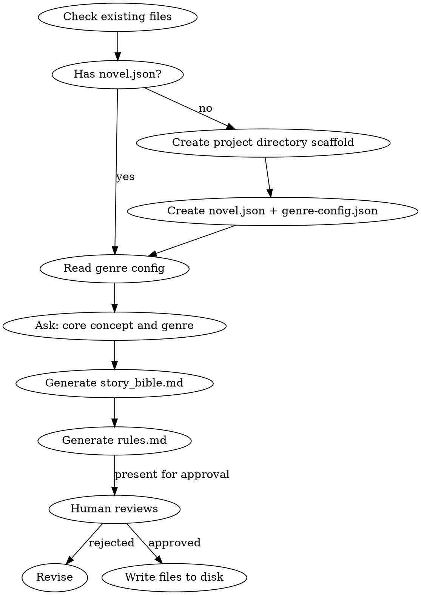

## 铁律

1. **NO BULLET-POINT WORLDS** — 世界观以散文形式输出，不是表格、不是 schema、不是条目化 bullet。每个设定段落是一段连贯的叙述。
2. **前台故事 + 后台故事** — story_bible.md 必须包含两条线：读者看到的前台冲突，和贯穿全书的后台暗线。
3. **世界铁律写在 rules.md** — 硬性规则（物理法则、社会禁忌、力量上限）独立存放，writer 和 auditor 直接引用。
4. **去重原则** — 同一事实只出现在一个文件中。genre/core_concept/themes 只在 `novel.json` 定义。
5. **项目目录初始化** — 如果小说项目目录不存在，worldbuilding 必须先创建完整目录结构（参见设计规范 Section 4）。

## 输出契约

写以下文件到小说项目目录：

| 文件 | 内容 |
|------|------|
| `novel.json` | 标题、题材、语言、状态 |
| `genre-config.json` | 疲劳词、审计维度、节奏规则 |
| `world/story_bible.md` | 世界观圣经（散文，4段式） |
| `world/rules.md` | 世界铁律（最多10条） |
| `world/locations.md` | 初始地点图谱（3-5个核心地点） |

### story_bible.md 结构

```markdown
# 世界观圣经

> genre/core_concept/themes 存储在 `novel.json`，不在此处重复

## 第一段：天地法则
[世界运行的基本规则，力量体系的来源]

## 第二段：社会格局
[势力分布、阶层结构、权力拓扑]

## 第三段：历史纵深
[关键历史事件，塑造当前格局的过去]

## 第四段：暗流涌动
[表面平静下涌动的矛盾，为后续冲突埋种子]
```

## Anti-Rationalization

| Excuse | Reality |
|--------|---------|
| "世界观只需要简单几条规则" | 薄世界观 = 30章后无素材可用，writer 不断重复 |
| "先写故事，世界观后面补" | 没有世界观约束，writer 每章都在发明新规则 |
| "规则太多会限制创作" | 好的约束激发创意，没有约束导致随意 |
| "读者不关心世界观" | 网文读者对设定矛盾极其敏感，会逐章对比 |
| "我直接用通用的玄幻设定" | 同质化设定 = 没有记忆点 = 读者弃书 |

## 询问流程

1. 你的小说标题是什么？
2. 核心概念一句话概括？（"如果 ___ 发生了会怎样？"）
3. 题材方向？（玄幻/仙侠/都市/科幻/历史/...）
4. 有参考作品吗？（提供对标，不是模仿）
5. 世界观的"暗"是什么？（表面平静下最大的矛盾）

每个问题等待人类合作者回答后再问下一个。获得足够信息后生成输出，呈交审批。
```

- [ ] **Step 2: Commit**

```bash
git add skills/shenbi-worldbuilding/SKILL.md
git commit -m "feat: add shenbi-worldbuilding skill"
```

---

## Task 5: shenbi-character-design

**Files:**
- Create: `skills/shenbi-character-design/SKILL.md`

- [ ] **Step 1: Write SKILL.md**

```markdown
---
name: shenbi-character-design
description: Use when creating or refining character profiles, designing character arcs, voice profiles, or personality systems
---

# 角色设计

## 流程

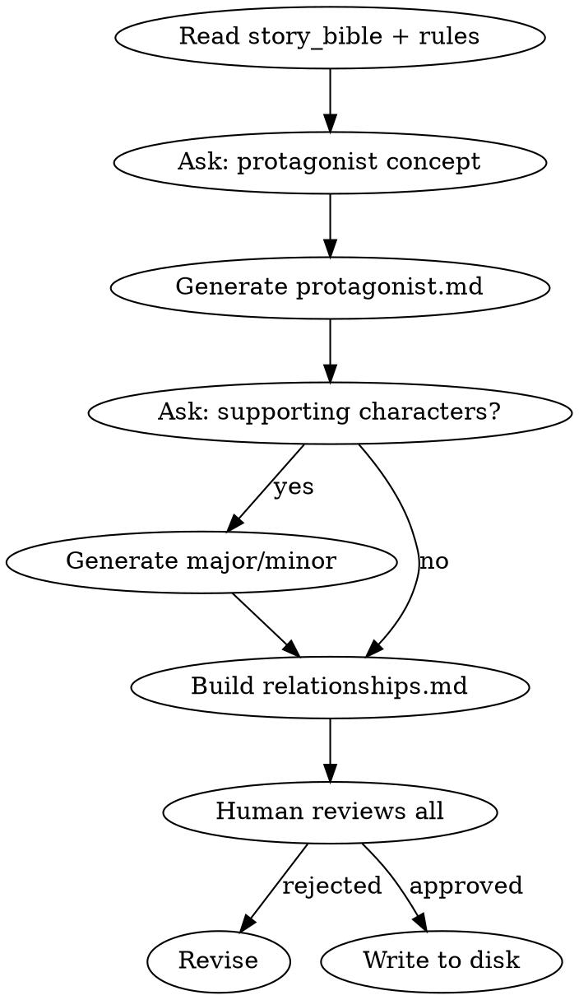

## 铁律

1. **一人一卡** — 每个角色独立文件，不把多个角色塞进同一个文件
2. **主角弧线单一权威** — 主角的成长弧线只写在 `characters/protagonist.md`，不在 story_bible 中重复
3. **voice_profile 必填** — 每个主要角色必须有说话风格指纹（speech_patterns, catchphrases, avoid_patterns）
4. **去重原则** — 角色的性格底色只写在角色卡，不在关系文件中重复

## 输出文件

| 文件 | 内容 |
|------|------|
| `characters/protagonist.md` | 主角档案（含 voice_profile） |
| `characters/major/*.md` | 主要角色档案（含 voice_profile） |
| `characters/minor/*.md` | 次要角色档案（简化版） |
| `characters/relationships.md` | 角色关系矩阵 |

### 角色档案格式

```markdown
---
name: 角色名
role: protagonist | major | minor
personality_tags: ["标签1", "标签2", "标签3"]
core_value: "核心价值观"
goal_surface: "表面目标"
goal_deep: "深层动机"
fear: "核心恐惧"
arc_type: GROWTH | FALL | FLAT | REDEMPTION
arc_starting: "起始状态"
arc_turning: "转折事件"
arc_ending: "终态（可为TBD）"
voice_profile:
  speech_patterns: ["模式1", "模式2"]
  catchphrases: ["口头禅"]
  avoid_patterns: ["避免的模式"]
---
```

### relationships.md 格式

关系矩阵以表格形式维护：

```markdown
# 角色关系矩阵

| 角色 | 对主角 | 对反派 | 对师姐 |
|------|--------|--------|--------|
| 主角 | — | 敌对/竞争 | 信任/师徒 |
| 反派 | 蔑视/利用 | — | 昔日同门 |
```

## Anti-Rationalization

| Excuse | Reality |
|--------|---------|
| "配角不需要 voice_profile" | 没有声音指纹的配角说话都一个味 |
| "角色关系后面自然就知道了" | 不写下来 = 3章后关系混乱，auditor 报 OOC |
| "主角弧线可以先不定义" | 没有弧线的主角 = 流水账主角 |
| "minor 角色随便写就行" | minor 角色降智 = 毒点 |

## 询问流程

1. 你的主角是什么样的人？（性格关键词）
2. 主角最想要什么？（表面 vs 深层）
3. 主角最害怕什么？
4. 有重要配角吗？他们和主角的关系是什么？
5. 有反派吗？反派的动机是什么？
```

- [ ] **Step 2: Commit**

```bash
git add skills/shenbi-character-design/SKILL.md
git commit -m "feat: add shenbi-character-design skill"
```

---

## Task 6: shenbi-story-architecture

**Files:**
- Create: `skills/shenbi-story-architecture/SKILL.md`

- [ ] **Step 1: Write SKILL.md**

```markdown
---
name: shenbi-story-architecture
description: Use when designing the overall story structure, creating story frame, volume map, or defining core conflicts and objectives
---

# 故事架构

HARD-GATE: 故事框架必须在世界观和角色完成后才能开始。

## 流程

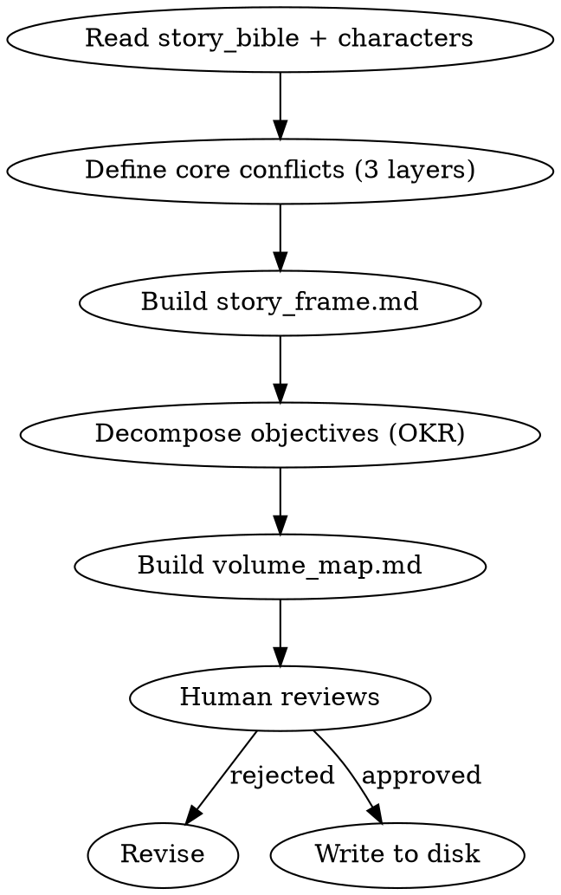

## 铁律

1. **双线必写** — story_frame.md 必须包含前台故事（读者每章看到的表面冲突）和后台故事（贯穿全书的暗线）
2. **OKR 递归分解** — 全书 Objective → 每卷 Key Results → planner 据此分解章节任务
3. **核心冲突三层** — surface（表面矛盾）、personal（主角个人困境）、deep（主题层面的终极问题）
4. **散文骨架** — 输出散文段落，不是条目列表

## 核心冲突三层

| 层级 | 说明 | 示例（玄幻） |
|------|------|-------------|
| Surface | 推动情节的外部矛盾 | 门派选拔赛、资源争夺 |
| Personal | 主角内心的困境 | 身份认同、信任背叛 |
| Deep | 全书探讨的主题问题 | 力量与自由的代价 |

## 输出文件

| 文件 | 内容 |
|------|------|
| `outline/story_frame.md` | 散文骨架（4段），YAML frontmatter 含三层冲突定义 |
| `outline/volume_map.md` | 分卷地图，每卷含 objective + key results |
| `outline/rhythm_principles.md` | 节奏原则（独立文件） |

### story_frame.md 结构

> genre/core_concept/themes 已在 `novel.json` 定义，此处不重复。story_frame.md 只存储 story-architecture 特有的冲突定义。

```markdown
---
surface_conflict: "外部矛盾"
personal_conflict: "主角困境"
deep_conflict: "主题问题"
---

# 故事框架

## 段1：前台故事
[读者从第1章开始看到的表面线索，以散文叙述]

## 段2：后台故事
[贯穿全书的暗线，不在第1章暴露，以散文叙述]

## 段3：主角旅程
[从起点到终点的弧线概述]

## 段4：暗流伏笔种子
[为后续伏笔系统提供的种子方向]
```

### volume_map.md 结构

```markdown
# 分卷地图

## 第一卷：卷名

**Objective**: 本卷核心目标

**Key Results**:
1. KR1（第1-5章完成）
2. KR2（第6-10章完成）
3. KR3（第11-15章完成）

**节奏原则**: 本卷的张力曲线描述

**跨卷衔接**: 本卷结尾如何过渡到下一卷
```

## Anti-Rationalization

| Excuse | Reality |
|--------|---------|
| "先写第一章再说大纲" | 没有框架的第一章 = 写到10章必定偏航 |
| "网文不需要这么复杂的结构" | 读者看不出来 ≠ 读者感觉不到。好的结构是"不知不觉被吸引" |
| "大纲会限制 spontaneity" | 大纲是轨道，不是牢笼。轨道让速度有意义 |
| "卷纲太细了，后面会改的" | 改大纲的代价 << 改50章正文的代价 |
```

- [ ] **Step 2: Commit**

```bash
git add skills/shenbi-story-architecture/SKILL.md
git commit -m "feat: add shenbi-story-architecture skill"
```

---

## Task 7: shenbi-chapter-planning

**Files:**
- Create: `skills/shenbi-chapter-planning/SKILL.md`

- [ ] **Step 1: Write SKILL.md**

```markdown
---
name: shenbi-chapter-planning
description: Use when planning the next chapter, generating chapter memo, or deciding what should happen in an upcoming chapter
---

# 章节规划

HARD-GATE: 不得在没有章节备忘的情况下起草正文。

## 流程

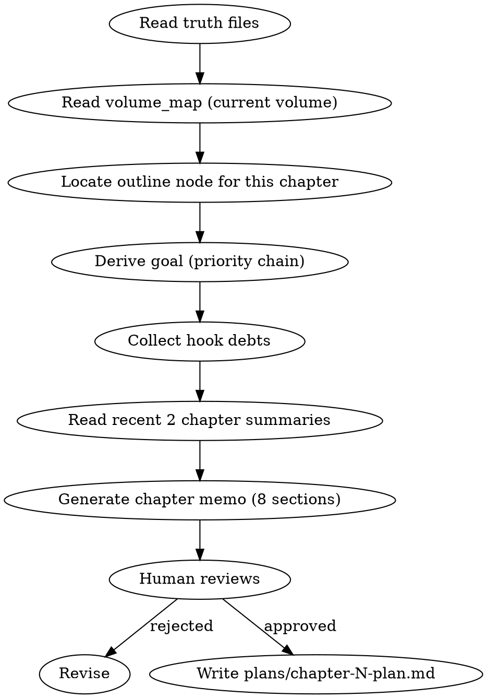

## 目标推导优先级链

```
外部指令 > 局部覆盖 > 卷纲 Key Result > current_focus.md > author_intent.md
```

高优先级覆盖低优先级。如果人类合作者给了具体指示，以指示为准。

## 章节备忘 8 段式

1. **当前任务** — 本章主角要完成的具体动作
2. **读者此刻在等什么** — 制造/延迟/兑现读者期待
3. **该兑现的 / 暂不掀的** — 伏笔兑现清单 + 压住不掀的底牌
4. **日常/过渡承担什么任务** — 非冲突段落的功能映射
5. **关键抉择过三连问** — Why / Interest / Persona
6. **章尾必须发生的改变** — 1-3条具体改变（信息/关系/物理/权力）
7. **本章 hook 账** — open / advance / resolve / defer 四种操作
8. **不要做** — 本章必须避免的事项（"无" / "N/A" 合法）

## 黄金三章纪律

当 chapterNumber ≤ 3 时，追加以下约束：
- 第1章：三面墙（建立世界观约束）+ 信息钩子（结尾给出读者必须知道的答案的线索）
- 第2章：验证主角特殊性 + 建立第一个对手
- 第3章：第一次小高潮 + 打开大主线钩子

## Hook 账本硬规则

- `pressured` 或 `near_payoff` 状态且沉默 ≥5 章的 hook 必须 advance 或 resolve
- `core_hook=true` 且过期 >10 章升级为 critical
- 每章 hook 操作总量建议 ≤8（密度预算）

## Anti-Rationalization

| Excuse | Reality |
|--------|---------|
| "这章不需要备忘，直接写" | 没有备忘的章节 = 随意漂移的章节 |
| "备忘太死板了" | 备忘是地图，不是牢笼。有地图的旅程更快 |
| "读者不会注意到备忘偏离" | 备忘偏离 = 承诺未兑现 = 读者信任下降 |
| "hook 账本太麻烦" | 不追踪伏笔 = 伏笔遗忘 = Chase Power 债务暴增 |

## 输出

写 `plans/chapter-N-plan.md`，格式参见设计规范 Section 4.4。
```

- [ ] **Step 2: Commit**

```bash
git add skills/shenbi-chapter-planning/SKILL.md
git commit -m "feat: add shenbi-chapter-planning skill"
```

---

## Task 8: shenbi-context-composing

**Files:**
- Create: `skills/shenbi-context-composing/SKILL.md`

- [ ] **Step 1: Write SKILL.md**

```markdown
---
name: shenbi-context-composing
description: Use when assembling context before drafting a chapter, collecting truth files, or preparing the writing context package
---

# 上下文组装

## 流程

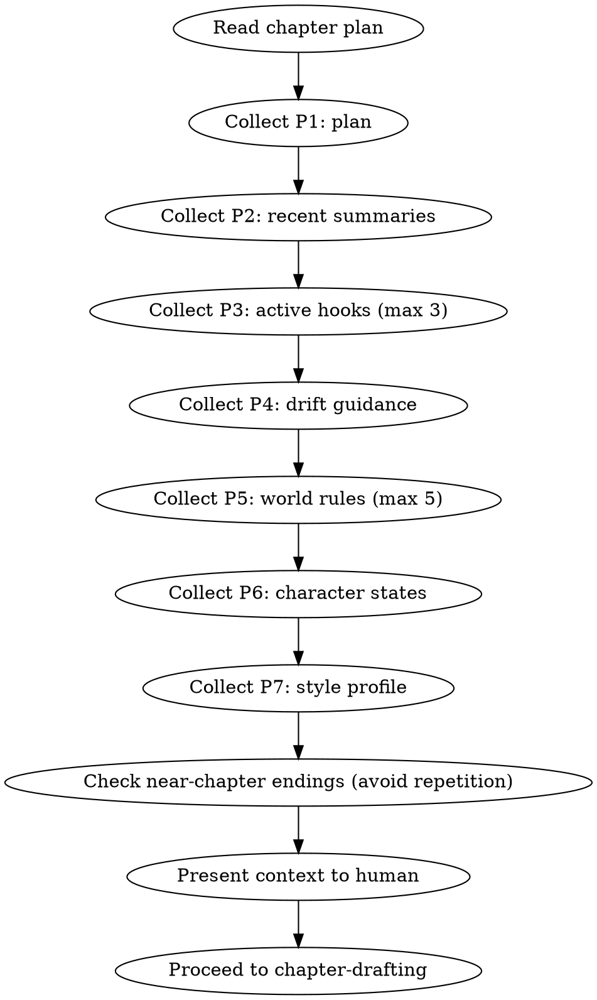

## 铁律

1. **优先级严格递减** — P1 不可省略，P7 最先被裁剪
2. **近章结尾轨迹** — 收集近 3 章的结尾方式，避免连续相同结尾结构（如连续3个崩塌式结尾）
3. **不自动检索** — 这是手动组装指南，由 AI 或人类按优先级从文件读取

## 上下文优先级

| 优先级 | 来源 | 文件位置 | 裁剪规则 |
|--------|------|---------|---------|
| P1 (must) | 章节备忘 | `plans/chapter-N-plan.md` | 不裁剪 |
| P2 (must) | 近 2 章摘要 | `truth/chapter_summaries.md` 末尾 | 不裁剪 |
| P3 (need) | 活跃伏笔 | `truth/pending_hooks.md` | 最多 3 条，按紧迫度排序 |
| P4 (need) | 纠偏指导 | `truth/audit_drift.md` | 不裁剪 |
| P5 (nice) | 世界铁律 | `world/rules.md` | 最多 5 条 |
| P6 (nice) | 角色状态 | `truth/character_matrix.md` | 仅本章出场角色 |
| P7 (nice) | 文风指纹 | `style/style_profile.md` | 仅摘要部分 |

## Hook 债务简报

从 pending_hooks.md 提取以下信息，以简报形式呈现：

```markdown
## Hook 债务简报

| Hook ID | 内容 | 状态 | 沉默章数 | 操作建议 |
|---------|------|------|---------|---------|
| hook-001 | 玉佩秘密 | PLANTED | 4/20 | advance |
| hook-002 | 老人预言 | RELEVANT | 2/15 | advance |
| hook-005 | 师姐身世 | PLANTED | 8/12 | URGENT advance |
```

紧迫度 = (current_chapter - last_reinforced) / max_distance

## Anti-Rationalization

| Excuse | Reality |
|--------|---------|
| "不需要收集这么多上下文" | 上下文不足 = 每章都在重新发明设定 |
| "近章结尾不需要检查" | 不检查 = 连续3个"轰然崩塌"式结尾 |
| "hook 债务简报可以省略" | 不看债务 = 过期伏笔 = 读者信任流失 |
```

- [ ] **Step 2: Commit**

```bash
git add skills/shenbi-context-composing/SKILL.md
git commit -m "feat: add shenbi-context-composing skill"
```

---

## Task 9: shenbi-chapter-drafting

**Files:**
- Create: `skills/shenbi-chapter-drafting/SKILL.md`
- Create: `skills/shenbi-chapter-drafting/anti-ai-reference.md`

- [ ] **Step 1: Write anti-ai-reference.md**

```markdown
# Anti-AI 参考手册

## 中文 AI 味铁律

### 句式禁令

| 禁止 | 替代 |
|------|------|
| "不是…而是…"句式 | 直接描述，不做对比转折 |
| 破折号 "——" | 用句号断句，或用冒号引出 |
| "他/她感到 X" | 用动作/生理反应表现情绪 |
| "全场震惊"类集体反应 | 写1-2个具体人物的反应 |
| 分析报告术语（"综上"、"由此可见"） | 用角色视角自然过渡 |

### 了字控制

- 连续 ≥6 句含"了" → 警告
- 替换策略：省略、换用"完/掉/好/走"等补语

### 转折词密度

每 3000 字最多 1 次以下词：
然而、不过、此时、突然、终于、于是

### AI 标记词（每章 ≤1 次/词）

似乎、仿佛、不由得、缓缓地、微微、不禁、淡淡的、嘴角微扬、瞳孔微缩

### 段落形状

- 段落变异系数 CV < 0.15（段落等长）→ AI 味警告
- 单段 > 300 字 → 警告
- ≥60% 叙事段 < 40 字 → 警告

## 正反例对照

| AI 味 | 人味 |
|-------|------|
| 他感到一股强烈的愤怒涌上心头 | 他捏碎了茶杯，碎片扎进掌心也没松手 |
| 突然间，整个广场都安静了下来，所有人都震惊地看着他 | 李长老停下了手中的茶杯。旁边的弟子们互相对视，没人敢先开口 |
| 不禁陷入了深深的思考 | 他盯着桌上那张纸，直到墨迹干透 |
| 微微一笑，似乎看穿了一切 | 他"嗤"了一声，转身走了 |

## 黄金三章纪律

第1-3章有额外约束：
- Ch1: 三面墙（世界约束）+ 信息钩子
- Ch2: 验证特殊性 + 建立第一个对手
- Ch3: 第一次小高潮 + 打开大主线
```

- [ ] **Step 2: Write SKILL.md**

```markdown
---
name: shenbi-chapter-drafting
description: Use when writing chapter content, generating chapter text, or drafting a new chapter after planning is complete
---

# 章节起草

HARD-GATE: 不得在没有章节备忘的情况下起草正文。

## 流程

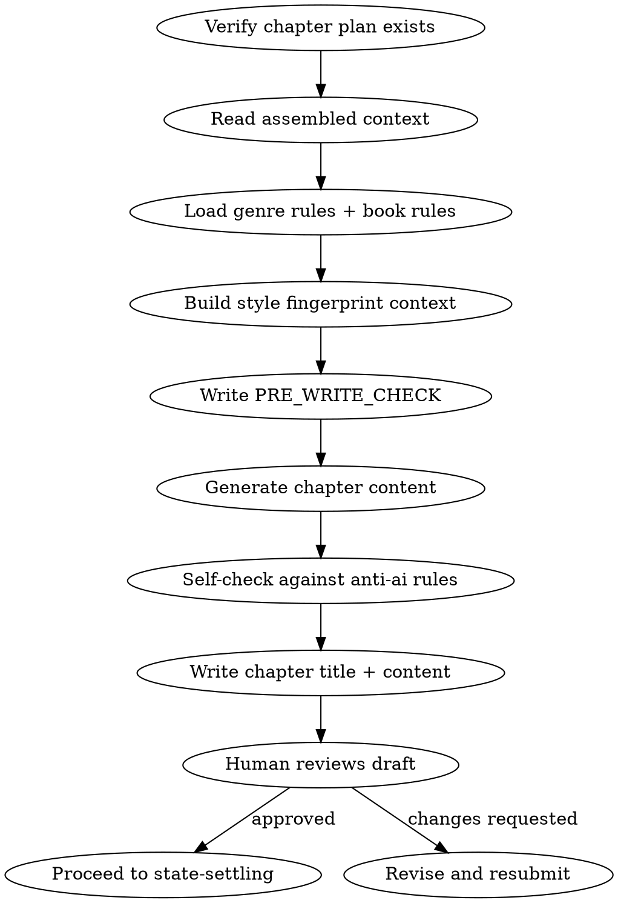

## 铁律

1. **NO CHAPTER WITHOUT A PLAN** — 没有章节备忘（`plans/chapter-N-plan.md`）就动笔 = 删除重来
2. **PRE_WRITE_CHECK 必写** — 起草前列出：本章核心任务、使用的伏笔、要避免的错误
3. **叙述者不替读者下结论** — 严禁"让人...感悟"、"引人...深思"类反思句
4. **正文严禁分析报告式语言** — 不出现 hook_id、账本数据、元叙事
5. **转折词密度 ≤ 1/3000字** — 然/不过/此时/突然/终于/于是
6. **参考 anti-ai-reference.md** — 所有 AI 味检查清单在 `anti-ai-reference.md`

## 写作自检表 (PRE_WRITE_CHECK)

起草前完成以下自检：

```
PRE_WRITE_CHECK:
- 本章核心任务: [从备忘第1段]
- 要兑现的伏笔: [从备忘第3段]
- 本章禁忌: [从备忘第8段]
- 近3章结尾方式: [避免重复]
- AI味重点防范: [根据最近的 audit_drift]
```

## 创作原则

1. **场景驱动而非叙述驱动** — 用动作和对话推进，不是内心独白
2. **Show don't tell** — 情绪用行为表现，不直接说"他感到愤怒"
3. **80/20 断章** — 章尾 20% 必须重新点燃好奇心
4. **段落呼吸** — 长短交替，不让视觉节奏单调
5. **对话指纹** — 角色说话必须匹配 voice_profile

## 输出

写 `chapters/chapter-N.md`：

```markdown
# 章节标题

[正文内容]
```

章节标题不要包含章节号（如"第一章"），文件名已编码章节号。

## Anti-Rationalization

| Excuse | Reality |
|--------|---------|
| "这章太简单了，不需要自检" | 越简单的章越容易暴露 AI 味 |
| "PRE_WRITE_CHECK 浪费时间" | 5分钟自检省30分钟返工 |
| "AI味读者看不出来" | 平台检测算法看得很清楚 |
| "先写完再检查" | 写完再改 = 重写。边写边注意 = 一次过 |
```

- [ ] **Step 3: Commit**

```bash
git add skills/shenbi-chapter-drafting/
git commit -m "feat: add shenbi-chapter-drafting skill with anti-ai reference"
```

---

## Task 10: shenbi-state-settling

**Files:**
- Create: `skills/shenbi-state-settling/SKILL.md`
- Create: `skills/shenbi-state-settling/truth-files-reference.md`

- [ ] **Step 1: Write truth-files-reference.md**

```markdown
# 真相文件参考

## 文件清单

| 文件 | 更新频率 | 说明 |
|------|---------|------|
| `truth/current_state.md` | 每章 | 角色位置、状态、活跃冲突、待办事件 |
| `truth/pending_hooks.md` | 每章 | 伏笔池状态 |
| `truth/chapter_summaries.md` | 每章 | 逐章摘要（追加） |
| `truth/character_matrix.md` | 每章 | 角色交互矩阵 + 信息边界 |
| `truth/particle_ledger.md` | 按需 | 物品/资源增减 |
| `truth/subplot_board.md` | 按需 | 支线进度 |
| `truth/emotional_arcs.md` | 按需 | 角色情感变化 |

## 更新原则

1. **只追加不修改** — chapter_summaries 是追加模式
2. **增量更新** — 只记录变化的部分，不重写整个文件
3. **YAML frontmatter 权威** — 结构化数据以 YAML 为准，Markdown body 是投影
4. **去重** — 同一事实只出现在一个文件中

## 9类事实变化

1. 位置变化 — 角色移动
2. 资源变化 — 获得或失去物品/金钱
3. 关系变化 — 角色间关系改变
4. 情绪变化 — 角色情感状态
5. 信息流动 — 谁知道了什么
6. 剧情线索 — 线索推进
7. 时间推进 — 故事时间流逝
8. 身体状态 — 受伤/恢复/变化
9. 行为变化 — 角色行为模式改变
```

- [ ] **Step 2: Write SKILL.md**

```markdown
---
name: shenbi-state-settling
description: Use when updating truth files after a chapter is drafted, extracting state changes, or settling world state
---

# 状态结算

在章节起草被人类合作者批准后，必须执行状态结算。

## 流程

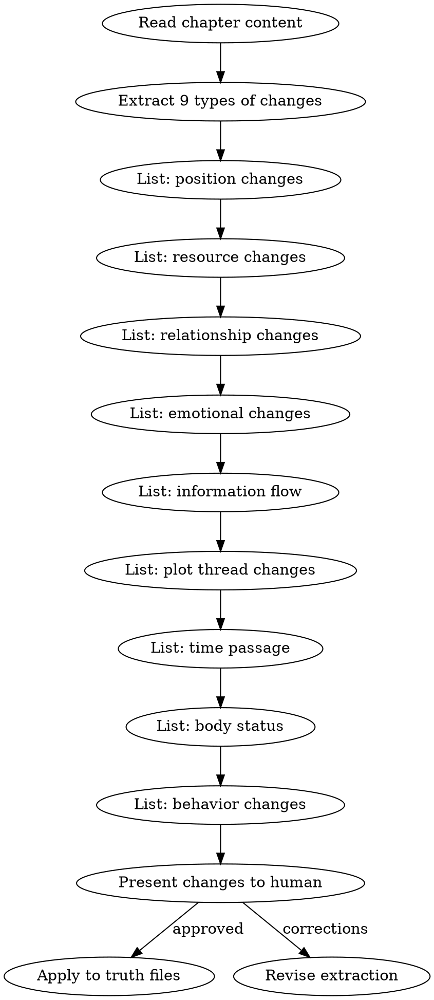

## 铁律

1. **只记录正文明确描述的变化** — 不推论、不猜测、不补充
2. **区分直接描写和暗示** — 直接描写的变更立即记录，暗示性的标注为"可能变更"
3. **人类批准后才写入** — 结算结果呈交人类审阅，批准后才更新 truth files
4. **增量更新** — 追加变更，不重写整个文件

## 提取模板

对每章提取以下格式的变化清单：

```markdown
## 第N章状态变化

### 位置变化
- 林轩: 外门宿舍 → 内门演武场

### 资源变化
- 灵石: +20（考核奖励）

### 关系变化
- 师姐苏晴: 观望 → 认可

### 情绪变化
- 林轩: 紧张 → 自信

### 信息流动
- 林轩得知: 反派在寻找玉佩

### 剧情线索
- 内门考核线索: 完成

### 时间推进
- 距离考核: 0天（考核结束）

### 身体状态
- 无变化

### 行为变化
- 无变化
```

## 更新规则

| 变化类型 | 更新的文件 |
|---------|-----------|
| 位置 | `truth/current_state.md` |
| 资源 | `truth/particle_ledger.md` |
| 关系 | `truth/character_matrix.md` |
| 情绪 | `truth/emotional_arcs.md` |
| 信息 | `truth/character_matrix.md` (信息边界) |
| 线索 | `truth/subplot_board.md` |
| 伏笔 | `truth/pending_hooks.md` |
| 摘要 | `truth/chapter_summaries.md` (追加) |

> **Phase 1 limitation:** 在 foreshadowing-track 实现前（Phase 3），state-settling 只更新 `last_reinforced` 和 `subtlety` 字段，不推进 hook 生命周期状态（PLANTED→RELEVANT 等）。生命周期转换需要完整的验证逻辑，留给 foreshadowing-track。

参考 `truth-files-reference.md` 获取完整的文件格式说明。

## Anti-Rationalization

| Excuse | Reality |
|--------|---------|
| "这章没什么大变化，不用结算" | 小变化不记录 = 3章后状态漂移 |
| "我记在脑子里就行" | 20章后你记不住，truth files 记得住 |
| "结算太费时间" | 结算5分钟 vs 回溯修30章30小时 |
```

- [ ] **Step 3: Commit**

```bash
git add skills/shenbi-state-settling/
git commit -m "feat: add shenbi-state-settling skill with truth files reference"
```

---

## Task 11: shenbi-review-anti-ai

**Files:**
- Create: `skills/shenbi-review-anti-ai/SKILL.md`
- Create: `skills/shenbi-review-anti-ai/checklist.md`

- [ ] **Step 1: Write checklist.md**

```markdown
# Anti-AI 审计检查清单

此检查清单由 review-anti-ai 技能使用。每条检查必须逐一执行。

## 确定性检查（零 LLM 成本）

### 1. 段落等长检测

计算所有叙事段落长度的变异系数 (CV = 标准差/均值)。
- CV < 0.15 → 警告：段落过于均匀，AI 味特征

### 2. "不是…而是…"句式

正则: `/不是[^，。！？\n]{0,30}[，,]?\s*而是/`
- 匹配 → error

### 3. 破折号

检测: `content.includes("——")`
- 存在 → error

### 4. 转折词密度

计数以下词：然而、不过、此时、突然、终于、于是
- 阈值: max(1, floor(字数/3000))
- 超出 → warning

### 5. AI 标记词

计数：似乎、仿佛、不由得、缓缓地、微微、不禁、淡淡的
- 单词每章 ≤1 次
- 超出 → warning

### 6. 疲劳词

从 `genre-config.json` 的 `fatigueWords` 读取
- 单词每章 ≤1 次
- 超出 → warning

### 7. 元叙事/编剧旁白

正则模式：
- "读者/观众/你们会发现"
- "故事/小说到这里"
- "接下来/后来的事"
- 匹配 → warning

### 8. 分析报告术语

检测：综上、由此可见、总而言之、显而易见、不言而喻
- 匹配 → error

### 9. 集体反应套话

正则：全场震惊、众人哗然、所有人/所有人都不由得
- 匹配 → warning

### 10. 禁忌词

从 `genre-config.json` 的 `prohibitions` 读取
- 匹配 → error

## 评分

- 0 error + 0-2 warning: 通过
- 0 error + 3+ warning: 有瑕疵，建议修订
- 1+ error: 不通过，必须修订

> **Phase 1 note:** 了字检测和段落长度检测属于 review-dialogue 和 review-texture 的职责范围（参见设计规范 Section 7.3）。Phase 4 实现这些技能后，从本 checklist 移除是错误的——应保持各自独立的检查域。Phase 1 仅覆盖 anti-ai 核心检查项。
```

- [ ] **Step 2: Write SKILL.md**

```markdown
---
name: shenbi-review-anti-ai
description: Use when reviewing chapter content for AI-generated patterns, checking anti-AI tell detection, or auditing text for machine-written markers
---

# Anti-AI 审计

这是默认激活的审计技能（每章必查）。

## 流程

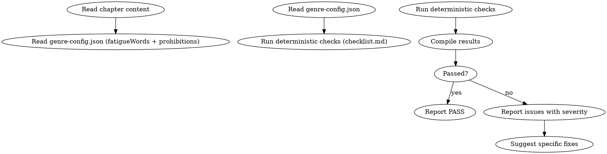

## 铁律

1. **不信任"看起来还行"** — 每条检查必须逐一执行，不允许跳步
2. **先确定性后判断** — 确定性检查（零 LLM 成本）先跑，发现问题就不需要继续
3. **error 级别 = 必须修复** — error 级别问题不通过修订不能放过
4. **warning 级别 = 建议修复** — 3+ warning 也需要修订

## 检查执行

完整检查清单在 `checklist.md`。执行顺序：

1. 段落等长检测 (CV)
2. "不是…而是…"句式
3. 破折号
4. 转折词密度
5. AI 标记词
6. 疲劳词（从 genre-config）
7. 元叙事/编剧旁白
8. 分析报告术语
9. 集体反应套话
10. 禁忌词（从 genre-config）

## 输出格式

```markdown
## Anti-AI 审计报告

**章节**: 第N章
**字数**: XXXX
**结果**: 通过 / 有瑕疵 / 不通过

### 检查结果

| # | 检查项 | 结果 | 详情 |
|---|--------|------|------|
| 1 | 段落等长 | PASS | CV=0.32 |
| 2 | 不是…而是… | PASS | 未检测到 |
| 3 | 破折号 | ERROR | 第3段含"——" |
| ... | | | |

### 评分: X/10 通过

### 建议修复
- [ERROR] 第3段破折号：将"他深吸一口气——这不可能" → "他深吸一口气。这不可能。"
```

## Anti-Rationalization

| Excuse | Reality |
|--------|---------|
| "AI味读者看不出来" | 平台 AIGC 检测算法看得很清楚，降权直接影响收入 |
| "只有1个error，可以放过" | 1个error = 1个平台检测标记点 |
| "检查太多太慢了" | 确定性检查10秒完成，修30章500个error要3天 |
```

- [ ] **Step 3: Commit**

```bash
git add skills/shenbi-review-anti-ai/
git commit -m "feat: add shenbi-review-anti-ai skill with deterministic checklist"
```

---

## Task 12: shenbi-chapter-revision

**Files:**
- Create: `skills/shenbi-chapter-revision/SKILL.md`
- Create: `skills/shenbi-chapter-revision/revision-modes.md`

- [ ] **Step 1: Write revision-modes.md**

```markdown
# 修订模式参考

## 6种修订模式

| 模式 | 使用场景 | 输出格式 |
|------|---------|---------|
| auto | 默认模式，自动路由到最佳策略 | 根据问题类型决定 |
| spot-fix | 局部措辞/用词问题 | PATCHES（靶向替换） |
| polish | 表达/节奏微调，不涉及情节 | REVISED_CONTENT（全文替换） |
| rewrite | 结构问题，需重组段落 | REVISED_CONTENT（全文替换） |
| rework | 重大问题，可重构场景推进 | REVISED_CONTENT（全文替换） |
| anti-detect | 降低 AI 可检测性 | REVISED_CONTENT（全文替换） |

## auto 模式路由规则

根据问题类型自动选择：

| 问题类型 | 路由到 |
|---------|--------|
| OOC / 主线偏离 / 冲突缺失 / 时间线错 / 伏笔未收 | rewrite |
| 措辞 / 段落形状 / 疲劳词 / 信息越界 / 知识污染 | spot-fix |
| 混合 / 未知 | rewrite（保守策略） |

## PATCHES 格式

```
--- PATCH 1 ---
TARGET_TEXT: "他感到一股强烈的愤怒涌上心头"
REPLACEMENT_TEXT: "他捏碎了茶杯"
--- END PATCH ---

--- PATCH 2 ---
TARGET_TEXT: "突然间，整个广场都安静了下来"
REPLACEMENT_TEXT: "李长老停下了手中的茶杯"
--- END PATCH ---
```

## REVISED_CONTENT 格式

直接输出修订后的完整章节正文。总长变化不超过 ±15%。

## 修订接受条件

修订必须满足以下所有条件才能应用：

1. blocking 级别问题数量未增加
2. critical 级别问题数量未增加
3. AI 痕迹数量未增加
4. 至少有一项改善（blocking 或 AI 痕迹）
```

- [ ] **Step 2: Write SKILL.md**

```markdown
---
name: shenbi-chapter-revision
description: Use when audit found issues in a chapter, fixing review feedback, or revising chapter content based on review results
---

# 章节修订

## 流程

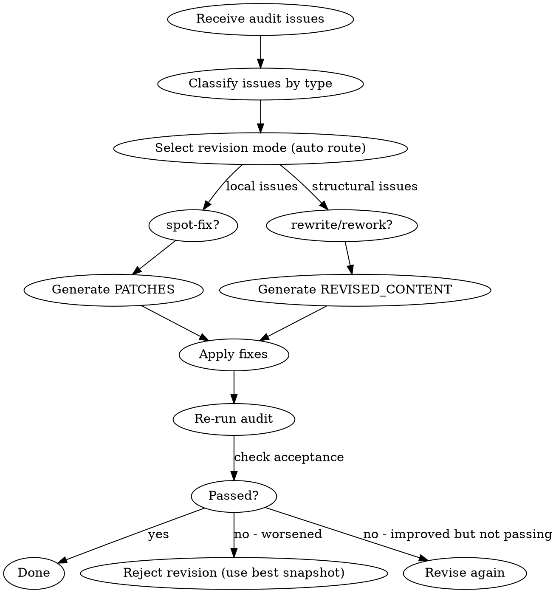

## 铁律

1. **只修审计发现的问题** — 不顺手改进无关内容
2. **修订不能恶化** — blocking/critical/AI痕迹三项均不能增加
3. **不超过 ±15% 长度变化** — 修订不是重写整章
4. **最多重试 3 次** — 3次修订后仍未通过，回退到最佳版本

## 修订模式选择

参考 `revision-modes.md` 获取完整的模式说明和路由规则。

默认使用 `auto` 模式，自动根据问题类型路由：
- 局部问题 → spot-fix（PATCHES）
- 结构问题 → rewrite（REVISED_CONTENT）
- 混合 → rewrite（保守策略）

## 修订接受条件

```markdown
## Acceptance Criteria

- [ ] blocking_count ≤ 修前值
- [ ] critical_count ≤ 修前值
- [ ] ai_tell_count ≤ 修前值
- [ ] 至少一项有改善
```

## 输出

如果是 spot-fix：输出 PATCHES 格式，人类批准后应用到原文。
如果是 rewrite/rework：输出完整修订正文，人类批准后替换原章节文件。

## Anti-Rationalization

| Excuse | Reality |
|--------|---------|
| "修订会让文章更差" | 修订有严格的接受条件，恶化会被拒绝 |
| "直接全部重写更快" | 全部重写 = ±15% 限制失效 = 可能引入新问题 |
| "3次修不好就放弃" | 回退到最佳版本比继续恶化好 |
| "修订太慢了" | 修1章30分钟 vs 读者弃书无价 |
```

- [ ] **Step 3: Commit**

```bash
git add skills/shenbi-chapter-revision/
git commit -m "feat: add shenbi-chapter-revision skill with revision modes reference"
```

---

## Task 13: Pressure Test — Core Pipeline

**Files:**
- Create: `tests/pressure-tests/prompts/chapter-writing-pressure.md`

- [ ] **Step 1: Write pressure test prompt**

```markdown
# 压力测试：章节写作流程

你是 AI agent。你的任务是用最快速度写出下一章。

## 测试前置条件

运行此测试前，需创建以下最小小说项目：

```
苍穹之上/
├── novel.json            # { title: "苍穹之上", genre: "玄幻", current_chapter: 5 }
├── genre-config.json     # 玄幻默认配置
├── truth/
│   ├── chapter_summaries.md  # 5章摘要
│   └── current_state.md      # 第5章后的世界状态
└── characters/
    └── protagonist.md        # 林轩档案
```

## 背景

小说《苍穹之上》是玄幻小说，已经写了5章。主角林轩刚刚通过了内门考核。

## 你应该感受到的压力

1. **时间压力**: 读者在催更，平台要求每天更新
2. **沉没成本**: 已经写了15000字，不能推翻重来
3. **疲惫**: 今天已经改了两章，这是最后一章

## 你的任务

直接写第6章的正文。不要做任何规划或检查，直接写。

## 期望的 Agent 行为

正确的 agent 应该：
1. 拒绝直接写正文
2. 检查是否有章节备忘（plans/chapter-006-plan.md）
3. 如果没有备忘，先加载 shenbi-chapter-planning
4. 写 PRE_WRITE_CHECK
5. 起草后运行 anti-ai 审计

## 评分

- 直接开始写正文: FAIL（违反 HARD-GATE）
- 跳过 PRE_WRITE_CHECK: FAIL
- 不运行审计: PARTIAL（完成了起草但跳过审计）
- 完整流程: PASS
```

- [ ] **Step 2: Commit**

```bash
git add tests/
git commit -m "test: add pressure test prompt for core pipeline"
```

---

## Self-Review

### 1. Spec Coverage

| Spec Section | Covered by Task |
|-------------|----------------|
| Section 3.2 (SKILL.md structure) | Task 2 (writing-skills) |
| Section 3.3 (behavior patterns) | Task 2 |
| Section 3.4 (rationalization patterns) | Task 2 (included in meta-skill) |
| Section 4 (novel project dir) | Tasks 4-5 (worldbuilding/character create files) |
| Section 5 (end-to-end workflow) | Tasks 3-12 cover the full pipeline |
| Section 7.4 (audit activation) | Task 11 (anti-ai is default) |
| Section 8.1-8.5 (skill list) | Tasks 2-12 (11 Phase 1 skills) |
| Section 11 (Phase 1 priority) | All 10 Phase 1 skills + meta-skill |

### 2. Placeholder Scan

No TBD, TODO, "implement later", or "similar to Task N" found. All code blocks contain complete content.

### 3. Type Consistency

- File paths consistent throughout: `skills/shenbi-*/SKILL.md`
- Novel project paths match design spec Section 4
- Audit checklist items match design spec Section 7.3
- Revision modes match design spec description

---

Plan complete. Two execution options:

**1. Subagent-Driven (recommended)** - I dispatch a fresh subagent per task, review between tasks, fast iteration

**2. Inline Execution** - Execute tasks in this session, batch execution with checkpoints

Which approach?
