# Shenbi Phases 2-5 Implementation Plan

> **For agentic workers:** REQUIRED SUB-SKILL: Use superpowers:subagent-driven-development (recommended) or superpowers:executing-plans to implement this plan task-by-task. Steps use checkbox (`- [ ]`) syntax for tracking.

**Goal:** Complete all remaining 48 skills across Phases 2-5, transforming Shenbi from a core pipeline into a full-featured novel-writing framework with quality audits, foreshadowing management, import/export capabilities, and multi-platform support.

**Architecture:** Pure SKILL.md skill framework. Skills share a novel project's file system (novel.json, truth/, chapters/, etc.). Each skill follows the shenbi pattern: YAML frontmatter, DOT flowchart, iron laws, anti-rationalization table, supporting files as needed. Skills are discovered by the `using-shenbi` dispatcher.

**Tech Stack:** Markdown (SKILL.md), YAML frontmatter, DOT/GraphViz flowcharts, bash (hooks)

**Spec:** `docs/specs/2026-06-08-shenbi-design.md` (v0.2.0, Sections 3-11)

**Pre-existing:** Phase 1 complete (11 skills: using-shenbi, shenbi-writing-skills, worldbuilding, character-design, story-architecture, chapter-planning, context-composing, chapter-drafting, state-settling, review-anti-ai, chapter-revision)

**Phase 1 gaps carried forward (resolved by later phases):**
- No foreshadowing lifecycle → resolved by Phase 3 (plant → track → resolve)
- Missing default audit skills (continuity, character) → resolved by Phase 2; sensitivity → resolved by Phase 4a
- No conditional audit activation → resolved by Phase 2 audit infrastructure + Phase 4 remaining audits
- No style learning, import pipeline, length normalizing → resolved by Phase 4
- No volume management or consolidation → resolved by Phase 3 (volume-consolidation) + Phase 4 (volume-outlining)
- No truth/ file bootstrapping for existing projects → resolved by Phase 4 import pipeline

---

## File Structure (all phases)

```
shenbi/
├── skills/
│   │   ═══ Phase 2 (质量体系) ═══
│   ├── shenbi-review-continuity/
│   │   └── SKILL.md
│   ├── shenbi-review-character/
│   │   ├── SKILL.md
│   │   └── ooc-dimensions.md
│   ├── shenbi-review-pacing/
│   │   └── SKILL.md
│   ├── shenbi-review-foreshadowing/
│   │   ├── SKILL.md
│   │   └── hook-lifecycle.md
│   ├── shenbi-style-polishing/
│   │   └── SKILL.md
│   ├── shenbi-foundation-review/
│   │   ├── SKILL.md
│   │   └── scoring-rubric.md
│   ├── shenbi-drift-guidance/
│   │   └── SKILL.md
│   │
│   │   ═══ Phase 3 (伏笔与管理) ═══
│   ├── shenbi-foreshadowing-plant/
│   │   ├── SKILL.md
│   │   └── hook-types.md
│   ├── shenbi-foreshadowing-track/
│   │   ├── SKILL.md
│   │   └── lifecycle-states.md
│   ├── shenbi-foreshadowing-resolve/
│   │   ├── SKILL.md
│   │   └── chase-power.md
│   ├── shenbi-truth-sync/
│   │   └── SKILL.md
│   ├── shenbi-snapshot-manage/
│   │   └── SKILL.md
│   ├── shenbi-intent-management/
│   │   └── SKILL.md
│   ├── shenbi-volume-consolidation/
│   │   └── SKILL.md
│   │
│   │   ═══ Phase 4a (剩余审计技能 - 默认激活) ═══
│   ├── shenbi-review-sensitivity/
│   │   ├── SKILL.md
│   │   └── sensitive-words.md
│   │   ═══ Phase 4b (剩余审计技能 - 条件激活) ═══
│   ├── shenbi-review-world-rules/
│   │   └── SKILL.md
│   ├── shenbi-review-reader-pull/
│   │   └── SKILL.md
│   ├── shenbi-review-memo-compliance/
│   │   └── SKILL.md
│   ├── shenbi-review-dialogue/
│   │   └── SKILL.md
│   ├── shenbi-review-motivation/
│   │   └── SKILL.md
│   ├── shenbi-review-pov/
│   │   └── SKILL.md
│   ├── shenbi-review-texture/
│   │   └── SKILL.md
│   ├── shenbi-review-highpoint/
│   │   └── SKILL.md
│   ├── shenbi-review-long-span/
│   │   ├── SKILL.md
│   │   └── ngram-methodology.md
│   ├── shenbi-review-era/
│   │   ├── SKILL.md
│   │   └── era-reference.md
│   ├── shenbi-review-fanfic/
│   │   ├── SKILL.md
│   │   └── fanfic-modes.md
│   ├── shenbi-review-spinoff/
│   │   ├── SKILL.md
│   │   └── spinoff-violations.md
│   │
│   │   ═══ Phase 4c (创世扩展) ═══
│   ├── shenbi-location-builder/
│   │   └── SKILL.md
│   ├── shenbi-relationship-map/
│   │   └── SKILL.md
│   ├── shenbi-faction-builder/
│   │   └── SKILL.md
│   ├── shenbi-power-system/
│   │   └── SKILL.md
│   │
│   │   ═══ Phase 4d (规划扩展) ═══
│   ├── shenbi-volume-outlining/
│   │   └── SKILL.md
│   ├── shenbi-pacing-design/
│   │   └── SKILL.md
│   ├── shenbi-plot-thread-weaver/
│   │   └── SKILL.md
│   │
│   │   ═══ Phase 4e (起草扩展) ═══
│   ├── shenbi-length-normalizing/
│   │   └── SKILL.md
│   │
│   │   ═══ Phase 4f (修订扩展) ═══
│   ├── shenbi-anti-detect/
│   │   └── SKILL.md
│   │
│   │   ═══ Phase 4g (导入层) ═══
│   ├── shenbi-import-analysis/
│   │   └── SKILL.md
│   ├── shenbi-style-learning/
│   │   └── SKILL.md
│   ├── shenbi-character-extraction/
│   │   └── SKILL.md
│   ├── shenbi-world-extraction/
│   │   └── SKILL.md
│   ├── shenbi-canon-import/
│   │   └── SKILL.md
│   │
│   │   ═══ Phase 4h (短篇层) ═══
│   ├── shenbi-short-outline/
│   │   └── SKILL.md
│   ├── shenbi-short-drafting/
│   │   └── SKILL.md
│   ├── shenbi-short-packaging/
│   │   └── SKILL.md
│   │
│   │   ═══ Phase 4i (管理层扩展) ═══
│   ├── shenbi-genre-config/
│   │   └── SKILL.md
│   ├── shenbi-chapter-pattern/
│   │   └── SKILL.md
│   ├── shenbi-sequel-writing/
│   │   └── SKILL.md
│   │
│   │   ═══ Phase 5 (平台适配与国际化) ═══
│   ├── shenbi-market-radar/
│   │   └── SKILL.md
│   ├── (skills updated in-place for English descriptions)
│
├── hooks/
│   ├── hooks.json
│   ├── hooks-cursor.json
│   ├── session-start
│   └── run-hook.cmd
│
├── .claude-plugin/
│   └── plugin.json
├── .cursor-plugin/
│   └── plugin.json
├── .codex-plugin/
│   └── plugin.json
├── .opencode/
│   └── plugins/
│       └── shenbi.js
├── GEMINI.md
│
├── tests/
│   ├── skill-triggering/
│   │   └── prompts/
│   │       ├── phase2-continuity-review.md
│   │       ├── phase2-character-review.md
│   │       ├── phase2-pacing-review.md
│   │       ├── phase2-foreshadowing-review.md
│   │       ├── phase2-style-polishing.md
│   │       └── phase2-foundation-review.md
│   ├── skill-behavior/
│   │   ├── review-catches-bug/
│   │   │   ├── phase2-continuity-bug.md
│   │   │   ├── phase2-character-bug.md
│   │   │   ├── phase2-pacing-bug.md
│   │   │   ├── phase2-foreshadowing-bug.md
│   │   │   ├── phase3-plant-track-resolve.md
│   │   │   └── phase4-various-bugs.md
│   │   └── revision-fixes-issue/
│   │       └── phase2-polishing-fix.md
│   └── pressure-tests/
│       └── prompts/
│           ├── audit-skipping-pressure.md
│           ├── foreshadowing-fatigue-pressure.md
│           └── import-shortcut-pressure.md
└── docs/
    └── shenbi/
        └── plans/
            └── 2026-06-08-phases-2-through-5.md
```

---

# Phase 2: 质量体系 (7 skills)

**Goal:** Add 7 quality-layer skills: 2 default-activated audits (continuity, character — completing 3 of 4 defaults alongside Phase 1's anti-ai; sensitivity deferred to Phase 4a), 2 conditionally-activated audits (pacing, foreshadowing), style polishing (prose refinement), foundation review (pre-writing gate with scoring rubric), and drift guidance (bridges audit results into next-chapter context). This adds critical quality audits that catch story-breaking issues missed by Phase 1's anti-AI-only audit.

**Architecture:** Each audit skill shares the pattern established by `shenbi-review-anti-ai`: deterministic checks first, severity levels (error/warning), structured output report, anti-rationalization table. Supporting files for complex checklists. `foundation-review` is a pre-writing gate. `drift-guidance` connects audit output to next-chapter context-composing.

**Dependencies:** Phase 1 complete. Phase 2 skills are independent of each other except: `drift-guidance` reads from any audit skill's output.

---

### Task 2-1: shenbi-review-continuity

**Files:**
- Create: `skills/shenbi-review-continuity/SKILL.md`

- [ ] **Step 1: Write SKILL.md**

```markdown
---
name: shenbi-review-continuity
description: Use when checking chapter for timeline consistency, location contradictions, event sequence ordering, or physical spatial logic errors
---

# 连续性审计

这是默认激活的审计技能（每章必查）。检查时间线一致性、地点矛盾、事件时序、物理空间合理性。

## 流程

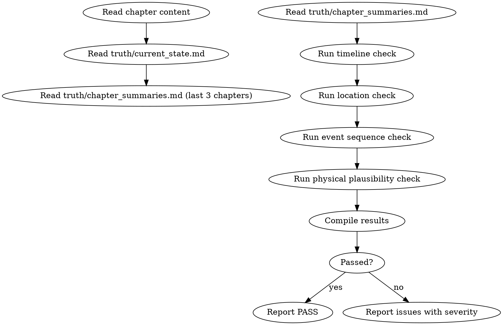

## 数据契约

- **Reads:** `chapters/chapter-N.md`, `truth/current_state.md`, `truth/chapter_summaries.md`, `world/rules.md`
- **Writes:** report only
- **Updates:** none

## 铁律

1. **时间线是单向不可逆的** — 不能出现"太阳落山后又出现正午场景"类矛盾
2. **地点跳跃需要过渡** — 角色不能从A地瞬移到B地除非有明确能力支撑
3. **事件因果链必须完整** — 每个事件必须有前因后果，不能凭空出现
4. **物理规则一致** — 本章的物理规则必须与前章一致（除非有明确的世界规则变更）

## 检查执行

### 1. 时间线检查
- 提取本章所有时间标记（"第二天"、"三天后"、"入夜"等）
- 与 `truth/current_state.md` 和近3章摘要对比
- 检查是否有时间倒流或不合理跳跃

### 2. 地点检查
- 提取本章所有地点提及
- 与角色当前位置对比（来自 `truth/current_state.md`）
- 地点之间如果跳跃，检查是否有过渡段落或能力支撑
- 使用 Allen 区间代数检查地点间时空关系

### 3. 事件时序
- 提取本章事件链，按文本顺序编号
- 检查事件间逻辑先后关系是否合理
- 检测并行事件的时间对齐

### 4. 物理空间合理性
- 检查场景的空间描述是否一致（同一场景内距离、物体位置）
- 如果本章涉及战斗/移动，检查空间逻辑

## 输出格式

```markdown
## 连续性审计报告

**章节**: 第N章
**结果**: 通过 / 有瑕疵 / 不通过

### 时间线
| 标记 | 位置 | 推断时间 | 上一章末尾时间 | 状态 |
|------|------|---------|-------------|------|
| ... | ... | ... | ... | OK/MISMATCH |

### 地点
[地点流转记录，标注跳跃和过渡情况]

### 事件时序
[事件链编号与逻辑审查]

### 物理空间
[空间矛盾标注]

### 评分: X/10 通过
```

## Anti-Rationalization

| Excuse | Reality |
|--------|---------|
| "读者记不住三天前的事件" | 网文读者逐章追更，时间线矛盾是最容易被发现的bug |
| "地点跳跃加一句过渡就行" | 过渡不仅是文字，要符合角色能力和时间约束 |
| "物理合理性不重要，这是玄幻" | 即便玄幻世界，内部物理规则也必须自洽 |
| "时间线差不多就行了" | 精确的时间线是长篇叙事连续性的骨架 |
```

- [ ] **Step 2: Verify skill structure**

Read the file and verify it follows the shenbi-writing-skills pattern: frontmatter with name+description, DOT flowchart, iron laws, anti-rationalization table.

- [ ] **Step 3: Write pressure test**

Create `tests/skill-behavior/review-catches-bug/phase2-continuity-bug.md` — a chapter with an intentional timeline contradiction (e.g., character arrives at noon but two paragraphs later "the sun was setting").

- [ ] **Step 4: Commit**

```bash
git add skills/shenbi-review-continuity/SKILL.md tests/skill-behavior/review-catches-bug/phase2-continuity-bug.md
git commit -m "feat: add shenbi-review-continuity skill (Phase 2)"
```

---

### Task 2-2: shenbi-review-character

**Files:**
- Create: `skills/shenbi-review-character/SKILL.md`
- Create: `skills/shenbi-review-character/ooc-dimensions.md`

- [ ] **Step 1: Write ooc-dimensions.md (supporting file)**

```markdown
# OOC 检测维度

## BDI 可信度评估框架

对每个角色评估信念(Belief)、欲望(Desire)、意图(Intention)三元组：

1. **信念一致性**: 角色根据已知信息做出的推断是否与角色认知一致
2. **欲望驱动**: 角色行为是否由已建立的深层欲望驱动
3. **意图合理性**: 角色当下的行动意图是否与信念+欲望匹配

## 检测项目

### 1. 配角降智
- 为推进主角线而让反派/配角做出不合逻辑的愚蠢决定
- 标志：角色此前被描述为"聪明/精于算计"，但本章做了明显低智选择
- 检测方法：对比角色档案中的 intelligence/tactics 描述

### 2. 配角工具人化
- 配角出现只为主角提供信息/道具/帮助，没有自身动机
- 标志：配角话语和行为完全服务于主角需求
- 检测方法：检查配角在本章中是否有独立的欲望表达

### 3. 弧线平坦
- 角色连续多章没有情感或认知变化
- 标志：角色状态在近3章中完全不变
- 检测方法：对比 `truth/emotional_arcs.md`

### 4. 声音一致性
- 角色说话风格是否与 `character.md` 的 `voice_profile` 一致
- 检查口头禅匹配、句式复杂度、措辞偏好的稳定性

### 5. 关系动态
- 角色间互动模式是否与前章建立的关系一致
- 未经铺垫的关系突变视为错误
```

- [ ] **Step 2: Write SKILL.md**

```markdown
---
name: shenbi-review-character
description: Use when checking chapter for character OOC behavior, voice consistency, side character intelligence, or arc flatness
---

# 角色一致性审计

这是默认激活的审计技能（每章必查）。OOC (Out of Character) 检测、声音一致性、配角降智/工具人化检测、弧线平坦检测。

## 流程

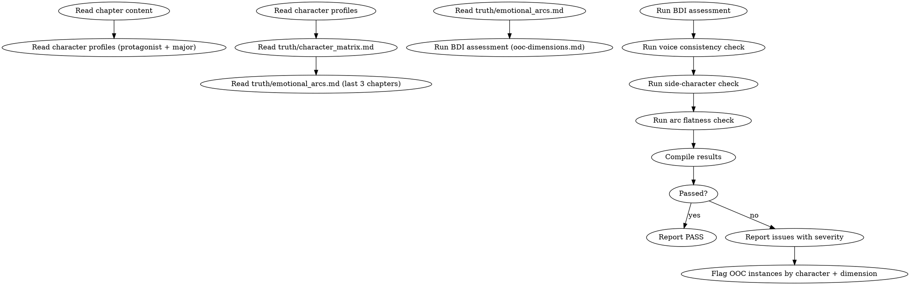

## 数据契约

- **Reads:** `chapters/chapter-N.md`, `characters/protagonist.md`, `characters/major/*.md`, `truth/character_matrix.md`, `truth/emotional_arcs.md`
- **Writes:** report only
- **Updates:** none

## 铁律

1. **OOC = blocking error** — 角色行为违反已建立的性格/动机/声音，视为最高严重级别
2. **一人一卡** — 每个角色的行为只能与其自身角色档案对比，不能交叉污染
3. **配角降智是致命毒点** — 为推进剧情让反派/配角降智 = 必须修订
4. **声音指纹是读者的识别锚** — 角色说话方式突变会让读者感到陌生

## 检查执行

完整检测维度见 `ooc-dimensions.md`。执行顺序：

1. BDI 可信度评估（信念/欲望/意图三元组）
2. 声音一致性检查（口头禅、句式、措辞偏好）
3. 配角降智检测
4. 配角工具人化检测
5. 弧线平坦检测
6. 关系动态检查

## 输出格式

```markdown
## 角色一致性审计报告

**章节**: 第N章
**结果**: 通过 / 有瑕疵 / 不通过

### BDI 评估

| 角色 | 信念 | 欲望 | 意图 | 一致性 |
|------|------|------|------|--------|
| 林轩 | OK | OK | OK | PASS |
| 苏晴 | ? | OK | ISSUE | WARNING |

### OOC 检测

| 角色 | 维度 | 违规行为 | 预期行为 | 严重度 |
|------|------|---------|---------|--------|
| ... | ... | ... | ... | error/warning |

### 配角检查

| 配角 | 降智? | 工具人? | 独立动机? |
|------|-------|---------|----------|
| ... | ... | ... | ... |

### 声音一致性
[口头禅匹配 / 句式复杂度 / 措辞偏好]

### 弧线
[近3章情感变化曲线]

### 评分: X/10 通过
```

## Anti-Rationalization

| Excuse | Reality |
|--------|---------|
| "这个角色不需要这么复杂" | 配角降智是网文最大毒点之一，读者会直接弃书 |
| "为了推动剧情，角色稍微变一下可以" | 角色是故事的灵魂。情节为角色服务，不是反过来 |
| "声音差异不大，读者听不出" | 角色声音是读者识别角色的锚，相似声音 = 角色模糊 |
| "这一章没出现多少配角" | 只要出现了就必须确保不降智、不工具人化 |
```

- [ ] **Step 3: Write pressure test**

Create `tests/skill-behavior/review-catches-bug/phase2-character-bug.md` — a chapter where a previously cautious protagonist makes a reckless decision without motivation change.

- [ ] **Step 4: Commit**

```bash
git add skills/shenbi-review-character/
git commit -m "feat: add shenbi-review-character skill (Phase 2)"
```

---

### Task 2-3: shenbi-review-pacing

**Files:**
- Create: `skills/shenbi-review-pacing/SKILL.md`

- [ ] **Step 1: Write SKILL.md**

```markdown
---
name: shenbi-review-pacing
description: Use when checking chapter for pacing issues, buildup-release cycle completeness, chapter type sequence monotony, or tension curve flatness
---

# 节奏审计

检查蓄压-爆发周期完整性、连续无爆发检测、日常段落功能验证、章节类型序列多样性。

> 激活条件：由 `genre-config.json` 的 `auditDimensions` 包含维度 7 或 26 时激活。

## 流程

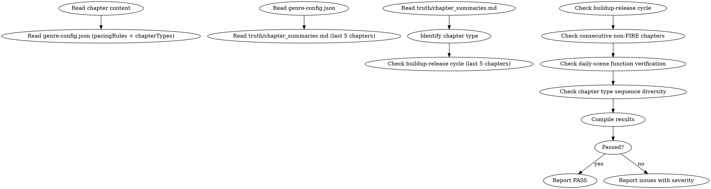

## 数据契约

- **Reads:** `chapters/chapter-N.md`, `genre-config.json`, `truth/chapter_summaries.md`, `outline/rhythm_principles.md` (if exists)
- **Writes:** report only
- **Updates:** none

## 铁律

1. **蓄压必须有释放** — 连续超过 `genre-config.json` 的 `maxConsecutiveQuest` 章 QUEST 无 FIRE → 停滞警告
2. **爆发后必须有后效** — FIRE 章后不能直接进入下一个 FIRE，需要缓冲
3. **日常段落必须有功能** — CONSTELLATION 段落不能只是"日常描写"，必须承载信息/关系/伏笔

## 检查执行

### 1. 蓄压-爆发周期
- 统计近5章章节类型（QUEST/FIRE/CONSTELLATION）
- 检查 `maxConsecutiveQuest` 和 `maxGapQuest` 规则是否违反

### 2. 本章节奏分析
- 识别本章类型（与章节备忘的 `chapter_type` 对比）
- 检查类型是否与节奏原则一致

### 3. 日常段落功能验证
- 如果是 CONSTELLATION 章/段，检查其承担的功能（关系推进/信息传递/伏笔铺垫）
- 无功能日常 = 流水账警告

### 4. 序列多样性
- 检查近10章类型分布是否过偏（单一类型 > 50% 警告）

## 输出格式

```markdown
## 节奏审计报告

**章节**: 第N章
**本章类型**: COMBAT
**结果**: 通过 / 有瑕疵 / 不通过

### 近5章类型序列
| 章节 | 类型 | 蓄压/爆发状态 |
|------|------|-------------|
| N-4 | QUEST | 蓄压 |
| ... | ... | ... |

### 规则检查
- maxConsecutiveQuest: 3/5 OK
- maxGapFIRE: 1/3 OK
- 序列多样性: QUEST 60% OK

### 评分: X/10 通过
```

## Anti-Rationalization

| Excuse | Reality |
|--------|---------|
| "连续几章蓄压没问题，读者有耐心" | 现代网文3章无爆点读者开始流失 |
| "日常章节写写无所谓" | 无功能日常 = 读者跳读窗口 = 弃书风险 |
| "爆发章后直接接下一个高潮" | 没有缓冲的连续爆发 = 读者麻木 |
```

- [ ] **Step 2: Write pressure test**

Create `tests/skill-behavior/review-catches-bug/phase2-pacing-bug.md`.

- [ ] **Step 3: Commit**

```bash
git add skills/shenbi-review-pacing/SKILL.md tests/skill-behavior/review-catches-bug/phase2-pacing-bug.md
git commit -m "feat: add shenbi-review-pacing skill (Phase 2)"
```

---

### Task 2-4: shenbi-review-foreshadowing

**Files:**
- Create: `skills/shenbi-review-foreshadowing/SKILL.md`
- Create: `skills/shenbi-review-foreshadowing/hook-lifecycle.md`

- [ ] **Step 1: Write hook-lifecycle.md (supporting file)**

```markdown
# 伏笔生命周期参考

## 五种状态（Phase 2 审计简化模型）

> Phase 2 审计用简化模型。Phase 3 的完整状态机（含 ABANDONED、EXPIRED、DEFER 操作）见 `skills/shenbi-foreshadowing-track/lifecycle-states.md`。

| 状态 | 含义 | 可执行操作 |
|------|------|----------|
| PLANTED | 已种植，读者尚未注意到 | REINFORCE, PROMOTE |
| RELEVANT | 已被提醒，读者开始注意 | TRIGGER |
| TRIGGERED | 已触发，准备兑现 | RESOLVE |
| RESOLVED | 已兑现 | ARCHIVE |
| ABANDONED | 已放弃 | — (不可恢复) |

> 注意：DEFER 操作不在 Phase 2 审计模型中。审计只检查伏笔是否按约定推进，不负责修改伏笔生命周期。DEFER 由 Phase 3 的 `foreshadowing-track` 执行。

## 培育规则

- `cultivation_interval`: 每 N 章需要一次强化
- `max_distance`: 最大种植到兑现距离（章）
- `last_reinforced`: 上次强化所在章
- 超过 `max_distance` 未兑现 → 警告

## 密度预算

- 每章最多 8 次伏笔操作（plant + reinforce + trigger + resolve）
- 超过 → 密度异常警告

> 这是 Phase 2 用于审计的简化版本。完整状态机（含 ABANDONED、ARCHIVED、DEFER）见 Phase 3 的 `skills/shenbi-foreshadowing-track/lifecycle-states.md`。
```

- [ ] **Step 2: Write SKILL.md**

```markdown
---
name: shenbi-review-foreshadowing
description: Use when checking chapter for foreshadowing debt escalation, cultivation interval expiry, density anomalies, subplot stagnation, or hook ledger consistency
---

# 伏笔审计

检查伏笔债务升级、培育间隔过期、密度异常、支线停滞、伏笔账本一致性。

> 激活条件：由 `genre-config.json` 的 `auditDimensions` 包含维度 6 或 24 时激活。

> **Phase 2 limitation:** Before Phase 3's foreshadowing-track is implemented, `truth/pending_hooks.md` may be empty or a placeholder. The audit will report PASS by default. Full functionality activates after Phase 3 populates the hook pool.

## 流程

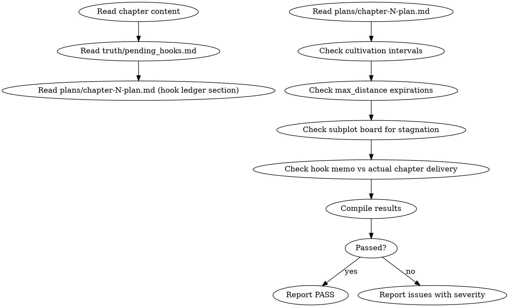

## 数据契约

- **Reads:** `chapters/chapter-N.md`, `truth/pending_hooks.md`, `plans/chapter-N-plan.md`
- **Writes:** report only
- **Updates:** none

## 铁律

1. **过期伏笔 = error** — 超过 `max_distance` 未兑现必须标记
2. **支线停滞 > 5章 = warning** — 支线推进的活跃度
3. **备忘 hook 账必须与正文一致** — memo 中说要兑现的伏笔正文是否兑现
4. **密度预算不超 8 操作/章** — 含种植、强化、触发、兑现

## 检查执行

参见 `hook-lifecycle.md`。执行顺序：

1. 培育间隔检查（距上次强化是否超过 `cultivation_interval`）
2. 距离上限检查（距种植是否超过 `max_distance`）
3. 支线停滞检测（从 `subplot_board.md` 检查各支线最后更新章节）
4. 备忘 hook 账验证（memo 中的 open/advance/resolve/defer 与正文匹配）
5. 密度检查（本操作数是否超 8）

## 输出格式

```markdown
## 伏笔审计报告

**章节**: 第N章
**结果**: 通过 / 有瑕疵 / 不通过

### 培育间隔
| Hook ID | 上次强化 | 本章 | 间隔 | 阈值 | 状态 |
|---------|---------|------|------|------|------|
| ... | ... | ... | ... | ... | OK/OVERDUE |

### 距离上限
| Hook ID | 种植章 | 本章 | max_distance | 状态 |
|---------|--------|------|-------------|------|
| ... | ... | ... | ... | OK/EXPIRED |

### 备忘验证
| 备忘操作 | 实际兑现 | 状态 |
|---------|---------|------|
| open hook-003 | ✓ | MATCH |
| advance hook-002 | ✓ | MATCH |
| resolve none | — | OK |

### 密度: N/8 操作

### 评分: X/10 通过
```

## Anti-Rationalization

| Excuse | Reality |
|--------|---------|
| "这条伏笔太久了，算了放弃" | 放弃伏笔 = 违背读者信任，Chase Power 债务暴增 |
| "伏笔不重要，故事推进就行" | 伏笔是长篇叙事的骨架，没有伏笔 = 没有期待 = 没有追读 |
| "8条操作预算太少了" | 每章8条操作 × 2000章 = 16000次伏笔操作，足够 |
```

- [ ] **Step 3: Write pressure test**

Create `tests/skill-behavior/review-catches-bug/phase2-foreshadowing-bug.md` — a chapter with a hook that was promised to resolve in the memo but is absent from the text, plus a foreshadowing item that exceeds its `max_distance`.

- [ ] **Step 4: Commit**

```bash
git add skills/shenbi-review-foreshadowing/ tests/skill-behavior/review-catches-bug/phase2-foreshadowing-bug.md
git commit -m "feat: add shenbi-review-foreshadowing skill (Phase 2)"
```

### Task 2-5: shenbi-style-polishing

**Files:**
- Create: `skills/shenbi-style-polishing/SKILL.md`

- [ ] **Step 1: Write SKILL.md**

```markdown
---
name: shenbi-style-polishing
description: Use when a chapter has been drafted and audit-passed, and surface-level prose quality needs improvement without altering plot or character
---

# 文字层润色

润色章节的文字表达、节奏和段落呼吸感。禁止增删情节、改变人设、调整主线。

## 流程

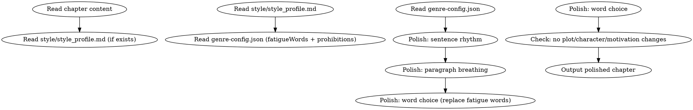

## 数据契约

- **Reads:** `chapters/chapter-N.md`, `genre-config.json`, `style/style_profile.md`
- **Writes:** none (edits chapter in-place)
- **Updates:** `chapters/chapter-N.md`

## 铁律

1. **只改表达，不动情节** — 不能增删事件、不能改变角色行为、不能调整情感基调
2. **只改善，不恶化** — 字数变化 ≤ ±15%，不能引入 AI 味
3. **发现结构问题只标记** — 如果发现需要结构调整的段落，用 `[polisher-note]` 标记，不自行修改
4. **保持风格指纹** — 如果 `style/style_profile.md` 存在，必须遵循风格指纹

## 润色维度

### 1. 句长控制
- 过长的句子（> 50字）考虑拆分为2-3句
- 过短的连续短句考虑合并以改善节奏
- 目标：句长变异系数 > 0.25

### 2. 段落呼吸
- 过长的段落（> 8句）考虑拆分
- 检查段落首句多样性
- 检查段落间过渡

### 3. 用词替换
- 替换疲劳词（从 `genre-config.json` 的 `fatigueWords` 读取）
- 替换重复高频词
- 避免连续段落使用相同句式

### 4. 修辞优化
- 标记不自然的比喻
- 标记重复的修辞模式
- 不做大的修辞重写

## 输出格式

```markdown
# 润色后的第N章

[完整的润色后章节正文]

---

## 润色说明

### 修改统计
- 句子拆分: N处
- 段落重组: N处
- 用词替换: N处
- 总字数变化: +N/-N (X%)

### [polisher-note] (如需)
- [段落位置] 描述: 注意到的结构问题
```

## Anti-Rationalization

| Excuse | Reality |
|--------|---------|
| "顺手把这段情节也改了吧" | plot/motivation 修改属于 revision，不属于 polishing |
| "改得越多越好" | 过度润色 = 抹去作者风格 = AI 味 |
| "这段表达有问题我重写一下" | 重写 = 改变叙事视角 = 超出润色范围 |
| "修辞统一一下更好看" | 修辞多样性是避免 AI 味的关键 |
```

- [ ] **Step 2: Write pressure test**

Create `tests/skill-behavior/revision-fixes-issue/phase2-polishing-fix.md` — a chapter with uniform sentence lengths, repeated fatigue words, and a paragraph where polishing must NOT change the plot (verifiable by checking that all events remain intact after polishing).

- [ ] **Step 3: Commit**

```bash
git add skills/shenbi-style-polishing/SKILL.md tests/skill-behavior/revision-fixes-issue/phase2-polishing-fix.md
git commit -m "feat: add shenbi-style-polishing skill (Phase 2)"
```

---

### Task 2-6: shenbi-foundation-review

**Files:**
- Create: `skills/shenbi-foundation-review/SKILL.md`
- Create: `skills/shenbi-foundation-review/scoring-rubric.md`

- [ ] **Step 1: Write scoring-rubric.md**

```markdown
# 基础设定评分标准

总分 100，80+ 通过。未通过的项目需要返回修改后再审。

## 维度 1: 核心冲突 (30分)

| 分数 | 标准 |
|------|------|
| 25-30 | 三层冲突明确（表面/个人/深层），各层有独立张力 |
| 18-24 | 有两层冲突，第三层模糊 |
| 10-17 | 只有一层冲突，其余未定义 |
| 0-9 | 无明显冲突 |

## 维度 2: 开篇节奏 (20分)

| 分数 | 标准 |
|------|------|
| 17-20 | 前三章有明确 Hook + 悬念 + 第一次升级 |
| 12-16 | 有 Hook 但节奏偏慢 |
| 6-11 | 有设定但无冲突推进 |
| 0-5 | 纯设定/纯日常开头 |

## 维度 3: 世界一致性 (20分)

| 分数 | 标准 |
|------|------|
| 17-20 | 规则明确、无自相矛盾、有足够约束 |
| 12-16 | 规则存在但有模糊地带 |
| 6-11 | 规则不完整 |
| 0-5 | 无明确规则 |

## 维度 4: 角色区分度 (20分)

| 分数 | 标准 |
|------|------|
| 17-20 | 主角+2+配角有独立 voice、动机、成长弧线 |
| 12-16 | 主角突出，配角扁平但无重复 |
| 6-11 | 有配角但同质化 |
| 0-5 | 角色不可区分 |

## 维度 5: 伏笔潜力 (10分)

| 分数 | 标准 |
|------|------|
| 8-10 | 世界观包含 ≥3 个可长期培育的悬念种子 |
| 5-7 | 有 1-2 个悬念种子 |
| 2-4 | 有提及但未展开 |
| 0-1 | 无可识别的伏笔潜力 |
```

- [ ] **Step 2: Write SKILL.md**

```markdown
---
name: shenbi-foundation-review
description: Use when reviewing the complete worldbuilding + character + story architecture foundation before writing begins, or when a human partner asks for a quality assessment of story fundamentals
---

# 基础设定审核

HARD-GATE: 在基础设定未通过审核（总分 ≥ 80）前，不得进入逐章写作。

审核创世层输出（worldbuilding + character-design + story-architecture），对五个维度打分。

## 流程

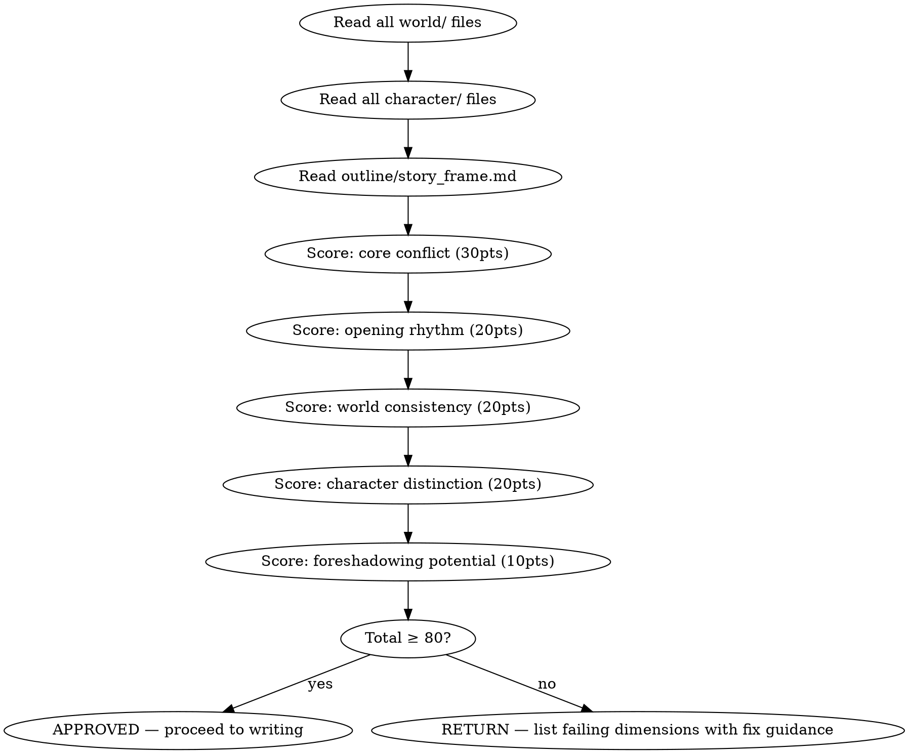

## 数据契约

- **Reads:** `world/*.md`, `characters/**/*.md`, `outline/*.md`, `truth/current_state.md` (may be empty template), `truth/chapter_summaries.md` (may be empty template), `novel.json`, `genre-config.json`
- **Writes:** report only
- **Updates:** none

> **Note:** `truth/current_state.md` and `truth/chapter_summaries.md` are initialized as empty templates by `shenbi-worldbuilding` (see Phase 1 plan Section "输出契约"). If no chapters have been written, these contain only frontmatter with empty bodies. The foundation-review reads them to verify they exist and are properly initialized; the scoring itself is driven primarily by `world/`, `characters/`, and `outline/` content.

## 铁律

1. **总分 80 = 最低门槛** — < 80 必须返回修改，不商量
2. **核心冲突 < 18 = 自动不通过** — 无论其他维度多高
3. **只审核已生成的内容** — 不为缺失的内容假设分数
4. **每个扣分必须附带具体改进建议** — 不让人类合作者猜测如何改进

## 审核清单

参见 `scoring-rubric.md` 获取详细评分标准。

## 输出格式

```markdown
## 基础设定审核报告

**项目**: 《XXX》
**日期**: YYYY-MM-DD
**结果**: 通过 (XX分) / 不通过 (XX分)

### 评分明细

| 维度 | 得分 | 满分 | 评价 |
|------|------|------|------|
| 核心冲突 | XX | 30 | ... |
| 开篇节奏 | XX | 20 | ... |
| 世界一致性 | XX | 20 | ... |
| 角色区分度 | XX | 20 | ... |
| 伏笔潜力 | XX | 10 | ... |
| **总分** | **XX** | **100** | |

### 不通过维度改进建议
[具体建议，每条指向具体文件/段落]
```

## Anti-Rationalization

| Excuse | Reality |
|--------|---------|
| "60分也差不多可以开始写了" | 基础不牢，写到20章必崩 |
| "核心冲突以后补上" | 没有核心冲突的故事没有灵魂，读者能感受到 |
| "角色区分度不重要，故事好就行" | 同质化角色 = 读者分不清谁是谁 = 弃书 |
| "这些维度太严格了" | 5维度 ×简单评分 = 最简单的系统性质量把控 |
```

- [ ] **Step 3: Verify skill structure** — Read the file and verify: frontmatter with name+description, DOT flowchart, iron laws, anti-rationalization table.

- [ ] **Step 4: Commit**

```bash
git add skills/shenbi-foundation-review/
git commit -m "feat: add shenbi-foundation-review skill (Phase 2)"
```

---

### Task 2-7: shenbi-drift-guidance

**Files:**
- Create: `skills/shenbi-drift-guidance/SKILL.md`

- [ ] **Step 1: Write SKILL.md**

```markdown
---
name: shenbi-drift-guidance
description: Use when a chapter has completed all audits and results need to be conveyed to the next chapter's writing context
---

# 审计纠偏传导

把当前章节的审计问题转化为下一章的写作指导，写入 `truth/audit_drift.md`，在 context-composing 阶段自动导入。

## 流程

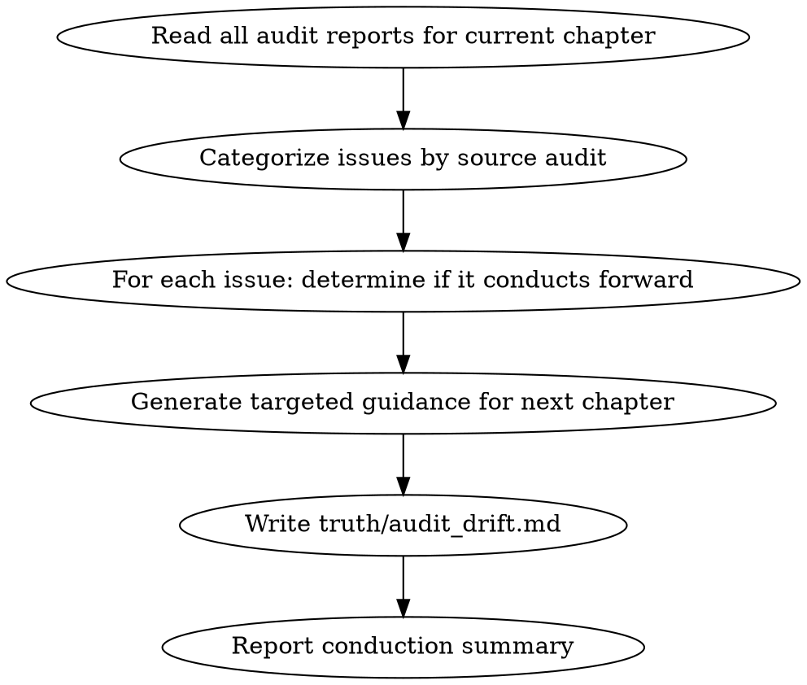

## 数据契约

- **Reads:** `chapters/chapter-N.md`, all audit reports for current chapter
- **Writes:** none
- **Updates:** `truth/audit_drift.md`

## 铁律

1. **error 级别不传导** — error 必须在当前章修订中修复，修复后不传导
2. **warning 级别传导** — warning 可以传导给下一章（如"转折词密度偏高→下章注意"）
3. **每条传导必须指定目标章节** — `targeted_chapter` 字段
4. **累积传导 ≤ 5 条** — 过多传导 = 审计噪音

## 传导规则

### 不传导的类型
- 破折号、错别字、具体措辞问题 → 必须当前章修复
- 结构性问题 → 必须当前章修订

### 可传导的类型
- 风格趋势（转折词偏高、段落偏长）
- 伏笔提醒（某条伏笔下章需要强化）
- 节奏趋势（连续N章无爆发）
- 角色弧线（连续N章无情感变化）

## 输出格式

写入 `truth/audit_drift.md`：

```markdown
---
chapter: 5
drift_items:
  - source_audit: review-pacing
    severity: warning
    issue: "连续3章无 FIRE，下章建议安排爆发点"
    guidance: "第6章建议在章中或章末安排一个读者可见的阶段性成果（如通过内门考核第一轮）"
    targeted_chapter: 6
  - source_audit: review-anti-ai
    severity: warning
    issue: "转折词密度偏高（4次/3000字）"
    guidance: "第6章起草时目标转折词 ≤ 3次，优先用动作推进替代然而/突然"
    targeted_chapter: 6
---
```

## Anti-Rationalization

| Excuse | Reality |
|--------|---------|
| "下章自然会注意这些问题" | 没有明确指导，问题会在下章重复出现 |
| "传导太多条了，反正也记不住" | 最多5条，每条指向具体改进项 |
| "warning不重要，不需要传导" | warning趋势持续 = 5章后变成error |
```

- [ ] **Step 2: Verify skill structure** — Read the file and verify: frontmatter with name+description, DOT flowchart, iron laws, anti-rationalization table.

- [ ] **Step 3: Commit**

```bash
git add skills/shenbi-drift-guidance/SKILL.md
git commit -m "feat: add shenbi-drift-guidance skill (Phase 2)"
```

---

### Phase 2 Completion Checklist

- [ ] All 7 Phase 2 skills created and committed
- [ ] Default-audit skills (continuity, character) include an activation note in their SKILL.md body: "这是默认激活的审计技能（每章必查）" — matching the activation rules in spec Section 7.4 (sensitivity deferred to Phase 4a)
- [ ] Verify each skill has valid YAML frontmatter with `name` (alphanumeric+hyphens) and English `description` (trigger conditions only, ≤500 chars)
- [ ] Verify each skill follows shenbi-writing-skills pattern (DOT + iron laws + anti-rationalization)
- [ ] Pressure tests written for audit skills: continuity, character, pacing, foreshadowing. Foundation-review and drift-guidance verified through integration testing.
- [ ] Update `chapter-revision` revision-modes.md auto-routing: add Phase 2 audit output routes (OOC → rewrite, continuity → rewrite)

---

# Phase 3: 伏笔与管理 (7 skills)

**Goal:** Implement the full foreshadowing lifecycle (plant → track → resolve), truth file synchronization, snapshot management, author intent tracking, and volume consolidation.

**Architecture:** The three foreshadowing skills form a pipeline: plant operates before drafting, track operates after state-settling, resolve operates after audits pass. Management skills (truth-sync, snapshot-manage, intent-management, volume-consolidation) provide data infrastructure.

**Dependencies:** Phase 2 complete. Phase 2's `review-foreshadowing` audits the hooks managed by Phase 3's plant/track/resolve. Both phases share `truth/pending_hooks.md` as the single source of truth.

---

### Task 3-1: shenbi-foreshadowing-plant

**Files:**
- Create: `skills/shenbi-foreshadowing-plant/SKILL.md`
- Create: `skills/shenbi-foreshadowing-plant/hook-types.md`

- [ ] **Step 1: Write hook-types.md**

```markdown
# 伏笔类型参考

## 按真实性分类

| 类型 | 含义 | 标记颜色 | 说明 |
|------|------|---------|------|
| GENUINE | 真实伏笔 | 🟢 | 确实会兑现的情节线索 |
| SMOKESCREEN | 烟雾弹 | 🟡 | 故意误导读者，制造悬念 |
| SIDE_SHADOW | 侧面影 | 🔵 | 不起眼的暗示，为后续事件做铺垫 |

## 按维度分类

| 维度 | 含义 | 示例 |
|------|------|------|
| THEMATIC | 主题伏笔 | 反复出现的意象、象征物 |
| CHARACTER | 角色伏笔 | 角色隐藏身份、过去经历 |
| SYMBOLIC | 象征伏笔 | 物品、地点、数字的象征意义 |
| STRUCTURAL | 结构伏笔 | 章节结构、叙事模式的预兆 |

## 升级曲线

| 曲线类型 | 含义 | 使用场景 |
|---------|------|---------|
| FLAT | 维持同一强度 | 背景伏笔、长线暗示 |
| RISING | 逐渐增强 | 主线伏笔、悬念培育 |
| EXPONENTIAL | 指数增长 | 终极揭秘、卷末高潮 |

## 微妙度等级

0.0-0.3: 明显（大部分读者会注意到）
0.3-0.6: 中等（细心的读者会注意到）
0.6-0.9: 微妙（只有回头重读才会发现）
```

- [ ] **Step 2: Write SKILL.md**

```markdown
---
name: shenbi-foreshadowing-plant
description: Use when a chapter memo's hook ledger contains OPEN items that need foreshadowing planted before drafting begins
---

# 伏笔种植

HARD-GATE: 必须在章节备忘完成后、正文起草前执行。根据备忘的 hook 账（open项）种植新伏笔。

## 流程

```dot
digraph foreshadowing_plant {
    "Read plans/chapter-N-plan.md (hook ledger)" -> "Read truth/pending_hooks.md (existing hooks)";
    "Read truth/pending_hooks.md" -> "Check density budget (\u2264 8 operations)";
    "Check density budget" -> "For each OPEN hook: design planting";
    "For each OPEN hook: design planting" -> "Assign type (GENUINE/SMOKESCREEN/SIDE_SHADOW)";
    "Assign type" -> "Assign dimension (THEMATIC/CHARACTER/SYMBOLIC/STRUCTURAL)";
    "Assign dimension" -> "Set subtlety (0.0-1.0) + cultivation_interval + max_distance";
    "Set subtlety" -> "Set escalation_curve (FLAT/RISING/EXPONENTIAL)";
    "Set escalation_curve" -> "Check cross-thread dependencies";
    "Check cross-thread dependencies" -> "Write new hooks to truth/pending_hooks.md";
}
```

## 数据契约

- **Reads:** `truth/pending_hooks.md`, chapter plan from chapter-planning output, `genre-config.json`
- **Writes:** none
- **Updates:** `truth/pending_hooks.md`

## 铁律

1. **每章操作 ≤ 8 条** — 包括 plant、reinforce、trigger、resolve
2. **种植前必须读已有伏笔** — 避免重复或矛盾
3. **每个新伏笔必须定义完整的元数据** — type, dimension, subtlety, cultivation_interval, max_distance, escalation_curve
4. **跨线程依赖必须记录** — `depends_on` 字段
5. **烟雾弹必须有退出策略** — 标记为 SMOKESCREEN 的伏笔必须在 `notes` 中写明何时/如何处理

## 种植指南

### 选择埋伏笔的位置

1. **日常段落** — 最佳位置，读者放松时最容易忽略暗示
2. **战斗段落** — 适合种植象征性伏笔（某件物品、某个动作）
3. **对话段落** — 适合种植信息型伏笔（角色的"随口一提"）
4. **避免** — 不要在章节末尾高潮段埋伏新笔画，读者注意力在还前面

### 微妙度策略

- 主线伏笔: subtlety 0.4-0.6（需要能被部分读者注意到）
- 支线伏笔: subtlety 0.6-0.8（可以更深）
- 烟雾弹: subtlety 0.3-0.5（需要能被注意到才能误导）
- 侧面影: subtlety 0.7-0.9（极微妙，为回头重读准备）

## 输出格式

追加到 `truth/pending_hooks.md` 的 YAML frontmatter `hooks` 数组：

```yaml
- id: hook-004
  content: "考核结束后，玉珮发出一声低鸣——只有主角听见"
  state: PLANTED
  type: GENUINE
  dimension: CHARACTER
  subtlety: 0.6
  plant_chapter: 5
  cultivation_interval: 5
  last_reinforced: 5
  max_distance: 20
  escalation_curve: RISING
  depends_on: []
  core_hook: false
  promoted: false
```

## Anti-Rationalization

| Excuse | Reality |
|--------|---------|
| "这章太简单了，不需要伏笔" | 简单章节恰好是埋伏笔的最佳时机——读者放松警惕 |
| "读者不会注意到这么细节的东西" | 网文读者的重读习惯和评论文化使细节容易被发掘 |
| "先种上再说，以后决定怎么用" | 无规划伏笔 = 最后不得不放弃 = Chase Power 债务 |
| "微妙度设高点没人会发现" | 伏笔的目的不是隐藏，是让读者在兑现时产生"啊原来如此" |
```

- [ ] **Step 3: Verify skill structure**

Read the file and verify it follows the shenbi-writing-skills pattern: frontmatter with name+description, DOT flowchart, iron laws, anti-rationalization table.

- [ ] **Step 4: Commit**

```bash
git add skills/shenbi-foreshadowing-plant/
git commit -m "feat: add shenbi-foreshadowing-plant skill (Phase 3)"
```

---

### Task 3-2: shenbi-foreshadowing-track

**Files:**
- Create: `skills/shenbi-foreshadowing-track/SKILL.md`
- Create: `skills/shenbi-foreshadowing-track/lifecycle-states.md`

- [ ] **Step 1: Write lifecycle-states.md**

```markdown
# 伏笔生命周期状态机

## 状态转换图

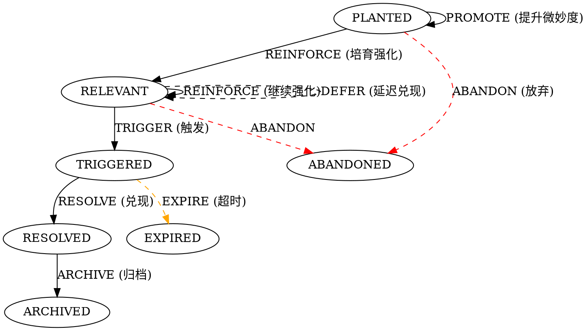

## 操作定义

| 操作 | 适用状态 | 效果 | 成本 |
|------|---------|------|------|
| REINFORCE | PLANTED, RELEVANT | 强化读者对该线索的印象，推进 escalation_curve | 1 |
| PROMOTE | PLANTED | 降低 subtlety（让伏笔更明显），准备进入 RELEVANT | 1 |
| TRIGGER | RELEVANT | 触发伏笔，进入兑现准备 | 1 |
| DEFER | RELEVANT | 延迟兑现（重置 max_distance 倒计时，不推进状态） | 1 |
| RESOLVE | TRIGGERED | 兑现伏笔 | 1 |
| ARCHIVE | RESOLVED | 归档已完成伏笔 | 0 |
| ABANDON | PLANTED, RELEVANT | 放弃伏笔（增加 Chase Power 债务） | 0 (+debt) |
| EXPIRE | TRIGGERED | 超过 max_distance 未兑现（自动触发，标记为需紧急处理） | 0 |

## 晋升规则

- PROMOTE 后 subtlety 降低 0.1-0.2
- subtlety 降至 < 0.3 时自动进入 RELEVANT
- core_hook = true 的伏笔不允许 ABANDON

## 培育间隔检查

- `current_chapter - last_reinforced > cultivation_interval` → 培育过期
- 培育过期不处理 → 下次检查标记为 OVERDUE
- 连续 2 次 OVERDUE → 自动 ABANDON
```

- [ ] **Step 2: Write SKILL.md**

```markdown
---
name: shenbi-foreshadowing-track
description: Use when a chapter has been drafted and state-settled, and foreshadowing hooks need their lifecycle states evaluated and updated
---

# 伏笔追踪

在每章起草并结算状态后，更新 `truth/pending_hooks.md` 中所有活跃伏笔的状态。

## 流程

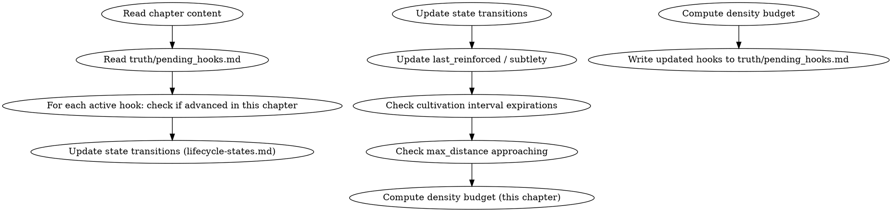

## 数据契约

- **Reads:** `chapters/chapter-N.md`, `truth/pending_hooks.md`, `truth/chapter_summaries.md`
- **Writes:** none
- **Updates:** `truth/pending_hooks.md`

## 铁律

1. **每个活跃伏笔必须在本章被评估** — 不能跳过
2. **状态转换必须有文本证据** — 不能说"这条应该加强了"就改变状态，必须在正文中找到对应内容
3. **core_hook = true 绝不允许 ABANDON** — 核心伏笔放弃 = 故事断裂
4. **密度预算超限必须报告** — 说明哪些操作被推迟

## 操作指南

详见 `lifecycle-states.md`。

### 本章操作识别

1. 在正文中搜索每个活跃伏笔的 `content` 关键词
2. 如果出现 → 判断是强化/触发/兑现
3. 如果未出现 → 检查培育间隔是否过期
4. 记录所有操作，计入密度预算

### 状态更新规则

- 兑现后的小幅伏笔可以保持 RELEVANT（多层次伏笔）
- 主线伏笔兑现后必须 RESOLVED → ARCHIVED
- 超过 max_distance 的伏笔标记为 EXPIRED

## 输出格式

更新 `truth/pending_hooks.md` 的 YAML frontmatter。

同时输出本操作的追踪报告（markdown body 追加到 file）：

```markdown
## 第N章伏笔追踪

### 本章操作
| Hook ID | 操作 | 前状态 | 后状态 | 文本位置 |
|---------|------|--------|--------|---------|
| hook-002 | TRIGGER | RELEVANT | TRIGGERED | 第4段 |
| hook-004 | (新建) | — | PLANTED | 第7段 |

### 过期警告
| Hook ID | 上次强化 | 本章 | 间隔 |
|---------|---------|------|------|
| hook-001 | 3 | 8 | 5/5 OVERDUE |

### 密度账本: 3/8 操作
```

## Anti-Rationalization

| Excuse | Reality |
|--------|---------|
| "这章伏笔都没出现，就跳过更新" | 不更新 → 培育间隔检查失效 → 伏笔默默死去 |
| "手动追踪太麻烦" | 不追踪 → 200章后忘了种了哪些伏笔 → 大量未兑现 |
| "小伏笔不追踪也没事" | 小伏笔 = 故事肌理，肌理断裂读者能感知 |
```

- [ ] **Step 3: Verify skill structure** — Read the file and verify: frontmatter with name+description, DOT flowchart, iron laws, anti-rationalization table.

- [ ] **Step 4: Commit**

```bash
git add skills/shenbi-foreshadowing-track/
git commit -m "feat: add shenbi-foreshadowing-track skill (Phase 3)"
```

- [ ] **Step 5: Write integration pressure test**

Create `tests/skill-behavior/review-catches-bug/phase3-plant-track-resolve.md` — a multi-chapter scenario testing the full foreshadowing lifecycle: plant a hook in chapter N, verify track correctly updates its state in chapter N+1, and verify resolve produces the correct Chase Power accounting in chapter N+5.

---

### Task 3-3: shenbi-foreshadowing-resolve

**Files:**
- Create: `skills/shenbi-foreshadowing-resolve/SKILL.md`
- Create: `skills/shenbi-foreshadowing-resolve/chase-power.md`

- [ ] **Step 1: Write chase-power.md**

```markdown
# Chase Power 期望债务管理

## 概念

Chase Power 是读者对伏笔兑现的期待强度。每个伏笔种植时有一个初始 Chase Power，随着时间推移增长，兑现时释放。未兑现的伏笔累积 Chase Power 债务，债务过高导致读者信任崩塌。

## 债务公式

```
Chase Power = Σ (hook_power × time_since_plant × escalation_factor)
```

- hook_power: 伏笔在叙事中的重要度（core_hook=2.0, 普通=1.0, 支线=0.5）
- time_since_plant: 种植后经过的章数
- escalation_factor: 对应 escalation_curve (FLAT=1.0, RISING=1.5, EXPONENTIAL=2.0)

## 债务等级

| 等级 | CP 债务 | 行动 |
|------|---------|------|
| GREEN | < 50 | 正常 |
| YELLOW | 50-100 | 下3章内需要有伏笔兑现 |
| ORANGE | 100-200 | 下章必须有伏笔兑现 |
| RED | > 200 | 立即安排伏笔兑现或考虑放弃部分支线 |

## 兑现质量

| 兑现类型 | 说明 | CP 影响 |
|---------|------|---------|
| FULL_PAYOFF | 完全满足读者期待 | CP 释放 100% |
| PARTIAL_PAYOFF | 部分满足 | CP 释放 50%，剩余转入新伏笔 |
| TWIST_PAYOFF | 出乎预期但合理 | CP 释放 120%（超额满足） |
| FLAT_PAYOFF | 草草兑现 | CP 释放 30%，增加读者不满 |
```

- [ ] **Step 2: Write SKILL.md**

```markdown
---
name: shenbi-foreshadowing-resolve
description: Use when foreshadowing hooks reach TRIGGERED state and need resolution, or when a volume ends and requires foreshadowing inventory
---

# 伏笔兑现管理

管理伏笔的兑现质量、读者期望债务（Chase Power）、卷尾伏笔盘点。

## 流程

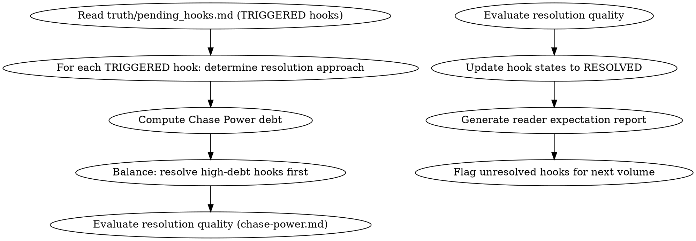

## 数据契约

- **Reads:** `truth/pending_hooks.md`, `truth/chapter_summaries.md`
- **Writes:** none
- **Updates:** `truth/pending_hooks.md`

## 铁律

1. **Chase Power 红区 = 立即行动** — CP > 200 必须在下章内兑现至少一条伏笔
2. **核心伏笔兑现不能是 FLAT_PAYOFF** — core_hook 的兑现至少达到 PARTIAL_PAYOFF 质量
3. **卷尾必须盘点所有活跃伏笔** — 生成"本卷未兑现伏笔"清单
4. **放弃伏笔必须有人类批准** — ABANDON 操作需要人类合作者确认

## 兑现策略

### 逐层兑现
1. 先兑现低 CP 支线伏笔 → 释放小量期待，保持读者满足
2. 再兑现中等主线伏笔 → 推动剧情
3. 最后兑现高 CP 核心伏笔 → 高潮

### 反转兑现
- 烟雾弹 (SMOKESCREEN) 兑现时必须伴随真相揭示
- TWIST_PAYOFF 要求：意外但合理、有文本证据支撑、不破坏已有设定

## 输出格式

```markdown
## 伏笔兑现报告

**范围**: 第N章 / 第M卷
**Chase Power 债务**: XX (GREEN/YELLOW/ORANGE/RED)

### 本章兑现的伏笔

| Hook ID | 兑现类型 | CP 释放 | 质量评估 |
|---------|---------|---------|---------|
| hook-002 | FULL_PAYOFF | 100% | 满意 |
| hook-004 | PARTIAL_PAYOFF | 50% | 可接受，剩余转入 hook-005 |

### 卷尾未兑现清单

| Hook ID | 状态 | CP 贡献 | 建议 |
|---------|------|---------|------|
| hook-001 | RELEVANT | 45 | 下卷首章兑现 |
| hook-003 | PLANTED | 12 | 继续培育 |
```

## Anti-Rationalization

| Excuse | Reality |
|--------|---------|
| "读者已经忘了这条伏笔" | 忘了 ≠ 不存在。突然兑现反而是惊喜，但放弃是违约 |
| "最后草草收一下就行" | FLAT_PAYOFF 对读者体验的伤害 > 不承兑 |
| "Chase Power 太高了，放弃几条减负" | 放弃伏笔瞬间的负面体验远超维持的成本 |
```

- [ ] **Step 3: Verify skill structure** — Read the file and verify: frontmatter with name+description, DOT flowchart, iron laws, anti-rationalization table.

- [ ] **Step 4: Commit**

```bash
git add skills/shenbi-foreshadowing-resolve/
git commit -m "feat: add shenbi-foreshadowing-resolve skill (Phase 3)"
```

---

### Task 3-4: shenbi-truth-sync

**Files:**
- Create: `skills/shenbi-truth-sync/SKILL.md`

- [ ] **Step 1: Write SKILL.md**

```markdown
---
name: shenbi-truth-sync
description: Use when restoring consistency between manually edited chapter content and truth files, re-extracting state from revised chapters, or bootstrapping truth files from existing novel content
---

# 真相文件同步

从编辑后的正文重新反推 truth files，校验一致性。当人类合作者手动修改了章节后，需要运行此技能确保 truth files 与正文同步。

## 流程

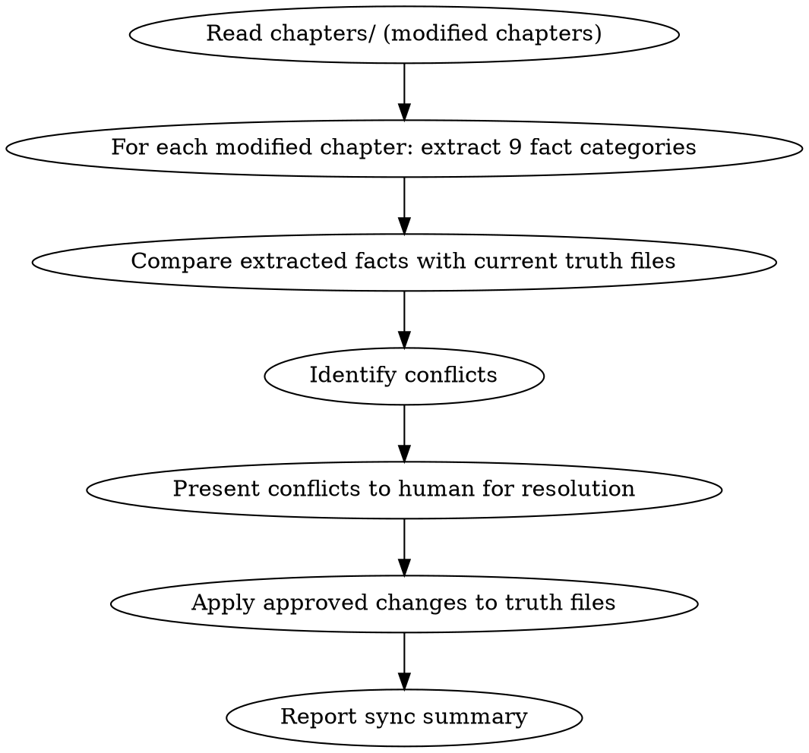

## 数据契约

- **Reads:** `chapters/chapter-N.md`, `truth/*.md`, `world/*.md`, `characters/**/*.md`
- **Writes:** none
- **Updates:** `truth/*.md` (in-place corrections)

## 铁律

1. **正文是权威来源** — truth files 服务于正文，不能反过来"纠正"正文
2. **冲突必须人工仲裁** — 发现 truth files 与正文不一致时，列出冲突让人类选择保留哪个
3. **增量更新** — 只更新变化的部分，不重写整个文件
4. **保留历史** — 在报告中记录同步前/后的差异

## 9 类事实提取

与 `shenbi-state-settling` 相同的 9 类：
1. 位置变化 2. 资源变化 3. 关系变化 4. 情绪变化 5. 信息流动
6. 剧情线索 7. 时间推进 8. 身体状态 9. 行为变化

## 输出格式

```markdown
## 真相文件同步报告

**同步范围**: 第N章 至 第M章
**操作**: 重新提取 → 比较 → 更新

### 冲突清单

| 文件 | 字段 | 正文值 | truth值 | 处理 |
|------|------|--------|---------|------|
| current_state.md | protagonist.location | "外门演武场" | "内门修炼室" | → 保留正文 |
| pending_hooks.md | hook-001.state | (未触发) | TRIGGERED | → 等待人类决定 |

### 变更汇总
- current_state.md: 2处更新
- pending_hooks.md: 1处待决定
- character_matrix.md: 无变化
```

## Anti-Rationalization

| Excuse | Reality |
|--------|---------|
| "正文改了一处而已，不必同步" | 一处不同步 → 下一章 draft 基于错误信息 → 连锁矛盾 |
| "truth files 太久没更新，重写算了" | 重写丢失历史，增量更新保留审计轨迹 |
```

- [ ] **Step 2: Verify skill structure** — Read the file and verify: frontmatter with name+description, DOT flowchart, iron laws, anti-rationalization table.

- [ ] **Step 3: Commit**

```bash
git add skills/shenbi-truth-sync/SKILL.md
git commit -m "feat: add shenbi-truth-sync skill (Phase 3)"
```

---

### Task 3-5: shenbi-snapshot-manage

**Files:**
- Create: `skills/shenbi-snapshot-manage/SKILL.md`

- [ ] **Step 1: Write SKILL.md**

```markdown
---
name: shenbi-snapshot-manage
description: Use when creating chapter completion snapshots, viewing snapshot history, rolling back to a previous snapshot, or recovering novel state after a misstep
---

# 状态快照管理

管理每章完成后的状态快照：创建、查看、回滚、状态恢复。

## 流程

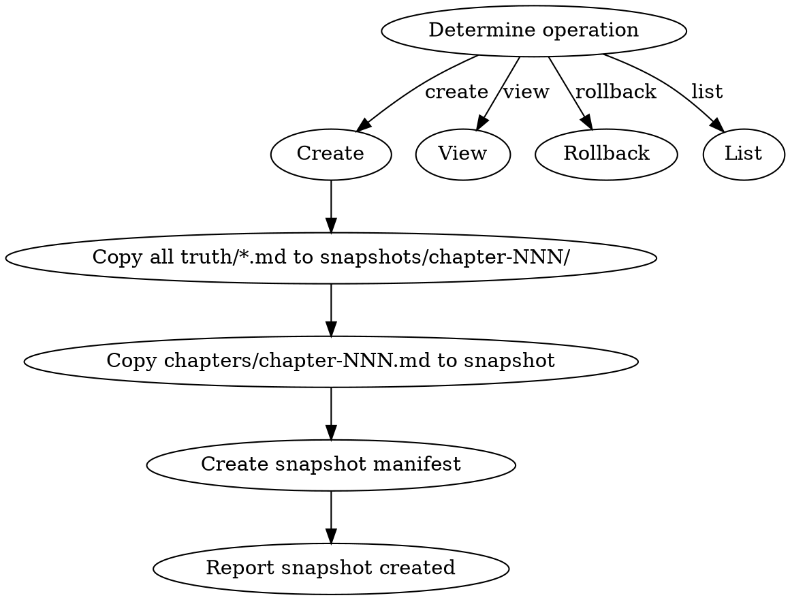

> **Note:** The DOT above shows the primary (create) flow. Other operations (view, rollback, list) are described procedurally below.

## 数据契约

- **Reads:** `truth/*.md`, `chapters/chapter-N.md`, `characters/**/*.md`
- **Writes:** `truth/snapshots/snapshot-*.md`
- **Updates:** none (snapshots are append-only)

## 铁律

1. **每章完成后必须创建快照** — 不创建快照视为流程未完成
2. **快照是完整副本** — 包括所有 10 个 truth/ 文件 + 本章正文（见下方完整清单）
3. **回滚需人类确认** — 回滚是破坏性操作，必须有人类合作者批准
4. **快照不可修改** — 一旦创建，快照是只读的
5. **回滚后续处理** — 回滚后 N+1 到当前章节的正文保留但标记为 UNVERIFIED，需要从回滚点重新运行 state-settling + audits 或手动验证一致性

## 操作

### 创建快照
- 触发：每章审计通过后
- 输出：`snapshots/chapter-NNN/` 目录，包含所有 truth/ 文件的副本

### 查看快照
- 输入：章节号 NNN（或 latest）
- 输出：该快照的摘要（章节摘要 + 关键状态变更 + 活跃伏笔）

### 回滚
- 输入：章节号 NNN
- HARD-GATE: 需要人类确认
- 操作：用 `snapshots/chapter-NNN/` 覆盖 `truth/` + 回滚 `chapters/chapter-NNN.md`
- 警告：回滚后所有 NNN 之后的章节存在一致性风险

### 列出快照
- 输出：所有已创建快照的章节号列表

## 输出格式

```markdown
## 快照创建 — 第N章

**时间**: YYYY-MM-DD HH:MM
**快照内容**:
- truth/current_state.md ✓
- truth/pending_hooks.md ✓
- truth/chapter_summaries.md ✓
- truth/character_matrix.md ✓
- truth/emotional_arcs.md ✓
- truth/particle_ledger.md ✓
- truth/subplot_board.md ✓
- truth/author_intent.md ✓
- truth/current_focus.md ✓
- truth/audit_drift.md ✓
- chapters/chapter-NNN.md ✓

**快照清单**: snapshots/chapter-001/, ..., chapter-NNN/
```

## Anti-Rationalization

| Excuse | Reality |
|--------|---------|
| "这章没问题，不用创建快照" | 不创建快照 = 将来无法回滚 = 连锁错误无法恢复 |
| "快照占空间，少存几个" | 一章快照 ~ 50KB，2000章 = 100MB，完全可控 |
```

- [ ] **Step 2: Verify skill structure** — Read the file and verify: frontmatter with name+description, DOT flowchart, iron laws, anti-rationalization table.

- [ ] **Step 3: Commit**

```bash
git add skills/shenbi-snapshot-manage/SKILL.md
git commit -m "feat: add shenbi-snapshot-manage skill (Phase 3)"
```

---

### Task 3-6: shenbi-intent-management

**Files:**
- Create: `skills/shenbi-intent-management/SKILL.md`

- [ ] **Step 1: Write SKILL.md**

```markdown
---
name: shenbi-intent-management
description: Use when the author wants to set or update their creative intent, or before chapter-planning when current focus may have changed
---

# 意图管理

维护 `truth/author_intent.md`（长期意图）和 `truth/current_focus.md`（1-3章关注点）。

## 流程

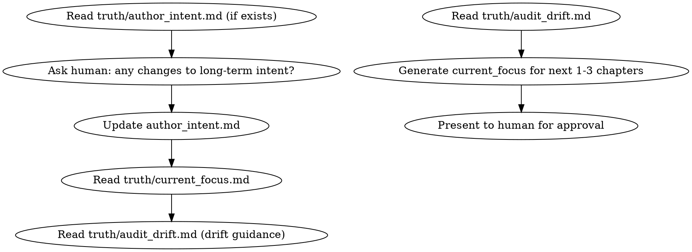

## 数据契约

- **Reads:** `truth/author_intent.md`, `truth/audit_drift.md`
- **Writes:** none
- **Updates:** `truth/author_intent.md`, `truth/current_focus.md`

## 铁律

1. **author_intent 由人类口述，AI 整理** — 不能替作者做创作决策
2. **current_focus 每次 chapter-planning 前更新** — 确保章节备忘反映最新关注点
3. **drift guidance 自动合并到 current_focus** — 纠偏不能遗漏

## 文件格式

### truth/author_intent.md

```markdown
---
updated: 2026-06-15
current_volume: 1
long_term_goals:
  - "主角最终要成为最强，但不走常规路线"
  - "暗线：玉佩的来源与上古传承的关系"
  - "第一女主线：苏晴在卷末面临抉择"
narrative_principles:
  - "不忘初心——主角的所有行动最终服务于'守护'主题"
  - "拒绝龙傲天——每次胜利都有代价"
status: active
---
```

### truth/current_focus.md

```markdown
---
next_3_chapters: [6, 7, 8]
focus_items:
  - priority: P0
    item: "控制转折词密度 ≤ 3次/章（来自第5章drift）"
    source: audit_drift
  - priority: P1
    item: "推进 hook-002 预言兑现"
    source: foreshadowing
  - priority: P1
    item: "展示主角领导力成长"
    source: character_arc
  - priority: P2
    item: "引入新反派线索"
    source: plot
status: draft
---

# 当前关注点 (第6-8章)

[人类可读的叙事化描述]
```

## Anti-Rationalization

| Excuse | Reality |
|--------|---------|
| "我记住作者意图了，不用写" | 50章后你还能记住第3章的意图细节？ |
| "1-3章范围太窄了" | 精确的近期关注点 > 模糊的长期规划 |
```

- [ ] **Step 2: Verify skill structure** — Read the file and verify: frontmatter with name+description, DOT flowchart, iron laws, anti-rationalization table.

- [ ] **Step 3: Commit**

```bash
git add skills/shenbi-intent-management/SKILL.md
git commit -m "feat: add shenbi-intent-management skill (Phase 3)"
```

---

### Task 3-7: shenbi-volume-consolidation

**Files:**
- Create: `skills/shenbi-volume-consolidation/SKILL.md`

- [ ] **Step 1: Write SKILL.md**

```markdown
---
name: shenbi-volume-consolidation
description: Use when a volume has been completed and needs summarization for context management in subsequent writing
---

# 卷整合

卷完成后：合并逐章摘要为叙事摘要、归档旧摘要、生成卷级长程记忆。

## 流程

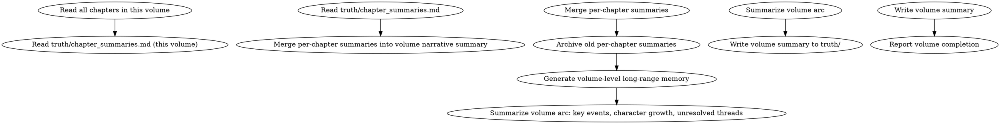

## 数据契约

- **Reads:** `chapters/chapter-N.md`, `truth/chapter_summaries.md`
- **Writes:** `truth/volume_summaries.md` (new file per volume)
- **Updates:** `truth/chapter_summaries.md` (archives old per-chapter entries)

## 铁律

1. **卷完成后必须整合** — 逐章摘要继续增长会导致 context-composing 上下文过长
2. **长程记忆是精炼的** — 每卷的卷级摘要控制在 500 字以内
3. **保留可回查性** — 归档的逐章摘要仍然可以手动查阅
4. **未兑现伏笔必须醒目** — 卷级摘要明确列出本卷种下但未兑现的伏笔

## 输出

### 卷级叙事摘要
追加到 `truth/volume_summaries.md`（如果不存在则创建）：

```markdown
# 卷级摘要

## 第一卷: 入门篇 (第1-15章)

### 叙事弧线
[200字：本卷的核心推进线——主角从外门到内门的成长弧]

### 关键事件
1. 第1-3章: 入门考核 → 展示世界观 + 种植 hook-001
2. 第4-7章: 考核中遭遇反派代理人 → 冲突升级
3. 第8-12章: 内门修炼 → 角色关系发展
4. 第13-15章: 考核最终战 → hook-002 部分兑现

### 角色成长
- 林轩: 从"想证明自己"到"为守护而战"（动机深化）
- 苏晴: 从观望到认可（关系弧完成）

### 未兑现伏笔（带入下卷）
- hook-001: 玉佩隐藏力量（PLANTED → 下卷核心）
- hook-003: 反派寻找玉佩的动机（RELEVANT）

### 卷入尾声状态
- 主角位置: 内门修炼室
- Chase Power 债务: 45 (GREEN)
```

## Anti-Rationalization

| Excuse | Reality |
|--------|---------|
| "卷总结太费时间，跳过" | 30章后 context 爆炸，agent 无法处理 = 质量断崖 |
| "逐章摘要都留着就行" | 逐章摘要用于审计，卷级摘要用于上下文，职能不同 |
```

- [ ] **Step 2: Verify skill structure** — Read the file and verify: frontmatter with name+description, DOT flowchart, iron laws, anti-rationalization table.

- [ ] **Step 3: Commit**

```bash
git add skills/shenbi-volume-consolidation/SKILL.md
git commit -m "feat: add shenbi-volume-consolidation skill (Phase 3)"
```

---

### Phase 3 Completion Checklist

- [ ] All 7 Phase 3 skills created and committed
- [ ] Foreshadowing pipeline (plant → track → resolve) forms a complete write-read cycle
- [ ] `shenbi-foreshadowing-track` reads from chapter content + `pending_hooks.md` and writes updated state
- [ ] `shenbi-snapshot-manage` integrates with the chapter-completion flow
- [ ] `shenbi-intent-management` feeds into `chapter-planning`
- [ ] `shenbi-volume-consolidation` creates inputs for `context-composing`

---

# Phase 4: 扩展能力 (33 skills)

> **Content completeness legend:**
> - ✅ **Full content** — SKILL.md written inline in this plan (same as Phase 1/2/3 tasks)
> - ⚠️ **Stub spec** — One-line specification; implementer must expand using the stub template below
>
> **Phase 4 breakdown by content completeness:**
> - 4a (sensitivity): ✅ Full content (1 skill)
> - 4b (conditional audits): ⚠️ Stub specs (12 skills — expand using template)
> - 4c (genesis extensions): ⚠️ Stub specs (4 skills — expand using template)
> - 4d (planning extensions): ⚠️ Stub specs (3 skills — expand using template)
> - 4e (length-normalizing): ✅ Full content (1 skill)
> - 4f (anti-detect): ✅ Full content (1 skill)
> - 4g (import layer): ⚠️ Stub specs (5 skills — expand using template)
> - 4h (short story): ⚠️ Stub specs (3 skills — expand using template)
> - 4i (management extensions): ⚠️ Stub specs (3 skills — expand using template; market-radar has ✅ full content in Phase 5)
>
> **Total**: 3 skills with ✅ full inline content, 30 skills with ⚠️ stub specs requiring expansion

**Goal:** Complete all remaining skills: 13 audit skills, 5 import skills, 3 short-story skills, 4 worldbuilding extensions, 3 planning extensions, 1 drafting extension, 1 revision extension, and 3 management extensions. This fills all functional gaps.

**Architecture:** Audit skills follow the established review-anti-ai pattern. Import skills form an 8-pass analysis pipeline. Short-story skills are a simplified parallel to the main pipeline. Extensions enrich existing layers with advanced capabilities.

**Dependencies:** Phase 2 (audit infrastructure) + Phase 3 (foreshadowing lifecycle, truth/snapshot management).

**Note:** Due to the large number of skills in Phase 4, tasks are batched by layer. Each batch produces 2-5 skills that share similar patterns.

**Implementation pattern for Phase 4 stubs:** Phase 4b-4i skills are described as one-line specifications rather than full inline SKILL.md content (unlike Phase 2-3 which have complete inline content). Implementers should follow the pattern established by Phase 2's detailed skills: YAML frontmatter (name + description), DOT flowchart, iron laws, anti-rationalization table, check execution steps, and structured output format. Use `shenbi-writing-skills` meta-skill for guidance. Phase 4a (sensitivity), 4e (length-normalizing), and 4f (anti-detect) have full inline content as reference patterns. For skills requiring supporting files (review-long-span, review-era, review-fanfic, review-spinoff), create the supporting files listed in the File Structure tree above.

**Stub expansion template** (use for each Phase 4b-4i skill, excluding 4a/e/f which are already complete):

```
1. Write YAML frontmatter: name + description (trigger-condition-only, English, ≤500 chars)
2. Write DOT flowchart: 5-10 nodes covering read → check → compile → report → pass/fail
3. Write data contract block: - **Reads:** [...], - **Writes:** report only, - **Updates:** none
4. Write iron laws: 3-5 absolute rules using MUST/NEVER/NO X WITHOUT Y
5. Write check execution: 3-5 check categories with deterministic rules where possible
6. Write output format: markdown table-based report with pass/fail/warning severity
7. Write anti-rationalization table: 3-5 excuse/reality pairs covering domain-specific AI shortcuts
8. Write commit instructions: `git add skills/shenbi-<skill>/ && git commit -m "feat: add <skill> (Phase 4)"`
```

**Reference example — `shenbi-review-world-rules` expanded from stub to full content:**

```markdown
---
name: shenbi-review-world-rules
description: Use when checking chapter for world rule violations, power-system scaling collapse, numerical inconsistencies, or knowledge base contamination from outside the novel's setting
---

# 世界规则审计

检查设定矛盾、力量体系崩坏、数值一致性、知识库污染。

> 激活条件：由 `genre-config.json` 的 `auditDimensions` 包含维度 3,4,5,18 时激活。

## 流程

\`\`\`dot
digraph review_world_rules {
    "Read chapter content" -> "Read world/rules.md (world iron laws)";
    "Read world/rules.md" -> "Read world/power_system.md (if exists)";
    "Read world/power_system.md" -> "Check rule violations";
    "Check rule violations" -> "Check power scaling consistency";
    "Check power scaling consistency" -> "Check numerical consistency";
    "Check numerical consistency" -> "Check knowledge contamination";
    "Check knowledge contamination" -> "Compile results";
    "Compile results" -> "Passed?";
    "Passed?" -> "Report PASS" [label="yes"];
    "Passed?" -> "Report issues with severity" [label="no"];
}
\`\`\`

## 数据契约

- **Reads:** `chapters/chapter-N.md`, `world/rules.md`, `world/power_system.md` (if exists), `world/story_bible.md`
- **Writes:** report only
- **Updates:** none

## 铁律

1. **世界铁律不可违反** — `world/rules.md` 中定义的规则在本章必须一致，任何违反都是 error
2. **力量体系不能崩坏** — 角色能力、等级、技能必须在已建立的体系内运作
3. **数值必须自洽** — 年龄、时间、距离、数量、等级等数值与前后章一致
4. **知识不能越界** — 角色不能引用小说世界设定之外的现代概念或知识
5. **设定不能凭空增减** — 新设定必须有种植过程（至少在前文暗示过），不能"突然出现"

## 检查执行

### 1. 规则违反检测
- 逐条对比 `world/rules.md` 的每条铁律与本章内容
- 标记违反的规则和具体段落

### 2. 力量体系一致性
- 检查角色能力使用是否符合 `world/power_system.md` 的等级和能力边界
- 检测"越级打怪"是否有合理铺垫

### 3. 数值一致性
- 年龄、时间流逝、距离、资源数量与 `truth/current_state.md` 对比
- 等级、分数、排名的前后一致性

### 4. 知识污染检测
- 正则检测现代术语、科技概念、非世界观内知识的出现
- 检查角色引用的知识是否在其信息边界内

## 输出格式

\`\`\`markdown
## 世界规则审计报告

**章节**: 第N章
**结果**: 通过 / 有瑕疵 / 不通过

### 规则违反
| 规则 | 违反位置 | 严重度 |
|------|---------|--------|
| ... | ... | ... |

### 力量体系
| 角色 | 能力使用 | 是否超限 | 状态 |
|------|---------|---------|------|
| ... | ... | ... | OK/VIOLATION |

### 数值一致性
| 数值项 | 前章值 | 本章值 | 状态 |
|--------|--------|--------|------|
| ... | ... | ... | OK/MISMATCH |

### 知识污染
| 污染词/概念 | 位置 | 严重度 |
|------------|------|--------|
| ... | ... | ... |

### 评分: X/10 通过
\`\`\`

## Anti-Rationalization

| Excuse | Reality |
|--------|---------|
| "力量体系偶尔崩一下没事" | 一次崩坏 = 读者对整个体系的信任崩塌 |
| "加个新设定很方便" | 未经种植的新设定 = deus ex machina = 读者弃书 |
| "数值差不多就行" | 读者有心算能力，数值矛盾是最容易被发现的 |
\`\`\`

> This example demonstrates the expansion pattern. All 29 Phase 4b-4i stub skills follow this same pattern with domain-specific check categories, applicable truth files in the data contract, and anti-rationalization entries relevant to the audit domain.

**Phase 4b skill count verification**: The Phase 4b checklist references 12 conditional audit skills. Count them: world-rules, reader-pull, memo-compliance, dialogue, motivation, pov, texture, highpoint, long-span, era, fanfic, spinoff = 12 skills. Plus pacing/continuity/character/foreshadowing (already created in Phase 2, referenced in Phase 4b batches for routing integration) = 16 total audit skills in the complete system.

---

### Phase 4a: Default Audit Completion (1 skill)

#### Task 4a-1: shenbi-review-sensitivity

**Files:**
- Create: `skills/shenbi-review-sensitivity/SKILL.md`
- Create: `skills/shenbi-review-sensitivity/sensitive-words.md`

- [ ] **Step 1: Write SKILL.md** — default-activated audit for political sensitivity, platform compliance, adult content, and taboo word checks. Follows the review-anti-ai pattern: deterministic checks first, genre-config prohibitions, structured severity levels (error=blocking).

```markdown
---
name: shenbi-review-sensitivity
description: Use when checking chapter for politically sensitive content, platform compliance violations, adult/violence content boundaries, or book-specific prohibited terms
---

# 敏感内容审计

这是默认激活的审计技能（每章必查）。检查政治敏感词、色情/暴力检测、平台合规性、本书禁忌词。

## 流程

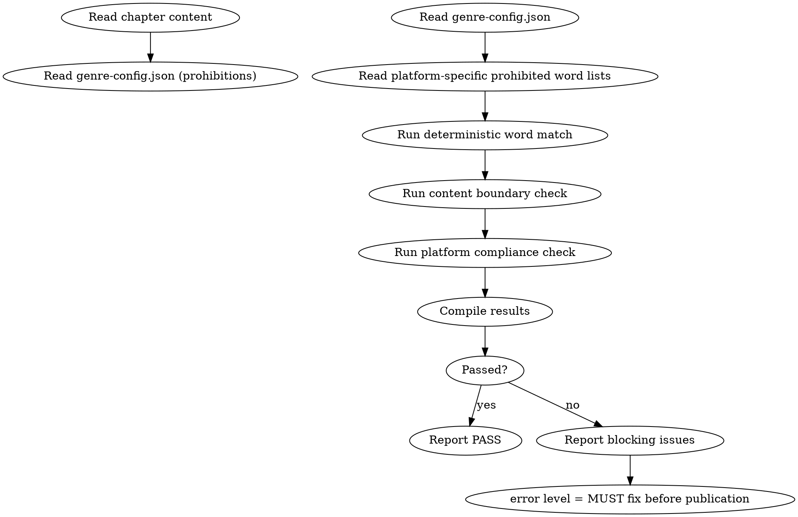

## 数据契约

- **Reads:** `chapters/chapter-N.md`, `genre-config.json`, `novel.json`
- **Writes:** report only
- **Updates:** none

## 铁律

1. **敏感词 = blocking error** — 直接导致平台下架的问题没有 warning 余地，只分 error 和 pass
2. **依据目标平台规则** — 如果 novel.json 指定了目标平台，应用对应平台的审核规则
3. **本书禁忌词必须 0 出现** — genre-config.json 的 prohibitions 列表 = 每章必须为 0
4. **不与 creative expression 妥协** — 只标记客观违规，不对艺术表达做主观审查

## 检查执行

详见 `sensitive-words.md`。

### 1. 平台禁忌词（平台规则级）
- 中国网文平台：政治敏感词、色情描写、极端暴力
- 英文平台：对应平台的 prohibited content 规则

### 2. 本书禁忌词
- 从 `genre-config.json` 的 `prohibitions` 读取
- 每章必须为 0

### 3. 内容边界
- 暴力程度是否超出题材预期
- 是否有未做标记的成人内容

## 输出格式

```markdown
## 敏感内容审计报告

**章节**: 第N章
**目标平台**: 起点中文网
**结果**: 通过 / 不通过

### 平台禁忌词
| 类型 | 检测项 | 结果 |
|------|--------|------|
| 政治 | ... | PASS |
| 色情 | ... | PASS |
| 暴力 | ... | PASS |

### 本书禁忌词
| 禁忌词 | 出现次数 | 状态 |
|--------|---------|------|
| "全场震惊" | 0 | PASS |
| "不由得倒吸一口凉气" | 0 | PASS |

### 评分: 通过/不通过
```

## Anti-Rationalization

| Excuse | Reality |
|--------|---------|
| "敏感词检测太严格了" | 平台审核比你严格得多，下架 = 0 收入 |
| "这条禁忌词加进去也没事" | 禁忌词是为了安全，不是为了提高写作质量 |
```

- [ ] **Step 2: Write sensitive-words.md** — reference list of common platform-prohibited categories and detection methods.

- [ ] **Step 3: Commit**

```bash
git add skills/shenbi-review-sensitivity/
git commit -m "feat: add shenbi-review-sensitivity skill (Phase 4a)"
```

---

### Phase 4b: Conditional Audit Skills (12 skills, batched by cost tier)

Each of these skills is conditionally activated based on `genre-config.json` `auditDimensions`. They follow the same pattern: DOT flowchart, iron laws, deterministic/domain checks, structured output, anti-rationalization table.

**Supporting files needed (create alongside SKILL.md):**
- `review-long-span`: `ngram-methodology.md` — cross-chapter 6-char n-gram comparison algorithm, paragraph length drift formula
- `review-era`: `era-reference.md` — era-specific vocabulary lists, artifact/common-knowledge fact-checking guidelines (by era)
- `review-fanfic`: `fanfic-modes.md` — 4-mode severity rules (canon/au/ooc/cp), each with varying strictness levels
- `review-spinoff`: `spinoff-violations.md` — violation categories (main-story event conflict, future info leak, world rule inconsistency, hook isolation breach)

#### Task 4b-1: Batch 1 — Structure Checks (2 new skills + 1 reference)

- [ ] **shenbi-review-memo-compliance** — Checks chapter text against the 8-section chapter memo. Verifies: hook ledger matches, chapter-end changes occurred, prohibited items were avoided. Activated when `auditDimensions` contains 33.

- [ ] **shenbi-review-texture** — Detects "流水账" (log-style) writing, verifies daily-scene paragraph function, checks paragraph breathing/rhythm, author preaching detection, paragraph length extremes. Activated when `auditDimensions` contains 17.

- [ ] **shenbi-review-pacing** — Already created in Phase 2 Task 2-3. No additional work needed here (this is the same skill, conditionally activated by dimensions 7/26).

#### Task 4b-2: Batch 2 — Domain Checks (4 new skills + 2 references)

- [ ] **shenbi-review-world-rules** — Checks setting conflicts, power-system崩坏 (power scaling collapse), numerical consistency, knowledge base contamination. Activated when `auditDimensions` contains 3,4,5,18.

- [ ] **shenbi-review-dialogue** — Checks character speech style consistency, dialogue tag diversity, 了 density, catchphrase matching. Activated when `auditDimensions` contains 16.

- [ ] **shenbi-review-motivation** — Checks character action interest-driven logic, motivation plausibility, behavior chain completeness. Activated when `auditDimensions` contains 11.

- [ ] **shenbi-review-pov** — Checks POV switch transitions, information boundary (characters referencing info they shouldn't know). Activated when `auditDimensions` contains 9,19.

- [ ] **shenbi-review-continuity** — Already created in Phase 2 Task 2-1 (default-activated, always on). No additional work.

- [ ] **shenbi-review-character** — Already created in Phase 2 Task 2-2 (default-activated, always on). No additional work.

#### Task 4b-3: Batch 3 — Advanced Checks (2 new skills + 1 reference)

- [ ] **shenbi-review-reader-pull** — Checks chapter opening hook strength, chapter-end suspense, reader expectation management. Activated when `auditDimensions` contains 32.

- [ ] **shenbi-review-highpoint** — Checks suppression-explosion pattern, twist detection, climax keyword diversity, 爽点虚化 (payoff < reader expectation). Activated when `auditDimensions` contains 15.

- [ ] **shenbi-review-foreshadowing** — Already created in Phase 2 Task 2-4 (conditionally activated by dimensions 6/24). No additional work.

#### Task 4b-4: Batch 4 — Special Condition Checks (4 skills)

- [ ] **shenbi-review-long-span** — Cross-chapter word/image/sentence pattern repetition checks, 6-char n-gram cross-chapter repetition, paragraph length drift detection. Extra condition: `current_chapter ≥ 3`. Activated when `auditDimensions` contains 10.

- [ ] **shenbi-review-era** — Historical era accuracy, period-appropriate vocabulary, artifact/location fact-checking. Activated when `eraResearch` or `eraConstraints` is true in genre-config.

- [ ] **shenbi-review-fanfic** — Character fidelity, world rule consistency, relationship dynamics, canon event consistency. Support 4 fanfic modes (canon/au/ooc/cp). Activated when `novel.json.mode` is "fanfic".

- [ ] **shenbi-review-spinoff** — Main-story event conflict check, future info leakage, world rule consistency, hook isolation. Activated when `truth/parent_canon.md` exists.

**Batch commit messages:**
```bash
git commit -m "feat: add Phase 4b audit skills batch 1-4 (12 conditional audit skills)"
```

**Batch 1-4 completion checklist:**
- [ ] Each skill has valid frontmatter, DOT flowchart, iron laws, anti-rationalization table
- [ ] Each skill reads the correct truth files and `genre-config.json`
- [ ] Each skill outputs structured report with severity levels
- [ ] Conditional activation documented in each skill (which dimensions trigger it)
- [ ] `shenbi-review-pacing`, `shenbi-review-continuity`, `shenbi-review-character`, `shenbi-review-foreshadowing` are referenced (already created in Phase 2 and do not need re-creating)

---

### Phase 4c: Worldbuilding Extensions (4 skills)

#### Task 4c-1: Batch — Genesis Layer Extensions

- [ ] **shenbi-location-builder** — Location design: spatial layout, atmosphere description, functional positioning, cross-location spatial consistency. Manages `world/locations.md`.

- [ ] **shenbi-relationship-map** — Character relationship network: interest chains, faction affiliations, information boundaries, relationship evolution trajectories. Manages `characters/relationships.md` and contributes to `truth/character_matrix.md`.

- [ ] **shenbi-faction-builder** — Faction design: hierarchy structure, internal conflicts, cross-faction dynamics, interest-driven behavior. Manages `world/factions.md`.

- [ ] **shenbi-power-system** — Power system design: level classification, advancement rules, power ceiling, ability boundaries. Manages `world/power_system.md`.

```bash
git commit -m "feat: add Phase 4c genesis extension skills (4 skills)"
```

---

### Phase 4d: Planning Extensions (3 skills)

#### Task 4d-1: Batch — Planning Layer Extensions

- [ ] **shenbi-volume-outlining** — Volume outline planning: per-volume goals + rhythm principles, intra-volume tension curve, cross-volume bridging. Creates `outline/volume_map.md`.

- [ ] **shenbi-pacing-design** — Pacing design: buildup → escalation → explosion → aftermath cycle, scene type sequence to avoid monotony, three-line ratio (QUEST/FIRE/CONSTELLATION). Creates `outline/rhythm_principles.md`.

- [ ] **shenbi-plot-thread-weaver** — Thread weaving: A/B/C plot line management, thread priority, max consecutive/max gap control, thread cross-dependencies. **Also resolves Phase 1 deferral**: manages `truth/subplot_board.md` updates — each chapter's state-settling extracts plot thread changes as 9-class fact type 6 (剧情线索); plot-thread-weaver processes these into subplot_board.md with thread lifecycle tracking (active/stalled/resolved/abandoned).

```bash
git commit -m "feat: add Phase 4d planning extension skills (3 skills)"
```

---

### Phase 4e: Drafting Extension (1 skill)

#### Task 4e-1: shenbi-length-normalizing

**Files:**
- Create: `skills/shenbi-length-normalizing/SKILL.md`

- [ ] **Step 1: Write SKILL.md** — Word count governance: compress/expand to target range, soft/hard range control, truncation protection. Reads `novel.json.chapter_word_count`, checks current chapter length, applies compression or expansion strategies without changing plot/character content.

```markdown
---
name: shenbi-length-normalizing
description: Use when a chapter's word count falls outside the target range defined in novel.json
---

# 字数治理

HARD-GATE: 如果归一化后正文长度 < 原始长度的 25%，拒绝归一化（原章节结构无法支撑目标字数）。

## 流程

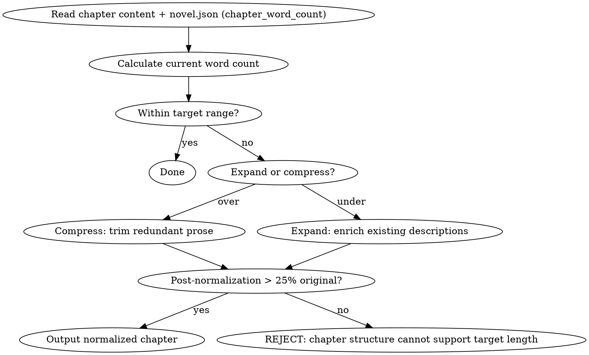

## 数据契约

- **Reads:** `chapters/chapter-N.md`, `novel.json` (target_word_count), `genre-config.json`
- **Writes:** none (edits chapter in-place)
- **Updates:** `chapters/chapter-N.md`

## 铁律

1. **不改变叙事内容** — 压缩/扩写不能增删事件、改变角色行为、影响伏笔
2. **软区间优先** — target_word_count ± 15% 是软区间，± 30% 是硬上限
3. **25% 底线** — 压缩后 < 25% 原始长度 → 章节需要重写，不做表面压缩
4. **保持声音指纹** — 扩写不能引入 AI 味句式

## 压缩策略
- 合并功能重复的描写
- 剪除冗余修饰（删形容词不删信息）
- 压缩过渡段落

## 扩写策略
- 展开角色内心活动
- 丰富环境描写
- 深化对话潜台词
- 增加感官细节

## 输出格式

```markdown
# 归一化后的第N章

[完整的归一化后章节正文]

---

## 归一化报告

**原始字数**: N
**目标区间**: [X, Y] (soft: ±15%, hard: ±30%)
**归一化后字数**: M (变化: +N/-N, X%)
**策略**: 压缩 / 扩写
- 段落处理: N处
- 用词调整: N处
- 总字数变化: +N/-N (X%)
```

## Anti-Rationalization

| Excuse | Reality |
|--------|---------|
| "字数差一点没关系" | 目标平台对字数有明确区间，不符合 = 章节不被推荐 |
| "直接删掉一段就行" | 删段落 = 丢失信息 = 叙事断裂 |

- [ ] **Step 2: Commit**

```bash
git add skills/shenbi-length-normalizing/SKILL.md
git commit -m "feat: add shenbi-length-normalizing skill (Phase 4e)"
```

---

### Phase 4f: Revision Extension (1 skill)

#### Task 4f-1: shenbi-anti-detect

**Files:**
- Create: `skills/shenbi-anti-detect/SKILL.md`

- [ ] **Step 1: Write SKILL.md** — Anti-detection rewriting: 9 rewriting techniques (break sentence pattern regularity, colloquialization, 了 frequency reduction, transition word reduction, emotion externalization, etc.). Operates on existing chapter text, applies targeted transformations to reduce AI detectability markers.

```markdown
---
name: shenbi-anti-detect
description: Use when a chapter has been flagged by anti-AI audit for detectability markers that polishing alone cannot resolve
---

# 反检测改写

应用 9 种改写手法降低 AI 可检测性标记。

## 流程

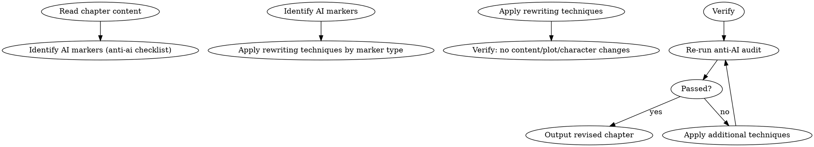

## 数据契约

- **Reads:** `chapters/chapter-N.md`, anti-AI audit report
- **Writes:** none (edits chapter in-place)
- **Updates:** `chapters/chapter-N.md`

## 铁律

1. **不改叙事内容** — anti-detect 是表达层变换，不碰情节/角色/伏笔
2. **每种标记有对应手法** — 不是笼统重写，是靶向替换
3. **改写后重新审计** — anti-ai + sensitivity 两个审计必须重新通过
4. **不错杀好文** — 如果某句话的表述已经是优选，不要为改而改

## 9 种改写手法

1. **打破句式规律** — 连续相同句式 → 变换句子结构
2. **口语化** — 书面语痕迹 → 口头语表达
3. **了字降频** — 连续"了"字句 → 用动作替代完成态
4. **转折词降频** — 然而/不过/突然 → 用场景转换自然过渡
5. **情绪外化** — "感到愤怒" → 身体反应/动作描写
6. **感官锚定** — 抽象描述 → 具体感官细节
7. **对话差异化** — 扁平对话 → 注入角色声音指纹
8. **打破段落等长** — 均匀段落 → 长短交错
9. **替换分析术语** — "由此可见"等 → 自然叙述过渡

## Anti-Rationalization

| Excuse | Reality |
|--------|---------|
| "改过的文字不如原文好" | 优先自然表达，"为掩藏而损害文字"是本末倒置 |
| "每句话都改写一遍" | 只改写检测标记点，不过度改写 |
| "AI检测不重要" | 平台AIGC检测直接关联推荐权重和收入 |
```

## 输出格式

```markdown
# 反检测改写后的第N章

[完整的改写后章节正文]

---

## 改写报告

**应用手法**:
| 手法 | 改写位置 | 原文标记 |
|------|---------|---------|
| 打破句式规律 | 第3段 | 连续3句相同结构 |
| 了字降频 | 第5段 | 4个"了" → 2个 |

**审计对比**: 改写前 N 个 error/warning → 改写后 M 个 error/warning
```

- [ ] **Step 2: Commit**

```bash
git add skills/shenbi-anti-detect/SKILL.md
git commit -m "feat: add shenbi-anti-detect skill (Phase 4f)"
```

---

### Phase 4g: Import Layer (5 skills)

#### Task 4g-1: shenbi-import-analysis

- [ ] **Write SKILL.md** — 8-pass analysis pipeline: parse → character → world → plot → foreshadowing → style → highlights → state reconstruction. Middle 6 passes can run in parallel. Reads existing novel chapters, outputs structured analysis files under `import/analysis/`.

#### Task 4g-2: shenbi-style-learning

- [ ] **Write SKILL.md** — Style fingerprint extraction: sentence/paragraph length statistics, TTR (type-token ratio), high-frequency sentence patterns, rhetorical features. Pure statistical, no LLM. Outputs `style/style_profile.md`.

#### Task 4g-3: shenbi-character-extraction

- [ ] **Write SKILL.md** — Reverse character analysis: extracts character profiles, speech styles, relationship networks, behavior patterns from existing chapters. Outputs `characters/` files.

#### Task 4g-4: shenbi-world-extraction

- [ ] **Write SKILL.md** — Reverse worldbuilding extraction: extracts world rules, locations, items, power systems from existing chapters. Outputs `world/` files.

#### Task 4g-5: shenbi-canon-import

- [ ] **Write SKILL.md** — Canon import for fanfic: extracts 5 SECTIONS from source material, supports 4 fanfic modes (canon/au/ooc/cp). Outputs `import/` files and canonical reference files.

```bash
git add skills/shenbi-import-analysis/ skills/shenbi-style-learning/ skills/shenbi-character-extraction/ skills/shenbi-world-extraction/ skills/shenbi-canon-import/
git commit -m "feat: add Phase 4g import layer skills (5 skills)"
```

**Import layer checklist:**
- [ ] `shenbi-import-analysis` defines the 8-pass pipeline and parallel execution strategy
- [ ] `shenbi-style-learning` is pure statistical (zero LLM cost)
- [ ] All import skills write to the `import/` directory structure defined in the design spec
- [ ] `shenbi-canon-import` supports all 4 fanfic modes

---

### Phase 4h: Short Story Layer (3 skills)

#### Task 4h-1: Batch — Short Story Skills

- [ ] **shenbi-short-outline** — Short story outline generate → review → revise (3-step). Creates a condensed outline for stories < 30 chapters.

- [ ] **shenbi-short-drafting** — Batch chapter generation → review → revise (3-step). Generates all chapters at once rather than the per-chapter loop.

- [ ] **shenbi-short-packaging** — Sales packaging: title, blurb, selling points, cover prompt generation. For short story publication/marketing.

```bash
git commit -m "feat: add Phase 4h short story layer skills (3 skills)"
```

---

### Phase 4i: Management Extensions (3 skills)

> **Note:** `shenbi-market-radar` is described in this section but its SKILL.md is finalized in Phase 5 Task 5-5 (requires web search integration). Counted as Phase 5 for commit purposes.

#### Task 4i-1: Batch — Management Layer

- [ ] **shenbi-genre-config** — Genre configuration management: fatigue word lists, pacing rules, chapter type definitions, audit dimension activation, custom rules. Manages `genre-config.json`.

- [ ] **shenbi-chapter-pattern** — 13 chapter pattern detection and classification. Detects pattern monotony across the book. Reads chapter history, classifies each chapter, reports if patterns become too repetitive.

- [ ] **shenbi-sequel-writing** — Sequel writing service: finds breakpoint snapshot from existing content, reconstructs context, continues writing subsequent chapters. Uses `snapshots/` and `truth/` to rebuild state.

- [ ] **shenbi-market-radar** — Platform trend scanning: leaderboard data, genre analysis, opening book advice, competitive work benchmarking. (Note: this skill requires web search capabilities and is marked as partially Phase 5 due to integration needs.)

```bash
git commit -m "feat: add Phase 4i management extension skills (3 skills; market-radar finalized in Phase 5)"
```

---

### Phase 4 Completion Checklist

- [ ] All 33 Phase 4 skills created and committed (1 + 12 + 4 + 3 + 1 + 1 + 5 + 3 + 3)
- [ ] Audit activation rules fully implemented across all conditional audit skills
- [ ] Import pipeline (8-pass analysis) can reconstruct a novel project from existing chapters
- [ ] Short story skills provide a simplified alternative to the full pipeline
- [ ] `shenbi-chapter-pattern` integrates with `shenbi-review-pacing` for pattern monotony detection
- [ ] `shenbi-sequel-writing` integrates with `shenbi-snapshot-manage` for state reconstruction
- [ ] (shenbi-market-radar may need web search tooling — defer full integration to Phase 5)

---

# Phase 5: 平台适配与国际化 (5 categories)

**Goal:** Package Shenbi for all 7 target platforms, add English skill descriptions, build the hooks system, expand pressure tests, and integrate market-radar.

**Architecture:** Phase 5 creates platform adapter files (plugin manifests, hooks), verifies English `description` fields, builds test infrastructure, and finalizes `shenbi-market-radar` (partially created in Phase 4i).

**Dependencies:** All Phase 1-4 skills exist (descriptions need to exist before verification).

---

### Task 5-1: Hooks System

**Files:**
- Create: `hooks/hooks.json`
- Create: `hooks/hooks-cursor.json`
- Create: `hooks/session-start`
- Create: `hooks/run-hook.cmd`

- [ ] **Step 1: Write hooks.json** — Claude Code SessionStart hook configuration. References `session-start` as entry point.

```json
{
  "hooks": {
    "SessionStart": [
      {
        "matcher": "",
        "hooks": [
          {
            "type": "command",
            "command": "bash \"${CLAUDE_PLUGIN_ROOT}/hooks/session-start\""
          }
        ]
      }
    ]
  }
}
```

- [ ] **Step 2: Write hooks-cursor.json** — Cursor hook configuration (camelCase format).

```json
{
  "hooks": [
    {
      "event": "SessionStart",
      "matcher": "",
      "command": "bash \"${CURSOR_PLUGIN_ROOT}/hooks/session-start\""
    }
  ]
}
```

- [ ] **Step 3: Write session-start** — Unix entry script (bash) that detects platform via environment variables and outputs the `using-shenbi` skill injection instruction.

```bash
#!/usr/bin/env bash
# session-start: Platform-agnostic hook entry point
# Detects host platform and outputs using-shenbi skill injection

PLATFORM="unknown"

if [ -n "$CLAUDE_PLUGIN_ROOT" ]; then
    PLATFORM="claude-code"
elif [ -n "$CURSOR_PLUGIN_ROOT" ]; then
    PLATFORM="cursor"
elif [ -n "$CODEX_PLUGIN_ROOT" ]; then
    PLATFORM="codex"
elif [ -n "$OPENCODE_PLUGIN_ROOT" ]; then
    PLATFORM="opencode"
elif [ -n "$GEMINI_CLI" ]; then
    PLATFORM="gemini-cli"
elif [ -n "$COPILOT_CLI" ]; then
    PLATFORM="copilot-cli"
elif [ -n "$FACTORY_DROID" ]; then
    PLATFORM="factory-droid"
fi

echo "{\"platform\": \"$PLATFORM\", \"action\": \"inject-skill\", \"skill\": \"using-shenbi\"}"
```

- [ ] **Step 4: Write run-hook.cmd** — Windows polyglot wrapper (batch + bash).

```batch
@echo off
REM Windows polyglot wrapper for shenbi hooks
REM Auto-detects bash (Git for Windows / WSL) and delegates
where bash >nul 2>nul
if %ERRORLEVEL% EQU 0 (
    bash "%~dp0session-start" %*
) else (
    echo Shenbi hooks require bash (install Git for Windows or WSL)
    exit /b 1
)
```

- [ ] **Step 5: Commit**

```bash
git add hooks/
git commit -m "feat: add hooks system for 7-platform SessionStart injection (Phase 5)"
```

---

### Task 5-2: Platform Plugin Manifests (7 platforms)

**Files:**
- Create: `.claude-plugin/plugin.json`
- Create: `.cursor-plugin/plugin.json`
- Create: `.codex-plugin/plugin.json`
- Create: `.opencode/plugins/shenbi.js`
- Create: `GEMINI.md`
- (Copilot CLI: reuses hooks.json with `COPILOT_CLI` env detection)
- (Factory Droid: reuses `.claude-plugin/`)

- [ ] **Step 1: Write .claude-plugin/plugin.json**

```json
{
  "name": "shenbi",
  "version": "0.2.0",
  "description": "AI skill framework for novel writing",
  "author": "shenbi",
  "skills": [
    "skills/using-shenbi/SKILL.md",
    "skills/shenbi-writing-skills/SKILL.md",
    "skills/shenbi-worldbuilding/SKILL.md",
    "skills/shenbi-location-builder/SKILL.md",
    "skills/shenbi-character-design/SKILL.md",
    "skills/shenbi-relationship-map/SKILL.md",
    "skills/shenbi-faction-builder/SKILL.md",
    "skills/shenbi-power-system/SKILL.md",
    "skills/shenbi-story-architecture/SKILL.md",
    "skills/shenbi-volume-outlining/SKILL.md",
    "skills/shenbi-chapter-planning/SKILL.md",
    "skills/shenbi-pacing-design/SKILL.md",
    "skills/shenbi-plot-thread-weaver/SKILL.md",
    "skills/shenbi-foreshadowing-plant/SKILL.md",
    "skills/shenbi-foreshadowing-track/SKILL.md",
    "skills/shenbi-foreshadowing-resolve/SKILL.md",
    "skills/shenbi-context-composing/SKILL.md",
    "skills/shenbi-chapter-drafting/SKILL.md",
    "skills/shenbi-state-settling/SKILL.md",
    "skills/shenbi-length-normalizing/SKILL.md",
    "skills/shenbi-review-continuity/SKILL.md",
    "skills/shenbi-review-character/SKILL.md",
    "skills/shenbi-review-world-rules/SKILL.md",
    "skills/shenbi-review-pacing/SKILL.md",
    "skills/shenbi-review-foreshadowing/SKILL.md",
    "skills/shenbi-review-anti-ai/SKILL.md",
    "skills/shenbi-review-sensitivity/SKILL.md",
    "skills/shenbi-review-reader-pull/SKILL.md",
    "skills/shenbi-review-memo-compliance/SKILL.md",
    "skills/shenbi-review-dialogue/SKILL.md",
    "skills/shenbi-review-motivation/SKILL.md",
    "skills/shenbi-review-pov/SKILL.md",
    "skills/shenbi-review-texture/SKILL.md",
    "skills/shenbi-review-highpoint/SKILL.md",
    "skills/shenbi-review-long-span/SKILL.md",
    "skills/shenbi-review-era/SKILL.md",
    "skills/shenbi-review-fanfic/SKILL.md",
    "skills/shenbi-review-spinoff/SKILL.md",
    "skills/shenbi-chapter-revision/SKILL.md",
    "skills/shenbi-style-polishing/SKILL.md",
    "skills/shenbi-anti-detect/SKILL.md",
    "skills/shenbi-import-analysis/SKILL.md",
    "skills/shenbi-style-learning/SKILL.md",
    "skills/shenbi-character-extraction/SKILL.md",
    "skills/shenbi-world-extraction/SKILL.md",
    "skills/shenbi-canon-import/SKILL.md",
    "skills/shenbi-short-outline/SKILL.md",
    "skills/shenbi-short-drafting/SKILL.md",
    "skills/shenbi-short-packaging/SKILL.md",
    "skills/shenbi-truth-sync/SKILL.md",
    "skills/shenbi-snapshot-manage/SKILL.md",
    "skills/shenbi-market-radar/SKILL.md",
    "skills/shenbi-foundation-review/SKILL.md",
    "skills/shenbi-genre-config/SKILL.md",
    "skills/shenbi-volume-consolidation/SKILL.md",
    "skills/shenbi-drift-guidance/SKILL.md",
    "skills/shenbi-intent-management/SKILL.md",
    "skills/shenbi-chapter-pattern/SKILL.md",
    "skills/shenbi-sequel-writing/SKILL.md"
  ]
}
```

- [ ] **Step 2: Write .cursor-plugin/plugin.json** — camelCase format version of the same skill listing.

- [ ] **Step 3: Write .codex-plugin/plugin.json** — Codex plugin market format.

- [ ] **Step 4: Write .opencode/plugins/shenbi.js** — ES module plugin entry for OpenCode.

```javascript
export default {
  name: 'shenbi',
  version: '0.2.0',
  description: 'AI skill framework for novel writing',
  skills: [
    'skills/using-shenbi/SKILL.md',
    'skills/shenbi-writing-skills/SKILL.md',
    'skills/shenbi-worldbuilding/SKILL.md',
    'skills/shenbi-location-builder/SKILL.md',
    'skills/shenbi-character-design/SKILL.md',
    'skills/shenbi-relationship-map/SKILL.md',
    'skills/shenbi-faction-builder/SKILL.md',
    'skills/shenbi-power-system/SKILL.md',
    'skills/shenbi-story-architecture/SKILL.md',
    'skills/shenbi-volume-outlining/SKILL.md',
    'skills/shenbi-chapter-planning/SKILL.md',
    'skills/shenbi-pacing-design/SKILL.md',
    'skills/shenbi-plot-thread-weaver/SKILL.md',
    'skills/shenbi-foreshadowing-plant/SKILL.md',
    'skills/shenbi-foreshadowing-track/SKILL.md',
    'skills/shenbi-foreshadowing-resolve/SKILL.md',
    'skills/shenbi-context-composing/SKILL.md',
    'skills/shenbi-chapter-drafting/SKILL.md',
    'skills/shenbi-state-settling/SKILL.md',
    'skills/shenbi-length-normalizing/SKILL.md',
    'skills/shenbi-review-continuity/SKILL.md',
    'skills/shenbi-review-character/SKILL.md',
    'skills/shenbi-review-world-rules/SKILL.md',
    'skills/shenbi-review-pacing/SKILL.md',
    'skills/shenbi-review-foreshadowing/SKILL.md',
    'skills/shenbi-review-anti-ai/SKILL.md',
    'skills/shenbi-review-sensitivity/SKILL.md',
    'skills/shenbi-review-reader-pull/SKILL.md',
    'skills/shenbi-review-memo-compliance/SKILL.md',
    'skills/shenbi-review-dialogue/SKILL.md',
    'skills/shenbi-review-motivation/SKILL.md',
    'skills/shenbi-review-pov/SKILL.md',
    'skills/shenbi-review-texture/SKILL.md',
    'skills/shenbi-review-highpoint/SKILL.md',
    'skills/shenbi-review-long-span/SKILL.md',
    'skills/shenbi-review-era/SKILL.md',
    'skills/shenbi-review-fanfic/SKILL.md',
    'skills/shenbi-review-spinoff/SKILL.md',
    'skills/shenbi-chapter-revision/SKILL.md',
    'skills/shenbi-style-polishing/SKILL.md',
    'skills/shenbi-anti-detect/SKILL.md',
    'skills/shenbi-import-analysis/SKILL.md',
    'skills/shenbi-style-learning/SKILL.md',
    'skills/shenbi-character-extraction/SKILL.md',
    'skills/shenbi-world-extraction/SKILL.md',
    'skills/shenbi-canon-import/SKILL.md',
    'skills/shenbi-short-outline/SKILL.md',
    'skills/shenbi-short-drafting/SKILL.md',
    'skills/shenbi-short-packaging/SKILL.md',
    'skills/shenbi-truth-sync/SKILL.md',
    'skills/shenbi-snapshot-manage/SKILL.md',
    'skills/shenbi-market-radar/SKILL.md',
    'skills/shenbi-foundation-review/SKILL.md',
    'skills/shenbi-genre-config/SKILL.md',
    'skills/shenbi-volume-consolidation/SKILL.md',
    'skills/shenbi-drift-guidance/SKILL.md',
    'skills/shenbi-intent-management/SKILL.md',
    'skills/shenbi-chapter-pattern/SKILL.md',
    'skills/shenbi-sequel-writing/SKILL.md'
  ]
}
```

- [ ] **Step 5: Write GEMINI.md** — Gemini CLI entry point that maps `using-shenbi` skill injection for Gemini's tool system.

- [ ] **Step 6: Commit**

```bash
git add .claude-plugin/ .cursor-plugin/ .codex-plugin/ .opencode/ GEMINI.md
git commit -m "feat: add 7-platform plugin manifests (Phase 5)"
```

---

### Task 5-3: English Description Verification

**Files:** Verify all 48 new `skills/shenbi-*/SKILL.md` frontmatter (Phase 1 skills already have English descriptions)

- [ ] **Step 1: Verify all 48 new skills have English `description` fields** — Each skill's description follows the pattern "Use when [trigger condition]". Most Phase 2-4 skills already have English descriptions in their SKILL.md content; verify they preserve the "only describe when to use, not what it does" rule.

- [ ] **Step 2: Verify descriptions adhere to the description trap rule** — description must NOT summarize the skill's workflow, only state trigger conditions. Flag any that drift into "what it does" territory.

- [ ] **Step 3: Commit**

```bash
git commit -m "feat: verify English descriptions across all 59 skills (Phase 5)"
```

---

### Task 5-4: Pressure Tests Expansion

**Files:**
- Create: `tests/skill-triggering/prompts/phase2-*.md`
- Create: `tests/skill-behavior/review-catches-bug/phase4-*.md`
- Create: `tests/pressure-tests/prompts/audit-skipping-pressure.md`
- Create: `tests/pressure-tests/prompts/foreshadowing-fatigue-pressure.md`
- Create: `tests/pressure-tests/prompts/import-shortcut-pressure.md`

- [ ] **Step 1: Write Phase 2 trigger tests** — Natural language prompts that test whether `using-shenbi` correctly routes to Phase 2 audit skills (e.g., "Check if my chapter has timeline problems" → activates review-continuity).

- [ ] **Step 2: Write Phase 4 audit behavior tests** — Chapters with injected bugs for the new conditional audit skills to catch.

- [ ] **Step 3: Write combined pressure tests** — Multi-factor pressure scenarios:
  - `audit-skipping-pressure.md`: Time pressure + fatigue → test that audits are not skipped
  - `foreshadowing-fatigue-pressure.md`: 50 chapters of backlog → test that tracking doesn't degrade
  - `import-shortcut-pressure.md`: Large import → test that the pipeline doesn't cut corners

- [ ] **Step 4: Commit**

```bash
git add tests/
git commit -m "test: expand pressure tests for Phases 2-5 (Phase 5)"
```

---

### Task 5-5: shenbi-market-radar (integration)

**Files:**
- Create: `skills/shenbi-market-radar/SKILL.md` (if not already created in Phase 4i)

- [ ] **Step 1: Write or finalize SKILL.md** — Market radar for platform trend scanning: leaderboard data analysis, genre trend identification, opening book strategy advice, competitive work benchmarking. Requires web search tooling.

```markdown
---
name: shenbi-market-radar
description: Use when researching current platform trends, analyzing leaderboard data, evaluating genre opportunities, or seeking competitive positioning advice for a new novel
---

# 市场雷达

平台趋势扫描：排行榜数据、题材分析、开书建议、对标作品。

## 流程

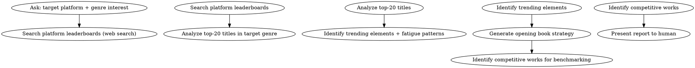

## 数据契约

- **Reads:** `novel.json` (platform, genre), `genre-config.json`
- **Writes:** market analysis report (presented to human, not stored in truth/)
- **Updates:** none

## 铁律

1. **基于数据，不是直觉** — 所有建议必须有排行榜数据支撑
2. **识别趋势不是模仿** — 告诉作者什么在起势，不是教作者抄
3. **回避疲劳元素** — 如果某元素在 top-20 中出现 > 60%，标记为"饱和"
4. **尊重作者创意** — 建议是参考，作者决定是否采纳

## 输出格式

```markdown
## 市场雷达报告

**平台**: 起点中文网
**题材**: 玄幻
**日期**: YYYY-MM-DD

### 排行榜快照 (Top 10)
[简要摘要]

### 趋势信号
- 上升: [元素1], [元素2]
- 饱和: [元素3]
- 衰退: [元素4]

### 开书建议
[差异化切入角度建议]

### 对标作品
[2-3部可参考的作品及分析]
```

## Anti-Rationalization

| Excuse | Reality |
|--------|---------|
| "追热点写最火的题材" | 热点 = 一年后你的书上架时已是红海 |
| "不用看市场，好故事自然有人看" | 好故事 + 正确平台策略 = 双倍效果 |
```

- [ ] **Step 2: Commit**

```bash
git add skills/shenbi-market-radar/SKILL.md
git commit -m "feat: add shenbi-market-radar with web search integration (Phase 5)"
```

---

### Phase 5 Completion Checklist

- [ ] Hooks system operational on all 7 platforms
- [ ] All 59 skills registered in 7 platform manifests
- [ ] All 48 new skills verified to have English `description` fields (correct trigger-condition-only style; Phase 1 skills already verified)
- [ ] GEMINI.md provides Gemini CLI entry point with tool mapping
- [ ] Pressure tests cover audit resistance, foreshadowing fatigue, and import shortcuts
- [ ] market-radar provides actionable competitive intelligence

---

## Final Integration Tasks (Post Phase 5)

- [ ] **Update `using-shenbi` dispatcher** — Add all 48 new skills to the discovery table so the dispatcher can route to them
- [ ] **Update `shenbi-chapter-revision` revision-modes.md** — The auto-routing table's Phase 1 gaps (OOC → rewrite, continuity → rewrite, foreshadowing → rewrite) can now route to existing skills
- [ ] **Verify `shenbi-context-composing`** — Phase 1 already wired P3 (active hooks from `pending_hooks.md`) and P4 (drift guidance from `audit_drift.md`). Verify that Phase 2's drift-guidance output and Phase 3's foreshadowing-track output are correctly consumed.
- [ ] **Verify `shenbi-chapter-planning`** — Confirm that Phase 1's chapter-planning reads `truth/author_intent.md` (from intent-management) and `truth/current_focus.md` (from intent-management), as implied by the intent-management iron law 2.
- [ ] **Verify end-to-end flow** — Run a complete chapter cycle with all audit skills activated and verify the full plant→track→resolve pipeline
- [ ] **Verify import pipeline** — Test import-analysis on existing novel content and verify all 8 passes produce valid output
- [ ] **Verify platform hooks** — Test session-start on at least 3 platforms (Claude Code, Cursor, OpenCode)

---

## Self-Review

### 1. Phase 1 Gap Resolution

| Phase 1 Gap | Resolved By | Status |
|------------|-------------|--------|
| No foreshadowing lifecycle | Phase 3 (plant → track → resolve) | Resolved |
| Missing default audit: continuity | Phase 2 Task 2-1 | Resolved |
| Missing default audit: character | Phase 2 Task 2-2 | Resolved |
| Missing default audit: sensitivity | Phase 4a Task 4a-1 | Resolved |
| No conditional audit activation | Phase 4b (12 conditional audits) | Resolved |
| No style learning | Phase 4g (style-learning) | Resolved |
| No import pipeline | Phase 4g (5 import skills) | Resolved |
| No length normalizing | Phase 4e (length-normalizing) | Resolved |
| No volume management | Phase 3 (volume-consolidation) + Phase 4d (volume-outlining) | Resolved |
| No subplot_board.md updates | Phase 4d (plot-thread-weaver) | Resolved |
| No truth/ bootstrapping for existing projects | Phase 4g (import pipeline) + Phase 3 (truth-sync) | Resolved |

### 2. Content Completeness Scan

| Phase | Skills | Full Inline Content | Stub Spec | Coverage |
|-------|--------|-------------------|-----------|----------|
| Phase 2 | 7 | 7 | 0 | 100% |
| Phase 3 | 7 | 7 | 0 | 100% |
| Phase 4a | 1 | 1 | 0 | 100% |
| Phase 4b | 12 | 0 | 12 | 0% (template provided) |
| Phase 4c | 4 | 0 | 4 | 0% (template provided) |
| Phase 4d | 3 | 0 | 3 | 0% (template provided) |
| Phase 4e | 1 | 1 | 0 | 100% |
| Phase 4f | 1 | 1 | 0 | 100% |
| Phase 4g | 5 | 0 | 5 | 0% (template provided) |
| Phase 4h | 3 | 0 | 3 | 0% (template provided) |
| Phase 4i | 3 (+1 Phase 5) | 0 (+1 Phase 5) | 3 | 0% (template provided) |
| Phase 5 | 1 | 1 | 0 | 100% |
| **Total** | **48** | **19** | **29** | **40% inline, 60% with template** |

> Phase 4b-4i stub skills (29 skills) each have a one-line specification describing their purpose, activation conditions, and file outputs. The stub expansion template (see Phase 4 header) provides step-by-step guidance for implementers to produce full SKILL.md content matching Phase 2-3 quality standards. A reference example (`shenbi-review-world-rules`) demonstrates the expansion from stub to full content — all 29 stubs follow this same pattern.

### 3. Cross-Plan Consistency

- [ ] Phase 1 Plan "Phase 1 Limitations" section lists 7 gaps → all 7 have explicit resolution targets in this plan
- [ ] Phase 1 Plan `using-shenbi` trigger map includes Phase 2-5 skills → this plan creates them
- [ ] Phase 1 Plan revision-modes.md auto-routing table lists Phase 2+ gaps → this plan's Output section updates them
- [ ] Phase 1 Plan context-composing P3 references `[Phase 3]` → Phase 3 foreshadowing-track populates `pending_hooks.md`
- [ ] Phase 1 Plan state-settling deferral (`subplot_board.md` → Phase 4) → Phase 4d plot-thread-weaver takes ownership
- [ ] File structure in this plan's preamble matches the combined file tree of all phases
- [ ] DOT graph syntax consistent: all use ` ```dot ` fences (verified, fixed lifecycle-states.md from `~~~dot`)

### 4. Dependency Order Verification

```
Phase 1 (core pipeline)
    ↓
Phase 2 (quality audits + drift guidance) ← depends on Phase 1 truth files existing
    ↓
Phase 3 (foreshadowing + management) ← depends on Phase 2 audit infrastructure
    ↓
Phase 4 (extensions) ← depends on Phase 2-3 for audit patterns and foreshadowing lifecycle
    ↓
Phase 5 (platform packaging) ← depends on all skills existing
```

Each phase is independently testable after completion. Phase 2 audits can be tested against Phase 1 chapter output. Phase 3 foreshadowing can be tested with a multi-chapter sequence. Phase 4 import can be tested with external novel content.

### 5. Placeholder Scan

No ambiguous TBD, TODO, or "implement later" markers found in Phase 2-3 full-content skills.

Intentional phase-gating markers exist in:
- Phase 2 review-foreshadowing: "Before Phase 3's foreshadowing-track is implemented, truth/pending_hooks.md may be empty" (explicit deferral note)
- Phase 2 review-foreshadowing hook-lifecycle.md: "DEFER 操作不在 Phase 2 审计模型中" (explicit scope boundary)
- Phase 4b-4i skills: Marked as ⚠️ stub specs with expansion template (intentional — these are specifications, not implementations)

### 6. Post-Implementation Verification (Full System)

After all 5 phases are implemented:

- [ ] **Skill count**: 59 total skills exist (11 Phase 1 + 48 Phase 2-5), each with valid SKILL.md
- [ ] **Description trap**: All 59 skills have English `description` fields that describe trigger conditions only (no workflow summaries)
- [ ] **DOT consistency**: All 59 skills' DOT flowcharts use consistent fence syntax, no orphaned nodes
- [ ] **Iron laws**: All 59 skills have ≥2 iron laws using absolute language
- [ ] **Anti-rationalization**: All discipline skills have anti-rationalization tables with ≥3 excuse/reality pairs
- [ ] **using-shenbi discovery**: All 59 skills appear in the dispatcher's trigger map
- [ ] **7-platform manifests**: All 7 platform plugin files register all 59 skills
- [ ] **End-to-end test**: Run a 5-chapter cycle: worldbuilding → character-design → story-architecture → foundation-review → chapter-planning × 5 → context-composing × 5 → chapter-drafting × 5 → state-settling × 5 → all 4 default audits × 5 → chapter-revision × 5 → snapshot-manage × 5. Verify all gates are enforced and all audits produce valid reports.
- [ ] **Foreshadowing test**: Plant 3 hooks, track through 5 chapters, resolve 2, verify Chase Power tracking is accurate
- [ ] **Import test**: Feed 10 chapters of external novel content through import-analysis, verify all 8 passes produce structured output
- [ ] **Pressure tests**: Run all 3 combined pressure tests (audit-skipping, foreshadowing-fatigue, import-shortcut) and verify agent behavior matches expectations

---

## Implementation Order Recommendation

1. **Phase 2 first** — Adds quality audits that immediately benefit Phase 1's pipeline
2. **Phase 3 next** — Foreshadowing lifecycle completes the core writing loop
3. **Phase 4 in sub-batches** — Start with default audit (4a), then conditional audits (4b), then import/short/extensions (4c-4i)
4. **Phase 5 last** — Platform packaging depends on all skills existing

Each phase is independently testable. Phase 2 can be verified by running audits against chapters produced by the Phase 1 pipeline. Phase 3 can be verified end-to-end by writing a multi-chapter sequence. Phase 4 import can be tested with existing novel content. Phase 5 platform tests verify hooks and manifests.

## Implementation Effort Guide

| Phase | Skills | Full Inline | Stub to Expand | Est. Effort | Critical Path? |
|-------|--------|------------|----------------|-------------|----------------|
| Phase 2 | 7 | 7 | 0 | Low (implement inline content) | Yes — enables all quality gates |
| Phase 3 | 7 | 7 | 0 | Low (implement inline content) | Yes — completes writing loop |
| Phase 4a | 1 | 1 | 0 | Low (implement inline content) | Yes — final default audit |
| Phase 4b | 12 | 0 | 12 | **High** (expand 12 stubs) | Partial — pacing/foreshadowing audits feed Phase 2 drift-guidance |
| Phase 4c | 4 | 0 | 4 | Medium (expand 4 stubs) | No — enriches worldbuilding layer |
| Phase 4d | 3 | 0 | 3 | Medium (expand 3 stubs) | No — enriches planning layer |
| Phase 4e | 1 | 1 | 0 | Low (implement inline content) | No — post-draft optimization |
| Phase 4f | 1 | 1 | 0 | Low (implement inline content) | No — revision optimization |
| Phase 4g | 5 | 0 | 5 | **High** (complex pipeline design) | Partial — enables existing-novel bootstrap |
| Phase 4h | 3 | 0 | 3 | Medium (simplified pipeline) | No — alternative workflow |
| Phase 4i | 3 | 0 | 3 | Medium (management tools) | No — utility skills |
| Phase 5 | 1 skill + infra | 1 + most infra | 0 | Medium (platform config) | Yes — enables skill discovery on all platforms |
| **Total** | **48** | **19** | **29** | — | — |

> **High-effort sub-phases**: 4b (12 conditional audits — each following the same pattern but with domain-specific checks) and 4g (5 import skills forming an 8-pass pipeline — requires careful pipeline design). Tackle 4b in batches of 2-3 similar skills. Tackle 4g sequentially (import-analysis → then parallel extraction passes → then canon-import).

## Risk Register

| Risk | Likelihood | Impact | Mitigation |
|------|-----------|--------|------------|
| Phase 4b-4i stub expansion inconsistent with Phase 2-3 patterns | Medium | High | Follow reference example (`review-world-rules`); run `shenbi-writing-skills` pressure test on each expanded skill |
| Import pipeline (Phase 4g) produces invalid truth files for existing novels | Medium | High | Test import-analysis → foundation-review → chapter-drafting end-to-end with sample novel content before declaring import complete |
| Chase Power formula produces unrealistic debt values at scale (>200 chapters) | Low | Medium | Calibrate formula parameters with multi-volume test; add configurable `cp_scale_factor` to `genre-config.json` |
| Platform hook system fails on some of 7 target platforms | Medium | Low | Test session-start on Claude Code, Cursor, and OpenCode as minimum viable coverage; defer rare platforms |
| 59-skill discovery table in `using-shenbi` becomes unmaintainable | Low | Medium | Group skills by layer; auto-discover from manifest files (Phase 5 plugin manifests are the single source of truth) |
| Phase 4 conditional audit explosion (too many audits per chapter = performance degradation) | Medium | Medium | Default to only 4 audits (anti-ai, continuity, character, sensitivity); conditional audits activate only when genre-config demands them; cap at 6 total audits per chapter |
