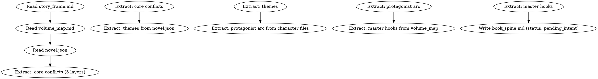
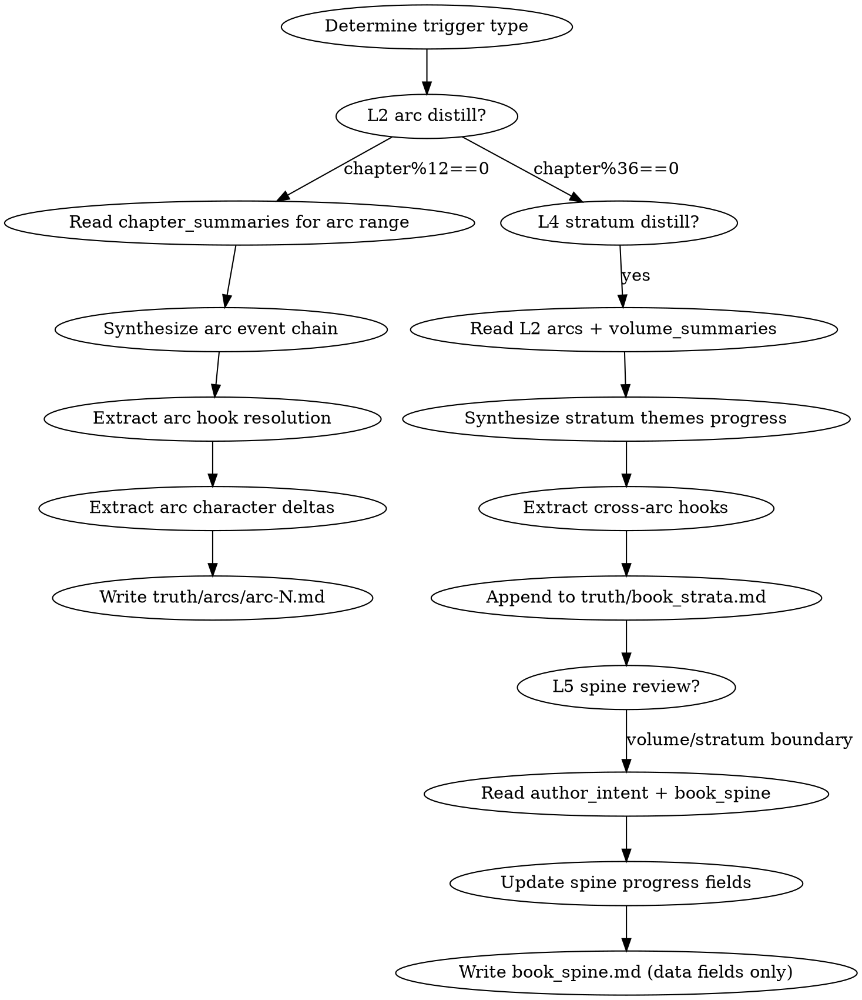

# 分层系统 Wave 2：记忆层实施计划

> **For agentic workers:** REQUIRED SUB-SKILL: Use superpowers:subagent-driven-development (recommended) or superpowers:executing-plans to implement this plan task-by-task. Steps use checkbox (`- [ ]`) syntax for tracking.

**Goal:** 实现分层记忆架构（L2/L4/L5），改造 context-composing 按层组装，新增 foreshadowing-recall skill，修复 G0.10 硬编码。

**Architecture:** 遵循现有 skill 模式（`skills/<name>/SKILL.md` + frontmatter contract）。memory-distill 泛化 volume-consolidation。context-composing 的 P1-P7 重写为按层组装。G0.10 的字面量 59 改为动态。

**Tech Stack:** Python 3.11+，pathlib.Path，SKILL.md (markdown + YAML frontmatter)，pytest。

**Spec:** `docs/superpowers/specs/2026-06-28-hierarchical-memory-scoring-system-design.md` v1.4.0
- §3.1-3.4 七层蒸馏树 + memory-distill
- §3.5 context-composing 按层组装
- §3.6 RAG 辅助召回
- §9.4 G0.10 动态化
- §11.1 book-spine-init 时序（创世层末尾，author_intent 暂空）
- §11.2 score-arc 读 L5 非 L4
- §3.2.1 爬坡期处理

**Depends on:** Wave 1（revision_routing / escalation / scoring 扩展 / foreshadowing_recall helper 已实现）

## Global Constraints

- Python 3.11+，`from __future__ import annotations`，pathlib.Path
- SKILL.md frontmatter: name (lowercase-kebab), description (英文 "Use when..." ≤500 chars)
- contract: kind (artifact/ephemeral/report), reads/writes/updates
- 测试标记：`@pytest.mark.unit`（helper）/ `@pytest.mark.integration`（跨模块）
- 修改 src/shenbi/ 后运行 `bash tests/lock-tool-hashes.sh`
- 新增 skill 必须同步：G4 checker + T1 测试目录 + fixtures（遵循 G0.9 禁止手写 mock）
- frontmatter 整体 ≤1024 字符

## File Structure

| 文件 | 职责 |
|------|------|
| `skills/shenbi-book-spine-init/SKILL.md` | 书脊初始化（创世层末尾） |
| `skills/shenbi-memory-distill/SKILL.md` | 记忆蒸馏（L2/L4/L5） |
| `skills/shenbi-foreshadowing-recall/SKILL.md` | RAG 伏笔召回封装 |
| `skills/shenbi-context-composing/SKILL.md` | 改造：按层组装 |
| `src/shenbi/gates/g0.py` | G0.10 动态化 |
| `src/shenbi/gates/g4/memory_distill.py` | memory-distill G4 checker |
| `src/shenbi/gates/g4/book_spine_init.py` | book-spine-init G4 checker |
| `tests/fixtures/arc-example.md` | L2 弧段样本 |
| `tests/fixtures/book-strata-example.md` | L4 大弧样本 |
| `tests/fixtures/book-spine-example.md` | L5 书脊样本 |
| `tests/fixtures/volume-summary-example.md` | L3 卷摘要样本 |
| `tests/unit/gates/test_g0_dynamic_count.py` | G0.10 动态化测试 |

---

### Task 1: shenbi-book-spine-init skill

**Files:**
- Create: `skills/shenbi-book-spine-init/SKILL.md`

**Interfaces:**
- Consumes: `outline/story_frame.md`（story-architecture 产出）+ `outline/volume_map.md`（volume-outlining 产出）+ `novel.json`（worldbuilding 产出）
- Produces: `truth/book_spine.md`（L5，status: pending_intent）。被 context-composing P2 消费、memory-distill 滚动复核、score-arc/stratum 读上级目标。

- [ ] **Step 1: Write the SKILL.md**

```markdown
---
name: shenbi-book-spine-init
description: "Use when initializing the book spine at the end of the genesis layer, before entering the per-chapter writing loop"
contract:
  kind: artifact
  reads:
    - outline/story_frame.md
    - outline/volume_map.md
    - novel.json
  writes:
    - truth/book_spine.md
  updates: []
---
<!-- AUTO-GENERATED from frontmatter — do not edit -->

## 数据契约

- **Reads:** outline/story_frame.md, outline/volume_map.md, novel.json
- **Writes:** truth/book_spine.md
- **Updates:** none

<!-- END AUTO-GENERATED -->

# 书脊初始化

HARD-GATE: 在创世层（worldbuilding + character + story-architecture + volume-outlining）完成后、逐章循环开始前执行。初始化全书的常青书脊（L5），后续由 memory-distill 滚动复核。

## 流程



## 铁律

1. **不读 author_intent.md** — 创世层末尾 author_intent 尚未由 intent-management 填充。书脊的 themes 从 novel.json 读取，author_intent 字段初始化为空，标记 `status: pending_intent`。memory-distill 在后续卷/大弧边界滚动合并 author_intent。
2. **声明值只初始化不臆造** — 核心冲突/themes/主角弧终点从 story_frame.md + novel.json 真实继承，不臆造。
3. **master hooks 从 volume_map 提取** — 跨卷级别的钩子（卷尾实体钩子的跨卷延续线）作为 master hooks 初始入库。
4. **status: pending_intent 是合法初始态** — 第一卷定稿后由 memory-distill 合并 author_intent 并改 status 为 active。

## 输出格式

写 `truth/book_spine.md`：

```markdown
---
updated: YYYY-MM-DD
total_chapters: 0
status: pending_intent
---

# 书脊

## 核心冲突三层（声明值，从 story_frame.md 继承）
- surface_conflict: "[从 story_frame.md frontmatter surface_conflict]"
- personal_conflict: "[从 story_frame.md frontmatter personal_conflict]"
- deep_conflict: "[从 story_frame.md frontmatter deep_conflict]"

## 全书 themes（声明值，从 novel.json 继承）
- [theme 1]: 探索进度: 未开始
- [theme 2]: 探索进度: 未开始

## 主角弧（声明终点，从 characters/protagonist.md 继承）
- arc_type: [GROWTH/REDEMPTION/FALL]
- arc_starting: "[从 protagonist.md]"
- arc_turning: "[从 protagonist.md，若已声明]"
- arc_ending: "[从 protagonist.md arc_ending]"
- 当前进度: 0%

## 主线钩子（master hooks，从 volume_map 跨卷钩子提取）
- MH01: [内容] | 状态: PLANTED | 最后推进章: — | 声明兑现卷: [从 volume_map]
- MH02: [内容] | 状态: PLANTED | 最后推进章: — | 声明兑现卷: [从 volume_map]

## 世界铁律滚动快照（从 world/rules.md 同步前5条）
- [rule 1]
- [rule 2]
```

## Anti-Rationalization

| Excuse | Reality |
|--------|---------|
| "author_intent 还没填，书脊先空着" | themes 从 novel.json 来，不是 author_intent；空书脊 = context-composing 无上级目标 = 每章漂移 |
| "书脊以后再补" | 没有书脊的 context-composing P2 为空 = 第一卷就开始上下文不足 |
| "master hooks 等埋了伏笔再说" | 跨卷钩子在 volume_map 已声明，必须初始入库追踪 |
```

- [ ] **Step 2: Verify frontmatter parses**

Run: `python3 -c "import re; t=open('skills/shenbi-book-spine-init/SKILL.md').read(); m=re.search(r'^---\n(.*?)\n---', t, re.S); print('frontmatter found' if m else 'FAIL')"`
Expected: frontmatter found

- [ ] **Step 3: Commit**

```bash
git add skills/shenbi-book-spine-init/SKILL.md
git commit -m "feat: add shenbi-book-spine-init skill (spec §11.1)"
```

---

### Task 2: shenbi-memory-distill skill

**Files:**
- Create: `skills/shenbi-memory-distill/SKILL.md`

**Interfaces:**
- Consumes: `truth/chapter_summaries.md`（L1）+ `truth/volume_summaries.md`（L3，L4 蒸馏时）+ 现有 truth/*.md（伏笔池/角色矩阵）
- Produces: `truth/arcs/arc-N.md`（L2，每12章）+ `truth/book_strata.md`（L4，每36章 append）
- Updates: `truth/book_spine.md`（L5 滚动复核）、`truth/volume_summaries.md`（L3，复用 volume-consolidation 逻辑）

- [ ] **Step 1: Write the SKILL.md**

```markdown
---
name: shenbi-memory-distill
description: "Use when distilling chapter summaries into arc syntheses (every 12 chapters), stratum syntheses (every 36 chapters), or rolling book spine review at volume or stratum boundaries"
contract:
  kind: artifact
  reads:
    - truth/chapter_summaries.md
    - truth/volume_summaries.md
    - truth/pending_hooks.md
    - truth/character_matrix.md
  writes:
    - truth/arcs/arc-N.md
    - truth/book_strata.md
  updates:
    - truth/book_spine.md
---
<!-- AUTO-GENERATED from frontmatter — do not edit -->

## 数据契约

- **Reads:** truth/chapter_summaries.md, truth/volume_summaries.md, truth/pending_hooks.md, truth/character_matrix.md
- **Writes:** truth/arcs/arc-N.md, truth/book_strata.md
- **Updates:** truth/book_spine.md

<!-- END AUTO-GENERATED -->

# 记忆蒸馏

泛化 volume-consolidation。产出 L2（弧段合成）、L4（大弧合成）、维护 L5（书脊滚动复核）。这是分层记忆架构的核心——让上下文窗口大小有界，与全书总字数无关。

## 触发规则（固定章数，确定性）

| 触发条件 | 动作 |
|---------|------|
| `chapter % 12 == 0` | L2 弧段蒸馏 → 写 `truth/arcs/arc-(chapter//12).md` |
| `chapter % 36 == 0` | L4 大弧蒸馏 → append 到 `truth/book_strata.md` |
| 卷边界（volume_map 声明的卷末章） | L3 卷摘要（复用 volume-consolidation 逻辑）+ L5 滚动复核 |
| 大弧边界（chapter % 36 == 0） | L5 滚动复核（合并 author_intent，更新进度） |

## 流程



## 铁律

1. **蒸馏可溯源** — 每条合成结论必须可追溯到具体章节（引用章号），例如"第23-25章：林轩获得传承 → 第26章：首次实战"
2. **增量产出** — L2/L4 只追加本弧/本大弧的合成，不重写历史层
3. **信息损失显式标注** — 蒸馏必然损失信息，未兑现的伏笔/悬置的张力必须在"未解决悬置"显式列出
4. **L5 滚动复核不破坏声明** — 书脊的核心冲突/themes/主角弧终点是声明值（book-spine-init 从 author_intent/novel.json 继承），复核只更新数据字段（当前位置/进度/themes探索深度），不改声明本身
5. **L5 字段分区所有权** — memory-distill 只写数据值（进度/状态）；诊断值（漂移/达成）由 score-stratum 写；声明值由 book-spine-init 初始化。三者用不同 YAML 字段

## L2 弧段合成输出格式

写 `truth/arcs/arc-N.md`（N = chapter // 12）：

```markdown
---
arc: N
chapter_range: [start]-[end]
volume: [从 volume_map 确定]
generated_at: YYYY-MM-DD
generated_by: shenbi-memory-distill
---

# 第N弧段合成

## 弧内事件链
[连续叙事摘要，~800字，可追溯到具体章节。每个关键事件标注章号。]

## 弧内伏笔兑现/推进
- [hook_id]: 第X章 [advance/resolve/plant] — [方式]
- ...

## 角色状态变化（弧段粒度）
- [角色]: [起点状态] → [终点状态]，关键转折章: N
- ...

## 张力曲线本弧段
[本弧段张力走向，对照卷节奏原则。标注高潮章和低谷章。]

## 未解决悬置（带入下一弧段）
- [悬置项]: 为何未解决，预期解决弧段
```

## L4 大弧合成输出格式

Append 到 `truth/book_strata.md`（每36章一段）：

```markdown
---
stratum: N
chapter_range: [start]-[end]
generated_at: YYYY-MM-DD
---

# 第N大弧合成

## 弧范围
第[start]章 - 第[end]章

## 本弧主题推进
- [theme]: 本弧如何推进此主题（具体事件链，引用大弧内章号）

## 跨弧伏笔账
- MH01: 第X章种植 → 第Y章推进 → 当前状态
- ...

## 角色弧弧段
- [角色]: [弧段起点状态] → [弧段终点状态]，关键转折章: N
- ...

## 未解决的张力悬置（带入下一大弧）
- [悬置项]: 为何未解决，预期解决弧段
```

## L5 书脊滚动复核

卷/大弧边界时更新 `truth/book_spine.md` 的**数据字段**（不改声明字段）：

- `status`: pending_intent → active（首次合并 author_intent 后）
- themes 探索进度：更新已探索章节范围
- 主角弧进度：更新当前位置百分比
- master hooks 状态：更新最后推进章、状态
- world 铁律快照：从 world/rules.md 同步前5条

## Anti-Rationalization

| Excuse | Reality |
|--------|---------|
| "弧段蒸馏就是摘要压缩" | 蒸馏必须提取事件链 + 伏笔 + 角色弧，不是压缩文字 |
| "信息损失无所谓" | 未兑现伏笔若不标注，下一弧段遗忘 = Chase Power 债务暴增 |
| "L5 复核时可以改 themes" | themes 是声明值，复核只更新进度；改 themes = 偏离 author_intent |
| "L4 大弧和 L3 卷摘要重复" | L4 是跨卷长程线（master hooks/角色弧段），L3 是单卷叙事；职责不同 |
```

- [ ] **Step 2: Commit**

```bash
git add skills/shenbi-memory-distill/SKILL.md
git commit -m "feat: add shenbi-memory-distill skill (spec §3.4)"
```

---

### Task 3: context-composing 完整改造（按层组装 — DOT + EXACT 节标题 + 铁律 + G4 checker 全部同步）

**Files:**
- Modify: `skills/shenbi-context-composing/SKILL.md`

**Interfaces:**
- Consumes: book_spine.md（L5）+ book_strata.md（L4，当前大弧）+ volume_summaries.md（L3，当前卷）+ arcs/arc-N.md（L2，当前弧）+ chapter_summaries.md（L1，近8章）
- Produces: 上下文包（9节：P1-P7 + 近章结尾多样性 + Hook 债务简报），但 P2-P5 改为按层加载

- [ ] **Step 1: Rewrite the context priority table**

Replace the existing `## 上下文优先级` table in `skills/shenbi-context-composing/SKILL.md` with:

```markdown
## 上下文优先级（按层组装）

分层记忆架构下，上下文按层加载，使窗口大小有界（与全书总字数无关）：

| 优先级 | 层 | 来源 | 裁剪规则 |
|--------|----|------|---------|
| P1 | - | plans/chapter-N-plan.md | 不裁剪 |
| P2 | L5 | truth/book_spine.md | 不裁剪（常青，~1页） |
| P3 | L4 | truth/book_strata.md（当前大弧段） | 不裁剪 |
| P4 | L3 | truth/volume_summaries.md（当前卷） | 不裁剪 |
| P5 | L2 | truth/arcs/arc-N.md（当前弧） | 不裁剪 |
| P6 | L1 | truth/chapter_summaries.md（近8章拍点） | 仅取近8章 |
| P7 | - | world/rules.md（最多5条）+ style/style_profile.md | nice，先裁剪 |
```

- [ ] **Step 2: Add ramp-up handling section**

在铁律后新增：

```markdown
## 爬坡期处理（章节 1-35）

前36章内，L2/L3/L4 尚未产出（首个L2在第12章，首个L4在第36章，首个L3在卷边界）。爬坡期规则：

- **缺失层不报错，跳过加载。** 按层逐层尝试加载，若文件不存在则跳过（不填充占位）。
- **爬坡期用 L1 近章拍点补偿。** 前12章无 L2 时，L1 取近章范围扩大到近12章（而非8章）。
- **爬坡期窗口较小（~3000-6000字），非缺陷。** 稳态窗口（~10,700字）从第36章起达成。
```

- [ ] **Step 3: Update frontmatter contract reads**

将 `reads` 中新增分层文件：

```yaml
  reads:
    - plans/chapter-N-plan.md
    - truth/book_spine.md
    - truth/book_strata.md
    - truth/volume_summaries.md
    - truth/arcs/arc-N.md
    - truth/chapter_summaries.md
    - truth/pending_hooks.md
    - truth/audit_drift.md
    - world/rules.md
    - truth/character_matrix.md
    - style/style_profile.md
    - chapters/chapter-N.md
```

- [ ] **Step 4: Rewrite the DOT flowchart to layer model**

The existing DOT references old P3-P7 meanings (`Collect P3: active hooks`, `Collect P5: world rules`). Replace the entire DOT with:

```dot
digraph context_composing {
    "Read chapter plan (P1)" -> "Load L5: book_spine.md (P2)";
    "Load L5: book_spine.md (P2)" -> "Load L4: book_strata.md current stratum (P3)";
    "Load L4 (P3)" -> "Load L3: volume_summaries.md current volume (P4)";
    "Load L3 (P4)" -> "Load L2: arcs/arc-N.md current arc (P5)";
    "Load L2 (P5)" -> "Load L1: chapter_summaries.md near 8 chapters (P6)";
    "Load L1 (P6)" -> "Load P7: world/rules.md (max 5) + style/style_profile.md";
    "Load P7" -> "Check near-chapter endings (avoid repetition)";
    "Check near-chapter endings" -> "Present context to human";
    "Present context to human" -> "Proceed to chapter-drafting";
}
```



- [ ] **Step 5: Rewrite the EXACT 节标题 output spec**

The existing EXACT section mandates `## P3 活跃伏笔` etc. (old meanings). Replace with layer-based titles:

```markdown
### EXACT 节标题（9/9 必须）

输出的 markdown 必须包含以下 H2 标题，按此顺序：

1. `## P1 章节备忘`
2. `## P2 书脊（L5）`
3. `## P3 当前大弧（L4）`
4. `## P4 当前卷摘要（L3）`
5. `## P5 当前弧段（L2）`
6. `## P6 近章拍点（L1）`
7. `## P7 世界铁律与文风`
8. `## 近章结尾多样性`
9. `## Hook 债务简报`
```

**不合格条件**：缺任意一节，或使用旧的 P3 活跃伏笔/P5 世界铁律标题。

- [ ] **Step 6: Rewrite the Hook 债务简报 section to reference book_spine master hooks**

The existing Hook 债务简报 reads from `pending_hooks.md` directly. In the layer model, cross-arc hooks come from book_spine master hooks (MH*) or foreshadowing-recall results. Update the Hook 债务简报 to read master hooks from P2 (book_spine) and local hooks from P5 (current arc).

- [ ] **Step 7: Update iron rules to layer model**

Update iron rule 1 ("优先级严格递减") to: "P1 不可省略，P7 最先被裁剪。L5-L2 缺失层跳过加载（爬坡期，§3.2.1），不报错。"

- [ ] **Step 8: Update g4_context_composing.py checker**

Update `src/shenbi/gates/g4/context_composing.py` to validate the **new** layer-based section titles instead of old P3 活跃伏笔/P5 世界铁律. The checker must look for `## P2 书脊`, `## P3 当前大弧`, `## P4 当前卷摘要`, `## P5 当前弧段`, `## P6 近章拍点`.

- [ ] **Step 9: Commit**

```bash
git add skills/shenbi-context-composing/SKILL.md src/shenbi/gates/g4/context_composing.py
git commit -m "feat: complete context-composing layer rewrite: DOT + EXACT sections + iron rules + G4 checker (spec §3.5, §3.2.1)"
```

---

### Task 4: shenbi-foreshadowing-recall skill

**Files:**
- Create: `skills/shenbi-foreshadowing-recall/SKILL.md`

**Interfaces:**
- Consumes: `truth/pending_hooks.md`（全量）+ Wave 1 helper `recall_overdue_hooks`
- Produces: `truth/foreshadowing_recall_result.md`（超期 hook 列表）。被 review-foreshadowing（大规模时调用）、score-arc/stratum（检查长程钩子）消费。

- [ ] **Step 1: Write the SKILL.md**

```markdown
---
name: shenbi-foreshadowing-recall
description: "Use when checking for overdue foreshadowing hooks across a large chapter range, or after each chapter's state-settling to maintain the recall index"
contract:
  kind: artifact
  reads:
    - truth/pending_hooks.md
  writes:
    - truth/foreshadowing_recall_result.md
  updates: []
---
<!-- AUTO-GENERATED from frontmatter — do not edit -->

## 数据契约

- **Reads:** truth/pending_hooks.md
- **Writes:** truth/foreshadowing_recall_result.md
- **Updates:** none

<!-- END AUTO-GENERATED -->

# 伏笔召回

封装 RAG 召回层 + 确定性阈值过滤。对调用方透明——review-foreshadowing 和评分 skill 调用本 skill 获取超期 hook 列表，无需关心 RAG 实现细节。

> **MVP 说明（spec §3.6）**：本 skill 当前实现为确定性全量扫描 + max_distance 阈值过滤（`recall_overdue_hooks` helper）。spec §3.6 的 SQLite + bge-large-zh 向量索引增量维护为**后续增强**（post-node-1），在验证节点 1 通过后作为独立 task 加入。当前 MVP 在 chapter < 500 时性能可接受；向量索引在更大规模时启用。

## 触发

- 每章 state-settling 后（增量更新索引）
- review-foreshadowing 在 current_chapter > 50 时调用

## 流程


## 铁律

1. **确定性阈值过滤** — 最终判定（超期/未超期）由 `recall_overdue_hooks` 纯数值比较决定，不受嵌入不确定性影响
2. **排除 RESOLVED** — 已解决的伏笔不召回
3. **输出可溯源** — 每个超期 hook 标注 last_reinformed/max_distance/沉默章数

## 输出格式

写 `truth/foreshadowing_recall_result.md`：

```markdown
---
current_chapter: N
recall_at: YYYY-MM-DD
overdue_count: X
---

# 伏笔召回结果（第N章）

## 超期伏笔

| Hook ID | 内容 | 最后推进章 | max_distance | 沉默章数 | 状态 |
|---------|------|----------|-------------|---------|------|
| H01 | ... | 3 | 20 | 17 | OVERDUE |
| H02 | ... | 40 | 15 | 16 | OVERDUE |

## 无超期伏笔时
（空表，标记"无超期伏笔"）
```
```

- [ ] **Step 2: Commit**

```bash
git add skills/shenbi-foreshadowing-recall/SKILL.md
git commit -m "feat: add shenbi-foreshadowing-recall skill (spec §3.6)"
```

---

### Task 5: G0.10 动态化（硬编码 59 → 动态）

**Files:**
- Modify: `src/shenbi/gates/g0.py`（419-447行区域）
- Create: `tests/unit/gates/test_g0_dynamic_count.py`

**Interfaces:**
- Consumes: `ALL_SKILLS`（g0.py 已有的全局）
- Produces: G0.10 用动态计数替代硬编码 59

- [ ] **Step 1: Write the failing test**

```python
# tests/unit/gates/test_g0_dynamic_count.py
"""Unit test for G0.10 dynamic skill count (spec §9.4)."""

from __future__ import annotations

import pytest

from shenbi.gates.g0 import ALL_SKILLS


@pytest.mark.unit
def test_all_skills_is_dynamic_not_hardcoded() -> None:
    """ALL_SKILLS is scanned from the directory, not hardcoded."""
    assert isinstance(ALL_SKILLS, (list, set))
    assert len(ALL_SKILLS) >= 61  # current count, grows with new skills
```

- [ ] **Step 2: Run to verify it passes (ALL_SKILLS already dynamic)**

Run: `uv run pytest tests/unit/gates/test_g0_dynamic_count.py -v`
Expected: PASS (ALL_SKILLS is already a dynamic scan)

- [ ] **Step 3: Replace hardcoded 59 in G0.10**

In `src/shenbi/gates/g0.py`, find the G0.10 block (around line 419-447) and replace the literal `59` references with `len(ALL_SKILLS)`:

```python
    # G0.10 — completed generative test count (must cover all skills for full round;
    # WARN if fewer — allows incremental execution). Count is dynamic (scanned from
    # skills/ dir), not hardcoded — new skills auto-included.
    total_skills = len(ALL_SKILLS)
    if round_dir:
        rd = Path(round_dir)
        t1_reports = rd / "t1-reports"
        if t1_reports.exists() and t1_reports.is_dir():
            generative_scores = list(t1_reports.glob("*-generative-scores.json"))
            count = len(generative_scores)
            if count < total_skills:
                checks.append(
                    {
                        "id": "G0.10",
                        "s": "WARN",
                        "r": f"generative tests: {count}/{total_skills} — {total_skills - count} remaining",
                        "completed": count,
                        "total": total_skills,
                    }
                )
            else:
                checks.append(
                    {
                        "id": "G0.10",
                        "s": "PASS",
                        "completed": count,
                        "total": total_skills,
                    }
                )
```

- [ ] **Step 4: Run G0 validation to confirm no regression**

Run: `uv run shenbi-validate G0 outline-example.md 2>&1 | grep "G0.10"`
Expected: WARN (partial round) with dynamic total, not error

- [ ] **Step 5: Re-lock hashes**

Run: `bash tests/lock-tool-hashes.sh`

- [ ] **Step 6: Commit**

```bash
git add src/shenbi/gates/g0.py tests/unit/gates/test_g0_dynamic_count.py tests/tiers/deps.json
git commit -m "fix: G0.10 skill count dynamic instead of hardcoded 59 (spec §9.4)"
```

---

### Task 6: 新增 fixtures（真实样本）

**Files:**
- Create: `tests/fixtures/book-spine-example.md`
- Create: `tests/fixtures/arc-example.md`
- Create: `tests/fixtures/book-strata-example.md`
- Create: `tests/fixtures/volume-summary-example.md`

**Note:** 以下展示的 fixture 内容是**完整的真实内容**（基于 outline-example.md 星火燃穹设定构造），直接使用，不需要后续填充。

- [ ] **Step 1: Create book-spine fixture**

```markdown
# tests/fixtures/book-spine-example.md
---
updated: 2026-06-28
total_chapters: 15
status: active
---

# 书脊（星火燃穹示例）

## 核心冲突三层
- surface_conflict: "涅普敦法西斯侵略与梅德兰民族存亡保卫战"
- personal_conflict: "林烽利己主义苟活本能与良知/阶级情感之间的挣扎"
- deep_conflict: "帝国主义殖民压迫与人民大众追求解放的根本对抗"

## 全书 themes
- 逆境成长: 探索进度 第1-15章已探索
- 人民至上: 探索进度 第8章起觉醒

## 主角弧
- arc_type: GROWTH
- arc_starting: "利己享乐的现代青年"
- arc_turning: "目睹屠杀觉醒良知"
- arc_ending: "文明共同体引路人"
- 当前进度: 30%

## 主线钩子
- MH01: 前穿越者梵光社会主义失败教训 | 状态: ADVANCED | 最后推进章: 12 | 声明兑现卷: 第二卷
- MH02: 灵能金手指的知识驱动上限 | 状态: PLANTED | 最后推进章: 5 | 声明兑现卷: 第三卷

## 世界铁律快照
1. 灵能守恒与知识驱动
2. 位面通道时间流速差异
3. 阶级与种姓垄断高魔力量
4. 殖民体系经济剥削
5. 灵能无法凭空产生
```

- [ ] **Step 2: Create arc fixture**

```markdown
# tests/fixtures/arc-example.md
---
arc: 1
chapter_range: 1-12
volume: 1
generated_at: 2026-06-28
generated_by: shenbi-memory-distill
---

# 第一弧段合成

## 弧内事件链
第1-3章：林烽穿越至梅德兰，发现身处战场，灵能金手指觉醒。第4-6章：首次参与抵抗，目睹平民惨状，良知开始动摇。第7-9章：遭遇前穿越者遗存线索，了解梵光社会主义失败教训。第10-12章：第一次主动选择站在人民一边，击退小规模侵略。

## 弧内伏笔兑现/推进
- MH01: 第9章 advance（发现梵光遗存文献）
- H01: 第3章 plant（灵能金手指的知识驱动特性首次显现）

## 角色状态变化
- 林烽: 利己苟活 → 良知觉醒，关键转折章: 第7章

## 张力曲线本弧段
铺垫段（1-3章）→ 上升段（4-9章）→ 小爆发（10-12章）

## 未解决悬置
- 梵光社会主义失败的具体原因（预期第二弧段揭示）
```

- [ ] **Step 3: Create strata + volume-summary fixtures**

```markdown
# tests/fixtures/book-strata-example.md
---
stratum: 1
chapter_range: 1-36
generated_at: 2026-06-28
---

# 第一大弧合成

## 弧范围
第1章 - 第36章

## 本弧主题推进
- 逆境成长: 林烽从穿越初期的利己主义，经三次良知考验，确立"人民至上"信念
- 人民至上: 第8章首次觉醒，第20章主动组织民众，第30章提出解放纲领

## 跨弧伏笔账
- MH01: 第9章种植 → 第15章推进 → 当前状态: ADVANCED
- MH02: 第3章种植 → 第20章推进 → 当前状态: ADVANCED

## 角色弧弧段
- 林烽: 利己享乐者 → 觉醒的革命者，关键转折章: 第7章、第20章

## 未解决悬置
- 前穿越者失败教训的完整真相（预期第二大弧揭示）
```

```markdown
# tests/fixtures/volume-summary-example.md
---
volume: 1
chapter_range: 1-15
generated_at: 2026-06-28
---

# 第一卷摘要

## 卷目标达成
Objective: 林烽从利己青年觉醒为有革命意识者 — 达成

## 核心事件
- 穿越与金手指觉醒（1-3章）
- 首次抵抗与良知动摇（4-6章）
- 梵光遗存线索（7-9章）
- 主动选择人民立场（10-12章）
- 卷尾：林烽决定组织更大规模抵抗（13-15章）

## 跨卷钩子
- 梵光失败真相的进一步线索（带入第二卷）
- 灵能金手指的新能力解锁（带入第二卷）
```

- [ ] **Step 4: Commit**

```bash
git add tests/fixtures/book-spine-example.md tests/fixtures/arc-example.md tests/fixtures/book-strata-example.md tests/fixtures/volume-summary-example.md
git commit -m "test: add hierarchical memory fixtures (spec §9.7)"
```

---

### Task 7: G4 checkers + T1 测试目录 + deps.json 注册

**Files:**
- Create: `src/shenbi/gates/g4/book_spine_init.py`
- Create: `src/shenbi/gates/g4/memory_distill.py`
- Create: T1 目录骨架 for 3 new skills
- Modify: `tests/tiers/deps.json`（genesis + book-spine-init）

- [ ] **Step 1: Create G4 checkers**

```python
# src/shenbi/gates/g4/book_spine_init.py
"""G4 checker for shenbi-book-spine-init."""
from __future__ import annotations
import re
from pathlib import Path
from shenbi.gates.shared import fail, passed


def g4_book_spine_init(fps: list[str], rd: str | None = None) -> str:
    """Validate book_spine.md has required frontmatter fields + sections."""
    c, mf = [], []
    for fp in fps or []:
        p = Path(fp)
        if not p.exists():
            mf.append(f"G4.bsi.not_found:{fp}")
            continue
        content = p.read_text(encoding="utf-8")
        # frontmatter fields
        for field in ["updated:", "total_chapters:", "status:"]:
            if field not in content:
                mf.append(f"G4.bsi.missing_field:{field}")
        # required sections
        for section in ["核心冲突三层", "全书 themes", "主角弧", "主线钩子"]:
            if section not in content:
                mf.append(f"G4.bsi.missing_section:{section}")
        c.append({"id": "G4.bsi", "s": "PASS"})
    if mf:
        return fail("G4-book-spine-init", c, "scoring", mf)
    return passed("G4-book-spine-init", c)
```

```python
# src/shenbi/gates/g4/memory_distill.py
"""G4 checker for shenbi-memory-distill (溯源校验)."""
from __future__ import annotations
import re
from pathlib import Path
from shenbi.gates.shared import fail, passed


def g4_memory_distill(fps: list[str], rd: str | None = None) -> str:
    """Validate arc/strata output has traceability (章号引用) + required sections."""
    c, mf = [], []
    for fp in fps or []:
        p = Path(fp)
        if not p.exists():
            mf.append(f"G4.md.not_found:{fp}")
            continue
        content = p.read_text(encoding="utf-8")
        # traceability: must reference chapter numbers
        if not re.search(r"第\d+章|chapter.*\d+", content):
            mf.append("G4.md.no_chapter_ref:distillation must reference chapter numbers")
        # arc files need event chain + hooks
        if "arc" in fp.lower():
            for section in ["事件链", "伏笔", "角色状态"]:
                if section not in content:
                    mf.append(f"G4.md.missing_section:{section}")
        c.append({"id": "G4.md", "s": "PASS"})
    if mf:
        return fail("G4-memory-distill", c, "scoring", mf)
    return passed("G4-memory-distill", c)
```

- [ ] **Step 2: Register in g4/__init__.py and router**

**G4 注册（spec §9.12 — 重要：dispatch 在 generic.py 不在 __init__.py）：**

G4 dispatch 在 `src/shenbi/gates/g4/generic.py` 的 `gate_G4()` 函数内（约 line 151-198），是 late imports + `checkers` dict。`__init__.py` 只 re-export `gate_G4`，在此添加 import 不生效。正确注册步骤：

1. 在 `generic.py` 的 late imports 块添加：`from shenbi.gates.g4.<checker_module> import <checker_fn>`
2. 在 `checkers = {...}` dict 添加：`"shenbi-<skill>": <checker_fn>,`
3. 在 `src/shenbi/gates/shared.py` 的 `G4_CHECKER_SKILLS` 集合添加 skill name（用于 G0.4 覆盖率统计）

```python
# 1. generic.py late imports 块添加：
from shenbi.gates.g4.book_spine_init import g4_book_spine_init
from shenbi.gates.g4.memory_distill import g4_memory_distill
# 2. checkers dict 添加：
#   "shenbi-book-spine-init": g4_book_spine_init,
#   "shenbi-memory-distill": g4_memory_distill,
# 3. shared.py G4_CHECKER_SKILLS 添加：
#   "shenbi-book-spine-init", "shenbi-memory-distill"
```

- [ ] **Step 3: Create T1 目录骨架**

为 3 个新 skill 创建 T1 测试目录结构（rubric.md + generative/bug-hunt/clean/input/scenario.md + expected/）：
```bash
for skill in shenbi-book-spine-init shenbi-memory-distill shenbi-foreshadowing-recall; do
  for ttype in generative bug-hunt clean; do
    mkdir -p "tests/tiers/t1-skill/$skill/$ttype/input"
    mkdir -p "tests/tiers/t1-skill/$skill/$ttype/expected"
  done
done
```

为每个 skill 创建 `rubric.md`（Universal 15% + Bespoke 85%）和 `scenario.md`（引用 tests/fixtures/ 下的样本）。以 memory-distill 为例：

```markdown
# tests/tiers/t1-skill/shenbi-memory-distill/rubric.md
# T1 Rubric: shenbi-memory-distill

## Universal Dimensions (15%)
| # | Dimension | Weight | Standard |
|---|-----------|--------|----------|
| 1 | Instruction adherence | 10% | All SKILL.md sections: L2/L4/L5 trigger rules, traceability, incremental output, loss标注 |
| 2 | Output completeness | 5% | All sections: event chain, hook resolution, character deltas, tension curve, unsuspended |

## Bespoke Dimensions (85%)
| # | Dimension | Weight | Standard |
|---|-----------|--------|----------|
| 3 | Traceability | 30% | Every synthesized conclusion references specific chapter numbers |
| 4 | Hook tracking accuracy | 25% | Arc hooks correctly extracted from L1 summaries, resolved/advanced/planted categorized correctly |
| 5 | Character arc extraction | 15% | Per-character state changes accurately captured at arc granularity |
| 6 | Information loss标注 | 15% | Unresolved foreshadowing/tension explicitly listed in "unsuspended" section |

## Kill Switches
### Generative
- No chapter references in synthesis -> total score = 0
### Bug-Hunt
- Missed planted unresolved hook -> total score = 0
### Clean
- Any hallucinated event not in source summaries -> total score = 0
```

scenario.md 示例：

```markdown
# tests/tiers/t1-skill/shenbi-memory-distill/generative/input/scenario.md
# Generative Test: shenbi-memory-distill

## Skill Under Test
`skills/shenbi-memory-distill/SKILL.md`

## Test Setup
A novel project exists with 12 completed chapters. Truth files include chapter summaries at `tests/fixtures/chapter-summaries-example.md` and pending hooks at `tests/fixtures/pending-hooks-example.md`. The project is ready for its first L2 arc distillation (arc 1, chapters 1-12).

## Agent Task
Run shenbi-memory-distill to produce the first L2 arc synthesis. The agent must:
1. Read chapter_summaries for chapters 1-12
2. Synthesize arc event chain with chapter references
3. Extract arc hook resolution (advance/resolve/plant)
4. Extract character state changes at arc granularity
5. Document tension curve vs volume rhythm principles
6. List unresolved foreshadowing in "unsuspended" section

## Seed Input
Chapter summaries from `tests/fixtures/chapter-summaries-example.md`, hooks from `tests/fixtures/pending-hooks-example.md`
```

book-spine-init 和 foreshadowing-recall 的 rubric/scenario 同此模式，替换维度为各自职责（book-spine-init: frontmatter字段完整性/themes继承/master hook提取; foreshadowing-recall: 超期判定准确性/RESOLVED排除/输出可溯源）。

- [ ] **Step 4: Update deps.json — genesis phase**

**注意嵌套层级**：phase 对象在 `t2-phases` 下，不是顶层。用 python patch：

```bash
python3 -c "
import json
from pathlib import Path
deps_path = Path('tests/tiers/deps.json')
d = json.loads(deps_path.read_text(encoding='utf-8'))
genesis = d['t2-phases']['genesis']
if 'shenbi-book-spine-init' not in genesis['prerequisites']:
    genesis['prerequisites'].append('shenbi-book-spine-init')
deps_path.write_text(json.dumps(d, indent=2, ensure_ascii=False) + '\n')
print('genesis prerequisites:', genesis['prerequisites'])
"
```
```

- [ ] **Step 5: Run check + re-lock**

```bash
just check
bash tests/lock-tool-hashes.sh
```

- [ ] **Step 6: Commit**

```bash
git add src/shenbi/gates/g4/ tests/tiers/ tests/tiers/t1-skill/shenbi-book-spine-init/ tests/tiers/t1-skill/shenbi-memory-distill/ tests/tiers/t1-skill/shenbi-foreshadowing-recall/
git commit -m "test: add G4 checkers + T1 dirs + deps.json for Wave 2 skills (spec §9)"
```

---

### Task 8: Wave 2 全量验证

- [ ] **Step 1: Run all tests**

Run: `just test && just check`
Expected: all passed

- [ ] **Step 2: Verify skill discovery**

Run: `uv run shenbi-validate G0 outline-example.md 2>&1 | grep "G0.4"`
Expected: PASS with skills_count = 64 (61 + 3 new)

- [ ] **Step 3: Commit final**

```bash
git add tests/tiers/deps.json
git commit -m "chore: re-lock hashes after Wave 2 memory layer"
```
