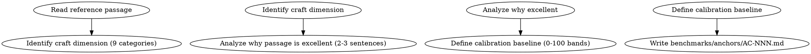

```dot
digraph score_arc {
    "Read truth/arcs/arc-N.md (被评弧段)" -> "Read truth/book_spine.md (上级目标: themes/master hooks, L5)";
    "Read book_spine" -> "Read truth/volume_summaries.md (上级目标: 卷Objective定位, 若当前卷已完结)";
    "Read volume_summaries" -> "Route C: 硬二元检查 (弧段伏笔兑现)";
    "Route C 硬二元" -> "Route C: 软程度 (张力曲线/角色弧)";
    "Route C 软程度" -> "Route A: 锚点对照 (AC-003/AC-009)";
    "Route A 锚点对照" -> "Write audits/arc-N-score.md";
    "Write audit" -> "Append arc drift to truth/audit_drift.md";
}
```

```dot
digraph score_volume {
    "Read truth/volume_summaries.md (被评卷)" -> "Read outline/volume_map.md (上级目标: Objective + Key Results)";
    "Read volume_map" -> "Read truth/book_spine.md (上级目标: 主线钩子状态)";
    "Read book_spine" -> "Route C: 硬二元 (卷Objective达成 + KR覆盖 + 跨卷钩子过境)";
    "Route C 硬二元" -> "Route C: 软程度 (Objective达成质量)";
    "Route C 软程度" -> "Route A: 锚点对照 (AC-003/AC-006)";
    "Route A" -> "Write audits/volume-N-score.md";
    "Write audit" -> "Append to truth/volume_score_trend.md";
}
```

# 分层系统 Wave 3：评分层实施计划

> **For agentic workers:** REQUIRED SUB-SKILL: Use superpowers:subagent-driven-development (recommended) or superpowers:executing-plans to implement this plan task-by-task. Steps use checkbox (`- [ ]`) syntax for tracking.

**Goal:** 实现分层评分体系（route C 目标达成主干 + route A 锚点校准天花板），新增 5 个评分 skill + 锚点策展，改造 review-resonance 注入锚点对照。

**Architecture:** route C 检查项分为硬二元（hook advance/§6改变/master hook 推进，确定性可验）和软程度（Objective 达成质量，LLM 判断但锚定上级目标）。route A 锚点库作为 `benchmarks/anchors/` 一等资产，从诡秘/炮火工艺分析入库。评分 skill 均 `requires_independent_agent: true`。

**Tech Stack:** Python 3.11+，SKILL.md，benchmarks/anchors/，pytest。

**Spec:** `docs/superpowers/specs/2026-06-28-hierarchical-memory-scoring-system-design.md` v1.4.0
- §4.1-4.5 四层评分金字塔 + route C/A + skill 家族
- §11.2 score-arc 读 L5 非 L4
- §11.6-11.7 卷边界顺序 + book_spine 字段所有权
- §11.8 score-volume 输出 → drift-guidance
- §4.3 锚点库（9 类槽位，诡秘+炮火）

**Depends on:** Wave 1（scoring.py 扩展）+ Wave 2（L2/L4/L5 记忆产出 + fixtures）

## Global Constraints

- 评分 skill 必须 `requires_independent_agent: true`（drafting/planning agent 不得评分）
- 评分 dispatch 指令必须含反塌缩约束（§5.4 补丁1：禁止默认95，88-97 有区分度）
- 锚点库不存储大段原文，只存工艺分析（文学批评）
- route C 硬二元项的"未达成"直接触发重生路由（§4.2）
- 修改 src/shenbi/ 后运行 `bash tests/lock-tool-hashes.sh`

## File Structure

| 文件 | 职责 |
|------|------|
| `skills/shenbi-anchor-curate/SKILL.md` | 锚点策展 |
| `skills/shenbi-score-arc/SKILL.md` | 弧段级评分 |
| `skills/shenbi-score-volume/SKILL.md` | 卷级评分 |
| `skills/shenbi-score-stratum/SKILL.md` | 大弧/书级评分 |
| `benchmarks/anchors/AC-001.md` ~ `AC-009.md` | 9 类锚点 |
| `skills/shenbi-review-resonance/SKILL.md` | 改造：注入 route A+C |
| `tests/fixtures/anchors/` | 锚点 fixture |
| `src/shenbi/gates/g4/score_arc.py` 等 | G4 checkers |

---

### Task 1: 锚点库初始化（9 类槽位）

**Files:**
- Create: `benchmarks/anchors/AC-001.md` ~ `AC-009.md`

**Interfaces:**
- Produces: 9 个锚点文件，被 review-resonance / score-arc / score-volume / score-stratum 的 route A 对照消费。

- [ ] **Step 1: Create AC-001 (情感落地/角色弧兑现)**

```markdown
# benchmarks/anchors/AC-001.md
---
id: AC-001
category: 情感落地/角色弧兑现
source_work: 诡秘之主
source_ref: 第一卷末，小丑魔药消化
calibrates: [章级.情感落地, 章级.角色弧兑现]
---

## 工艺分析

该场景将角色弧兑现（小丑魔药消化）与情感落地（笑中带泪）融合。克莱恩在拯救鲁恩后独自消化"小丑"身份，情感不是直接宣告而是通过身体反应（液体滑过衣领）和无声自语（"队长，你看"）传达。这是 show-not-tell 的标杆——情感强度通过克制释放，而非直白宣告。

## 评分校准基准（0-100）
- 产出达到此工艺水平 → 章级情感落地 88-97
- 产出接近但未及 → 75-87
- 产出远不及 → <75
- 禁止默认 95。
```

- [ ] **Step 2: Create AC-002 through AC-009**

为每个锚点创建完整文件（含实际工艺分析）。逐个创建：

```markdown
# benchmarks/anchors/AC-002.md
---
id: AC-002
category: 氛围质感/日常段功能
source_work: 诡秘之主
source_ref: 克莱恩做羔羊肉等妹妹回家（第一卷日常段）
calibrates: [章级.文笔质感, 章级.日常段功能]
---
## 工艺分析
该场景在日常段落中完成多重功能：展现克莱恩的节俭（因陋就简的烹饪）、兄妹关系（梅丽莎的惊恐到柔和）、维多利亚式的生活质感（猪油、怀表、纱帽）。氛围不是描写堆砌而是通过感官细节（香味弥漫、吞咽口水）和动作节奏（看怀表等待）传达。这是日常段"功能映射"的标杆——日常不是水文而是承载角色塑造和气氛调节。
## 评分校准基准（0-100）
- 达到此工艺水平 → 章级文笔质感 88-97
- 接近但未及 → 75-87
- 远不及 → <75
```

```markdown
# benchmarks/anchors/AC-003.md
---
id: AC-003
category: 规模管理/高光/信息张力
source_work: 诡秘之主
source_ref: 第七卷末，乌托邦偷袭战
calibrates: [弧段/卷级.高光, 卷级.伏笔纪律]
---
## 工艺分析
该战役是全书最精密的战略性进攻：亚当的两次致命进攻完美达成战略目的，克莱恩交出满分防守试卷。信息差驱动贯穿全局——观众途径真神的威能通过多层伏笔（密偶小镇的建立、维尔杜的突兀到来）逐步揭示。这是"规模管理"标杆：多序列一围剿一人，复杂度极高却逻辑自洽，每一步都可追溯。
## 评分校准基准（0-100）
- 达到此工艺水平 → 卷级高光/伏笔纪律 88-97
- 接近但未及 → 75-87
- 远不及 → <75
```

```markdown
# benchmarks/anchors/AC-004.md
---
id: AC-004
category: 战役节奏/场景临场感
source_work: 炮火弧线
source_ref: 第50章《燃烧的原野》
calibrates: [章级.节奏, 章级.场景临场]
---
## 工艺分析
王忠骑白马携缴获喷火器半履带车反推的场面，是战术微操与战场画面感融合的标杆。俯瞰视角（金手指）转化为读者可感知的临场感——烟雾、风向、马匹体力的细节让RTS式指挥有了血肉。节奏控制上，蓄压（敌人烟雾逼近）到爆发（逆风放火）的转换精准。
## 评分校准基准（0-100）
- 达到此工艺水平 → 章级节奏/场景临场 88-97
- 接近但未及 → 75-87
- 远不及 → <75
```

```markdown
# benchmarks/anchors/AC-005.md
---
id: AC-005
category: 高光设计/爽点阶梯
source_work: 炮火弧线
source_ref: 第67章《我炮多，怎么，你不服气？》
calibrates: [章级.爽点, 章级.读者牵引]
---
## 工艺分析
炮火覆盖名场面展示了爽点的阶梯升级：不是一次性倾泻而是分层揭示火力（210毫米炮缺席→己方炮群全开），让读者期待逐步拉高后集中释放。标题本身就是钩子（挑衅式语气制造好奇心）。爽点不是无脑碾压而是战术合理性背书的快感。
## 评分校准基准（0-100）
- 达到此工艺水平 → 章级爽点/读者牵引 88-97
- 接近但未及 → 75-87
- 远不及 → <75
```

```markdown
# benchmarks/anchors/AC-006.md
---
id: AC-006
category: 规模管理/群像调度
source_work: 炮火弧线
source_ref: 第453章《突袭莫哈》
calibrates: [弧段.群像, 卷级.规模]
---
## 工艺分析
伞降突袭展现了多视角群像调度的标杆：理查德中校和查理上校的对话切入，天气侦察的等待，各部队视角的快速切换。每个视角段都推进信息（攻击决心、天气窗口、降 versus 降），没有冗余。这是"单场与战略弧关系"的典范——战术行动服务于战略目标（阿巴瓦罕郊外机场）。
## 评分校准基准（0-100）
- 达到此工艺水平 → 弧段群像/卷级规模 88-97
- 接近但未及 → 75-87
- 远不及 → <75
```

```markdown
# benchmarks/anchors/AC-007.md
---
id: AC-007
category: 情感落地/主题升华
source_work: 炮火弧线
source_ref: 第670章《以我残躯化烈火》
calibrates: [大弧级.主题贯穿, 章级.情感]
---
## 工艺分析
杜达耶夫大爷和卢娜大婶在收音机旁听飞行员通讯的场景，将"普通人的牺牲"主题推至高潮。情感落地不靠主角而靠配角群像——老人家变多、无线电里的呼喊、大爷的焦急。这是"主题升华"标杆：个人故事（大爷认路）升华为集体叙事（全城守护），情感强度来自克制而非煽情。
## 评分校准基准（0-100）
- 达到此工艺水平 → 大弧级主题贯穿/章级情感 88-97
- 接近但未及 → 75-87
- 远不及 → <75
```

```markdown
# benchmarks/anchors/AC-008.md
---
id: AC-008
category: 战役节奏/张力曲线
source_work: 炮火弧线
source_ref: 第696章《装甲对决》
calibrates: [卷级.张力曲线, 弧段.节奏]
---
## 工艺分析
大场面装甲对决展示了张力曲线的标杆控制：渡河→遭遇→装甲对决的阶梯式升级，每一步都提高赌注。节奏上，技术细节（坦克型号、射击角度）与人物反应（恐惧、决断）交替，避免纯技术流水账。单场与战略弧的关系清晰——这场对决是突破第伯河的关键节点。
## 评分校准基准（0-100）
- 达到此工艺水平 → 卷级张力曲线/弧段节奏 88-97
- 接近但未及 → 75-87
- 远不及 → <75
```

```markdown
# benchmarks/anchors/AC-009.md
---
id: AC-009
category: 伏笔纪律/世界规则自洽
source_work: 诡秘之主
source_ref: 序列体系全局设计
calibrates: [卷级.世界规则, 卷级.伏笔]
---
## 工艺分析
22条序列途径、220个职业的体系是"世界规则自洽"的最高标杆：每一条途径的晋升逻辑、能力特点、扮演法都内部自洽，且跨数百章一致。伏笔纪律上，序列体系的规则在第一卷建立后从未被违反——读者可以逐章验证。力量体系与角色成长绑定（扮演法消化魔药），让规则成为叙事驱动力而非设定百科。
## 评分校准基准（0-100）
- 达到此工艺水平 → 卷级世界规则/伏笔纪律 88-97
- 接近但未及 → 75-87
- 远不及 → <75
```

| ID | category | source | calibrates |
|----|----------|--------|-----------|
| AC-001 | 情感落地/角色弧兑现 | 诡秘·小丑消化 | 章级.情感落地, 章级.角色弧兑现 |
| AC-002 | 氛围质感/日常段功能 | 诡秘·羔羊肉场景 | 章级.文笔质感, 章级.日常段功能 |
| AC-003 | 规模管理/高光/信息张力 | 诡秘·乌托邦偷袭战 | 弧段/卷级.高光, 卷级.伏笔纪律 |
| AC-004 | 战役节奏/场景临场感 | 炮火·燃烧的原野 | 章级.节奏, 章级.场景临场 |
| AC-005 | 高光设计/爽点阶梯 | 炮火·我炮多 | 章级.爽点, 章级.读者牵引 |
| AC-006 | 规模管理/群像调度 | 炮火·突袭莫哈 | 弧段.群像, 卷级.规模 |
| AC-007 | 情感落地/主题升华 | 炮火·以我残躯化烈火 | 大弧级.主题贯穿, 章级.情感 |
| AC-008 | 战役节奏/张力曲线 | 炮火·装甲对决 | 卷级.张力曲线, 弧段.节奏 |
| AC-009 | 伏笔纪律/世界规则自洽 | 诡秘·序列体系 | 卷级.世界规则, 卷级.伏笔 |

- [ ] **Step 3: Create anchor fixtures (copy to tests/fixtures/anchors/)**

```bash
mkdir -p tests/fixtures/anchors
cp benchmarks/anchors/AC-001.md tests/fixtures/anchors/
# (each anchor copied for T1 test scenarios)
```

- [ ] **Step 4: Commit**

```bash
git add benchmarks/anchors/ tests/fixtures/anchors/
git commit -m "feat: initialize anchor library with 9 categories from 诡秘/炮火 craft analysis (spec §4.3)"
```

---

### Task 2: shenbi-anchor-curate skill

**Files:**
- Create: `skills/shenbi-anchor-curate/SKILL.md`

- [ ] **Step 1: Write SKILL.md**

```markdown
---
name: shenbi-anchor-curate
description: "Use when generating a new scoring anchor from a reference work passage, or curating the existing anchor library"
contract:
  kind: artifact
  reads:
    - import/source/*.txt
  writes:
    - benchmarks/anchors/AC-NNN.md
  updates: []
---
<!-- AUTO-GENERATED from frontmatter — do not edit -->

## 数据契约

- **Reads:** import/source/*.txt
- **Writes:** benchmarks/anchors/AC-NNN.md
- **Updates:** none

<!-- END AUTO-GENERATED -->

# 锚点策展

从授权参考作品提取工艺分析，生成评分锚点。锚点存储工艺分析（文学批评），不存储大段原文。

## 流程



## 铁律

1. **工艺分析非原文复制** — 只分析手法，不复制大段原文。版权边界严格遵守
2. **9 类槽位映射** — 每个锚点必须映射到 spec §4.3 的 9 类之一
3. **校准基准必须具体** — 88-97/75-87/<75 三档，禁止模糊区间
4. **source_ref 精确** — 标注作品名 + 具体位置（卷/章/场景）

## 输出格式

参照 `benchmarks/anchors/AC-001.md` 格式（id/category/source_work/source_ref/calibrates + 工艺分析 + 评分校准基准）。
```

- [ ] **Step 2: Commit**

```bash
git add skills/shenbi-anchor-curate/SKILL.md
git commit -m "feat: add shenbi-anchor-curate skill (spec §4.4)"
```

---

### Task 3: review-resonance 改造（注入 route A + route C）

**Files:**
- Modify: `skills/shenbi-review-resonance/SKILL.md`

**Interfaces:**
- Consumes: 现有 4 维度 + benchmarks/anchors/（route A）+ plans/chapter-N-plan.md §1/§6/§7（route C 目标）
- Produces: 现有输出 + route C 硬二元检查结果 + route A 锚点相对定位

- [ ] **Step 1: Add route A anchor calibration to review-resonance**

在 `skills/shenbi-review-resonance/SKILL.md` 的评分维度后新增：

```markdown
## Route A：锚点校准（注入）

评分时必须对照 `benchmarks/anchors/` 相关锚点定相对位置。每个维度分数必须回答"比锚点更好/相当/更差"，而非孤立打分。

对照规则：
- 情感落地 → 对照 AC-001（诡秘·小丑消化）
- 场景临场感 → 对照 AC-004（炮火·燃烧的原野）
- 文笔质感 → 对照 AC-002（诡秘·羔羊肉场景）
- 读者回报 → 对照 AC-005（炮火·我炮多）

评分输出增加锚点对照列：

| 维度 | 得分 | 对照锚点 | 相对位置 | 证据 |
|------|------|---------|---------|------|
| 情感落地 | 22 | AC-001 | 相当 | chapter-N.md L45 > … |
```

- [ ] **Step 2: Add route C goal attainment checks**

在铁律后新增：

```markdown
## Route C：目标达成检查（注入）

除现有 4 维度体验评分外，增加 route C 目标达成硬二元检查（对照章计划）：

| 检查项 | 来源 | 类型 | 判定 |
|--------|------|------|------|
| chapter_role 兑现 | plans/chapter-N-plan.md §1 | 硬二元 | 已达成/未达成 |
| §6 章尾改变发生 | plans/chapter-N-plan.md §6 | 硬二元 | 已达成/未达成 |
| hook 账履行 | plans/chapter-N-plan.md §7 | 硬二元 | 已达成/未达成 |

任一硬二元项"未达成" → 诊断输出含 `{"category": "unmet_goal", "severity": "BLOCKING"}` → 触发重生路由（§5.2 revision_routing）。
```

- [ ] **Step 3: Update frontmatter reads**

```yaml
  reads:
    - {file: chapters/chapter-N.md, fields: [prose, POST_WRITE_SELF_CHECK]}
    - {file: plans/chapter-N-plan.md, fields: [chapter_role, core_task, section6_changes, section7_hooks]}
    - {file: style/style_profile.md, fields: [voice_fingerprint]}
    - benchmarks/anchors/
```

- [ ] **Step 4: Commit**

```bash
git add skills/shenbi-review-resonance/SKILL.md
git commit -m "feat: inject route A anchor calibration + route C goal attainment into review-resonance (spec §4.4)"
```

---

### Task 4: shenbi-score-arc skill

**Files:**
- Create: `skills/shenbi-score-arc/SKILL.md`
- Create: `src/shenbi/gates/g4/score_arc.py`

- [ ] **Step 1: Write SKILL.md**

```markdown
---
name: shenbi-score-arc
description: "Use when scoring an arc segment (every 12 chapters) on foreshadowing resolution, tension curve adherence, and character arc progression against upper-level goals"
requires_independent_agent: true
contract:
  kind: report
  reads:
    - truth/arcs/arc-N.md
    - truth/book_spine.md
    - truth/volume_summaries.md
    - truth/book_strata.md
    - benchmarks/anchors/
  writes:
    - audits/arc-N-score.md
  updates:
    - truth/audit_drift.md
---
<!-- AUTO-GENERATED from frontmatter — do not edit -->

## 数据契约

- **Reads:** truth/arcs/arc-N.md, truth/book_spine.md, truth/volume_summaries.md, truth/book_strata.md, benchmarks/anchors/
- **Writes:** audits/arc-N-score.md
- **Updates:** truth/audit_drift.md

<!-- END AUTO-GENERATED -->

# 弧段级评分

触发：每12章（与 memory-distill L2 对齐）。

## 流程



## 铁律

1. **独立评分** — context-cleaned 独立 subagent
2. **读 L5 非 L4** — 上级目标从 book_spine.md（L5，始终存在）读；book_strata.md（L4）可选（§11.2，chapter<36 时缺失，标记 cross_arc_data: unavailable）
3. **硬二元驱动** — 弧段伏笔未兑现 = 该检查项 0 分 + 标记 unmet_goal

## Route C 检查项

**硬二元（确定性）：**
- 弧段声明的伏笔是否兑现/推进（对照弧段合成§伏笔）→ 已兑现/未兑现
- 弧段是否推进所属卷的 Key Result → 是/否

**软程度（锚定上级目标）：**
- 弧段张力曲线遵循卷节奏原则的程度（对照 volume_map 节奏原则）
- 主要角色在本弧是否有可测弧段变化

## Route A 锚点对照
- 伏笔纪律/信息张力维度对照 AC-003（诡秘·乌托邦偷袭战）/ AC-009（诡秘·序列体系）

## 输出格式

```markdown
## 弧段评分报告

**弧段**: arc-N (第X-Y章) | **结果**: 通过 (XX/100) / 阻断

### Route C 目标达成

| 检查项 | 类型 | 结果 | 证据 |
|--------|------|------|------|
| 弧段伏笔兑现 | 硬二元 | 已兑现 | arc-N.md §伏笔: H01 advance, H02 resolve |
| 卷KR推进 | 硬二元 | 是 | 推进 KR1 |
| 张力曲线遵循 | 软程度 | 85/100 | 对照 volume_map 节奏原则 |
| 角色弧段变化 | 软程度 | 80/100 | 林烽有可测变化 |

### Route A 锚点对照

| 维度 | 得分 | 对照锚点 | 相对位置 |
|------|------|---------|---------|
| 伏笔纪律 | 82 | AC-009 | 相当 |
| 信息张力 | 78 | AC-003 | 略低 |

### 弧段漂移（写入 audit_drift）
- [维度] [漂移描述] → 下弧段防范建议
```
```

- [ ] **Step 2: Create G4 checker**

```python
# src/shenbi/gates/g4/score_arc.py
"""G4 checker for shenbi-score-arc."""
from __future__ import annotations
import re
from pathlib import Path
from shenbi.gates.shared import fail, passed


def g4_score_arc(fps: list[str], rd: str | None = None) -> str:
    c, mf = [], []
    for fp in fps or []:
        p = Path(fp)
        if not p.exists():
            mf.append(f"G4.sa.not_found:{fp}")
            continue
        content = p.read_text(encoding="utf-8")
        for section in ["Route C", "Route A", "锚点对照"]:
            if section not in content:
                mf.append(f"G4.sa.missing_section:{section}")
        if not re.search(r"AC-0\d\d", content):
            mf.append("G4.sa.no_anchor_ref:must reference anchor IDs")
        c.append({"id": "G4.sa", "s": "PASS"})
    if mf:
        return fail("G4-score-arc", c, "scoring", mf)
    return passed("G4-score-arc", c)
```

- [ ] **Step 3: Commit**

```bash
git add skills/shenbi-score-arc/SKILL.md src/shenbi/gates/g4/score_arc.py
git commit -m "feat: add shenbi-score-arc skill + G4 checker (spec §4.4, §11.2)"
```

---

### Task 5: shenbi-score-volume skill

**Files:**
- Create: `skills/shenbi-score-volume/SKILL.md`
- Create: `src/shenbi/gates/g4/score_volume.py`

- [ ] **Step 1: Write SKILL.md**

```markdown
---
name: shenbi-score-volume
description: "Use when scoring a completed volume on Objective achievement, cross-volume hook transit, and master hook progression against the book spine"
requires_independent_agent: true
contract:
  kind: report
  reads:
    - truth/volume_summaries.md
    - outline/volume_map.md
    - truth/book_spine.md
    - benchmarks/anchors/
  writes:
    - audits/volume-N-score.md
    - truth/volume_score_trend.md
  updates: []
---
<!-- AUTO-GENERATED from frontmatter — do not edit -->

## 数据契约

- **Reads:** truth/volume_summaries.md, outline/volume_map.md, truth/book_spine.md, benchmarks/anchors/
- **Writes:** audits/volume-N-score.md, truth/volume_score_trend.md
- **Updates:** none

<!-- END AUTO-GENERATED -->

# 卷级评分

触发：卷边界。**必须在 volume-consolidation 之后运行**（§11.6：volume-consolidation 产出 L3 卷摘要，本 skill 读它）。与 review-arc-payoff 分工（§4.5）：arc-payoff 评体验交付轴，score-volume 评目标达成轴。

## 流程



## 铁律

1. **必须在 volume-consolidation 之后** — 读 L3 卷摘要，后者由 volume-consolidation 产出
2. **Objective 二元判定优先** — 卷 Objective 未达成 = 硬阻断，不接受程度评分
3. **输出 volume_score_trend** — drift-guidance 消费此 trend（§11.8）

## Route C 检查项

**硬二元：**
- 卷 Objective 达成（OKR 二元判定）→ 达成/未达成
- 本卷 Key Results 全部有章节覆盖 → 是/否
- 跨卷钩子 ≥3 且已过境到下一卷 → 是/否
- 长程主线钩子（MH*）在本卷有推进且未超 max_distance → 是/否

**软程度：** Objective 达成质量

## Route A 锚点对照
- 规模管理维度对照 AC-003（诡秘·乌托邦）/ AC-006（炮火·突袭莫哈）

## 输出格式

```markdown
## 卷级评分报告

**卷**: volume-N | **结果**: 通过 (XX/100) / 阻断

### Route C 目标达成

| 检查项 | 类型 | 结果 | 证据 |
|--------|------|------|------|
| 卷Objective达成 | 硬二元 | 达成 | volume_map Objective: ... ; volume_summaries: 达成 |
| KR覆盖 | 硬二元 | 是 | KR1-3 全部有章节 |
| 跨卷钩子过境 | 硬二元 | 是 | 3个钩子过境 |
| master hook推进 | 硬二元 | 是 | MH01推进, 未超max_distance |
| Objective质量 | 软程度 | 85/100 | |

### Route A 锚点对照
| 维度 | 得分 | 对照锚点 | 相对位置 |
|------|------|---------|---------|
| 规模管理 | 80 | AC-006 | 相当 |

### volume_score_trend 追加行
| volume | objective_achieved | cross_vol_hooks | master_hook_status | overall |
| N | true | 3 | advanced | 85 |
```
```

- [ ] **Step 2: Create G4 checker**

```python
# src/shenbi/gates/g4/score_volume.py
"""G4 checker for shenbi-score-volume."""
from __future__ import annotations
import re
from pathlib import Path
from shenbi.gates.shared import fail, passed


def g4_score_volume(fps: list[str], rd: str | None = None) -> str:
    c, mf = [], []
    for fp in fps or []:
        p = Path(fp)
        if not p.exists():
            mf.append(f"G4.sv.not_found:{fp}")
            continue
        content = p.read_text(encoding="utf-8")
        for section in ["Route C", "Objective达成", "跨卷钩子"]:
            if section not in content:
                mf.append(f"G4.sv.missing_section:{section}")
        c.append({"id": "G4.sv", "s": "PASS"})
    if mf:
        return fail("G4-score-volume", c, "scoring", mf)
    return passed("G4-score-volume", c)
```

- [ ] **Step 3: Commit**

```bash
git add skills/shenbi-score-volume/SKILL.md src/shenbi/gates/g4/score_volume.py
git commit -m "feat: add shenbi-score-volume skill + G4 checker (spec §4.4, §11.6, §11.8)"
```

---

### Task 6: shenbi-score-stratum skill

**Files:**
- Create: `skills/shenbi-score-stratum/SKILL.md`
- Create: `src/shenbi/gates/g4/score_stratum.py`

- [ ] **Step 1: Write SKILL.md**

```markdown
---
name: shenbi-score-stratum
description: "Use when scoring a stratum (every 36 chapters) on theme exploration depth, master hook progression, protagonist arc alignment, and cross-hundred-chapter fatigue"
requires_independent_agent: true
contract:
  kind: report
  reads:
    - truth/book_strata.md
    - truth/book_spine.md
    - benchmarks/anchors/
  writes:
    - audits/stratum-N-score.md
  updates:
    - truth/book_spine.md
---
<!-- AUTO-GENERATED from frontmatter — do not edit -->

## 数据契约

- **Reads:** truth/book_strata.md, truth/book_spine.md, benchmarks/anchors/
- **Writes:** audits/stratum-N-score.md
- **Updates:** truth/book_spine.md

<!-- END AUTO-GENERATED -->

# 大弧/书级健康评分

触发：每36章 + 滚动（每卷后增量复核）。

## 铁律

1. **L5 字段分区所有权（§11.7）** — 本 skill 只写 book_spine.md 的**诊断字段**（主角弧漂移诊断/themes达成诊断），不写声明值（book-spine-init）或数据值（memory-distill）
2. **主轴偏移检测** — 主角弧偏离声明终点 = 书级主轴偏移，触发升级

## Route C 检查项

**硬二元：**
- master hooks 是否在 max_distance 内推进
- 主角弧是否仍指向声明终点（arc_ending 未被偏移）

**软程度：**
- 全书 themes 被真正探索的程度（非悬空，有具体事件链支撑）
- 跨数百章疲劳/套路复发诊断（用 chapter-pattern 全书数据）

## Route A 锚点对照
- 战役节奏/氛围质感维度对照 AC-004（炮火·燃烧的原野）/ AC-008（炮火·装甲对决）

## 输出格式

```markdown
## 大弧/书级健康报告

**大弧**: stratum-N (第X-Y章) | **结果**: 健康 (XX/100) / 主轴偏移

### Route C 目标达成

| 检查项 | 类型 | 结果 |
|--------|------|------|
| master hook max_distance | 硬二元 | 未超期 |
| 主角弧终点对齐 | 硬二元 | 对齐 |
| themes探索深度 | 软程度 | 82/100 |
| 疲劳/套路复发 | 软程度 | 无复发 |

### book_spine 诊断字段回流（§11.7）
- 主角弧漂移诊断: 无偏移
- themes达成诊断: 人民至上 探索充分, 逆境成长 探索充分
```
```

- [ ] **Step 2: Create G4 checker**

```python
# src/shenbi/gates/g4/score_stratum.py
"""G4 checker for shenbi-score-stratum."""
from __future__ import annotations
import re
from pathlib import Path
from shenbi.gates.shared import fail, passed


def g4_score_stratum(fps: list[str], rd: str | None = None) -> str:
    c, mf = [], []
    for fp in fps or []:
        p = Path(fp)
        if not p.exists():
            mf.append(f"G4.ss.not_found:{fp}")
            continue
        content = p.read_text(encoding="utf-8")
        for section in ["Route C", "master hook", "主角弧", "themes"]:
            if section not in content:
                mf.append(f"G4.ss.missing_section:{section}")
        c.append({"id": "G4.ss", "s": "PASS"})
    if mf:
        return fail("G4-score-stratum", c, "scoring", mf)
    return passed("G4-score-stratum", c)
```

- [ ] **Step 3: Commit**

```bash
git add skills/shenbi-score-stratum/SKILL.md src/shenbi/gates/g4/score_stratum.py
git commit -m "feat: add shenbi-score-stratum skill + G4 checker (spec §4.4, §11.7)"
```

---

### Task 7: deps.json + rubric + T1 目录 + fixtures

- [ ] **Step 1: Update deps.json**

**注意嵌套层级**：phase 对象在 `t2-phases` 下。用 python patch：

```bash
python3 -c "
import json
from pathlib import Path
deps_path = Path('tests/tiers/deps.json')
d = json.loads(deps_path.read_text(encoding='utf-8'))
for skill in ['shenbi-score-arc', 'shenbi-foreshadowing-recall']:
    prereqs = d['t2-phases']['drafting']['prerequisites']
    if skill not in prereqs: prereqs.append(skill)
for skill in ['shenbi-memory-distill', 'shenbi-score-volume', 'shenbi-score-stratum']:
    prereqs = d['t2-phases']['management']['prerequisites']
    if skill not in prereqs: prereqs.append(skill)
deps_path.write_text(json.dumps(d, indent=2, ensure_ascii=False) + '\n')
"
```
```

_out_of_pipeline 加入 anchor-curate：

```json
"t1_only_auxiliary": [
  "shenbi-market-radar", "shenbi-sequel-writing", "shenbi-anchor-curate"
]
```

- [ ] **Step 2: Update review-resonance rubric with route A/C dimensions**

修改 `tests/tiers/t1-skill/shenbi-review-resonance/rubric.md`，从现有 bespoke 维度拆出权重。新 Bespoke Dimensions 表（权重从现有维度按比例拆分，总 100%）：

```markdown
## Bespoke Dimensions (85%)

| # | Dimension | Weight | Standard |
|---|-----------|--------|----------|
| 3 | 4-dim scoring quality | 25% | 情感落地/场景临场/文笔质感/读者回报 scored against calibration anchors (reduced from 40% to make room for A/C) |
| 4 | Evidence rigor (file + line) | 20% | Every dimension score lands on original-text line numbers + quoted excerpt |
| 5 | Confidence + routing correctness | 15% | Per-dim + overall confidence; §5.4 routing via deterministic helper |
| 6 | Gate-decision correctness | 10% | Calibration gate picks threshold from chapter_role |
| 7 | Route A: Anchor calibration (NEW) | 10% | Every dimension must position relative to benchmarks/anchors/ AC-ID (better/equivalent/worse); no anchorless isolated scoring |
| 8 | Route C: Goal attainment hard-binary (NEW) | 5% | chapter_role/§6-changes/§7-hooks each binary checked; any unmet = dimension 0 + triggers regeneration |

## Kill Switches by Test Type

### Generative Kill Switches
- HARD-GATE violation -> total score = 0
- Route C hard-binary goal unmet but not reported as unmet_goal -> total score = 0
- No anchor ID referenced in any dimension -> total score = 0
```

- [ ] **Step 3: Create T1 dirs + rubrics for 4 new scoring skills**

为每个新评分 skill 创建完整 rubric.md。以 score-arc 为例（其余三个同模式）：

```markdown
# tests/tiers/t1-skill/shenbi-score-arc/rubric.md
# T1 Rubric: shenbi-score-arc

## Universal Dimensions (15%)
| # | Dimension | Weight | Standard |
|---|-----------|--------|----------|
| 1 | Instruction adherence | 10% | Every SKILL.md section executed: reads L5 not L4, route C hard-binary + soft-degree, route A anchor positioning |
| 2 | Output completeness | 5% | All output sections: Route C table, Route A table, arc drift -> audit_drift |

## Bespoke Dimensions (85%)
| # | Dimension | Weight | Standard |
|---|-----------|--------|----------|
| 3 | Route C: arc hook resolution (hard-binary) | 30% | Arc-declared hooks checked for兑现/推进; each binary; any unmet unreported -> 0 |
| 4 | Route C: tension curve adherence (soft-degree) | 20% | Arc tension vs volume_map rhythm principles; degree scored |
| 5 | Route C: character arc progression (soft-degree) | 15% | Measurable arc-segment change per major character |
| 6 | Route A: anchor positioning (伏笔纪律/信息张力) | 20% | AC-003/AC-009 referenced; relative position justified |

## Kill Switches by Test Type
### Bug-Hunt Kill Switches
- Missed planted unmet-goal (false negative) -> total score = 0
- No anchor ID referenced -> total score = 0
### Clean Kill Switches
- Any hallucinated unmet-goal (false positive) -> total score = 0
### Generative Kill Switches
- Route C hard-binary unmet but not reported -> total score = 0

## Dimension Applicability by Test Type
| Dimension scope | Bug-hunt | Clean | Generative |
|----------------|----------|-------|------------|
| Universal (1-2) | Yes | Yes | Yes |
| Route C hard-binary (3) | Yes | Yes | Yes |
| Route C soft-degree (4-5) | Yes | Yes | Yes |
| Route A (6) | Yes | Yes | Yes |
```

score-volume / score-stratum / anchor-curate 的 rubric 同此模式，替换维度为各自 route C 检查项（score-volume: Objective达成/KR覆盖/跨卷钩子；score-stratum: themes探索/master hook/主角弧对齐；anchor-curate: 工艺分析完整性/校准基准具体性/槽位映射正确性）。

- [ ] **Step 4: Create diagnosis fixture**

```json
// tests/fixtures/diagnosis-example.json
{
  "issues": [
    {"category": "unmet_goal", "id": "goal-H01-advance", "evidence": "ch5.md", "severity": "BLOCKING"},
    {"category": "craft", "id": "craft-ai-tell-L23", "evidence": "ch5.md L23", "severity": "CRITICAL"}
  ]
}
```

- [ ] **Step 5: Register G4 checkers in generic.py dispatch (spec §9.12)**

G4 dispatch 在 `src/shenbi/gates/g4/generic.py` 的 `gate_G4()` 函数内（late imports + checkers dict）。`__init__.py` 只 re-export，在此添加不生效。对每个新评分 skill 的 G4 checker：

```python
# 1. generic.py late imports 块添加：
from shenbi.gates.g4.score_arc import g4_score_arc
from shenbi.gates.g4.score_volume import g4_score_volume
from shenbi.gates.g4.score_stratum import g4_score_stratum
# 2. checkers dict 添加：
#   "shenbi-score-arc": g4_score_arc,
#   "shenbi-score-volume": g4_score_volume,
#   "shenbi-score-stratum": g4_score_stratum,
# 3. shared.py G4_CHECKER_SKILLS 集合添加：
#   "shenbi-score-arc", "shenbi-score-volume", "shenbi-score-stratum"
```

- [ ] **Step 6: Run check + re-lock + commit**

```bash
just check
bash tests/lock-tool-hashes.sh
git add tests/ src/shenbi/gates/g4/ src/shenbi/gates/g4/ src/shenbi/gates/shared.py tests/tiers/
git commit -m "test: add rubrics + T1 dirs + G4 registration + fixtures for Wave 3 scoring layer (spec §9.6, §9.7, §9.12)"
```

---

### Task 8: Wave 3 全量验证

- [ ] **Step 1: Run all tests**

Run: `just test && just check`
Expected: all passed, coverage ≥90%

- [ ] **Step 2: Verify skill count**

Run: `uv run shenbi-validate G0 outline-example.md 2>&1 | grep "G0.4"`
Expected: skills_count = 68 (64 + 4 new scoring skills)

- [ ] **Step 3: Commit**

```bash
git add tests/tiers/deps.json
git commit -m "chore: re-lock hashes after Wave 3 scoring layer"
```
