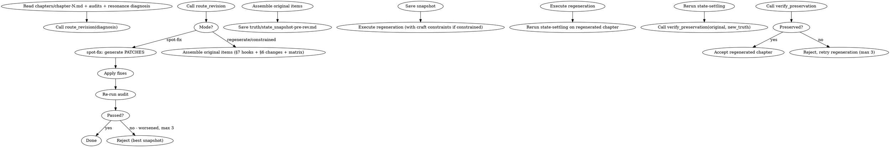
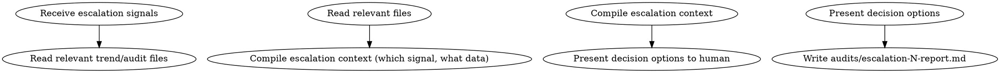

# 分层系统 Wave 4：闭环 + 审批实施计划

> **For agentic workers:** REQUIRED SUB-SKILL: Use superpowers:subagent-driven-development (recommended) or superpowers:executing-plans to implement this plan task-by-task. Steps use checkbox (`- [ ]`) syntax for tracking.

**Goal:** 实现生成-评分-修正闭环（含重生路由 + state-settling 重跑 + preserve_check），改造审批节点为默认 auto + 阻断覆盖 + 升级，新增 escalation-review skill，更新 drift-guidance/review-foreshadowing 接缝，完成 summarize_round/command-to-give 集成。

**Architecture:** 四 prompt 闭环修正为五步（§11.3：重生后强制 state-settling 重跑）。chapter-revision 读评分诊断（§11.4）。审批节点统一改为 auto + BLOCKING 覆盖（§6.1）。escalation-review 在升级信号触发时召唤人工。

**Tech Stack:** Python 3.11+，SKILL.md，pytest。

**Spec:** `docs/superpowers/specs/2026-06-28-hierarchical-memory-scoring-system-design.md` v1.4.0
- §5 闭环（§5.1-5.5 + §11.3-11.5 接缝）
- §6 自动审批（§6.1-6.4）
- §11.4-11.5 chapter-revision 接缝
- §11.8 drift-guidance 读 volume_score_trend
- §11.9 review-foreshadowing 调用 recall
- §9.8 summarize_round hierarchical_scores
- §9.9 command-to-give 更新

**Depends on:** Wave 1（revision_routing + preserve_check + escalation + scoring 扩展）+ Wave 2（记忆层）+ Wave 3（评分层 + 锚点）

## Global Constraints

- 重生后必须 state-settling 重跑（§11.3），否则 truth 过时
- preserve_check 在 state-settling 重跑后执行（§11.5）
- BLOCKING 级覆盖自动批（§6.1：BLOCKING 是确定性信号）
- 升级触发条件全部确定性（§6.2：线性回归/二元判定/计数器）
- 修改 src/shenbi/ 后运行 `bash tests/lock-tool-hashes.sh`

## File Structure

| 文件 | 职责 |
|------|------|
| `skills/shenbi-chapter-revision/SKILL.md` | 改造：重生路由 + preserve_check + 读评分诊断 |
| `skills/shenbi-escalation-review/SKILL.md` | 新增：升级审查 |
| `skills/shenbi-drift-guidance/SKILL.md` | 改造：读 volume_score_trend |
| `skills/shenbi-review-foreshadowing/SKILL.md` | 改造：大规模调用 recall |
| `src/shenbi/summarize_round.py` | 改造：hierarchical_scores 桶 |
| `command-to-give.md` | 改造：执行协议更新 |
| 各创作/审计 skill | 审批节点统一改造 |

---

### Task 1: chapter-revision 改造（重生路由 + preserve_check）

**Files:**
- Modify: `skills/shenbi-chapter-revision/SKILL.md`

**Interfaces:**
- Consumes: Wave 1 `route_revision` + `verify_preservation`；评分诊断（audits/chapter-N-resonance.md）；plans/chapter-N-plan.md（原始项提取）
- Produces: 修订/重生后的 chapters/chapter-N.md + truth/state_snapshot-pre-rev.md

- [ ] **Step 1: Rewrite chapter-revision flow for regeneration routing**

在 `skills/shenbi-chapter-revision/SKILL.md` 的流程 DOT 中，替换为五步闭环（§11.3）：

```markdown
## 流程（五步闭环，spec §11.3）



## 接缝契约（spec §11.4-11.5）

### Reads 扩展
```
reads:
  - chapters/chapter-N.md
  - audits/chapter-N-*.md           # 审计问题（现有）
  - audits/chapter-N-resonance.md   # 评分诊断（新增，含 route C unmet_goal）
  - plans/chapter-N-plan.md         # 章计划（新增，preserve_check 原始项提取）
```

### 重生保留核验（§11.5）
重生前组装 original 字典：
1. 读 plans/chapter-N-plan.md §7 → hooks_advanced（已 advance/resolve 的 hook_id）
2. 读 plans/chapter-N-plan.md §6 → changes_realized（已实现的改变）
3. 读 truth/character_matrix.md → state_changes（角色关系/状态变更）
4. 创建 truth/state_snapshot-pre-rev.md 快照
5. 重生 → state-settling 重跑 → verify_preservation(original, new_truth)
```

- [ ] **Step 2: Add iron rules for regeneration**

```markdown
## 铁律（补充）

6. **重生不是润色** — 目标未达成（route C 硬二元未兑现）不能用 spot-fix，必须重生
7. **重生保留已兑现项** — verify_preservation 必须通过，违反 = 重生无效重做
8. **重生后强制 state-settling 重跑** — 否则 truth 文件反映重生前旧章节（§11.3）
9. **重生上限 3 次** — 同一目标连续 3 次未兑现 → escalation_check 触发升级人工
```

- [ ] **Step 3: Update frontmatter contract**

```yaml
  reads:
    - chapters/chapter-N.md
    - audits/chapter-N-*.md
    - audits/chapter-N-resonance.md
    - plans/chapter-N-plan.md
  writes:
    - truth/state_snapshot-pre-rev.md
  updates:
    - chapters/chapter-N.md
```

- [ ] **Step 4: Commit**

```bash
git add skills/shenbi-chapter-revision/SKILL.md
git commit -m "feat: rewrite chapter-revision for regeneration routing + preserve_check + state-settling rerun (spec §5.3, §11.3-11.5)"
```

---

### Task 2: 审批节点统一改造（默认 auto + 阻断覆盖 + 升级）

**Files:**
- Modify: 各创作/审计 skill 的 DOT 节点（worldbuilding/character-design/chapter-drafting/state-settling 等含 "Human reviews" 的 skill）

- [ ] **Step 1: Identify all skills with human approval nodes**

Run: `grep -rl "Human reviews\|present for approval\|Human approves" skills/ | grep SKILL.md`
Expected: list of skills needing改造

- [ ] **Step 2: Replace approval DOT nodes with auto + escalation pattern**

对每个含审批节点的 skill，将：
```dot
"Generate output" -> "Human reviews" [label="present for approval"];
"Human reviews" -> "Write to disk" [label="approved"];
"Human reviews" -> "Revise" [label="rejected"];
```
替换为（§6.4）：
```dot
"Generate output" -> "Has BLOCKING issues?";
"Has BLOCKING issues?" -> "Write to disk" [label="no"];
"Has BLOCKING issues?" -> "Mark blocked" [label="yes"];
"Write to disk" -> "Escalation check (post-score)";
"Escalation check (post-score)" -> "Done" [label="no escalation"];
"Escalation check (post-score)" -> "Human review" [label="escalation"];
"Mark blocked" -> "Human review";
"Human review" -> "Revise" [label="rejected"];
"Human review" -> "Write to disk" [label="approved"];
```

在铁律区新增：
```markdown
## 自动审批（spec §6.1）

默认自动通过，不等待人工。例外：
- BLOCKING 级问题 → 自动标记 blocked，触发升级
- 升级信号（escalation_check）→ 召唤人工
```

- [ ] **Step 3: Verify all approval nodes converted**

Run: `grep -rl "Human reviews\|present for approval\|Human approves" skills/ | grep SKILL.md`
Expected: empty output (all converted). If any remain, repeat Step 2 for those skills.

- [ ] **Step 4: Commit batch**

```bash
git add skills/
git commit -m "feat: convert approval nodes to auto + blocking override + escalation (spec §6.1, §6.4)"
```

---

### Task 3: shenbi-escalation-review skill

**Files:**
- Create: `skills/shenbi-escalation-review/SKILL.md`
- Create: `src/shenbi/gates/g4/escalation_review.py`

- [ ] **Step 1: Write SKILL.md**

```markdown
---
name: shenbi-escalation-review
description: "Use when an escalation signal has been triggered (score decline, objective miss, regeneration loop, sensitivity blocking, arc failure, or axis drift) and human review is required"
requires_independent_agent: true
contract:
  kind: report
  reads:
    - truth/resonance_trend.md
    - audits/volume-N-score.md
    - audits/arc-N-score.md
    - audits/stratum-N-score.md
    - audits/chapter-N-sensitivity.md
  writes:
    - audits/escalation-N-report.md
  updates: []
---
<!-- AUTO-GENERATED from frontmatter — do not edit -->

## 数据契约

- **Reads:** truth/resonance_trend.md, audits/volume-N-score.md, audits/arc-N-score.md, audits/stratum-N-score.md, audits/chapter-N-sensitivity.md
- **Writes:** audits/escalation-N-report.md
- **Updates:** none

<!-- END AUTO-GENERATED -->

# 人工升级审查

仅在 escalation_check 返回非空信号时触发。汇总升级原因 + 相关评分数据，呈交人工决策。

## 流程



## 铁律

1. **只读不评** — 本 skill 不产生评分，只汇总升级上下文供人工决策
2. **决策选项明确** — 每个升级给出 2-3 个具体选项（接受现状/回滚/手动修订）

## 输出格式

```markdown
## 升级审查报告

**触发信号**: [signal type]
**触发时间**: YYYY-MM-DD
**相关章节/卷/弧**: N

### 升级上下文
[触发条件的完整数据：如连续下滑的5章分数 + 线性回归斜率]

### 决策选项
1. 接受现状，继续自动批（附风险说明）
2. 回滚到第N章快照，手动修订
3. 手动修订当前产出

### 人工决策
[ ] 选项1  [ ] 选项2  [ ] 选项3
```
```

- [ ] **Step 2: Create G4 checker**

```python
# src/shenbi/gates/g4/escalation_review.py
"""G4 checker for shenbi-escalation-review."""
from __future__ import annotations
from pathlib import Path
from shenbi.gates.shared import fail, passed


def g4_escalation_review(fps: list[str], rd: str | None = None) -> str:
    c, mf = [], []
    for fp in fps or []:
        p = Path(fp)
        if not p.exists():
            mf.append(f"G4.er.not_found:{fp}")
            continue
        content = p.read_text(encoding="utf-8")
        for section in ["触发信号", "升级上下文", "决策选项"]:
            if section not in content:
                mf.append(f"G4.er.missing_section:{section}")
        c.append({"id": "G4.er", "s": "PASS"})
    if mf:
        return fail("G4-escalation-review", c, "scoring", mf)
    return passed("G4-escalation-review", c)
```

- [ ] **Step 3: Commit**

```bash
git add skills/shenbi-escalation-review/SKILL.md src/shenbi/gates/g4/escalation_review.py
- [ ] **Step 3: Register G4 checker in generic.py dispatch (spec §9.12)**

```python
# 1. generic.py late imports 块添加：
from shenbi.gates.g4.escalation_review import g4_escalation_review
# 2. checkers dict 添加：
#   "shenbi-escalation-review": g4_escalation_review,
# 3. shared.py G4_CHECKER_SKILLS 集合添加：
#   "shenbi-escalation-review"
```

- [ ] **Step 4: Register in deps.json (t1_only_auxiliary)**

`shenbi-escalation-review` 归入 `_out_of_pipeline.t1_only_auxiliary`（spec §9.5）：

```bash
python3 -c "
import json
from pathlib import Path
deps_path = Path('tests/tiers/deps.json')
d = json.loads(deps_path.read_text(encoding='utf-8'))
aux = d['_out_of_pipeline']['t1_only_auxiliary']
if 'shenbi-escalation-review' not in aux:
    aux.append('shenbi-escalation-review')
deps_path.write_text(json.dumps(d, indent=2, ensure_ascii=False) + '\n')
"
```

- [ ] **Step 4: Commit**

```bash
git add skills/shenbi-escalation-review/SKILL.md src/shenbi/gates/g4/ src/shenbi/gates/shared.py tests/tiers/deps.json
git commit -m "feat: add shenbi-escalation-review skill + G4 checker + deps.json registration (spec §6.3, §9.5)"
```

---

### Task 4: drift-guidance 改造（读 volume_score_trend）

**Files:**
- Modify: `skills/shenbi-drift-guidance/SKILL.md`

**Interfaces (§11.8):** 新增读 `truth/volume_score_trend.md`（score-volume 产出）

- [ ] **Step 1: Add volume_score_trend to reads**

将 frontmatter reads 增加 `truth/volume_score_trend.md`，并在铁律区新增：

```markdown
## 卷级目标达成漂移（spec §11.8）

读取 truth/volume_score_trend.md，drift_detection 增加"卷级目标未达成"触发器。当 volume_score_trend 最近一行 objective_achieved=false 时，生成卷级漂移指导。
```

- [ ] **Step 2: Commit**

```bash
git add skills/shenbi-drift-guidance/SKILL.md
git commit -m "feat: drift-guidance reads volume_score_trend for objective-miss drift (spec §11.8)"
```

---

### Task 5: review-foreshadowing 改造（大规模调用 recall）

**Files:**
- Modify: `skills/shenbi-review-foreshadowing/SKILL.md`

**Interfaces (§11.9):** current_chapter > 50 时调用 foreshadowing-recall

- [ ] **Step 1: Add recall integration**

在铁律区新增：

```markdown
## 大规模伏笔召回（spec §11.9）

当 current_chapter > 50，调用 shenbi-foreshadowing-recall 获取 recall_overdue_hooks 结果，替代全量读取 pending_hooks.md。阈值以下仍用扁平读取。

调用：`uv run python -m shenbi.skill_utils.foreshadowing_recall --hooks-json '[...]' --current-chapter N`
```

- [ ] **Step 2: Commit**

```bash
git add skills/shenbi-review-foreshadowing/SKILL.md
git commit -m "feat: review-foreshadowing calls foreshadowing-recall at scale (spec §11.9)"
```

---

### Task 6: summarize_round.py 改造（hierarchical_scores 桶）

**Files:**
- Modify: `src/shenbi/summarize_round.py`

**Interfaces (§9.8):** summary.json 新增 hierarchical_scores 桶

- [ ] **Step 1: Add hierarchical_scores parsing**

在 `src/shenbi/summarize_round.py` 中，读取 arc/volume/stratum 评分并聚合到 `hierarchical_scores`：

```python
# 在 main() 的 t3 聚合后新增（spec §9.8）
hierarchical = summary.get("hierarchical_scores", {})
arc_scores = hierarchical.get("arc_scores", {})
volume_scores = hierarchical.get("volume_scores", {})
stratum_scores = hierarchical.get("stratum_scores", {})

if arc_scores:
    arc_vals = [float(v) for v in arc_scores.values()]
    arc_avg = sum(arc_vals) / len(arc_vals)
    arc_bands = classify_scores(arc_scores)
    next_actions.append(f"分层评分: 弧段级均分 {arc_avg:.1f} (bands: {arc_bands})")
if volume_scores:
    vol_failed = below_threshold(
        {k: float(v) for k, v in volume_scores.items()}, threshold=80.0
    )
    if vol_failed:
        next_actions.append(f"分层评分: 卷级 Objective 未达成的卷: {vol_failed}，需人工复核")
if stratum_scores:
    strat_vals = [float(v) for v in stratum_scores.values()]
    if any(v < 80 for v in strat_vals):
        next_actions.append("分层评分: 大弧级主轴可能有偏移，需人工复核书脊")
```

- [ ] **Step 2: Update summary.json template**

在 round-exec.sh 的 summary.json 模板增加：
```json
"hierarchical_scores": {
  "arc_scores": {},
  "volume_scores": {},
  "stratum_scores": {}
}
```

- [ ] **Step 3: Write test**

```python
# tests/unit/test_summarize_hierarchical.py
"""Test summarize_round hierarchical_scores parsing (spec §9.8)."""
import pytest
from shenbi.summarize_round import classify_scores, below_threshold


@pytest.mark.unit
def test_arc_scores_classified_into_bands():
    # classify_scores returns band counts: {pass_excellent, pass_acceptable, conditional, fail}
    result = classify_scores({"arc-1": 95.0, "arc-2": 91.5})
    assert result["pass_excellent"] == 2  # both >= 90 (95 and 91.5)
    assert result["fail"] == 0


@pytest.mark.unit
def test_volume_objective_missed_detected():
    # below_threshold returns list of names scoring below threshold
    vol_scores = {"volume-1": 85.0, "volume-2": 72.0}
    failed = below_threshold(vol_scores, threshold=80.0)
    assert "volume-2" in failed
    assert "volume-1" not in failed
```

- [ ] **Step 4: Run tests + re-lock + commit**

```bash
uv run pytest tests/unit/test_summarize_hierarchical.py -v
bash tests/lock-tool-hashes.sh
git add src/shenbi/summarize_round.py tests/unit/test_summarize_hierarchical.py tests/round-exec.sh tests/tiers/deps.json
git commit -m "feat: summarize_round parses hierarchical_scores bucket (spec §9.8)"
```

---

### Task 7: command-to-give.md 更新

**Files:**
- Modify: `command-to-give.md`

- [ ] **Step 1: Update generative protocol (step 3)**

在第三步 generative 协议中，评分 subagent dispatch 指令增加：

```markdown
评分 subagent 指令增加（spec §5.4 反塍缩）:
- 禁止默认 95。95 是"未认真区分"的信号
- 达标也必须在 88-97 间给有区分度的分
- 必须解释每个维度分数相对锚点的位置（更好/相当/更差）
- 双评员：两个独立 subagent 评同一章，差异 >5 分触发仲裁

评分诊断输出必须按统一 schema（spec §5.2）:
{"issues": [{"category": "unmet_goal"|"craft", "id": str, "evidence": str, "severity": "BLOCKING"|"CRITICAL"|"MINOR"}]}

chapter-revision 失败后按 revision_routing 分流（spec §5.2）:
- spot-fix: 工艺问题
- regenerate: 目标未达成（含 state-settling 重跑 + preserve_check）
- constrained-regenerate: 两者皆有
```

- [ ] **Step 2: Update T2 phase protocol (step 6)**

在第六步 T2 phase 执行中增加：
```markdown
drafting phase 含 score-arc（每12章）+ foreshadowing-recall（每章）
management phase 含 memory-distill + score-volume + score-stratum
```

- [ ] **Step 3: Commit**

```bash
git add command-to-give.md
git commit -m "docs: update command-to-give with closed-loop + hierarchical scoring protocol (spec §9.9)"
```

---

### Task 8: 全量集成验证

- [ ] **Step 1: Run full check**

Run: `just check`
Expected: all passed

- [ ] **Step 2: Verify complete skill chain**

Run: `uv run shenbi-validate G0 outline-example.md 2>&1 | grep "G0.4"`
Expected: skills_count = 69 (61 original + 8 new)

- [ ] **Step 3: Verify all G4 checkers registered**

Run: `python3 -c "from shenbi.gates.g4 import *; print('all imported')"`
Expected: success

- [ ] **Step 4: Final hash lock + commit**

```bash
bash tests/lock-tool-hashes.sh
git add tests/tiers/deps.json
git commit -m "chore: final hash lock after Wave 4 — hierarchical system complete"
```

---

### Task 9: 运行时接线（helpers → 编排）

**Files:**
- Create: `src/shenbi/orchestration/escalation_bridge.py`
- Create: `src/shenbi/orchestration/scoring_bridge.py`
- Test: `tests/unit/orchestration/test_bridges.py`

**问题**（independent review I6）：Wave 1 的 helpers（check_escalation / check_scorer_agreement / flag_score_collapse / recall_overdue_hooks）是纯函数有单测，但从未被运行时调用。本 task 构建 file→params 适配器，让 helpers 真正接入逐章循环。

- [ ] **Step 1: Write escalation_bridge（trend.md → check_escalation params）**

```python
# src/shenbi/orchestration/escalation_bridge.py
"""Bridge: parse resonance_trend.md → check_escalation params (spec §6.3)."""
from __future__ import annotations
import re
from pathlib import Path
from shenbi.skill_utils.escalation.check import check_escalation, EscalationSignal


def parse_resonance_scores(trend_path: Path) -> list[float]:
    """Extract overall scores from resonance_trend.md table rows."""
    content = trend_path.read_text(encoding="utf-8")
    scores = []
    for line in content.split("\n"):
        # Table rows: | chapter | role | 情感 | 场景 | 文笔 | 回报 | overall | ...
        if line.startswith("|") and "overall" not in line.lower():
            cells = [c.strip() for c in line.split("|")[1:-1]]
            # overall is the 7th column (index 6), before confidence
            if len(cells) >= 7:
                try:
                    val = float(cells[6])
                    if val > 0:  # skip pending/empty
                        scores.append(val)
                except (ValueError, IndexError):
                    pass
    return scores


def run_escalation_check(
    resonance_trend_path: Path,
    sensitivity_blocking: bool = False,
    volume_objective_met: bool = True,
    regeneration_attempts: int = 0,
    arc_score: float | None = None,
    stratum_axis_drift: bool = False,
) -> list[EscalationSignal]:
    """Full bridge: read trend file, call check_escalation."""
    scores = parse_resonance_scores(resonance_trend_path)
    return check_escalation(
        resonance_scores=scores,
        sensitivity_blocking=sensitivity_blocking,
        volume_objective_met=volume_objective_met,
        regeneration_attempts=regeneration_attempts,
        arc_score=arc_score,
        stratum_axis_drift=stratum_axis_drift,
    )
```

- [ ] **Step 2: Write scoring_bridge（双评员一致性与塌缩检测接入评分流程）**

```python
# src/shenbi/orchestration/scoring_bridge.py
"""Bridge: run dual-scorer agreement + collapse detection on scoring results."""
from __future__ import annotations
from shenbi.scoring import check_scorer_agreement, flag_score_collapse


def validate_dual_scorer(scores_a: dict[int, float], scores_b: dict[int, float], threshold: float = 5.0) -> dict:
    """Run agreement check; return result with escalation flag if disputed."""
    result = check_scorer_agreement(scores_a, scores_b, threshold)
    return {
        **result,
        "needs_arbitration": not result["agreed"],
    }


def check_single_scorer_collapse(scores: dict[int, float]) -> dict:
    """Run collapse detection on a single scorer's output."""
    return flag_score_collapse(scores)
```

- [ ] **Step 3: Write tests**

```python
# tests/unit/orchestration/test_bridges.py
"""Tests for orchestration bridges (spec §6.3, §5.5)."""
import pytest
from pathlib import Path
from shenbi.orchestration.escalation_bridge import parse_resonance_scores, run_escalation_check
from shenbi.orchestration.scoring_bridge import validate_dual_scorer, check_single_scorer_collapse


@pytest.mark.unit
def test_parse_resonance_scores_extracts_overall():
    # Create a temp trend file
    import tempfile, os
    content = """| chapter | chapter_role | 情感落地 | 场景临场感 | 文笔质感 | 读者回报 | overall | confidence |
| N | 高潮 | 22 | 20 | 22 | 18 | 82 | high |
| N+1 | 推进 | 20 | 18 | 20 | 16 | 74 | mid |"""
    with tempfile.NamedTemporaryFile(mode='w', suffix='.md', delete=False, encoding='utf-8') as f:
        f.write(content)
        f.flush()
        scores = parse_resonance_scores(Path(f.name))
    os.unlink(f.name)
    assert scores == [82.0, 74.0]


@pytest.mark.unit
def test_validate_dual_scorer_flags_dispute():
    a = {1: 90, 2: 95}
    b = {1: 85, 2: 70}  # dim 2 diff = 25
    result = validate_dual_scorer(a, b, threshold=5.0)
    assert result["needs_arbitration"] is True


@pytest.mark.unit
def test_check_single_scorer_collapse_detects_all_95():
    scores = {1: 95, 2: 95, 3: 95}
    result = check_single_scorer_collapse(scores)
    assert result["collapse_suspected"] is True
```

- [ ] **Step 4: Run tests**

Run: `uv run pytest tests/unit/orchestration/test_bridges.py -v`
Expected: 3 passed

- [ ] **Step 5: Commit**

```bash
git add src/shenbi/orchestration/ tests/unit/orchestration/
git commit -m "feat: wire helpers into runtime via orchestration bridges (spec §6.3, §5.5, review I6)"
```

---

## 全系统完成检查

完成 Wave 1-4 后，整个分层记忆与分层评分系统应满足：

- [ ] 67+ skills（61 original + 8 new）全部有 G4 checker + T1 测试
- [ ] G0.10 动态计数，G0.13/14 全树哈希锁定
- [ ] 4 个确定性 helper（revision_routing/preserve_check/escalation/foreshadowing_recall）
- [ ] scoring.py 双评员一致性 + 塍缩检测
- [ ] 分层记忆 L0-L5 全链路（book-spine-init → memory-distill → context-composing 按层组装）
- [ ] 分层评分 4 层（review-resonance 改造 + score-arc + score-volume + score-stratum）
- [ ] 9 类锚点库（benchmarks/anchors/AC-001~009）
- [ ] 生成-评分-修正五步闭环（含重生路由 + state-settling 重跑 + preserve_check）
- [ ] 自动审批（默认 auto + BLOCKING 覆盖 + escalation_check）
- [ ] summarize_round hierarchical_scores 桶
- [ ] command-to-give 执行协议更新
- [ ] 所有 10 个集成接缝（§11.1-11.10）契约满足
