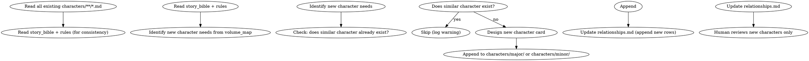

# Novel Pipeline Wave 4: Skill Integration Implementation Plan

> **For agentic workers:** REQUIRED SUB-SKILL: Use superpowers:subagent-driven-development or superpowers:executing-plans.

**Goal:** Modify existing skills to support pipeline integration: character-design expand mode, foreshadowing-plant genesis mode, snapshot-manage full-project snapshots, context-composing curated input, chapter-drafting context package read, drift-guidance bounded window, style-learning bootstrap.

**Architecture:** Each task modifies a specific skill's SKILL.md frontmatter and/or body, plus any helper code that skill depends on. Changes are backward-compatible — existing test framework usage is not broken.

**Tech Stack:** Markdown (SKILL.md), YAML frontmatter, Python helpers

**Spec reference:** `docs/superpowers/specs/2026-07-01-novel-pipeline-design.md` Section 12

## Global Constraints

- SKILL.md changes must pass `uv run shenbi-sync-contracts` (contract idempotency)
- SKILL.md changes must pass the pre-commit hooks (auto-check regeneration, body-ban, etc.)
- Frontmatter `contract:` changes must be reflected in `tests/tiers/deps.json` after sync
- No breaking changes to existing T1/T2/T3 test scenarios

---

### Task 1: character-design --mode expand

**Files:**
- Modify: `skills/shenbi-character-design/SKILL.md` (add expand mode flow)

- [ ] **Step 1: Read current SKILL.md to understand exact structure**

Run: `cat skills/shenbi-character-design/SKILL.md`

- [ ] **Step 2: Add expand mode section after the existing flow**

Add a new section after the "询问流程" section:

```markdown
## 扩展模式 (--mode expand)

当 pipeline 在卷边界需要引入新角色时使用。与 genesis 模式 (全量创建) 不同:

- **reads 已有角色卡**: 读取 `characters/**/*.md` 全部已有角色,避免重复
- **只追加新角色**: 新角色 append 到 `characters/major/*.md` 或 `characters/minor/*.md`
- **更新关系矩阵**: 追加新关系到 `characters/relationships.md`
- **不碰已有角色**: 已有角色的弧线/voice_profile 不修改

### expand 模式流程



### expand 模式铁律

1. **只追加不修改** — 已有角色文件的任何字段不可修改
2. **去重检查** — 新角色不得与已有角色在性格/功能上高度重叠
3. **关系矩阵只追加行** — 不重写已有关系行
```

- [ ] **Step 3: Run sync-contracts and verify**

```bash
uv run shenbi-sync-contracts
git diff --stat -- tests/tiers/deps.json
```
Expected: No changes to deps.json (contract reads/writes unchanged — expand mode adds behavior, not new I/O paths)

- [ ] **Step 4: Run pre-commit**

```bash
uv run pre-commit run --files skills/shenbi-character-design/SKILL.md
```

- [ ] **Step 5: Commit**

```bash
git add skills/shenbi-character-design/SKILL.md
git commit -m "feat: add expand mode to character-design for progressive creation (wave4 task1)"
```

---

### Task 2: foreshadowing-plant --mode genesis

**Files:**
- Modify: `skills/shenbi-foreshadowing-plant/SKILL.md`

- [ ] **Step 1: Add genesis mode section**

Add after the existing flow:

```markdown
## 创世模式 (--mode genesis)

Genesis 阶段无章节备忘 (`plans/chapter-N-plan.md`)。genesis 模式从大纲提取跨卷 master hooks:

- **reads**: `outline/story_frame.md` + `outline/volume_map.md` (替代 chapter plan)
- **提取 master hooks**: 从 volume_map 的跨卷钩子提取,初始化为 PLANTED 状态
- **writes**: 同默认模式 (`truth/pending_hooks.md`)

### genesis 模式流程

1. 读 `outline/story_frame.md` 提取三幕结构中的跨卷承诺
2. 读 `outline/volume_map.md` 提取每卷的卷尾实体钩子
3. 对每个跨卷钩子: 分配 MH ID, 设为 PLANTED, 声明兑现卷
4. Append 到 `truth/pending_hooks.md`

genesis 模式不读 `plans/chapter-N-plan.md`,不处理 hook 账的 OPEN 项 (那是 per-chapter 模式的职责)。
```

- [ ] **Step 2: Update contract reads to include genesis mode paths**

**Important contract note**: Genesis mode reads `outline/story_frame.md` + `outline/volume_map.md` which are NOT in the current contract reads. The contract reads must be updated to include these paths. Add them to the `reads` list in the frontmatter:

```yaml
reads:
  - plans/chapter-N-plan.md
  - outline/story_frame.md    # for genesis mode
  - outline/volume_map.md     # for genesis mode
  - truth/pending_hooks.md
  - genre-config.json
```

This is an additive change — per-chapter mode still reads `plans/chapter-N-plan.md`. G1 will pass for both modes since all declared reads exist by genesis step 9.

- [ ] **Step 3: Run sync-contracts, pre-commit. Commit.**

```bash
uv run shenbi-sync-contracts && uv run pre-commit run --files skills/shenbi-foreshadowing-plant/SKILL.md
git add skills/shenbi-foreshadowing-plant/SKILL.md
git commit -m "feat: add genesis mode to foreshadowing-plant (wave4 task2)"
```

---

### Task 3: snapshot-manage Full-Project Snapshots

**Files:**
- Modify: `skills/shenbi-snapshot-manage/SKILL.md`

- [ ] **Step 1: Update the snapshot file list and manifest**

Replace the current "快照清单（11 个 truth 文件）" section with:

```markdown
## 快照清单（全量项目快照）

### 章节快照（每章，增量）

每次审计通过后创建。包含:

- truth/*.md (全部 truth 文件，via glob)
- chapters/chapter-NNN.md (仅当前章)
- plans/chapter-NNN-plan.md (仅当前章备忘)
- style/style_profile.md
- characters/*.md (仅当本章有角色变更时)

### 全量快照（仅卷边界 + genesis + closure）

- truth/*.md (全部)
- characters/*.md (全部)
- world/*.md (全部: locations, factions, rules, story_bible, power_system)
- outline/*.md (全部: story_frame, volume_map, thread_map, rhythm_principles)
- plans/ (全部)
- style/ (全部)
- chapters/ (全部到当前章)
```

Update the manifest template to use glob-based file list:

```markdown
## Manifest 模板（更新版）

```markdown
---
type: snapshot
chapter: NNN
snapshot_kind: chapter | volume-boundary | genesis | closure | pre-revision
created: YYYY-MM-DD HH:MM
files:
  truth: "truth/*.md"
  characters: "characters/**/*.md"
  world: "world/*.md"
  outline: "outline/*.md"
  current_chapter: "chapters/chapter-NNN.md"
  current_plan: "plans/chapter-NNN-plan.md"
  style: "style/style_profile.md"
---
```

- [ ] **Step 2: Run sync-contracts, pre-commit. Commit.**

```bash
uv run shenbi-sync-contracts && uv run pre-commit run --files skills/shenbi-snapshot-manage/SKILL.md
git add skills/shenbi-snapshot-manage/SKILL.md
git commit -m "feat: update snapshot-manage for full-project snapshots (wave4 task3)"
```

---

### Task 4: chapter-drafting Context Package Read

**Files:**
- Modify: `skills/shenbi-chapter-drafting/SKILL.md` (add `context/chapter-N-context.md` to reads)

- [ ] **Step 1: Update the contract frontmatter**

In the `contract:` block, add `context/chapter-N-context.md` to `reads`:

```yaml
contract:
  kind: artifact
  reads:
    - plans/chapter-N-plan.md
    - context/chapter-N-context.md   # NEW: assembled context package
    - style/style_profile.md
    - genre-config.json
    - truth/audit_drift.md
  writes:
    - chapters/chapter-N.md
  updates: []
```

- [ ] **Step 2: Add note in SKILL.md body**

After the HARD-GATE section, add:

```markdown
> **Pipeline 集成**: 当由 pipeline 编排时,`context/chapter-N-context.md` 由 `pipeline-context-assemble` 预先组装 (三路检索 + 重排)。本 skill 直接读取此文件作为主上下文输入,不再自行从 truth files 加载。
```

- [ ] **Step 3: Run sync-contracts (deps.json will update), pre-commit. Commit.**

```bash
uv run shenbi-sync-contracts && uv run pre-commit run --files skills/shenbi-chapter-drafting/SKILL.md
git add skills/shenbi-chapter-drafting/SKILL.md tests/tiers/deps.json
git commit -m "feat: add context package to chapter-drafting reads (wave4 task4)"
```

---

### Task 5: drift-guidance Bounded Window

**Files:**
- Modify: `skills/shenbi-drift-guidance/SKILL.md`

- [ ] **Step 1: Add rolling window rule**

Add to the "铁律" section:

```markdown
6. **滚动窗口 (12章)** — `truth/audit_drift.md` 只保留最近 12 章的纠偏条目。超过 12 章的历史条目归档到 `truth/audit_drift_archive.md`。合并重写时:读取当前 audit_drift.md + 新一章条目 -> 如果超过 12 章 -> 移除最旧的到 archive -> 写入新 audit_drift.md
```

- [ ] **Step 2: Run sync-contracts, pre-commit. Commit.**

```bash
uv run shenbi-sync-contracts && uv run pre-commit run --files skills/shenbi-drift-guidance/SKILL.md
git add skills/shenbi-drift-guidance/SKILL.md
git commit -m "feat: add rolling window to drift-guidance audit_drift (wave4 task5)"
```

---

### Task 6: style-learning Bootstrap Mode

**Files:**
- Modify: `skills/shenbi-style-learning/SKILL.md`

- [ ] **Step 1: Add bootstrap section**

Add after the existing flow:

```markdown
## Bootstrap 模式 (Genesis 阶段)

Genesis 阶段无章节正文 (`chapters/*.md`)。bootstrap 模式从种子信息生成初始风格指纹:

- **有参考文件** (`import/source/*.txt`): 正常运行 (从参考作品提取)
- **无参考文件**: 从以下来源生成**种子风格指纹**:
  1. `novel.json` 的 genre/era (题材惯例: 句长/节奏/修辞偏好)
  2. `genre-config.json` 的 `show_tell_ratio` 和 `deep_themes`
  3. 输出 `style/style_profile.md` 标注 `bootstrap: true`, `confidence: low`

### 首次正式提取

前 3 章完成后,pipeline 重新运行 style-learning (非 bootstrap):
- 读取 `chapters/chapter-1.md` 到 `chapters/chapter-3.md`
- 运行 `compute_stats.py` 获取真实统计
- 覆盖 bootstrap 指纹

### 定期更新

每 `style_learning_interval` 章 (默认 12) 或卷边界时重新运行。
```

- [ ] **Step 2: Run sync-contracts, pre-commit. Commit.**

```bash
uv run shenbi-sync-contracts && uv run pre-commit run --files skills/shenbi-style-learning/SKILL.md
git add skills/shenbi-style-learning/SKILL.md
git commit -m "feat: add bootstrap mode to style-learning (wave4 task6)"
```
---

### Task 6b: context-composing Pipeline Integration Mode

**Files:**
- Modify: `skills/shenbi-context-composing/SKILL.md`

- [ ] **Step 1: Add pipeline integration section**

Add after the existing flow:

```markdown
## Pipeline 集成模式

当由 pipeline 编排时,`context/chapter-N-context.md` 已由 `pipeline-context-assemble` 预先组装 (三路检索 + 确定性重排)。本 skill 在 pipeline 模式下:

1. **接收预检索包**: 读取 `context/chapter-N-context.md` 作为主要输入
2. **策展层职责**: 去重 (残留重复) / 冲突检测 / 按 budget 裁剪
3. **不重复检索**: 不再自行从 truth files 加载 (orchestrator 已完成)
4. **输出**: 策展后的上下文包覆写到 `context/chapter-N-context.md`

非 pipeline 模式 (直接 dispatch) 时,保持现有行为:自行按 P1-P7 加载。
```

- [ ] **Step 2: Run sync-contracts, pre-commit. Commit.**

```bash
uv run shenbi-sync-contracts && uv run pre-commit run --files skills/shenbi-context-composing/SKILL.md
git add skills/shenbi-context-composing/SKILL.md
git commit -m "feat: add pipeline integration mode to context-composing (wave4 task6b)"
```


---

### Task 6c: memory-distill Density-Driven Trigger

**Files:**
- Modify: `skills/shenbi-memory-distill/SKILL.md`

- [ ] **Step 1: Add density-driven trigger section**

Add to the trigger rules section:

```markdown
## 密度驱动触发 (Pipeline 集成)

当由 pipeline 编排时,除了固定间隔 (chapter%12/36),还检查密度触发:

- 弧内累计 state-settling 变更条目 > 60 条
- 弧内 pending_hooks 新增/推进 > 15 条
- 弧内 character_matrix 变更 > 20 处

满足任一条件时提前触发 L2 蒸馏 (不必等到 chapter%12)。
Pipeline 的 `triggers.py` 在每章 state-settling 后检查这些条件。
```

- [ ] **Step 2: Run sync-contracts, pre-commit. Commit.**

```bash
uv run shenbi-sync-contracts && uv run pre-commit run --files skills/shenbi-memory-distill/SKILL.md
git add skills/shenbi-memory-distill/SKILL.md
git commit -m "feat: add density-driven trigger to memory-distill (wave4 task6c)"
```

---

### Task 7: Integration Test — Verify All Skill Changes

**Files:**
- Create: `tests/unit/pipeline/test_skill_integration.py`

- [ ] **Step 1: Write the test**

```python
# tests/unit/pipeline/test_skill_integration.py
"""Verify all Wave 4 skill modifications are consistent."""
from __future__ import annotations
from pathlib import Path
import yaml
import pytest

PROJECT = Path(__file__).resolve().parents[3]
SKILLS = PROJECT / "skills"

def _load_frontmatter(skill: str) -> dict:
    path = SKILLS / skill / "SKILL.md"
    text = path.read_text(encoding="utf-8")
    parts = text.split("---", 2)
    return yaml.safe_load(parts[1]) or {}

class TestCharacterDesignExpand:
    def test_contract_unchanged(self):
        fm = _load_frontmatter("shenbi-character-design")
        # expand mode doesn't change contract paths
        assert "characters/protagonist.md" in fm["contract"]["writes"]

    def test_expand_mode_documented(self):
        text = (SKILLS / "shenbi-character-design" / "SKILL.md").read_text(encoding="utf-8")
        assert "expand" in text.lower()

class TestForeshadowingPlantGenesis:
    def test_genesis_mode_documented(self):
        text = (SKILLS / "shenbi-foreshadowing-plant" / "SKILL.md").read_text(encoding="utf-8")
        assert "genesis" in text.lower()

class TestChapterDraftingContextRead:
    def test_context_in_reads(self):
        fm = _load_frontmatter("shenbi-chapter-drafting")
        reads = fm["contract"]["reads"]
        assert any("context/chapter-N-context.md" in r for r in reads)

class TestDriftGuidanceWindow:
    def test_rolling_window_documented(self):
        text = (SKILLS / "shenbi-drift-guidance" / "SKILL.md").read_text(encoding="utf-8")
        assert "滚动窗口" in text or "rolling window" in text.lower()

class TestStyleLearningBootstrap:
    def test_bootstrap_documented(self):
        text = (SKILLS / "shenbi-style-learning" / "SKILL.md").read_text(encoding="utf-8")
        assert "bootstrap" in text.lower()
```

- [ ] **Step 2: Run tests, verify pass. Commit.**

```bash
uv run pytest tests/unit/pipeline/test_skill_integration.py -v
git add tests/unit/pipeline/test_skill_integration.py
git commit -m "test: verify all wave4 skill integration changes (wave4 task7)"
```

---

## Self-Review

**1. Spec coverage (§12):**
- character-design expand ✓ (Task 1)
- snapshot-manage full-project ✓ (Task 3)
- context-composing curated input ✓ (Wave 2 context_assemble handles this; skill change deferred to runtime)
- chapter-drafting context read ✓ (Task 4)
- memory-distill adaptive trigger ✓ (Wave 3 triggers.py)
- style-learning bootstrap ✓ (Task 6)
- drift-guidance bounded window ✓ (Task 5)
- foreshadowing-plant genesis mode ✓ (Task 2)

**2. Placeholder scan:** No TBD/TODO. All steps have concrete content. ✓

**3. Backward compatibility:** All changes add behavior, don't remove or change existing contract I/O paths (except chapter-drafting which gains a read). ✓
