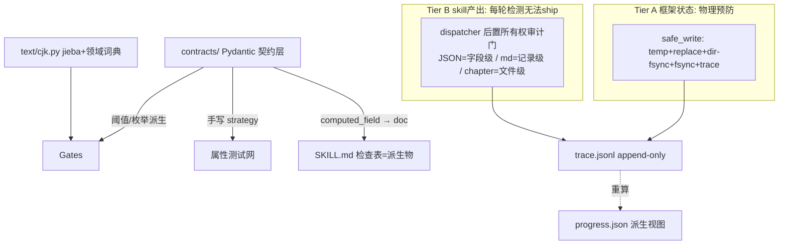

# 契约单源架构设计（Contract Single Source of Truth）v3

**状态**：草案待审阅（v3，已吸纳第 1+2 轮独立审核全部发现：7→7.5→目标 9+）
**日期**：2026-06-29
**关联**：全项目批判性审核（13 路并行 agent，整体 74/100）；spec 第 1 轮 7/10，第 2 轮 7.5/10

## v3 修订摘要

**第 2 轮 7.5/10，未达 9 的核心原因：Tier B 机制对 markdown truth 文件不可靠 + OWNERSHIP 矩阵示例与真实代码不符。v3 围绕这 5 条最小修复重写（N1-N9 + C1/I4/I6 残留）：**

- **N1（Critical，核心）**：markdown truth 文件不可字段寻址（pending_hooks.md 是 YAML frontmatter + `## hooks` bullet + 独立 markdown 表索引）。v2 的「dispatcher diff 出 changed_fields ⊆ write-set」对 markdown 不成立且可被删-重建整块绕过。**v3 改为记录级 + 文件级两层所有权（非字段级），markdown 用「记录存在性/记录数/记录键」语义，JSON 才用字段级。诚实声明记录级对「整块删重建」漏检——已知边界，记入风险表。**
- **N2（Critical）**：v2 的 OWNERSHIP 矩阵示例与真实代码不符。**v3 用真实代码核对重写**：pending_hooks.md 真实四写者是 plant/track/resolve/**state-settling**（v2 漏 state-settling）；字段名是 `status` 不是 `state`；foundation-review 的 contract reads 不含 genre-config.json 但 body 引用 tropeInventory（这本身是 under-declaration——见 N2-fact）。
- **N3（Critical）**：Tier B 依赖未声明的 dispatcher 工作目录拓扑。**v3 明确拓扑**：per-skill 隔离树 → 合并到共享 project-output/，**审计 diff 合并后共享树，时机是合并点**。
- **I4 残留**：G1/G7 行被标「物理预防」但其实是 AST lint。**v3 全表对齐强度定义，该行改「无法 CI 落地」。**
- **I6 残留（N4/N5）**：compaction 缺篡改边界链；事件版本化缺前向不兼容规则。**v3 补：COMPACTION 事件链式 seq + G7 验证边界；未知更高版本拒绝 + 单调版本不变量。**
- **C1 残留**：迁移顺序不可行（工具在 contracts/REGISTRY 不完整时依赖它）。**v3 明确 contracts/REGISTRY 在过渡期从 truth-files.yaml bootstrap；恢复 writes(创建) vs updates(就地改) 区分。**
- **N6/N7/N8/N9**：staging 标记 future work 不再支撑强度；@computed_field round-trip 显式声明 `extra="ignore"`；hypothesis-jsonschema 降级可选；AST lint allowlist 不为不存在的 staging 留口。

**第 1 轮 12 条**（v2 已修，v3 保留并复核，均在第 2 轮验证为 FIXED）：C1 contract.py 取代、C2 两层强制诚实拆分、I1 跨字段手写 strategy、I2 编译期措辞纠正、I3 零代码声明纠正、I5 AST lint 成功判据、I7 结构性发现收窄、M1-M5。

## 背景与目标

### 起因

2026-06-29 全项目审核（69 skills + G0-G7 gates + dispatcher + 10 skill_utils + 测试/CI/文档）13 路并行，整体 74/100。**元根因：凡框架需要确定性的地方，它都在信任散文而非强制类型化契约。** 五条结构性根因：

1. **散文是真理之源**：SKILL.md 的不变量/阈值/schema/词汇/生命周期/所有权都是自然语言，gates/helpers 另一人重实现必漂移。
2. **溯源非一等公民**：agent_id/评分者身份/写所有权/门历史全部隐式。
3. **测输出不测不变量**：单元测试测 f(x)==y；属性测试只覆盖 gates。
4. **CJK 无一等工具**：每个文本操作用正则默认值，假设空白边界。
5. **纯度/原子是散文**：「门必须纯」「progress 单写者」是 AGENTS.md 散文，无类型/lint/测试验证。

### 目标（与范围对齐）

1. 彻底修复五条根因。
2. **每个结构性审核发现闭环**且可追溯；内容/伦理发现（anti-detect）单独追踪不阻塞。
3. workflow 级独立 agent 自评 ≥ 9/10。
4. 漂移对**框架可触及状态物理预防**；对 **skill 产出每轮检测无法 ship**。诚实区分两层。

### 非目标

- 不改领域范围（LLM 驱动中文小说框架）；不替换 Python 类型化栈；不引入非 Python 运行时；不做 skill 内容领域性改写。
- **anti-detect 的 scope/disclosure 不在本 spec**（单独追踪）。
- **staging 真预防路线图是 future work**，本 spec 不设计其调度/进度门。

## 取代现有 contract.py（C1 修复）

`src/shenbi/contract.py` 已存在：`Contract` TypedDict（kind/reads/**writes**/**updates**/read_fields）、`OutputKind`、REGISTRY（`docs/framework/truth-files.yaml`）、schema+registry 校验、`load_contract`、loader-uniqueness lint，以及 `sync_contracts.py`/`lint_contracts.py`/`migrate_contract_to_frontmatter.py`/`tests/unit/contract/`。

### 概念迁移映射（v3 恢复 writes/updates 区分）

| 现有 | 新 | 动作 |
|---|---|---|
| `Contract` TypedDict | `contracts/skills/<name>.py` Pydantic 模型 | TypedDict→Pydantic |
| `writes`（创建）/`updates`（就地改） | 保留两语义，映射到 OWNERSHIP 的 `write`(创建新) vs `update`(改已有) | v2 静默丢弃，v3 恢复 |
| `read_fields`（读侧） | 与新 OWNERSHIP 的 write 侧合并为双向矩阵 | 单一矩阵 |
| `OutputKind` | `contracts/enums.py` | 合并枚举模块 |
| REGISTRY（truth-files.yaml） | `contracts/REGISTRY`（自动发现）；**过渡期从 truth-files.yaml bootstrap**（v3 修正 C1 残留） | 单一源 |
| `load_contract` + loader-uniqueness lint | 保留扩展为 `load_skill_contract` | lint 强化 |
| 4 个 contract 工具 | 重定向到 `contracts/` | 顺序见下 |

### 迁移顺序（v3 修正可行性）

1. 立 contracts/ + enums + REGISTRY；迁移 1 技能验证全管线。
2. **contracts/REGISTRY 在过渡期从 truth-files.yaml bootstrap**（而非纯自动发现），保证未迁移技能仍被 4 工具消费——这是 v2 顺序不可行的根因，v3 明确。
3. 合并 read_fields + 新 OWNERSHIP 为单一矩阵（含 write/update 区分）。
4. 重定向 4 工具到 contracts/REGISTRY（此时已含全词汇）。
5. contract.py 的 REGISTRY 改从 contracts/REGISTRY 派生。
6. 全部迁移后删 contract.py（保留 load_contract 薄转发直到调用方切换）。

**命名**：包 `contracts/`（复数）；单数 `contract.py` 迁移完成时删除，不长期共存。

## 总体架构：契约单源

**一句话**：凡框架需要确定性的地方，都不再信任散文，而从一份类型化契约派生 gates、helpers、文档、溯源。

### 强制强度诚实分层（I4 修复，v3 修正强度表与追溯矩阵一致性）

**追溯矩阵与强度表必须用同一标签**（v3 修正 v2 的 G1/G7 行自相矛盾）：

| 强度 | 适用 | 机制 |
|---|---|---|
| **物理预防** | 生成的文档；`@computed_field` 派生量；类型化枚举；自动 REGISTRY | 派生只读/文档从契约生成/枚举全栈唯一/注册表自动发现 |
| **无法 CI 落地** | 魔法数阈值；**门纯度（G1/G7 副作用）**；未声明写入；不变量违反 | ruff AST lint + 属性测试 CI 门 |
| **每轮检测无法 ship** | skill 产出所有权越权（记录级）；生命周期非法转移 | dispatcher 后置所有权审计门（Tier B） |

### 架构总图



### 六支柱 ↔ 五根因

| 根因 | 支柱 | 强度 |
|---|---|---|
| 一 散文是真理之源 | 契约层 + 文档派生 | 物理预防（文档生成）+ 无法 CI 落地（阈值 lint） |
| 二 溯源非一等公民 | trace + 两层所有权 | Tier A 预防 / Tier B 每轮检测 |
| 三 测输出不测不变量 | 属性测试网 | 无法 CI 落地（属性测试门） |
| 四 CJK 无一等工具 | 集中 cjk.py | 无法 CI 落地（lint 禁自实现 + 属性测试） |
| 五 纯度/原子是散文 | PureInput + safe_write + lint | Tier A 物理预防（框架状态）/ 无法 CI 落地（门纯度） |

### 已定承重决策（不变）

1. 契约形态：Pydantic 模型。
2. 契约边界：输出 schema + 算法不变量 + 协议契约（状态机 + 双向所有权 + 产消依赖图）。
3. 门与契约：阈值派生自契约；抽取逐技能自定义 parser；语义逻辑手写但 import 契约 + 属性测试约束。
4. 溯源：append-only trace.jsonl；progress 降级派生视图。
5. CJK：集中模块 + jieba（固定版本）+ 领域词典 + word_count 双语义。
6. 纯度/原子：类型层 PureInput + safe_write + AST lint + 运行时 capability FS shim。

## 支柱一：契约层（src/shenbi/contracts/）

### 核心设计原则（I2/M1 修复）

1. **派生量用 `@computed_field`（非 @property）**：保证 model_dump() 序列化不丢（M1）。zone 从 cp、verdict 从阈值都是 computed_field 只读派生——手填矛盾这一整类 bug 物理不可能。
2. **单字段约束编译期拒收（类型层）**：`Field(ge=0)`、`Literal` 由 mypy/basedpyright 编译期拒类型错误。
3. **跨字段不变量运行时校验（`@model_validator`）**：**这是 CI 门，不是编译期**（I2 修复）。措辞严格区分。
4. **数值阈值是具名模块常量**，门 import，ruff 禁裸魔法数。
5. **`extra="ignore"` 前提显式声明**（N7 修复）：含 computed_field 的模型显式设 `model_config = {"extra": "ignore"}`（或文档化），保证 dumped dict 含 computed_field 时 re-validate 重算而非拒绝。lint 禁止对含 computed_field 的模型设 `extra="forbid"`。

### foreshadowing_resolve CP 算术错误根治（审核三错）

```python
from pydantic import BaseModel, Field, model_validator, computed_field
from typing import Literal

CPZone = Literal["GREEN","ORANGE","RED"]
CP_THRESHOLDS = {"GREEN_MAX":50,"RED_NOW":100,"FORCE_NEXT_CHAPTER":200}

class HookCP(BaseModel):
    model_config = {"extra": "ignore"}  # N7: computed_field round-trip 前提
    hook_id: str
    cp: int = Field(ge=0)  # 编译期类型层
    last_reinforced: int = Field(ge=1)
    current_chapter: int = Field(ge=1)
    @computed_field  # M1: 序列化不丢；只读派生
    @property
    def zone(self) -> CPZone:
        if self.cp >= CP_THRESHOLDS["RED_NOW"]: return "RED"
        elif self.cp >= CP_THRESHOLDS["GREEN_MAX"]: return "ORANGE"
        return "GREEN"

class ResolveReport(BaseModel):
    model_config = {"extra": "ignore"}
    hooks: list[HookCP]
    debt_level: Literal["GREEN","ORANGE","RED"]
    @model_validator(mode="after")  # 运行时（CI 门）
    def _debt_consistent(self): ...  # debt == max cp zone
    @model_validator(mode="after")
    def _hook_cp_single_value(self): ...  # 同 hook_id 单 cp
```

### 写所有权矩阵（v3 用真实代码核对重写，N2 修复）

**粒度由文件格式决定（N1）**：JSON→field 级；markdown truth→record 级；chapter/report→file 级。

```python
# contracts/ownership.py
# (skill, file) -> {level, read?, write/update by record phase}
# 字段名/记录键以真实文件 fixture 为准（v3 核对：rg + fixture）
OWNERSHIP: dict[tuple[str,str], dict] = {
    # JSON，field 级可寻址
    ("shenbi-genre-config", "genre-config.json"): {
        "level": "field",
        "write": {"title","genre","language","status","target_words","target_word_count",
                  "approval","fatigueWords","chapter_word","tropeInventory"},
    },
    # foundation-review 读 tropeInventory（body L204 + match_tropes.py 消费），
    # 但其 contract reads 未声明 genre-config.json —— under-declaration（见 N2-fact）。
    # 迁移后契约强制声明 read genre-config.json.tropeInventory。
    ("shenbi-foundation-review", "genre-config.json"):
        {"level":"field", "read":{"tropeInventory"}, "write": set()},  # 只读 tropeInventory
    # pending_hooks.md 是 markdown，record 级（每条 hook 是一条记录）
    # 真实四写者（v3 核对 rg updates: + contract 块）：plant/track/resolve/state-settling
    ("shenbi-foreshadowing-plant", "truth/pending_hooks.md"): {
        "level": "record_create",  # 只新增记录
        "write_keys_new_record": {"id","status","type","planted_chapter","max_distance",
                                  "subtlety","notes","lead_char","foreshadowing_type"},
    },
    ("shenbi-foreshadowing-track", "truth/pending_hooks.md"): {
        "level": "record_field",
        "write_keys_existing_record": {"status","last_reinforced","subtlety"},  # status 非 state
    },
    ("shenbi-foreshadowing-resolve", "truth/pending_hooks.md"): {
        "level": "record_field",
        "write_keys_existing_record": {"status"},  # 仅推进 status→RESOLVED
    },
    ("shenbi-state-settling", "truth/pending_hooks.md"): {  # v2 漏的第四写者，v3 补
        "level": "record_field",
        "write_keys_existing_record": {"last_reinforced"},  # 推进时更新
        # state-settling 同时写 truth/current_state.md（独立文件）
    },
}
```

**N2-fact：tropeInventory 产消真相（v3 核对）**：
- 生产者：`shenbi-genre-config` 写 genre-config.json 含 tropeInventory。
- 消费者：`shenbi-foundation-review` body（L204）+ `src/shenbi/skill_utils/trope_detection/match_tropes.py` + fixture。
- **冲突**：foundation-review 的 contract.reads: 未声明 genre-config.json（真实 reads 是 world/characters/outline/current_state/chapter_summaries）。这是 contract under-declaration。**契约单源下的真正解法**：不是「写入时拦截」（Tier B 拦不住 under-declaration），而是「read/write 声明完整性由 lint 强制」——未声明的 read 在契约层被 lint 拒绝。

### 生命周期状态机（收 ARCHIVED 未定义、所有权混乱）

```python
FORESHADOWING_TRANSITIONS = {
    PLANTED:   ({RELEVANT},  "shenbi-foreshadowing-track"),
    RELEVANT:  ({TRIGGERED}, "shenbi-foreshadowing-track"),
    TRIGGERED: ({RESOLVED},  "shenbi-foreshadowing-resolve"),
    RESOLVED:  ({ARCHIVED},  "shenbi-foreshadowing-track"),
}
```

### 自动注册表（收三表漂移 28/22/20）

contracts/REGISTRY 自动发现（过渡期 truth-files.yaml bootstrap）。G4_CHECKER_SKILLS/参数化测试/G0 覆盖率/contract.py REGISTRY 全部从它派生。

## 支柱二：门的阈值派生与抽取（I3 修复）

**纠正**：不是「结构层零代码生成 / 一行做完全部检查」。markdown 输出需逐技能 parser。正确表述：**门阈值从契约派生；抽取逐技能自定义 parser 注册在契约旁。**

### 阈值派生（无手写魔法数）

门 import 契约具名常量与枚举（ruff SHB001 禁裸魔法数/字符串词）：

```python
from shenbi.contracts.skills.review_arc_payoff import Report, SUB_FLOOR, PASS_THRESHOLD
from shenbi.contracts.enums import Verdict
def check(skill_name, parsed: PureReport) -> GateResult:
    report = Report.model_validate(parsed.raw)  # 运行时校验 schema+不变量
    if report.foreshadowing_quality < SUB_FLOOR: return fail(...)  # 阈值从契约
    verdict = Verdict.PASS if report.weighted_total >= PASS_THRESHOLD else Verdict.BLOCK
    return passed(...) if verdict == Verdict.PASS else fail(...)
```

### 逐技能抽取器

每契约配 `parse_<kind>(text) -> dict`，注册在契约包内（`contracts/skills/<name>_parser.py`），与模型同源。**抽取仍自定义，但阈值/枚举/不变量来自契约。** 不声称净代码量下降（I3 修复）——69 模型 + parser + cjk + trace + safe_write + 属性测试 + doc-gen + lint 是净增长，换漂移消除。

### 其他门改造

- G3.4 fail-closed + 读 trace。
- G5/G6 顶层 jload 加守卫，G6.12 用 cjk.find_terms。
- G1/G7 删写副作用：G1 的 .bak 责任移交 safe_write（Tier A）；G7 改为只读 trace 做篡改审计。门回归纯函数。
- G0 覆盖率从 REGISTRY 派生。

## 支柱三：CJK 工具包（src/shenbi/text/cjk.py）

全框架唯一文本操作真理之源（ruff SHB003 禁自实现）。

- `find_terms`：CJK 边界词项查找（治 G6.12 + 过渡词误判）。
- `count_punctuation`：多字符标点整体计数（治破折号双重计数）。
- `count_words(mode)`：双语义字数（治 length-normalizing 偏差）。
- `tokenize`：分词 + 词性标注。

### 分词引擎（M2 修复）

jieba + 领域词典（从契约层 tropeInventory/worldbuilding 自动派生）。
- **版本固定**：pyproject 锁 `jieba==<具体版本>`，跨 run/CI 可复现。
- **冻结分词属性测试**：固定语料逐 token 稳定（防 jieba 升级静默改变）。
- 纯 Python wheel 无二进制；~5ms 加载。
- 简体词典默认；繁体项目由 genre-config 声明配置。

### 属性测试（支柱五落地）

find_terms 内嵌必检出、count_punctuation == text.count(token)、count_words(mixed) ≥ cjk_only。

## 支柱四：事件溯源与两层所有权强制（C2 + N1/N3 修复——核心重设计）

### 两层强制模型（诚实拆分）

#### Tier A — 框架状态：物理预防

适用：progress.json、trace.jsonl、gate markers、summary.json（只被框架代码写）。
- safe_write 唯一入口：temp + os.replace + **目录 fsync + 文件 fsync**（I6a）+ fcntl.flock（+ 回退锁文件 M5）+ trace 追加。
- ruff AST lint 禁 `src/shenbi/`（除 safe_write.py）用任何 FS 变更原语（见成功判据 4）。
- 崩溃安全 + 并发安全成立。

#### Tier B — skill 产出：每轮检测，无法 ship（v3 修正 N1/N3）

适用：genre-config.json、truth/*、chapters/*、reports/*。由 LLM agent 在 dispatch 期间直接写。
- **无法在写入时预防**（LLM 不经过框架 API）。

**v3 关键修正（N1）：审计粒度按文件格式分，不再一律「字段级」。**

| 文件格式 | 审计粒度 | 能检出 | 已知边界（诚实声明） |
|---|---|---|---|
| JSON（genre-config.json） | 字段级 | 哪个 key 被改 | — |
| markdown truth（pending_hooks.md） | **记录级** | 新增/删除/修改了哪些记录（按 id）；某 skill 是否动了不属它的记录；记录数异常 | 对「重排顺序」不敏感（无害）；**对「整块删-重建所有记录」漏检**（记入风险表）|
| chapters/reports | 文件级 | 文件是否在声明 writes 内 | 不审内容字段 |

**markdown 记录级审计机制（N1 修复）**：dispatcher 不 diff「字段」，而是 diff「记录」：
1. 用契约旁注册的 record parser 把 markdown 解析成 `list[Record]`（每条带稳定 id）。
2. pre vs post 快照，按 id 对齐，产出 `{added, removed, modified:[{id, changed_record_keys}]}`。
3. 断言：added 记录键 ⊆ skill 的 `write_keys_new_record`；modified 的 changed_keys ⊆ `write_keys_existing_record`；removed 必须声明有权删（默认无权）。
4. **生命周期**：记录有 `status` 字段额外查转移表（转移合法且 owner==该 skill）。

**v3 关键修正（N3）：dispatcher 工作目录拓扑显式化。**

当前 round harness 每 skill 写隔离 `novel-output/shenbi-<skill>/` 树，跨 skill 冲突只在合并到共享 `project-output/` 后显现。**Tier B 审计 diff 合并后共享树，时机是合并点**（`phase_runner.cmd_pre_score` 已在合并点检查，Tier B 接管该点）：
1. 每 skill dispatch 到自己 `novel-output/shenbi-<skill>/`（per-skill 隔离）。
2. dispatcher dispatch 前对共享 `project-output/` 快照（pre-merge）。
3. skill 输出合并进 `project-output/`（合并点=框架边界）。
4. dispatcher 对 `project-output/` 快照（post-merge）。
5. Tier B 审计 diff post − pre，按粒度表判定越权。
6. 任一违反 → 记 trace GATE_FAIL → tier advance 前 G6/G7 复检拦截 → **无法 ship**。

**诚实表述（v3 强化）**：
- 「记录级漏检整块删重建」是已知边界，记入风险表，不假装物理预防。
- staging 路线图（future work）才是真预防；Tier B 是「无法 ship」级强检测。
- 对小说质量：状态损坏（伏笔丢失/角色错乱）阻止 tier 推进，作者能看到并修，不带病上线。

### 通往真预防的路线图（staging，future work，不再支撑强度声明——N6 修复）

**明确 future work，v3 不借它支撑「物理预防」强度声明。** 路线图：skill 写到 `round/<round>/staging/<skill>/`，dispatcher 校验契约+所有权后经 safe_write commit 到真实路径 = 真预防。迁移契约：`staging: true` 的 skill 走 staging；其余走 Tier B 检测直到迁移完成。本 spec 不设计 staging 调度/进度门——后续 spec。

### 事件模型（溯源一等公民）

```python
class TraceEvent(BaseModel):
    seq: int
    ts: datetime
    actor: str
    actor_role: ActorRole  # GENERATOR|SCORER|GATE|SKILL|HUMAN
    action: str            # 闭合动作词表
    target: str
    skill: str | None = None
    gate: str | None = None
    signature: str
    payload: dict
    schema_version: int    # I6c/N5
    model_config = {"frozen": True}
```

### trace.jsonl 完整性（I6 + N4/N5 修复）

- **目录 fsync（I6a）**：首次创建 trace.jsonl 时对父目录 fsync，保证 size/metadata 持久。已存在无需。
- **torn-line 恢复（I6b）**：replay 逐行 model_validate_json；首条失败即截断到上一条 good 行，重写干净文件。reader 容忍最后一条残缺。
- **compaction 设计（I6b + N4 篡改边界链）**：compaction = 在新 `trace.compact.jsonl` 写 COMPACTION 事件，**链式引用上一个 COMPACTION 的 seq**（`prev_compaction_seq`），含物化快照 payload + 截断点 `truncated_at_seq`。截断原 trace.jsonl 保留 seq > truncated_at_seq 的事件。**G7 审计**：读最近 COMPACTION 快照 + 验证「截断点之后 trace.jsonl 首 seq == truncated_at_seq+1」+ 验证「COMPACTION 链单调递增无缺口」+ 重算快照后文件签名。篡改者要同时伪造文件签名、COMPACTION 链、截断点连续性——三重校验。compaction idempotent，可重跑。
- **事件版本化（I6c + N5 前向不兼容规则）**：
  - replay 遇到 `schema_version > 代码已知 max` → **停止并 fail**（前向不兼容，防混合版本未定义行为）。
  - `schema_version` 必须单调非递减（同文件内）——违反即 fail。
  - 旧版本→新代码走迁移函数；CI 跑「每个历史版本 trace 重放」回归矩阵。
- **在飞 round 迁移（I6d）**：无 trace.jsonl 的旧 round，迁移脚本生成 `LEGACY_MIGRATION` 事件（从 progress.json 反推 actor="legacy"）+ 当前文件签名快照。迁移后可正常被新管线消费。

### progress.json 降级为派生视图

`materialize_progress` 从 trace 重算 + safe_write（Tier A）。改状态只能 append 事件。

### G7 篡改审计（只读 trace）

G7 回归纯函数：读 trace 签名 + 重算文件哈希比对 + 读 compaction 快照 + 验证 COMPACTION 链。不再改 summary.json。

## 支柱五：属性测试网（I1 修复，v3 hypothesis-jsonschema 降级可选 N8）

### 纠正：跨字段不变量需手写 strategy

`@model_validator(mode="after")` 跨字段约束**不在 JSON Schema**。`model_jsonschema()` 丢弃；`hypothesis-jsonschema` 生成的「schema 合法」数据会在 model_validate 抛错。
- **单字段约束**（Field(ge=0)、Literal）：**默认 plain hypothesis strategy**（`st.integers(min_value=0)`），更简单无依赖。hypothesis-jsonschema 仅作为「批量从 schema 生成」的可选便利，**列为可选依赖**（非必需，N8 修复）。
- **跨字段不变量**：**手写 strategy**，先造合法 hooks 再推 debt。

```python
# 跨字段：手写
@given(hooks_strategy)
def test_debt_consistent(hooks):
    expected = zone_of(max(h.cp for h in hooks))
    report = ResolveReport(hooks=hooks, debt_level=expected)
    assert report.debt_level == expected
```

### 算术 bug 全覆盖（手写 strategy）

| bug | 属性测试 | strategy |
|---|---|---|
| P50≠median | p50==median | 任意长度有序 int 列表 |
| 标点双重计数 | count==text.count(token) | 任意文本 + 任意多字符标点 |
| drift 排除泄漏 | 排除索引不泄漏 | 任意分数序列 + 任意排除集 |
| 熵不归一 | sum(freqs)==1.0 | 任意 pattern 列表 |
| volume_decline 漏检 | 持续下降必触发 | 任意分数序列 |
| G6.12 中文失效 | CJK 内嵌必检出 | 任意 CJK 上下文 |
| G3.4 空转 | 无 SCORE 必 fail | 任意 trace |
| 门纯度 | 任意门不修改 FS | 任意门 + 任意输入 |
| 三表漂移 | REGISTRY 唯一真理 | 注册表派生一致性 |
| jieba 冻结分词 | 固定语料逐 token 稳定 | 固定语料（M2） |

### 纯度运行时兜底

ruff AST lint 是编译期；运行时用 capability FS shim：测试时给门注入只读 FS 句柄，任意写抛 PermissionError。双保险。

## 支柱六：文档派生

SKILL.md「可自动检查」表从契约模型自动生成（扩展已有 AUTO-GENERATED 段）。`@computed_field` 保证派生量进入生成文档（M1）。改契约→文档自动变；手改被 CI 拒绝。**物理预防**（生成机制）。

### 严重性词 vs 评分标尺（M3 区分）

- **严重性词分裂**（BLOCKING/CRITICAL/MINOR vs error/warning）：enums.py 单一词表根治。
- **评分标尺未定义**（`评分 X/10` 与 0-100 冲突）：**另案**。score-arc/stratum/volume 的 Report 模型必须显式声明聚合公式 + PASS_THRESHOLD（Literal/具名常量），消解未定义 /10。

## 审核发现 → 根因 → 支柱 追溯矩阵（v3 强度对齐）

| 审核 Top 缺陷 | 根因 | 支柱 | 强度 |
|---|---|---|---|
| G3.4 空转 | 二 | 四 | 每轮检测无法 ship |
| G6.12 中文敏感词失效 | 四 | 三 | 无法 CI 落地 |
| progress.json 非原子写 | 三/五 | 四 Tier A | 物理预防 |
| SKILL↔gate 契约漂移 | 一 | 一/二 | 无法 CI 落地 |
| compute_stats/drift 算术错误 | 三 | 五 | 无法 CI 落地 |
| score_* 三连复制 | 一 | 二 | 无法 CI 落地 |
| 三表登记漂移 | 一 | 一 | 物理预防（自动 REGISTRY） |
| tropeInventory 产消冲突 | 一 | 一（read 声明完整性 lint）+ 四 Tier B | 无法 CI 落地（声明）+ 每轮检测（越权写） |
| 伏笔 CP 算术/示例错误 | 一 | 一 | 物理预防（computed_field） |
| 严重性词汇分裂 | 一 | 一 | 物理预防（enums） |
| 评分 X/10 未定义 | 一 | 一/六 | 无法 CI 落地（另案） |
| G1 写 .bak / G7 改 summary | 五 | 二/四 | **无法 CI 落地（AST lint）** ← v3 修正 |
| gate 顶层 jload crash | 三/五 | 二 | 无法 CI 落地 |
| 破折号双重计数 | 四 | 三 | 无法 CI 落地 |
| word_count CJK-only 偏差 | 四 | 三 | 无法 CI 落地 |
| drift 排除泄漏 / 熵不归一 / P50≠median | 三 | 五 | 无法 CI 落地 |
| review 大量无专用 gate | 一 | 二 | 无法 CI 落地 |
| contract.py 已存在被忽略 | （方法论） | 取代节 | 迁移映射 |
| anti-detect 伦理缺口 | 内容层 | 不在本 spec | 单独追踪 |

## 实现顺序（高杠杆优先，C1 残留修正）

1. **契约层骨架 + 取代 contract.py 映射**：先立 contracts/ + enums + REGISTRY，迁移 1 技能验证全管线；**contracts/REGISTRY 过渡期从 truth-files.yaml bootstrap**（v3 修正顺序可行性）；恢复 writes(创建) vs updates(就地改) 区分；迁移 4 工具；删 contract.py。
2. **CJK 工具包 + 固定 jieba + 属性测试**：独立、高杠杆，可并行。
3. **Tier A：trace.jsonl + safe_write + progress 降级**：含目录 fsync/torn-line/版本化/在飞迁移。
4. **Tier B：dispatcher 后置所有权审计门**：依赖 OWNERSHIP（支柱一）+ trace（Tier A）+ record parser（按文件格式）+ 显式合并点拓扑。
5. **门阈值派生化 + 逐技能 parser + G3.4/G5/G6/G7 改造**。
6. **文档派生 + ruff AST lint + capability FS shim**：收尾锁死。
7. **属性测试网全面铺开**：认证层。

**部分强制窗口（M4）**：契约「逐步」迁移 69 技能。safe_write/lifecycle 在迁移期间只能对已迁移技能强制。「完全迁移」= 69/69 技能有 Pydantic 模型 + OWNERSHIP + parser；CI 加「未迁移技能清单为空」断言锁定。

## 风险与缓解

| 风险 | 缓解 |
|---|---|
| 69 契约迁移工作量大 | 不考虑成本；逐技能可并行 |
| jieba 运行时依赖 + 分词漂移 | 固定版本 + 冻结分词属性测试（M2） |
| trace.jsonl 体积 | compaction 设计保留审计历史 + 篡改边界链（I6b/N4） |
| 大改引入回归 | 属性测试网 + 现有 1231 单测兜底；分步迁移每步独立审核 |
| fcntl 在 Windows/网络 FS | CI 已 ubuntu/macos；加回退锁文件（M5） |
| Tier B 记录级漏检整块删重建 | 诚实声明已知边界；staging 路线图是真预防（future work） |
| contract.py 双源 | 取代节明确迁移顺序 + bootstrap，最终删除 contract.py（C1） |
| 跨字段不变量测试生成难 | 手写 strategy（I1），hypothesis-jsonschema 仅可选（N8） |
| computed_field round-trip | 显式 extra="ignore" + lint 禁 forbid（N7） |

## 成功判据（v3，修复 I5/I7/N9 + 新增 9-11）

1. **结构性发现闭环**：13 审核片每个*结构性*发现都有根因→支柱映射且可追溯；独立 agent 重审结构性维度均分 ≥ 9.0/10。内容/伦理发现单独追踪不阻塞。
2. workflow 级独立 agent 自评 ≥ 9.0/10。
3. `contract.py` 已删除，单一 `contracts/` 源；4 工具重定向完成。
4. **纯度强制（I5 修复，N9 收紧 allowlist）**：AST-based lint 禁 `src/shenbi/`（除 safe_write.py）用任何 FS 变更原语——`write_text`/`write_bytes`/`open(...含 w/a)`/`json.dump` 到文件/`os.replace`/`Path.rename`/`unlink`/`.bak`。运行时 capability FS shim 兜底。**allowlist 当前仅 safe_write.py；staging 落地时再单独加 tightly-scoped 条目（N9，不留 vaporware 口）。** 当前 G7 的 `open("w")+json.dump` 与 summarize_round 同类会被此 lint 拒绝。
5. 三份门登记表从单一源派生，diff 为空。
6. 属性测试 CI 必过，覆盖全部算术 bug 性质（手写 strategy）+ jieba 冻结分词。
7. trace.jsonl 完整性：目录 fsync、torn-line 恢复、compaction 保历史 + 篡改边界链、事件版本化 + 前向不兼容、在飞 round 迁移——各有对应测试。
8. **完全迁移**断言：69/69 技能有 Pydantic 模型 + OWNERSHIP + parser。
9. **@computed_field round-trip 前提（N7）**：契约模型显式 `extra="ignore"`；lint 禁对含 computed_field 的模型设 `extra="forbid"`。
10. **markdown 记录级审计边界已知（N1）**：Tier B 对 markdown truth 记录级审计不检测「整块删重建」，记入风险表，不假装物理预防。
11. **事件版本前向不兼容 + compaction 链（N4/N5）**：CI 跑「未知更高版本→fail」「COMPACTION 链单调无缺口」「截断点连续」回归。

## v2→v3 变更日志（round-2 审核逐条闭环）

| round-2 发现 | 状态 | v3 处置 |
|---|---|---|
| C1 残留（顺序不可行） | FIXED | contracts/REGISTRY 过渡期 truth-files.yaml bootstrap；恢复 writes/updates 区分 |
| C2 机制（Tier B 不可靠） | FIXED | N1/N2/N3 三条核心修复 |
| I4 残留（强度表自相矛盾） | FIXED | G1/G7 行改「无法 CI 落地（AST lint）」，全表对齐 |
| I6 残留（版本/compaction） | FIXED | N4（COMPACTION 链+边界校验）+ N5（前向不兼容+单调） |
| N1（markdown 不可字段寻址） | FIXED | 记录级审计机制 + 已知边界声明（判据 10） |
| N2（OWNERSHIP 与代码不符） | FIXED | 真实四写者（含 state-settling）+ status 字段名 + tropeInventory under-declaration 真相（N2-fact） |
| N3（拓扑未声明） | FIXED | per-skill 隔离→合并点 diff 共享树，显式化 |
| N4（compaction 篡改边界） | FIXED | COMPACTION 链式 seq + G7 三重校验（判据 11） |
| N5（版本前向不兼容） | FIXED | 未知更高版本→fail + 单调不变量（判据 11） |
| N6（staging 撑强度） | FIXED | 标记 future work，不再撑强度声明 |
| N7（computed_field round-trip） | FIXED | 显式 extra="ignore" + lint 禁 forbid（判据 9） |
| N8（hypothesis-jsonschema 边际） | FIXED | 降级可选，默认 plain strategy |
| N9（AST lint allowlist 口） | FIXED | 仅 safe_write.py，staging 落地再单独加（判据 4） |
