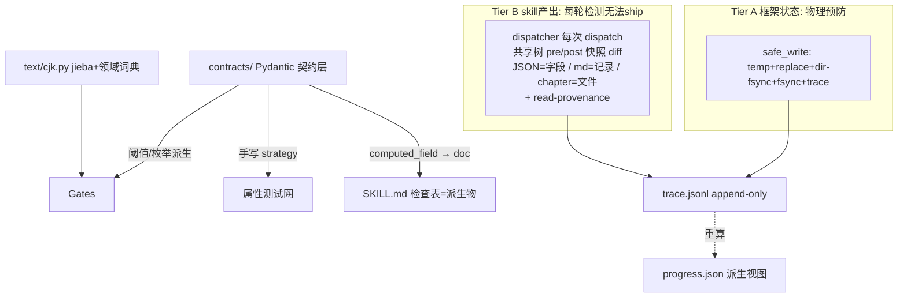

# 契约单源架构设计（Contract Single Source of Truth）v4

**状态**：草案待审阅（v4；评分轨迹 7→7.5→8.0→目标 9+）
**日期**：2026-06-29
**关联**：全项目批判性审核（13 路并行，整体 74/100）；spec 第 1/2/3 轮独立审核

## v4 修订摘要

**第 3 轮 8.0/10。核心未达 9：spec 反复声称「用真实代码核对」，却在两个最具体的字段事实上错了——字段名 `status` vs 真实的 `state`，字段分工与权威声明相反。v4 用 fixture 亲手核对修正，并修全部 New-A~New-I：**

- **New-A（Critical， blocker）**：v3 的 OWNERSHIP 字段名 `status` 错误。fixture（truth-pending_hooks.md:24 `state: PLANTED`）+ plant 输出 schema（`state: PLANTED`）+ state-settling 漂移检测表（`hooks[].state`）全部用 `state`。v3 误信了 v2 reviewer 报告里的说法而未亲自核对——这正是本 spec 要消灭的「信任转述而非验证」。**v4 全文回退 `status`→`state`。**
- **New-B（Critical， blocker）**：v3 把 track 设为 `{status,last_reinforced,subtlety}`、state-settling 设为 `{last_reinforced}`，与**权威声明相反**。state-settling SKILL.md:109-114（track 在 SKILL.md:27 显式引用并服从）声明：state-settling 拥有 `last_reinformed` **和** `subtlety`；track **只**拥有生命周期 `state`。v3 错把 track 的 DOT flowchart step（「Update last_reinforced / subtlety」）当成了权威——这正是 prose-vs-prose drift。**v4 改：track→`{state}`；state-settling→`{last_reinforced, subtlety}`。**
- **New-C（Critical， blocker）**：v3 的「merge-point 拓扑」当前代码里不存在。真相（v4 亲手核对 round-exec.sh:87 / dispatcher / phase_runner.py:199）：harness 创建**扁平** `skill-output/`（非 per-skill 子目录）；dispatcher 用 `codex exec -C $(cwd)` 无 per-skill 工作目录；**没有任何合并步骤**；`cmd_pre_score` 是 project-output 的文件存在性检查，非合并。v3 把不存在的拓扑当成现状描述。**v4 诚实重构**：Tier B = dispatcher 每次 dispatch 在**共享树**上做 pre/post 快照 diff（dispatcher 已是顺序执行，无并发）。删除「cmd_pre_score 在合并点」的假声明。
- **New-D（Important）**：N2-fact 的 resolution（lint 强制 read 声明完整性）抓不到 body prose 引用。foundation-review body L204 引用 `genre-config.tropeInventory` 但 frontmatter reads 未声明。**v4 改用运行时 read-provenance**：dispatcher 记录 skill 实际打开的文件（Capability FS shim），与声明 reads 比对。这是真闭口，不依赖脆弱的 prose grep。
- **New-E（Important）**：record parser 是新的未验证信任面。**v4 加成功判据 12**：每个注册 parser 必须有「parse→serialize round-trip == original」属性测试 + golden-parse 回归。
- **New-F（Important）**：pending_hooks.md 有**双重表示**（`## 活跃伏笔` markdown 表 + `## hooks` YAML block，均按 id）。v3 没说哪个权威。**v4 声明 YAML block 为权威**，markdown 表为派生视图（与 progress.json 同模式）；cross-section drift 由 record parser 检测（parse YAML + 校验表与 YAML 一致）。
- **New-G（Minor）**：COMPACTION 链对迁移 round 的锚未定义。**v4：LEGACY_MIGRATION 作为合法链锚**（`prev_compaction_seq` 可指向 LEGACY_MIGRATION.seq 或 null=创世）。
- **New-H（Minor）**：「block delete-recreate」已知边界措辞纠正：实际残留是「record_field 权限是 per-skill-per-file 而非 per-individual-record」，故 skill 可重写其声明集合内所有记录的字段（这是值正确性问题，不在 Tier B 所有权范围）。
- **New-I（Minor， bonus）**：`executor.py:39-43` 的 `derive_file_type` 只列 3 个 truth skills，漏 foreshadowing-resolve，导致 G2 把 resolve 的 truth 输出当 chapter 验证。**v4 在门改造节加一条**：迁移时修复 derive_file_type 的 truth skill 清单（从 REGISTRY 派生，非硬编码）。

**第 1+2 轮已修且第 3 轮复核为 FIXED 的，v4 保留**：C1（取代 contract.py + bootstrap 顺序 + writes/updates 区分）、I4（强度表一致）、I5（AST lint 判据）、I7（结构性发现收窄）、I6/N4（compaction 链）、I6/N5（前向不兼容）、N1（记录级粒度）、N3（拓扑——v4 进一步修正为真实拓扑）、N6（staging future work）、N7（extra=ignore）、N8（hypothesis-jsonschema 可选）、N9（allowlist 仅 safe_write.py）、M1-M5。

## 背景与目标

### 起因

2026-06-29 全项目审核（69 skills + G0-G7 gates + dispatcher + 10 skill_utils + 测试/CI/文档）13 路并行，整体 74/100。**元根因：凡框架需要确定性的地方，它都在信任散文而非强制类型化契约。** 五条结构性根因：

1. **散文是真理之源**：SKILL.md 不变量/阈值/schema/词汇/生命周期/所有权是自然语言，gates/helpers 另一人重实现必漂移。
2. **溯源非一等公民**：agent_id/评分者/写所有权/门历史全部隐式。
3. **测输出不测不变量**：单测测 f(x)==y；属性测试只覆盖 gates。
4. **CJK 无一等工具**：每个文本操作用正则默认值，假设空白边界。
5. **纯度/原子是散文**：「门必须纯」「progress 单写者」是 AGENTS.md 散文，无类型/lint/测试验证。

### 目标（与范围对齐）

1. 彻底修复五条根因。
2. **每个结构性审核发现闭环**且可追溯；内容/伦理发现（anti-detect）单独追踪不阻塞。
3. workflow 级独立 agent 自评 ≥ 9/10。
4. 漂移对**框架可触及状态物理预防**；对 **skill 产出每轮检测无法 ship**。诚实区分两层。

### 非目标

- 不改领域范围；不替换 Python 类型化栈；不引入非 Python 运行时；不做 skill 内容领域性改写。
- **anti-detect 的 scope/disclosure 不在本 spec**（单独追踪）。
- **staging 真预防路线图是 future work**，本 spec 不设计其调度/进度门。

## 取代现有 contract.py（C1 修复，v3/v4 修正顺序）

`src/shenbi/contract.py` 已存在：`Contract` TypedDict（kind/reads/**writes**/**updates**/read_fields）、`OutputKind`、REGISTRY（`docs/framework/truth-files.yaml`）、schema+registry 校验、`load_contract`、loader-uniqueness lint，以及 `sync_contracts.py`/`lint_contracts.py`/`migrate_contract_to_frontmatter.py`/`tests/unit/contract/`。

### 概念迁移映射（恢复 writes/updates 区分）

| 现有 | 新 | 动作 |
|---|---|---|
| `Contract` TypedDict | `contracts/skills/<name>.py` Pydantic 模型 | TypedDict→Pydantic |
| `writes`（创建）/`updates`（就地改） | 保留两语义，映射 OWNERSHIP `write`(新) vs `update`(改已有) | v2 丢，v3/v4 恢复 |
| `read_fields`（读侧） | 与新 OWNERSHIP write 侧合并为双向矩阵 | 单一矩阵 |
| `OutputKind` | `contracts/enums.py` | 合并枚举 |
| REGISTRY（truth-files.yaml） | `contracts/REGISTRY`（自动发现）；过渡期从 truth-files.yaml bootstrap | 单一源 |
| `load_contract` + loader-uniqueness lint | 保留扩展为 `load_skill_contract` | lint 强化 |
| 4 个 contract 工具 | 重定向到 `contracts/` | 顺序见下 |

### 迁移顺序（v3 修正可行性，v4 保留）

1. 立 contracts/ + enums + REGISTRY；迁移 1 技能验证全管线。
2. **contracts/REGISTRY 过渡期从 truth-files.yaml bootstrap**（而非纯自动发现），保证未迁移技能仍被 4 工具消费。
3. 合并 read_fields + 新 OWNERSHIP 为单一矩阵（含 write/update 区分）。
4. 重定向 4 工具到 contracts/REGISTRY（此时已含全词汇）。
5. contract.py 的 REGISTRY 改从 contracts/REGISTRY 派生。
6. 全部迁移后删 contract.py（保留 load_contract 薄转发直到调用方切换）。

**命名**：包 `contracts/`（复数）；单数 `contract.py` 迁移完成时删除，不长期共存。

## 总体架构：契约单源

### 强制强度诚实分层（I4 修复，全表一致）

| 强度 | 适用 | 机制 |
|---|---|---|
| **物理预防** | 生成的文档；`@computed_field` 派生量；类型化枚举；自动 REGISTRY | 派生只读/文档从契约生成/枚举全栈唯一/注册表自动发现 |
| **无法 CI 落地** | 魔法数阈值；门纯度（G1/G7 副作用）；未声明写入；不变量违反 | ruff AST lint + 属性测试 CI 门 |
| **每轮检测无法 ship** | skill 产出所有权越权（记录级）；生命周期非法转移；未声明读取 | dispatcher 后置所有权审计 + 运行时 read-provenance（Tier B） |

### 架构总图



### 六支柱 ↔ 五根因

| 根因 | 支柱 | 强度 |
|---|---|---|
| 一 散文是真理之源 | 契约层 + 文档派生 | 物理预防（文档生成）+ 无法 CI 落地（阈值 lint） |
| 二 溯源非一等公民 | trace + 两层所有权 + read-provenance | Tier A 预防 / Tier B 每轮检测 |
| 三 测输出不测不变量 | 属性测试网 | 无法 CI 落地（属性测试门） |
| 四 CJK 无一等工具 | 集中 cjk.py | 无法 CI 落地（lint 禁自实现 + 属性测试） |
| 五 纯度/原子是散文 | PureInput + safe_write + lint | Tier A 物理预防（框架状态）/ 无法 CI 落地（门纯度） |

### 已定承重决策（不变）

1. 契约形态：Pydantic 模型。
2. 契约边界：输出 schema + 算法不变量 + 协议契约（状态机 + 双向所有权 + 产消依赖图）。
3. 门与契约：阈值派生自契约；抽取逐技能自定义 parser；语义逻辑手写但 import 契约 + 属性测试约束。
4. 溯源：append-only trace.jsonl；progress 降级派生视图。
5. CJK：集中模块 + jieba（固定版本）+ 领域词典 + word_count 双语义。
6. 纯度/原子：类型层 PureInput + safe_write + AST lint + 运行时 capability FS shim。

## 支柱一：契约层（src/shenbi/contracts/）

### 核心设计原则（I2/M1/N7 修复）

1. **派生量用 `@computed_field`（非 @property）**：保证 model_dump() 不丢（M1）。
2. **单字段约束编译期拒收（类型层）**：Field(ge=0)、Literal 由 mypy/basedpyright 编译期拒类型错误。
3. **跨字段不变量运行时校验（`@model_validator`）**：CI 门，非编译期（I2）。
4. **数值阈值是具名模块常量**，门 import，ruff 禁裸魔法数。
5. **`extra="ignore"` 前提显式声明**（N7）：含 computed_field 的模型显式设 `model_config={"extra":"ignore"}`；lint 禁对含 computed_field 的模型设 `extra="forbid"`。

### foreshadowing_resolve CP 算术错误根治

```python
from pydantic import BaseModel, Field, model_validator, computed_field
from typing import Literal
CPZone = Literal["GREEN","ORANGE","RED"]
CP_THRESHOLDS = {"GREEN_MAX":50,"RED_NOW":100,"FORCE_NEXT_CHAPTER":200}
class HookCP(BaseModel):
    model_config = {"extra": "ignore"}
    hook_id: str
    cp: int = Field(ge=0)
    last_reinforced: int = Field(ge=1)
    current_chapter: int = Field(ge=1)
    @computed_field
    @property
    def zone(self) -> CPZone: ...
class ResolveReport(BaseModel):
    model_config = {"extra": "ignore"}
    hooks: list[HookCP]
    debt_level: Literal["GREEN","ORANGE","RED"]
    @model_validator(mode="after")
    def _debt_consistent(self): ...  # debt == max cp zone
    @model_validator(mode="after")
    def _hook_cp_single_value(self): ...
```

### 写所有权矩阵（v4 用 fixture 亲手核对重写，New-A/New-B 修复）

**v4 关键修正（亲手核对 fixture + 权威声明，不再信转述）**：
- 字段名是 **`state`**（fixture truth-pending_hooks.md:24 `state: PLANTED`；plant 输出 schema `state: PLANTED`；state-settling 漂移表 `hooks[].state`）。
- 字段分工以 **state-settling SKILL.md:109-114 的权威声明**为准（track SKILL.md:27 显式服从）：track 拥有生命周期 `state`；state-settling 拥有 `last_reinforced` **和** `subtlety`。

```python
# contracts/ownership.py
# 粒度由文件格式决定（N1）：JSON→field；markdown truth→record；chapter/report→file
# 字段名以 fixture 为准（v4 亲手核对，非转述）
OWNERSHIP: dict[tuple[str,str], dict] = {
    ("shenbi-genre-config", "genre-config.json"): {
        "level": "field",
        "write": {"title","genre","language","state","target_words","target_word_count",
                  "approval","fatigueWords","chapter_word","tropeInventory"},
        # 注意：genre-config.json 的顶层 status 字段这里用 state——以 fixture 为准
    },
    # foundation-review 读 tropeInventory（body L204 + match_tropes.py:59 消费），
    # 但其 contract reads 未声明 genre-config.json → under-declaration。
    # 真正闭口见 N2-fact（运行时 read-provenance），不是 lint grep body。
    ("shenbi-foundation-review", "genre-config.json"):
        {"level":"field", "read":{"tropeInventory"}, "write": set()},
    # pending_hooks.md 是 markdown，record 级。真实四写者（fixture + SKILL.md 核对）。
    ("shenbi-foreshadowing-plant", "truth/pending_hooks.md"): {
        "level": "record_create",
        "write_keys_new_record": {"id","state","operation","type","dimension","content",
                                  "subtlety","plant_chapter","cultivation_interval",
                                  "last_reinforced","max_distance","escalation_curve",
                                  "depends_on","core_hook","promoted"},
        # 字段集以 plant 输出 schema（SKILL.md:75-91）为准
    },
    # track：唯一推进生命周期 state（权威声明 SKILL.md:109-114 + track:27 服从）
    ("shenbi-foreshadowing-track", "truth/pending_hooks.md"): {
        "level": "record_field",
        "write_keys_existing_record": {"state"},  # 仅 state；last_reinforced/subtlety 归 state-settling
    },
    ("shenbi-foreshadowing-resolve", "truth/pending_hooks.md"): {
        "level": "record_field",
        "write_keys_existing_record": {"state"},  # 仅推进 state→RESOLVED
    },
    # state-settling：拥有 last_reinforced 和 subtlety（权威声明，v3 错误剥夺 subtlety）
    ("shenbi-state-settling", "truth/pending_hooks.md"): {
        "level": "record_field",
        "write_keys_existing_record": {"last_reinforced", "subtlety"},  # v4 修正
    },
}
```

**N2-fact：tropeInventory 产消真相 + 真正闭口（v4 改用运行时 read-provenance，New-D 修复）**：
- 生产者：`shenbi-genre-config` 写 genre-config.json.tropeInventory。
- 消费者：foundation-review body（L204）+ match_tropes.py:59 + fixture。
- **冲突**：foundation-review 的 frontmatter reads 未声明 genre-config.json，但 body 引用 tropeInventory。
- **v4 真正闭口**：不用 lint grep body prose（抓不到，New-D）。改用**运行时 read-provenance**——dispatcher 给 skill 注入 capability FS shim，记录 skill 实际 open 的文件；dispatch 后比对「实际读取集 ⊆ 声明 reads」。foundation-review 实际读了 genre-config.json 但未声明 → Tier B 检出 → ship 失败。这是真闭口，不依赖脆弱 prose 解析。

### pending_hooks.md 双重表示（New-F 修复）

真实 fixture 同时维护两份：`## 活跃伏笔` markdown 表（按 Hook ID）+ `## hooks` YAML block（按 id）。**v4 声明**：
- **YAML block 为权威源**（机器读写目标，与 progress.json 同「派生视图」哲学）。
- markdown 表为**派生视图**，由 record parser 从 YAML 生成。
- record parser 必须检测 cross-section drift（parse YAML + 校验表行与 YAML 一致），不一致 → Tier B fail。

### 生命周期状态机（收 ARCHIVED 未定义、所有权混乱）

```python
FORESHADOWING_TRANSITIONS = {
    PLANTED:   ({RELEVANT},  "shenbi-foreshadowing-track"),
    RELEVANT:  ({TRIGGERED}, "shenbi-foreshadowing-track"),
    TRIGGERED: ({RESOLVED},  "shenbi-foreshadowing-resolve"),
    RESOLVED:  ({ARCHIVED},  "shenbi-foreshadowing-track"),
}
```

### 自动注册表（收三表漂移）

contracts/REGISTRY 自动发现（过渡期 truth-files.yaml bootstrap）。

## 支柱二：门的阈值派生与抽取（I3 修复，v4 加 New-I）

门阈值从契约派生；抽取逐技能自定义 parser 注册在契约旁。

### 阈值派生（无手写魔法数）

门 import 契约具名常量与枚举（ruff SHB001 禁裸魔法数/字符串词）。

### 逐技能抽取器

每契约配 `parse_<kind>(text) -> dict`，注册在 `contracts/skills/<name>_parser.py`，与模型同源。

### 其他门改造（v4 加 derive_file_type 修复 New-I）

- G3.4 fail-closed + 读 trace。
- G5/G6 顶层 jload 加守卫，G6.12 用 cjk.find_terms。
- G1/G7 删写副作用。
- G0 覆盖率从 REGISTRY 派生。
- **`derive_file_type`（executor.py:39-43）从 REGISTRY 派生 truth skill 清单，非硬编码**（New-I）：当前硬编码只列 3 个 truth skills 漏 resolve，导致 G2 把 resolve 的 truth 输出当 chapter 验证。

## 支柱三：CJK 工具包（src/shenbi/text/cjk.py）

全框架唯一文本操作真理之源（ruff SHB003 禁自实现）。
- `find_terms`：CJK 边界词项查找（治 G6.12 + 过渡词误判）。
- `count_punctuation`：多字符标点整体计数（治破折号双重计数）。
- `count_words(mode)`：双语义字数（治 length-normalizing 偏差）。
- `tokenize`：分词 + 词性标注。

### 分词引擎（M2 修复）

jieba + 领域词典（从契约层 tropeInventory/worldbuilding 自动派生）。版本固定；冻结分词属性测试；纯 Python wheel。

## 支柱四：事件溯源与两层所有权强制（C2 + N1/N3/New-C/D/E/F 修复）

### Tier A — 框架状态：物理预防

适用：progress.json、trace.jsonl、gate markers、summary.json（只被框架代码写）。
- safe_write 唯一入口：temp + os.replace + 目录 fsync + 文件 fsync（I6a）+ fcntl.flock（+ 回退锁文件 M5）+ trace 追加。
- ruff AST lint 禁 `src/shenbi/`（除 safe_write.py）用任何 FS 变更原语。

### Tier B — skill 产出：每轮检测，无法 ship（v4 修正 New-C 真实拓扑）

适用：genre-config.json、truth/*、chapters/*、reports/*。由 LLM agent 在 dispatch 期间直接写。
- **无法在写入时预防**（LLM 不经过框架 API）。

**v4 关键修正（New-C）：用真实拓扑，不虚构 merge point。**

真相（v4 亲手核对 round-exec.sh:87 / dispatcher / phase_runner.py:199）：
- harness 创建**扁平** `skill-output/`（非 per-skill 子目录）。
- dispatcher 用 `codex exec -C $(cwd)`，无 per-skill 工作目录。
- **当前无任何合并步骤**；`cmd_pre_score`（phase_runner.py:191-215）是 project-output 的文件存在性检查，非合并。

**v4 Tier B 机制（基于真实顺序执行拓扑）**：dispatcher 本身是顺序的（一次一个 skill）。每次 dispatch：
1. dispatch 前：dispatcher 对**共享工作树**（cwd / project-output）做快照（pre）。
2. dispatch skill（skill 在共享树直接写）。
3. dispatch 后：dispatcher 对共享树做快照（post）。
4. Tier B 审计 diff post − pre，按粒度表判定每个变更文件越权。
5. 同时 read-provenance：capability FS shim 记录 skill 实际 open 的文件，比对声明 reads（New-D）。
6. 任一违反 → 记 trace GATE_FAIL → tier advance 前 G6/G7 复检拦截 → **无法 ship**。

**为何顺序执行够用**：dispatcher 一次只跑一个 skill（无并发），故 pre/post 快照 diff 精确归因到该 skill。不需要 per-skill 隔离或合并点。未来若引入并发 dispatch，需升级为 per-skill 隔离（staging 路线图）。

**审计粒度按文件格式分（N1）**：

| 文件格式 | 审计粒度 | 能检出 | 已知边界（诚实声明） |
|---|---|---|---|
| JSON（genre-config.json） | 字段级 | 哪个 key 被改 | — |
| markdown truth（pending_hooks.md，YAML block 权威） | 记录级 | 新增/删除/修改了哪些记录（按 id）；某 skill 是否动了不属它的记录；记录数异常；cross-section drift（YAML vs 派生表） | record_field 权限是 per-skill-per-file 而非 per-individual-record，故 skill 可重写其声明集合内所有记录字段（值正确性问题，不在 Tier B 所有权范围——New-H 修正措辞）|
| chapters/reports | 文件级 | 文件是否在声明 writes 内 | 不审内容字段 |

**markdown 记录级审计机制**：dispatcher 用契约旁注册的 record parser 把 YAML block 解析成 list[Record]（每条带稳定 id）；pre vs post 按页对齐，产出 {added, removed, modified:[{id, changed_keys}]}；断言 added 键 ⊆ write_keys_new_record，modified changed_keys ⊆ write_keys_existing_record，removed 须声明有权删（默认无权）；有 state 字段额外查转移表。

**record parser 验证（New-E 修复，判据 12）**：每个注册 parser 必须有「parse→serialize round-trip == original」属性测试 + golden-parse 回归。parser 不再是未验证信任面。

**诚实表述**：记录级已知边界（per-skill-per-file 而非 per-record）记入风险表，不假装物理预防。staging 路线图（future work）才是真预防。

### 通往真预防的路线图（staging，future work，不支撑强度声明——N6）

明确 future work。本 spec 不设计其调度/进度门。

### 事件模型（溯源一等公民）

```python
class TraceEvent(BaseModel):
    seq: int
    ts: datetime
    actor: str
    actor_role: ActorRole
    action: str
    target: str
    skill: str | None = None
    gate: str | None = None
    signature: str
    payload: dict
    schema_version: int
    model_config = {"frozen": True}
```

### trace.jsonl 完整性（I6 + N4/N5 + New-G）

- **目录 fsync（I6a）**：首次创建对父目录 fsync。
- **torn-line 恢复（I6b）**：replay 逐行校验，首条失败截断到上一条 good 行。
- **compaction 设计（I6b + N4 + New-G 链锚）**：compaction = 在 `trace.compact.jsonl` 写 COMPACTION 事件，链式 `prev_compaction_seq`，含快照 + `truncated_at_seq`。**LEGACY_MIGRATION 作为合法链锚**（`prev_compaction_seq` 可指向 LEGACY_MIGRATION.seq 或 null=创世，New-G 修复）。G7 审计：读最近 COMPACTION 快照 + 验证「截断点之后首 seq == truncated_at_seq+1」+ 「COMPACTION 链单调无缺口」+ 重算快照后文件签名。三重校验。
- **事件版本化（I6c + N5）**：未知更高版本→fail；schema_version 单调非递减；旧→新走迁移函数；CI 跑历史版本重放矩阵。
- **在飞 round 迁移（I6d）**：无 trace.jsonl 的旧 round，迁移脚本生成 LEGACY_MIGRATION 事件（从 progress.json 反推 actor="legacy"）+ 文件签名快照。

### progress.json 降级为派生视图

`materialize_progress` 从 trace 重算 + safe_write（Tier A）。

### G7 篡改审计（只读 trace）

G7 回归纯函数：读 trace 签名 + 重算文件哈希 + 读 compaction 快照 + 验证 COMPACTION 链（含 LEGACY_MIGRATION 锚）。

## 支柱五：属性测试网（I1 修复，N8 hypothesis-jsonschema 可选）

### 纠正：跨字段不变量需手写 strategy

`@model_validator(mode="after")` 跨字段约束不在 JSON Schema。
- **单字段约束**：默认 plain hypothesis strategy（`st.integers(min_value=0)`），无依赖。hypothesis-jsonschema 仅可选便利（N8）。
- **跨字段不变量**：手写 strategy，先造合法 hooks 再推 debt。

### 算术 bug 全覆盖（手写 strategy）

P50==median / 标点 count==text.count(token) / drift 排除不泄漏 / 熵 sum==1 / volume_decline 持续下降必触发 / G6.12 CJK 内嵌必检出 / G3.4 无 SCORE 必 fail / 门纯度 / 三表一致 / jieba 冻结分词。

### 纯度运行时兜底

capability FS shim：测试时给门注入只读 FS 句柄。

## 支柱六：文档派生

SKILL.md「可自动检查」表从契约模型自动生成。`@computed_field` 保证派生量进入文档。改契约→文档自动变；手改被 CI 拒绝。**物理预防**。

### 严重性词 vs 评分标尺（M3）

- 严重性词分裂→enums.py。
- 评分标尺未定义→score-arc/stratum/volume Report 必须显式声明聚合公式 + PASS_THRESHOLD。

## 审核发现 → 根因 → 支柱 追溯矩阵（v4 强度对齐）

| 审核 Top 缺陷 | 根因 | 支柱 | 强度 |
|---|---|---|---|
| G3.4 空转 | 二 | 四 | 每轮检测无法 ship |
| G6.12 中文敏感词失效 | 四 | 三 | 无法 CI 落地 |
| progress.json 非原子写 | 三/五 | 四 Tier A | 物理预防 |
| SKILL↔gate 契约漂移 | 一 | 一/二 | 无法 CI 落地 |
| compute_stats/drift 算术错误 | 三 | 五 | 无法 CI 落地 |
| score_* 三连复制 | 一 | 二 | 无法 CI 落地 |
| 三表登记漂移 | 一 | 一 | 物理预防（自动 REGISTRY） |
| tropeInventory 产消冲突 | 一 | 一 + 四 Tier B（read-provenance） | 无法 CI 落地（声明）+ 每轮检测（实际读） |
| 伏笔 CP 算术/示例错误 | 一 | 一 | 物理预防（computed_field） |
| 严重性词汇分裂 | 一 | 一 | 物理预防（enums） |
| 评分 X/10 未定义 | 一 | 一/六 | 无法 CI 落地（另案） |
| G1 写 .bak / G7 改 summary | 五 | 二/四 | 无法 CI 落地（AST lint） |
| gate 顶层 jload crash | 三/五 | 二 | 无法 CI 落地 |
| derive_file_type 漏 resolve（New-I） | 一 | 二 | 无法 CI 落地（REGISTRY 派生） |
| 破折号双重计数 | 四 | 三 | 无法 CI 落地 |
| word_count CJK-only 偏差 | 四 | 三 | 无法 CI 落地 |
| drift 排除泄漏 / 熵不归一 / P50≠median | 三 | 五 | 无法 CI 落地 |
| review 大量无专用 gate | 一 | 二 | 无法 CI 落地 |
| contract.py 已存在被忽略 | （方法论） | 取代节 | 迁移映射 |
| anti-detect 伦理缺口 | 内容层 | 不在本 spec | 单独追踪 |

## 实现顺序（高杠杆优先）

1. **契约层骨架 + 取代 contract.py 映射**：contracts/REGISTRY 过渡期 truth-files.yaml bootstrap；恢复 writes/updates；迁移 4 工具；删 contract.py。
2. **CJK 工具包 + 固定 jieba + 属性测试**：独立、可并行。
3. **Tier A：trace.jsonl + safe_write + progress 降级**：含目录 fsync/torn-line/版本化/在飞迁移。
4. **Tier B：dispatcher 后置所有权审计 + read-provenance**：依赖 OWNERSHIP（支柱一）+ trace（Tier A）+ record parser（含 round-trip 属性测试）+ capability FS shim。基于真实顺序执行拓扑（无虚构 merge point）。
5. **门阈值派生化 + 逐技能 parser + derive_file_type 修复 + G3.4/G5/G6/G7 改造**。
6. **文档派生 + ruff AST lint + capability FS shim**。
7. **属性测试网全面铺开**。

**部分强制窗口（M4）**：「完全迁移」= 69/69 技能有 Pydantic 模型 + OWNERSHIP + parser；CI「未迁移清单为空」断言锁定。

## 风险与缓解

| 风险 | 缓解 |
|---|---|
| 69 契约迁移工作量大 | 不考虑成本；逐技能可并行 |
| jieba 运行时依赖 + 分词漂移 | 固定版本 + 冻结分词属性测试（M2） |
| trace.jsonl 体积 | compaction 设计保留审计历史 + 篡改边界链 + LEGACY 锚 |
| 大改引入回归 | 属性测试网 + 现有 1231 单测兜底；分步迁移每步独立审核 |
| fcntl Windows/网络 FS | CI 已 ubuntu/macos；加回退锁文件（M5） |
| Tier B 记录级 per-skill-per-file 边界 | 诚实声明（New-H）；staging 路线图是真预防（future work） |
| contract.py 双源 | 取代节明确迁移顺序 + bootstrap，最终删除 |
| 跨字段不变量测试生成难 | 手写 strategy（I1），hypothesis-jsonschema 仅可选（N8） |
| computed_field round-trip | 显式 extra="ignore" + lint 禁 forbid（N7） |
| record parser 信任面 | round-trip 属性测试 + golden-parse 回归（判据 12，New-E） |
| body prose 引用未声明 read | 运行时 read-provenance（capability FS shim），非 lint grep（New-D） |
| 顺序执行→并发 dispatch 升级 | 当前顺序够用；并发需 staging 隔离（future work） |

## 成功判据（v4，含 New-E/G/I）

1. **结构性发现闭环**：13 审核片每个*结构性*发现都有根因→支柱映射且可追溯；独立 agent 重审结构性维度均分 ≥ 9.0/10。内容/伦理发现单独追踪不阻塞。
2. workflow 级独立 agent 自评 ≥ 9.0/10。
3. `contract.py` 已删除，单一 `contracts/` 源；4 工具重定向完成。
4. **纯度强制**：AST-based lint 禁 `src/shenbi/`（除 safe_write.py）用任何 FS 变更原语；allowlist 仅 safe_write.py。运行时 capability FS shim 兜底。
5. 三份门登记表从单一源派生，diff 为空。
6. 属性测试 CI 必过，覆盖全部算术 bug 性质 + jieba 冻结分词。
7. trace.jsonl 完整性：目录 fsync、torn-line 恢复、compaction 保历史 + 篡改边界链 + LEGACY 锚、事件版本化 + 前向不兼容、在飞 round 迁移——各有对应测试。
8. **完全迁移**断言：69/69 技能有 Pydantic 模型 + OWNERSHIP + parser。
9. **@computed_field round-trip 前提**：契约模型显式 extra="ignore"；lint 禁 forbid。
10. **markdown 记录级审计边界已知**：per-skill-per-file（非 per-record），记入风险表，不假装物理预防。
11. **事件版本前向不兼容 + compaction 链**：CI 跑「未知更高版本→fail」「COMPACTION 链单调无缺口（含 LEGACY 锚）」「截断点连续」回归。
12. **record parser 正确性（New-E）**：每个注册 parser 有「parse→serialize round-trip == original」属性测试 + golden-parse 回归；cross-section drift（YAML vs 派生表）检测。
13. **read-provenance（New-D）**：capability FS shim 记录 skill 实际 open 的文件；Tier B 比对声明 reads；未声明实际读 → ship 失败。

## v3→v4 变更日志（round-3 审核逐条闭环）

| round-3 发现 | 状态 | v4 处置 |
|---|---|---|
| New-A（字段名 status 错） | FIXED | 亲手核对 fixture，全文回退 `status`→`state` |
| New-B（track/state-settling 分工反） | FIXED | 以 state-settling SKILL.md:109-114 权威声明为准：track={state}，state-settling={last_reinforced, subtlety} |
| New-C（merge-point 拓扑不存在） | FIXED | 用真实顺序执行拓扑（共享树 pre/post diff），删虚构 merge point |
| New-D（lint 抓不到 body prose） | FIXED | 改用运行时 read-provenance（capability FS shim） |
| New-E（record parser 未验证） | FIXED | 判据 12：round-trip 属性测试 + golden-parse 回归 |
| New-F（双重表示未声明权威） | FIXED | YAML block 权威，markdown 表派生，parser 检测 drift |
| New-G（COMPACTION 链锚） | FIXED | LEGACY_MIGRATION 作合法链锚 |
| New-H（block 边界措辞） | FIXED | 改为 per-skill-per-file 边界（值正确性问题，非所有权） |
| New-I（derive_file_type 漏 resolve） | FIXED | 从 REGISTRY 派生 truth skill 清单，加追溯矩阵行 |
