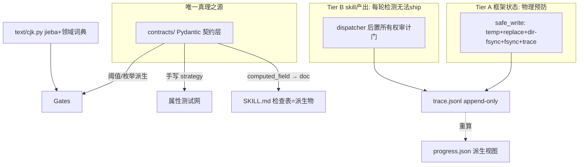

# 契约单源架构设计（Contract Single Source of Truth）v2

**状态**：草案待审阅（v2，已吸纳第 1 轮独立审核全部 12 条发现）
**日期**：2026-06-29
**关联**：2026-06-29 全项目批判性审核（13 路并行 agent，整体 74/100）；第 1 轮 spec 独立审核 7/10

## v2 修订摘要（对应第 1 轮审核发现）

- **C1**：新增「取代现有 contract.py」节，给出迁移映射与删除顺序。原 spec 忽略了已存在的 TypedDict 契约层。
- **C2（最关键）**：诚实拆分两层强制。框架状态（progress/trace/summary）由 safe_write 真正预防；skill 产出（LLM 直接写的 genre-config/truth/chapters）无法在写入时拦截，改为 dispatcher 边界的「所有权审计门」每轮检测，越权无法 ship。原 spec 对 skill 产出声称的「写入时拦截」是错的。
- **I1**：纠正属性测试声明。跨字段 `@model_validator` 不在 JSON Schema，hypothesis-jsonschema 无法生成满足它的输入；跨字段不变量需手写 strategy。hypothesis-jsonschema 列为新增依赖（仅用于单字段约束）。
- **I2**：纠正「编译期拒收」事实错误。`@model_validator` 是运行时校验；mypy/basedpyright 只在编译期拒收类型错误。措辞改为「校验时/CI 门」，编译期仅保留给类型层（Literal/Field ge）。
- **I3**：纠正「结构层零代码生成 / 一行做完全部检查」。markdown 输出（章节、报告）需要逐技能的解析器。改为「阈值从契约派生，抽取仍需自定义 parser 注册在契约旁」。删除「净代码量下降」的错误声明。
- **I4**：全文诚实化「物理不可能」措辞。只有少数机制配得上：生成的文档、`@computed_field` 派生量、类型化枚举。其余是「无法在 CI 落地而不覆盖检查」——强，但不是物理不可能。
- **I5**：修复会放过自身旗舰 bug 的成功判据。改用 AST-based lint 禁止全部 FS 变更原语 + 运行时 capability FS shim。
- **I6**：trace.jsonl 补全：目录 fsync、torn-line 恢复、compaction 设计（保留 G7 审计所需历史）、事件版本化、在飞 round 迁移。
- **I7**：将「每个 skill 9+」收窄为「每个结构性发现闭环；内容/伦理发现单独追踪」。anti-detect 伦理明确不在本 spec。
- **M1-M5**：`@computed_field`（非 @property）保证序列化；jieba 版本固定 + 冻结分词属性测试；区分严重性词分裂（enums）与未定义评分标尺（另案）；承认部分强制窗口 + 定义「完全迁移」；fcntl + 回退锁文件。

## 背景与目标

### 起因

2026-06-29 对 shenbi 全项目（69 skills + G0–G7 gates + dispatcher + 10 skill_utils + 测试/CI/文档）做了 13 路并行高精度批判性审核，整体 74/100。审核在几乎每个审核片反复发现同一类问题：**凡是框架需要确定性的地方，它都在信任散文（自己的、和 skills 的），而它本该强制类型化契约。**

### 五条结构性根因

1. **散文是真理之源，不是机器可读契约。** SKILL.md 里的「可自动检查不变量、数值阈值、输出 schema、严重性词汇、生命周期状态、字段所有权」都是自然语言。gates 和 helpers 是另一个人根据散文重新实现一遍的代码，必然漂移。
2. **溯源（provenance）不是一等公民。** agent_id、评分者身份、写入所有权、门执行历史全部隐式。
3. **测试验证输出，不验证不变量。** 单元测试测 `f(x)==y`；属性测试只覆盖 gates。
4. **框架主语言（CJK）没有一等工具包。** 每个文本操作用 Python 正则默认值，假设空白边界。
5. **纯度和崩溃安全是写下的规矩，不是强制的契约。**

**元根因**：凡是框架需要确定性的地方，它都在信任散文而非强制类型化契约。

### 目标（v2 已与范围对齐）

1. 彻底修复五条根因。
2. **每个结构性审核发现闭环**，可追溯；内容/伦理发现（如 anti-detect 范围条款）单独追踪，不阻塞本 spec。
3. 整个 skill workflow 配合使用达到最优；workflow 级独立 agent 自评达 9/10 以上。
4. 漂移对**框架可触及的状态**物理不可能；对 **skill 产出**无法 ship（每轮门检测）。诚实区分两层。

### 非目标

- 不改变领域范围（仍是 LLM 驱动中文小说框架）。
- 不替换 Python 类型化栈（mypy strict / basedpyright）。
- 不引入非 Python 运行时（pathlib + json + jsonl）。
- 不做 skill 内容的领域性改写（只做结构性/契约性修复）。
- **anti-detect 的 scope/disclosure 条款不在本 spec**（单独追踪）。

## 取代现有 contract.py（C1 修复）

`src/shenbi/contract.py` 已存在：`Contract` TypedDict（kind/reads/writes/updates/read_fields）、`OutputKind` 枚举、`REGISTRY`（`docs/framework/truth-files.yaml`）、schema + registry 校验、`load_contract` 加载器、loader-uniqueness lint，以及 `sync_contracts.py`、`tools/lint_contracts.py`、`tools/migrate_contract_to_frontmatter.py`、`tests/unit/contract/`。原 spec 忽略了它，会制造第三个真理之源。

### 概念迁移映射

| 现有（contract.py） | 新（contracts/） | 迁移动作 |
|---|---|---|
| `Contract` TypedDict | `contracts/skills/<name>.py` 的 Pydantic 模型 | TypedDict→Pydantic；字段类型化升级 |
| `read_fields`（读侧） | 与 `WRITE_OWNERSHIP` 合并为双向所有权矩阵 | 读字段 + 写字段合一，单一矩阵 |
| `OutputKind` 枚举 | `contracts/enums.py`（与 Severity/Verdict/CPZone 同栈） | 合并到单一枚举模块 |
| `REGISTRY`（truth-files.yaml） | `contracts/REGISTRY`（自动发现）+ truth-files.yaml 降级为派生物 | 单一自动注册表 |
| `load_contract` + loader-uniqueness lint | 保留并扩展为 `load_skill_contract`（读 frontmatter + 加载 Pydantic 模型） | lint 保留并强化 |
| `sync_contracts.py` / `lint_contracts.py` / `migrate_*` | 改为消费 `contracts/` 单源 | 重定向到新源 |

### 迁移顺序

1. 新建 `contracts/` 包，把 contract.py 的 TypedDict 逐技能升级为 Pydantic（先迁移 1 个技能验证管线）。
2. 合并 `read_fields` + 新 `WRITE_OWNERSHIP` 为单一矩阵。
3. 重定向 4 个 contract 相关工具到 `contracts/`。
4. `contract.py` 的 REGISTRY 改为从 `contracts/REGISTRY` 派生。
5. 全部技能迁移后，删除 `contract.py`（保留 `load_contract` 为薄转发直到调用方切换）。

**命名**：包用 `contracts/`（复数，承载多技能模型）；现有单数 `contract.py` 在迁移完成时删除，避免长期共存。

## 总体架构：契约单源

**一句话定性**：凡框架需要确定性的地方，都不再信任散文，而是从一份类型化契约派生 gates、helpers、文档、溯源。

### 强制强度诚实分层（I4 修复）

本 spec 严格区分三种强制强度，不再滥用「物理不可能」：

| 强度 | 适用 | 机制 |
|---|---|---|
| **物理不可能**（真正的结构性预防） | 生成的文档；`@computed_field` 派生量；类型化枚举 | 派生量只读、文档从契约生成、枚举全栈唯一 |
| **无法在 CI 落地**（强检测，需显式覆盖才放过） | 魔法数阈值；纯度；未声明写入；不变量违反 | ruff AST lint + 属性测试 CI 门 |
| **每轮检测，无法 ship**（轮次边界检测） | skill 产出的所有权越权；生命周期非法转移 | dispatcher 后置所有权审计门（见支柱四 Tier B） |

### 架构总图



### 六支柱 ↔ 五根因

| 根因 | 支柱 | 强度 |
|---|---|---|
| 一 散文是真理之源 | 契约层 + 文档派生 | 物理不可能（文档生成）+ 无法 CI 落地（阈值 lint） |
| 二 溯源非一等公民 | trace.jsonl + 两层所有权 | Tier A 预防 / Tier B 每轮检测 |
| 三 测输出不测不变量 | 属性测试网 | 无法 CI 落地（属性测试门） |
| 四 CJK 无一等工具 | 集中 cjk.py | 无法 CI 落地（lint 禁自实现 + 属性测试） |
| 五 纯度/原子是散文 | PureInput + safe_write + lint | Tier A 物理预防（框架状态）/ 无法 CI 落地（门纯度） |

### 已定承重决策（不变）

1. 契约形态：Pydantic 模型。
2. 契约边界：输出 schema + 算法不变量 + 协议契约（状态机 + 写所有权 + 产消依赖图）。
3. 门与契约：阈值派生自契约；抽取逐技能自定义 parser；语义逻辑手写但 import 契约 + 属性测试约束。
4. 溯源：append-only trace.jsonl；progress 降级派生视图。
5. CJK：集中模块 + jieba（固定版本）+ 领域词典 + word_count 双语义。
6. 纯度/原子：类型层 PureInput + safe_write + AST lint + 运行时 capability FS shim。

## 支柱一：契约层（src/shenbi/contracts/）

### 核心设计原则（已纠正 I2/M1）

1. **派生量用 `@computed_field`（非 @property）**：保证 `model_dump()` 序列化时派生量不丢（M1 修复）。zone 从 cp、verdict 从阈值都是 computed_field，只读派生——手填的派生值与原始值矛盾这一整类 bug 物理不可能。
2. **单字段约束编译期拒收（类型层）**：`Field(ge=0)`、`Literal["RED"]` 由 mypy/basedpyright 在编译期拒绝类型错误。
3. **跨字段不变量运行时校验（`@model_validator`）**：在 `model_validate` 调用时校验。**这是 CI 门，不是编译期**（I2 修复）。措辞严格区分。
4. **数值阈值是具名模块常量**，门 import，ruff 禁裸魔法数。

### foreshadowing_resolve CP 算术错误根治

审核三错（CP=80 标 RED、hook-001 三 CP 值、>200 vs ≥100 边界不收敛）：

```python
from pydantic import BaseModel, Field, model_validator, computed_field
from typing import Literal

CPZone = Literal["GREEN", "ORANGE", "RED"]
CP_THRESHOLDS = {"GREEN_MAX": 50, "RED_NOW": 100, "FORCE_NEXT_CHAPTER": 200}

class HookCP(BaseModel):
    hook_id: str
    cp: int = Field(ge=0)  # 编译期：类型层拒负值
    last_reinforced: int = Field(ge=1)
    current_chapter: int = Field(ge=1)

    @computed_field  # M1: 序列化时不丢；只读派生，不可手填
    @property
    def zone(self) -> CPZone:
        if self.cp >= CP_THRESHOLDS["RED_NOW"]: return "RED"
        elif self.cp >= CP_THRESHOLDS["GREEN_MAX"]: return "ORANGE"
        return "GREEN"

class ResolveReport(BaseModel):
    hooks: list[HookCP]
    debt_level: Literal["GREEN", "ORANGE", "RED"]

    @model_validator(mode="after")  # 运行时校验（CI 门）
    def _debt_consistent_with_hooks(self):
        # debt 必须等于 hooks 最大 cp 的 zone —— 运行时拒收手填矛盾
        ...
    @model_validator(mode="after")
    def _hook_cp_single_value(self):
        # 同一 hook_id 单一 cp —— 运行时拒收 80/45/180
        ...
```

### 写所有权矩阵（与现有 read_fields 合并，C1 修复）

```python
# contracts/ownership.py
# (skill, file) -> {read: set[str]|None, write: set[str]|None}；None=全部
OWNERSHIP: dict[tuple[str,str], dict[str, set[str]|None]] = {
    ("shenbi-genre-config", "genre-config.json"): {
        "write": {"title","genre","language","status","target_words",
                  "approval","fatigueWords","chapter_word","tropeInventory"},
    },
    ("shenbi-foundation-review", "genre-config.json"): {"read": None, "write": set()},  # 只读
    ("shenbi-foreshadowing-plant", "truth/pending_hooks.md"): {
        "write": {"id","state","planted_chapter","max_distance","subtlety","notes"},
    },
    ("shenbi-foreshadowing-track", "truth/pending_hooks.md"):
        {"write": {"state","last_reinforced","subtlety"}},
    ("shenbi-foreshadowing-resolve", "truth/pending_hooks.md"): {"write": {"state"}},
}
```

注意：OWNERSHIP 是**声明**，落地分两层（Tier A 框架状态预防 / Tier B skill 产出每轮检测，见支柱四）。

### 生命周期状态机（收 ARCHIVED 未定义、所有权混乱）

```python
FORESHADOWING_TRANSITIONS = {
    PLANTED:   ({RELEVANT},  "shenbi-foreshadowing-track"),
    RELEVANT:  ({TRIGGERED}, "shenbi-foreshadowing-track"),
    TRIGGERED: ({RESOLVED},  "shenbi-foreshadowing-resolve"),
    RESOLVED:  ({ARCHIVED},  "shenbi-foreshadowing-track"),
}
```

### 自动注册表（收三表漂移 28/22/20）

`contracts/REGISTRY` 自动发现。G4_CHECKER_SKILLS、参数化测试、G0 覆盖率、contract.py 的 truth-files.yaml 全部从它派生。

## 支柱二：门的阈值派生与抽取（I3 修复）

**纠正**：不是「结构层零代码生成 / 一行做完全部检查」。markdown 输出（章节、报告）需要逐技能 parser。正确表述是：**门阈值从契约派生；抽取仍需自定义 parser 注册在契约旁。**

### 阈值派生（无手写魔法数）

门 import 契约的具名常量与枚举（ruff SHB001 禁裸魔法数/字符串词）：

```python
from shenbi.contracts.skills.review_arc_payoff import Report, SUB_FLOOR, PASS_THRESHOLD
from shenbi.contracts.enums import Verdict

def check(skill_name, parsed: PureReport) -> GateResult:
    report = Report.model_validate(parsed.raw)  # 运行时校验全部 schema+不变量
    if report.foreshadowing_quality < SUB_FLOOR:  # 阈值从契约
        return fail(...)
    verdict = Verdict.PASS if report.weighted_total >= PASS_THRESHOLD else Verdict.BLOCK
    return passed(...) if verdict == Verdict.PASS else fail(...)
```

### 逐技能抽取器（parser 注册在契约旁）

每个契约模型配一个 `parse_<kind>(text) -> dict`，把 markdown/json 文本转成模型能 `model_validate` 的 dict。抽取器注册在契约包内（`contracts/skills/<name>_parser.py`），与模型同源。**抽取仍是自定义代码，但阈值/枚举/不变量来自契约**——抽取器把文本结构化，契约做语义判定。

`score_arc/stratum/volume` 三连复制：三者的 Report 模型不同（维度各异），但抽取+校验骨架相同。塌缩为一个共享 `_run_structural(skill, model, parser)` + 三个薄注册。**不声称净代码量下降**（I3 修复）——69 模型 + parser + cjk + trace + safe_write + 属性测试 + doc-gen + lint 是净增长，换来的是漂移消除。

### 其他门改造

- G3.4 fail-closed + 读 trace。
- G5/G6 顶层 jload 加守卫，G6.12 用 cjk.find_terms。
- G1/G7 删写副作用：G1 的 .bak 责任移交 safe_write（Tier A）；G7 改为只读 trace 做篡改审计。门回归纯函数。
- G0 覆盖率从 REGISTRY 派生。

## 支柱三：CJK 工具包（src/shenbi/text/cjk.py）

全框架唯一文本操作真理之源（ruff SHB003 禁自实现）。

- `find_terms`：CJK 边界词项查找（治 G6.12 + 过渡词误判）。
- `count_punctuation`：多字符标点整体计数（治破折号双重计数）。
- `count_words(mode)`：双语义字数（治 length-normalizing 偏差）。
- `tokenize`：分词 + 词性标注。

### 分词引擎（M2 修复）

jieba + 领域词典（从契约层 tropeInventory/worldbuilding 自动派生）。
- **版本固定**：pyproject 锁定 `jieba==<具体版本>`，分词结果跨 run/CI 可复现。
- **冻结分词属性测试**：断言对固定语料，`tokenize` 输出逐 token 稳定（防 jieba 升级静默改变）。
- jieba 是纯 Python wheel，无二进制；首次 import ~5ms。
- 简体词典：项目默认简体中文；繁体项目需配置繁体词典（契约层 genre-config 声明）。

### 属性测试覆盖（支柱五落地）

find_terms 内嵌必检出、count_punctuation == text.count(token)、count_words(mixed) ≥ cjk_only。

## 支柱四：事件溯源与两层所有权强制（C2 修复——核心重设计）

### 两层强制模型（诚实拆分）

原 spec 错误地对 skill 产出声称「safe_write 写入时拦截」。真相：skills 是 LLM agent，直接写 genre-config.json / truth/* / chapters/*；safe_write 是框架代码，不在 LLM 写入路径。拆为两层：

#### Tier A — 框架状态：物理预防

适用：progress.json、trace.jsonl、gate markers、summary.json。这些**只被框架代码写**。
- safe_write 是唯一入口：temp + os.replace + **目录 fsync + 文件 fsync**（I6a）+ fcntl.flock（+ 回退锁文件 M5）+ trace 追加。
- ruff AST lint 禁止 `src/shenbi/`（除 safe_write.py）使用任何 FS 变更原语（见成功判据 4）。
- 崩溃安全 + 并发安全成立。

#### Tier B — skill 产出：每轮检测，无法 ship

适用：genre-config.json、truth/*、chapters/*、reports/*。由 LLM agent 在 dispatch 期间直接写。
- **无法在写入时预防**（LLM 不经过框架 API）。
- **dispatcher 是框架边界**，每个 skill 运行后做后置所有权审计：
  1. dispatcher 读 skill 契约的声明 writes/updates。
  2. dispatcher 对比 dispatch 前后的文件快照，计算实际变更字段集。
  3. 对每个变更文件，断言 `变更字段集 ⊆ OWNERSHIP[(skill,file)].write`，且文件在声明 writes 内。
  4. 生命周期字段（如 foreshadowing state）额外查转移表：转移合法且 owner==该 skill。
  5. 任一违反 → 记 trace GATE_FAIL 事件 → 轮次无法推进（tier advance 前 G6/G7 复检）。
- **诚实表述**：skill 产出越权「无法 ship 到读者/tier 推进」，不是「无法写入」。这对小说质量是真正重要的属性。

对 showcased 冲突的诚实根治：
- **tropeInventory**：foundation-review 是只读 skill（write=∅）。若它在 dispatch 中写了 genre-config.json，dispatcher 后置审计检出 → ship 失败。每轮检测，无法逃逸。
- **伏笔四写者**：track 写 id/planted_chapter（属 plant）→ 后置审计检出 → ship 失败。

### 通往 Tier B 预防的路线图（staging）

未来升级路径（本 spec 标记为 roadmap，不阻塞 9+）：skill 写到 `round/<round>/staging/<skill>/`，dispatcher 校验契约+所有权后经 safe_write commit 到真实路径。这是真预防。迁移契约：`staging: true` 的 skill 走 staging；其余走 Tier B 检测直到迁移完成。

### 事件模型（溯源一等公民）

```python
class TraceEvent(BaseModel):
    seq: int
    ts: datetime
    actor: str
    actor_role: ActorRole  # GENERATOR|SCORER|GATE|SKILL|HUMAN
    action: str            # 闭合动作词表
    target: str
    skill: str | None = None
    gate: str | None = None
    signature: str
    payload: dict
    schema_version: int    # I6c: 事件版本化
    model_config = {"frozen": True}
```

### trace.jsonl 完整性（I6 修复）

- **目录 fsync（I6a）**：首次创建 trace.jsonl 时，对父目录 `os.open(dir) + fsync`，保证 size/metadata 持久。文件已存在时无需。
- **torn-line 恢复（I6b）**：replay 逐行 `model_validate_json`；首条校验失败即截断到上一条 good 行，重写干净文件。reader 容忍最后一条残缺。
- **compaction 设计（I6b）**：compaction = 在新 `trace.compact.jsonl` 写一个 `COMPACTION` 事件（含物化快照 payload）+ 截断原文件保留从最近 N 轮起的事件。**G7 审计读 compaction 快照 + 截断后的增量**——历史不丢。compaction 是 idempotent，可重跑校验。
- **事件版本化（I6c）**：每个事件带 `schema_version`。replay 用对应版本的 model 重放；新增必填字段时旧事件走迁移函数。CI 跑「旧版本 trace 重放」回归。
- **在飞 round 迁移（I6d）**：无 trace.jsonl 的旧 round，迁移脚本生成 `LEGACY_MIGRATION` 事件（从 progress.json 反推 actor="legacy"）+ 当前文件签名快照。迁移后该 round 可正常被新管线消费。

### progress.json 降级为派生视图

`materialize_progress` 从 trace 重算 + safe_write（Tier A）。改状态只能 append 事件。

### G7 篡改审计（只读 trace）

G7 回归纯函数：读 trace 签名 + 重算文件哈希比对 + 读 compaction 快照。不再改 summary.json。

## 支柱五：属性测试网（I1 修复）

### 纠正：跨字段不变量需手写 strategy

`@model_validator(mode="after")` 跨字段约束**不在 JSON Schema**。`model_jsonschema()` 丢弃它们；`hypothesis-jsonschema` 生成的「schema 合法」数据会在 `model_validate` 时抛错。
- **单字段约束**（`Field(ge=0)`、`Literal`）：`hypothesis-jsonschema` 自动生成，免费。
- **跨字段不变量**（debt==max-cp zone、hook 单 cp）：**手写 strategy**，先构造合法 hooks 再推 debt。

hypothesis-jsonschema 列为**新增依赖**（仅用于单字段场景）。跨字段一律手写。

```python
# 跨字段：手写，先造合法 hooks 再推 debt
@given(hooks_strategy)
def test_debt_consistent(hooks):
    expected = zone_of(max(h.cp for h in hooks))
    report = ResolveReport(hooks=hooks, debt_level=expected)  # 构造合法
    assert report.debt_level == expected  # 不变量对合法输入成立

# 单字段：免费生成器
@given(from_schema(HookCP.model_json_schema()))
def test_cp_ge_0(hook_dict):
    try:
        h = HookCP.model_validate(hook_dict)
        assert h.cp >= 0  # 编译期类型已保证，属性测试兜底
    except ValueError:
        pass
```

### 算术 bug 全覆盖（手写 strategy）

| bug | 属性测试 | strategy |
|---|---|---|
| P50≠median | p50==median | 任意长度有序 int 列表 |
| 标点双重计数 | count==text.count(token) | 任意文本 + 任意多字符标点 |
| drift 排除泄漏 | 排除索引不泄漏 | 任意分数序列 + 任意排除集 |
| 熵不归一 | sum(freqs)==1.0 | 任意 pattern 列表 |
| volume_decline 漏检 | 持续下降必触发 | 任意分数序列 |
| G6.12 中文失效 | CJK 内嵌必检出 | 任意 CJK 上下文 |
| G3.4 空转 | 无 SCORE 必 fail | 任意 trace |
| 门纯度 | 任意门不修改 FS | 任意门 + 任意输入 |
| 三表漂移 | REGISTRY 唯一真理 | 注册表派生一致性 |
| jieba 冻结分词 | 固定语料逐 token 稳定 | 固定语料（M2） |

### 纯度运行时兜底

ruff AST lint 是编译期；运行时用 capability FS shim：测试时给门注入只读 FS 句柄，任意写抛 PermissionError。双保险。

## 支柱六：文档派生

SKILL.md「可自动检查」表从契约模型自动生成（扩展已有 AUTO-GENERATED 段）。`@computed_field` 保证派生量进入生成文档（M1）。改契约→文档自动变；手改被 CI 拒绝。这是**物理不可能漂移**（生成机制）。

### 严重性词 vs 评分标尺（M3 区分）

- **严重性词分裂**（BLOCKING/CRITICAL/MINOR vs error/warning）：由 `enums.py` 单一词表根治。
- **评分标尺未定义**（`评分 X/10` 与框架 0-100 标尺冲突）：**另案**。score-arc/stratum/volume 的 Report 模型必须显式声明聚合公式与 PASS_THRESHOLD（Literal/具名常量），消解未定义 /10。这是契约层的直接要求，不属于 enums。

## 审核发现 → 根因 → 支柱 追溯矩阵

| 审核 Top 缺陷 | 根因 | 支柱 | 强度 |
|---|---|---|---|
| G3.4 空转 | 二 | 四 | 每轮检测 |
| G6.12 中文敏感词失效 | 四 | 三 | 无法 CI 落地 |
| progress.json 非原子写 | 三/五 | 四 Tier A | 物理预防 |
| SKILL↔gate 契约漂移 | 一 | 一/二 | 无法 CI 落地 |
| compute_stats/drift 算术错误 | 三 | 五 | 无法 CI 落地 |
| score_* 三连复制 | 一 | 二 | 无法 CI 落地 |
| 三表登记漂移 | 一 | 一 | 物理预防（自动 REGISTRY） |
| tropeInventory 产消冲突 | 一 | 四 Tier B | 每轮检测无法 ship |
| 伏笔 CP 算术/示例错误 | 一 | 一 | 物理预防（computed_field） |
| 严重性词汇分裂 | 一 | 一 | 物理预防（enums） |
| 评分 X/10 未定义 | 一 | 一/六 | 无法 CI 落地（另案） |
| G1 写 .bak / G7 改 summary | 五 | 二/四 Tier A | 物理预防 |
| gate 顶层 jload crash | 三/五 | 二 | 无法 CI 落地 |
| 破折号双重计数 | 四 | 三 | 无法 CI 落地 |
| word_count CJK-only 偏差 | 四 | 三 | 无法 CI 落地 |
| drift 排除泄漏 / 熵不归一 / P50≠median | 三 | 五 | 无法 CI 落地 |
| review 大量无专用 gate | 一 | 二 | 无法 CI 落地 |
| contract.py 已存在被忽略 | （方法论） | 取代节 | 迁移映射 |
| anti-detect 伦理缺口 | 内容层 | 不在本 spec | 单独追踪 |

## 实现顺序（高杠杆优先，已含依赖约束）

1. **契约层骨架 + 取代 contract.py 映射**：先立 contracts/ + enums + REGISTRY，迁移 1 个技能验证全管线，再迁移 4 个 contract 工具，最后删 contract.py。
2. **CJK 工具包 + 固定 jieba + 属性测试**：独立、高杠杆，可并行。
3. **Tier A：trace.jsonl + safe_write + progress 降级**：根因二/五的地基。含目录 fsync/torn-line/版本化/在飞迁移。
4. **Tier B：dispatcher 后置所有权审计门**：依赖 OWNERSHIP 矩阵（支柱一）+ trace（Tier A）。
5. **门阈值派生化 + 逐技能 parser + G3.4/G5/G6/G7 改造**。
6. **文档派生 + ruff AST lint + capability FS shim**：收尾锁死。
7. **属性测试网全面铺开**：认证层。

**部分强制窗口（M4）**：契约「逐步」迁移 69 技能。safe_write/lifecycle 在迁移期间只能对已迁移技能强制。「完全迁移」= 69/69 技能有 Pydantic 模型 + OWNERSHIP 条目 + parser；CI 加「未迁移技能清单为空」断言锁定。

## 风险与缓解

| 风险 | 缓解 |
|---|---|
| 69 契约迁移工作量大 | 不考虑成本；逐技能可并行 |
| jieba 运行时依赖 + 分词漂移 | 固定版本 + 冻结分词属性测试（M2） |
| trace.jsonl 体积 | compaction 设计保留审计历史（I6b） |
| 大改引入回归 | 属性测试网 + 现有 1231 单测兜底；分步迁移每步独立审核 |
| fcntl 在 Windows/网络 FS | CI 已 ubuntu/macos；加回退锁文件（M5） |
| Tier B 检测非预防 | 诚实表述「无法 ship」；staging 路线图提供升级到预防的路径 |
| contract.py 双源 | 取代节明确迁移顺序，最终删除 contract.py（C1） |
| 跨字段不变量测试生成难 | 手写 strategy（I1），不依赖 hypothesis-jsonschema |

## 成功判据（v2，已修复 I5/I7）

1. **结构性发现闭环**：13 个审核片的每个*结构性*发现都有根因→支柱映射且可追溯；独立 agent 重审结构性维度均分 ≥ 9.0/10。内容/伦理发现（anti-detect 等）单独追踪，不阻塞。
2. workflow 级独立 agent 自评 ≥ 9.0/10。
3. `contract.py` 已删除，单一 `contracts/` 源；4 个 contract 工具重定向完成。
4. **纯度强制（I5 修复）**：AST-based lint 禁止 `src/shenbi/`（除 safe_write.py 与 staging commit 路径）使用任何 FS 变更原语——`write_text`/`write_bytes`/`open(...含 w/a)`/`json.dump` 到文件/`os.replace`/`Path.rename`/`unlink`/`.bak`。运行时 capability FS shim 兜底。当前 G7 的 `open("w")+json.dump` 与 summarize_round 的同类会被此 lint 拒绝。
5. 三份门登记表（REGISTRY / G4_CHECKER_SKILLS / 参数化测试）从单一源派生，diff 为空。
6. 属性测试 CI 必过，覆盖全部算术 bug 性质（手写 strategy）+ jieba 冻结分词。
7. trace.jsonl 完整性：目录 fsync、torn-line 恢复、compaction 保历史、事件版本化、在飞 round 迁移——各有对应测试。
8. **完全迁移**断言：69/69 技能有 Pydantic 模型 + OWNERSHIP + parser。
