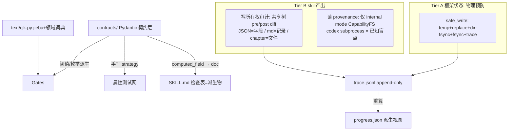

# 契约单源架构设计（Contract Single Source of Truth）v5

**状态**：草案待审阅（v5；评分轨迹 7→7.5→8.0→8.0→目标 9+）
**日期**：2026-06-29
**关联**：全项目批判性审核（13 路并行，整体 74/100）；spec 第 1-4 轮独立审核

## v5 修订摘要

**第 4 轮 8.0/10（持平）。两个 critical：v4 在回退 status→state 时机械替换到了 genre-config.json 行（该文件根本没有此字段），并加了伪造的「fixture 核对」注释——正是本 spec 要消灭的信任转述错误；v4 的 read-provenance capability FS shim 对 codex subprocess 不可行。v5 亲手核对 fixture 修正两者：**

- **C1（Critical， blocker）**：genre-config.json 的 OWNERSHIP 行 ~70% 虚构。v4 亲手核对 fixture 确认：真实顶层键 = `{approval, auditDimensions, chapterTypes, customRules, fatigueWords, pacing, tropeInventory, updated, version}`（9 个，非 genre-config SKILL.md 声称的「恰好 8」——这是 inherited drift，记入风险表）。v4 的 title/genre/language/target_words 是 **novel.json 字段**误抄；state/target_word_count/chapter_word 不存在；伪造注释删除。**v5 用真实 9 键。**
- **C2（Critical， blocker）**：read-provenance capability FS shim 对 codex subprocess 不可行。v5.2 亲手核对 codex.py:28 确认 `subprocess.run(["codex","exec",...])` 是子进程，Python 无法拦截其 syscall。**v5 诚实分层**：capability FS shim 仅用于 in-process（gates 纯度，支柱五，可行）；codex subprocess 的 read-provenance 是 **future work**（需 FUSE/ptrace/seccomp）。tropeInventory under-declaration 在生产路径**不是真闭口**——诚实降级为：迁移时人工补全 reads + lint 维护 frontmatter 完整性，已知盲点是 body prose 引用未声明文件（lint 抓不到，subprocess 无法 runtime 校验）。
- **I1（Important）**：「capability FS shim」术语过载。**v5 拆分命名**：in-process 用 `CapabilityFS`（gates 纯度）；subprocess read-provenance 明确标 future work，不与前者混名。
- **New-F（Important，解决矛盾）**：v4 自相矛盾（表既「派生生成」又「检测 drift」）。**v5 选定单一模型**：skills 继续写两份；YAML block 为权威；record parser 检测 drift（派生表必须与 YAML 一致，不一致即 fail）；YAML 在冲突时胜出。这是「检测」模型，非「生成」。
- **New-E（Important，定义 round-trip）**：YAML 字节级 round-trip 不成立（引号/顺序/空白差异）。**v5 定义语义 round-trip**：`parse(serialize(parse(x))) == parse(x)`（parse 幂等），加 golden-parse 回归固定格式。
- **New-I（Important，补 join 规则；v5.1 修正 OutputKind 转录错误）**：derive_file_type 从 REGISTRY 派生 truth skill 需要未指定的 join。**v5.1 亲手核对 contract.py:34-37**：`OutputKind = {ARTIFACT, REPORT, EPHEMERAL}`（3 成员，非 v5 误写的 2）。truth 与 chapter **都是 ARTIFACT**（durable project file），REPORT 是 audit 报告，EPHEMERAL 是瞬态。truth/chapter 区分不在 OutputKind，在 truth-files.yaml。**derive join**：skill 契约 writes/updates → 文件路径 → 查 truth-files.yaml 是否在 truth 列表；REPORT 走 report-type 门，EPHEMERAL 跳过输出门。当前 executor.py:31 `derive_file_type` 硬编码漏 resolve（truth_skills 块 39-45 只列 3），需修复为从 REGISTRY + truth-files.yaml 派生。这是新增 join 逻辑（非现成）。

**第 1-3 轮已修且第 4 轮复核为 FIXED 的，v5 保留**：C1 contract.py 取代、I4 强度表、I5 AST lint、I7 收窄、I6/N4 compaction 链、I6/N5 前向不兼容、N1 记录级、N3/New-C 真实拓扑、New-A pending_hooks state、New-B track/state-settling 分工、New-G LEGACY 锚、New-H 边界措辞、N6 staging future work、N7 extra=ignore、N8 可选、N9 allowlist、M1-M5。

## 背景与目标

### 起因

2026-06-29 全项目审核（69 skills + G0-G7 gates + dispatcher + 10 skill_utils + 测试/CI/文档）13 路并行，整体 74/100。**元根因：凡框架需要确定性的地方，它都在信任散文而非强制类型化契约。** 五条结构性根因：1.散文是真理之源 2.溯源非一等公民 3.测输出不测不变量 4.CJK 无一等工具 5.纯度/原子是散文。

### 目标

1. 彻底修复五条根因。
2. **每个结构性审核发现闭环**且可追溯；内容/伦理发现（anti-detect）单独追踪不阻塞。
3. workflow 级独立 agent 自评 ≥ 9/10。
4. 漂移对**框架可触及状态物理预防**；对 **skill 产出每轮检测无法 ship**（写所有权）；**read 完整性在 subprocess 路径是已知盲点**（诚实声明）。

### 非目标

- 不改领域范围；不替换 Python 类型化栈；不引入非 Python 运行时；不做 skill 内容领域性改写。
- **anti-detect 的 scope/disclosure 不在本 spec**。
- **staging 真预防路线图是 future work**。
- **subprocess read-provenance（FUSE/ptrace/seccomp）是 future work**——本 spec 只承诺 in-process CapabilityFS + 写所有权审计。

## 取代现有 contract.py（C1 修复）

`src/shenbi/contract.py` 已存在：`Contract` TypedDict（kind/reads/writes/updates/read_fields）、`OutputKind`、REGISTRY（`docs/framework/truth-files.yaml`）、schema+registry 校验、`load_contract`、loader-uniqueness lint，以及 4 个 contract 工具。

### 概念迁移映射（恢复 writes/updates 区分）

| 现有 | 新 | 动作 |
|---|---|---|
| `Contract` TypedDict | `contracts/skills/<name>.py` Pydantic 模型 | TypedDict→Pydantic |
| `writes`(创建)/`updates`(就地改) | 保留，映射 OWNERSHIP `write`(新)/`update`(改已有) | v2 丢，v3+ 恢复 |
| `read_fields`(读侧) | 与新 OWNERSHIP 合并双向矩阵 | 单一矩阵 |
| `OutputKind` | `contracts/enums.py` | 合并 |
| REGISTRY(truth-files.yaml) | `contracts/REGISTRY`；过渡期从 truth-files.yaml bootstrap | 单一源 |
| `load_contract` + lint | 保留扩展为 `load_skill_contract` | lint 强化 |
| 4 个 contract 工具 | 重定向到 contracts/ | 顺序见下 |

### 迁移顺序（C1 残留修正）

1. 立 contracts/ + enums + REGISTRY；迁移 1 技能验证全管线。
2. contracts/REGISTRY 过渡期从 truth-files.yaml bootstrap。
3. 合并 read_fields + 新 OWNERSHIP（含 write/update 区分）。
4. 重定向 4 工具到 contracts/REGISTRY（此时含全词汇）。
5. contract.py 的 REGISTRY 改从 contracts/REGISTRY 派生。
6. 全部迁移后删 contract.py。

**命名**：包 `contracts/`（复数）；单数 `contract.py` 迁移完成时删除。

## 总体架构：契约单源

### 强制强度诚实分层（I4，全表一致；v5 新增 read-provenance 盲点层）

| 强度 | 适用 | 机制 |
|---|---|---|
| **物理预防** | 生成文档；computed_field 派生；类型化枚举；自动 REGISTRY | 派生只读/生成/全栈唯一/自动发现 |
| **无法 CI 落地** | 魔法数阈值；门纯度；未声明写入；不变量违反 | ruff AST lint + 属性测试 CI 门 |
| **每轮检测无法 ship（写）** | skill 产出**写**所有权越权；生命周期非法转移 | dispatcher 后置写所有权审计（Tier B 写侧） |
| **每轮检测无法 ship（读）** | skill 产出**读**未声明（in-process only） | CapabilityFS（仅 internal mode；codex subprocess 不可行） |
| **已知盲点（诚实）** | codex subprocess 的 read-provenance | future work（FUSE/ptrace/seccomp）；lint frontmatter 完整性兜底（body prose 盲点） |

### 架构总图



### 六支柱 ↔ 五根因

| 根因 | 支柱 | 强度 |
|---|---|---|
| 一 散文是真理之源 | 契约层 + 文档派生 | 物理预防（文档）+ 无法 CI 落地（阈值 lint） |
| 二 溯源非一等公民 | trace + 两层所有权 | Tier A 预防 / Tier B 每轮检测（写）；读 provenance 分模式 |
| 三 测输出不测不变量 | 属性测试网 | 无法 CI 落地 |
| 四 CJK 无一等工具 | 集中 cjk.py | 无法 CI 落地 |
| 五 纯度/原子是散文 | PureInput + safe_write + CapabilityFS + lint | Tier A 物理预防（框架状态）/ 无法 CI 落地（门纯度） |

### 已定承重决策（不变）

1. 契约形态：Pydantic 模型。
2. 契约边界：输出 schema + 算法不变量 + 协议契约（状态机 + 双向所有权 + 产消依赖图）。
3. 门与契约：阈值派生；抽取逐技能 parser；语义逻辑手写但 import 契约 + 属性测试。
4. 溯源：append-only trace.jsonl；progress 降级派生视图。
5. CJK：集中模块 + jieba（固定版本）+ 领域词典 + word_count 双语义。
6. 纯度/原子：类型层 PureInput + safe_write + AST lint + in-process CapabilityFS。

## 支柱一：契约层（src/shenbi/contracts/）

### 核心设计原则（I2/M1/N7）

1. 派生量用 `@computed_field`（非 @property）：保证 model_dump() 不丢（M1）。
2. 单字段约束编译期拒收（类型层）：Field(ge=0)、Literal。
3. 跨字段不变量运行时校验（`@model_validator`）：CI 门，非编译期（I2）。
4. 数值阈值是具名模块常量，门 import，ruff 禁裸魔法数。
5. `extra="ignore"` 前提显式声明（N7）：含 computed_field 的模型显式设；lint 禁 forbid。

### foreshadowing_resolve CP 算术错误根治

```python
from pydantic import BaseModel, Field, model_validator, computed_field
from typing import Literal
CPZone = Literal["GREEN","ORANGE","RED"]
CP_THRESHOLDS = {"GREEN_MAX":50,"RED_NOW":100,"FORCE_NEXT_CHAPTER":200}
class HookCP(BaseModel):
    model_config = {"extra": "ignore"}
    hook_id: str
    cp: int = Field(ge=0)
    @computed_field
    @property
    def zone(self) -> CPZone: ...
class ResolveReport(BaseModel):
    model_config = {"extra": "ignore"}
    hooks: list[HookCP]
    debt_level: Literal["GREEN","ORANGE","RED"]
    @model_validator(mode="after")
    def _debt_consistent(self): ...
    @model_validator(mode="after")
    def _hook_cp_single_value(self): ...
```

### 写所有权矩阵（v5 亲手核对 genre-config fixture，C1 修复；New-A/B 修复 pending_hooks）

**v5 关键修正（亲手核对每个文件的 fixture 顶层键，不再信任何转述）**：

```python
# contracts/ownership.py
# 粒度由文件格式决定：JSON→field；markdown truth→record；chapter/report→file
# 每行的字段集均经 fixture / SKILL.md 输出 schema 亲手核对（v5）
OWNERSHIP: dict[tuple[str,str], dict] = {
    # genre-config.json：v5 亲手核对 fixture 顶层键（非 novel.json，非转述）
    # 真实 9 键：approval, auditDimensions, chapterTypes, customRules,
    # fatigueWords, pacing, tropeInventory, updated, version
    # 注意：genre-config SKILL.md 声称「恰好 8 字段」但 fixture 有 9——inherited drift，记风险表
    ("shenbi-genre-config", "genre-config.json"): {
        "level": "field",
        "write": {"approval","auditDimensions","chapterTypes","customRules",
                  "fatigueWords","pacing","tropeInventory","updated","version"},
    },
    # foundation-review 读 tropeInventory（body L204 + match_tropes.py:59）
    # 但 frontmatter reads 未声明 → under-declaration
    # 闭口见 N2-fact（迁移补全 + lint frontmatter 完整性；subprocess runtime 是已知盲点）
    ("shenbi-foundation-review", "genre-config.json"):
        {"level":"field", "read":{"tropeInventory"}, "write": set()},
    # pending_hooks.md：字段名 state（fixture L24 `state: PLANTED`，亲手核对）
    # 分工以 state-settling SKILL.md:110-116 权威声明（track:21 服从）为准
    ("shenbi-foreshadowing-plant", "truth/pending_hooks.md"): {
        "level": "record_create",
        "write_keys_new_record": {"id","state","operation","type","dimension","content",
                                  "subtlety","plant_chapter","cultivation_interval",
                                  "last_reinforced","max_distance","escalation_curve",
                                  "depends_on","core_hook","promoted","notes"},
        # 字段集以 plant 输出 schema（SKILL.md:75-91）为准 + fixture 的 notes（M4 修复）
    },
    ("shenbi-foreshadowing-track", "truth/pending_hooks.md"): {
        "level": "record_field",
        "write_keys_existing_record": {"state"},  # 仅生命周期 state（权威声明）
    },
    ("shenbi-foreshadowing-resolve", "truth/pending_hooks.md"): {
        "level": "record_field",
        "write_keys_existing_record": {"state"},  # 仅推进 state→RESOLVED
    },
    ("shenbi-state-settling", "truth/pending_hooks.md"): {
        "level": "record_field",
        "write_keys_existing_record": {"last_reinforced", "subtlety"},  # 权威声明
    },
}
```

**N2-fact：tropeInventory 产消真相 + 诚实分层闭口（v5 C2 修复）**：
- 生产者：`shenbi-genre-config` 写 genre-config.json.tropeInventory。
- 消费者：foundation-review body（L204）+ match_tropes.py:59 + fixture。
- **冲突**：foundation-review frontmatter reads 未声明 genre-config.json。
- **v5 诚实闭口（分层）**：
  - **迁移时**：foundation-review 的契约 reads 人工补全 genre-config.json（tropeInventory 字段）。这是确定性修复。
  - **维护**：lint 检查 frontmatter reads 完整性（声明字段 vs OWNERSHIP read 集）。
  - **已知盲点（诚实）**：body prose 引用未声明文件，lint 抓不到；codex subprocess 路径无法 runtime 校验 read-provenance（需 FUSE/ptrace，future work）。internal mode 可用 CapabilityFS runtime 校验。
  - **不再声称「真闭口」**：subprocess 生产路径上，tropeInventory under-declaration 是「迁移修复 + lint 维护 + 已知盲点」，不是物理预防。

### pending_hooks.md 双重表示（New-F 修复，v5 选定单一模型）

真实 fixture 同时有 `## 活跃伏笔` markdown 表 + `## hooks` YAML block，均按 id。**v5 选定「检测」模型（非「生成」）**：
- skills 继续写两份（当前行为，不重写）。
- **YAML block 为权威**。
- record parser 检测 drift：派生表必须与 YAML 一致；不一致 → Tier B fail。
- YAML 在冲突时胜出（parser 报 drift，ship 失败，人工修）。
- 这是「检测」，非「框架生成派生表」——v4 的矛盾消除。

### 生命周期状态机（收 ARCHIVED 未定义、所有权混乱）

```python
FORESHADOWING_TRANSITIONS = {
    PLANTED:   ({RELEVANT},  "shenbi-foreshadowing-track"),
    RELEVANT:  ({TRIGGERED}, "shenbi-foreshadowing-track"),
    TRIGGERED: ({RESOLVED},  "shenbi-foreshadowing-resolve"),
    RESOLVED:  ({ARCHIVED},  "shenbi-foreshadowing-track"),
}
```

### 自动注册表（收三表漂移）

contracts/REGISTRY 自动发现（过渡期 truth-files.yaml bootstrap）。

## 支柱二：门的阈值派生与抽取（I3；v4 New-I，v5 补 join 规则）

门阈值从契约派生；抽取逐技能自定义 parser 注册在契约旁。

### 其他门改造（v5 补 derive_file_type join 规则，New-I 修复）

- G3.4 fail-closed + 读 trace。
- G5/G6 顶层 jload 加守卫，G6.12 用 cjk.find_terms。
- G1/G7 删写副作用。
- G0 覆盖率从 REGISTRY 派生。
- **`derive_file_type`（executor.py:31，truth_skills 硬编码块 39-45）修复（New-I，v5.1 修正）**：当前硬编码 3 truth skills 漏 resolve，G2 把 resolve 的 truth 输出当 chapter。改从 REGISTRY 派生。**join 规则（v5.1 亲手核对）**：`OutputKind = {ARTIFACT, REPORT, EPHEMERAL}`（contract.py:34-37，3 成员）。truth 与 chapter 都是 ARTIFACT，故 OutputKind 无法区分；truth/chapter 区分在 truth-files.yaml。derive = skill 契约 writes/updates → 文件路径 → 查 truth-files.yaml 是否在 truth 文件列表；REPORT 走 report-type 门，EPHEMERAL 跳过。这是新增 join 逻辑（非现成）。

## 支柱三：CJK 工具包（src/shenbi/text/cjk.py）

全框架唯一文本操作真理之源（ruff SHB003 禁自实现）。
- `find_terms`：CJK 边界词项查找（治 G6.12 + 过渡词误判）。
- `count_punctuation`：多字符标点整体计数（治破折号双重计数）。
- `count_words(mode)`：双语义字数（治 length-normalizing 偏差）。
- `tokenize`：分词 + 词性标注。

### 分词引擎（M2）

jieba + 领域词典（从契约层 tropeInventory/worldbuilding 自动派生）。版本固定；冻结分词属性测试；纯 Python wheel。

## 支柱四：事件溯源与两层所有权强制（C2 + N1/N3/New-C/D/E/F，v5 C2 诚实分层）

### Tier A — 框架状态：物理预防

适用：progress.json、trace.jsonl、gate markers、summary.json（只被框架代码写）。
- safe_write 唯一入口：temp + os.replace + 目录 fsync + 文件 fsync（I6a）+ fcntl.flock（+ 回退锁文件 M5）+ trace 追加。
- ruff AST lint 禁 `src/shenbi/`（除 safe_write.py）用任何 FS 变更原语。

### Tier B — skill 产出：每轮检测（v5 诚实分层读写两侧）

适用：genre-config.json、truth/*、chapters/*、reports/*。由 LLM agent 在 dispatch 期间直接写。

#### 写所有权审计（可行，所有 dispatch 模式）

基于真实顺序执行拓扑（New-C，dispatcher 顺序）：
1. dispatch 前：dispatcher 对共享工作树（cwd）做快照（pre）。
2. dispatch skill。
3. dispatch 后：对共享树做快照（post）。
4. 审计 diff post − pre，按粒度表判定写越权。
5. 任一违反 → 记 trace GATE_FAIL → tier advance 前 G6/G7 复检拦截 → 无法 ship。

**审计粒度按文件格式分（N1）**：

| 文件格式 | 审计粒度 | 能检出 | 已知边界 |
|---|---|---|---|
| JSON（genre-config.json） | 字段级 | 哪个 key 被改 | — |
| markdown truth（pending_hooks.md，YAML 权威） | 记录级 | 新增/删除/修改记录（按 id）；越权记录；cross-section drift | per-skill-per-file（非 per-record），值正确性不在范围（New-H）|
| chapters/reports | 文件级 | 文件是否在声明 writes 内 | 不审内容字段 |

#### 读 provenance（v5 诚实分层，C2 修复）

- **internal mode**：dispatcher 在进程内执行 skill 逻辑，注入 CapabilityFS 记录实际 open 的文件，比对声明 reads。未声明实际读 → ship 失败。**可行。**
- **codex subprocess mode**：skill 是 `codex exec` 子进程（codex.py:28，v5.2 修正行号）。Python 无法拦截子进程 syscall。**read-provenance 不可行**（需 FUSE/ptrace/seccomp，future work）。
- **诚实结论**：codex 生产路径上，read 未声明只能靠「迁移补全 reads + lint frontmatter 完整性」；body prose 引用未声明文件是已知盲点。**不声称真闭口。**

**为何写侧可行而读侧不可行**：写侧用文件系统快照 diff（pre/post），不依赖拦截 skill 行为，对子进程同样有效。读侧要记录 skill 实际 open 了什么，必须拦截 syscall——子进程做不到。

### record parser 验证（New-E，v5 定义语义 round-trip）

每个注册 parser 必须有：
- **语义 round-trip**（非字节级）：`parse(serialize(parse(x))) == parse(x)`（parse 幂等）。字节级 round-trip 对 YAML 不成立（引号/顺序/空白），故用语义等价。
- **golden-parse 回归**：固定 fixture 的 parse 输出做基线，防 parser 改动静默漂移。
- **cross-section drift 检测**（pending_hooks.md）：parse YAML block + 校验 markdown 表与 YAML 一致。

### 通往真预防的路线图（staging + subprocess read-provenance，future work，不支撑强度声明）

明确 future work。本 spec 不设计其调度/进度门/FUSE 层。

### 事件模型（溯源一等公民）

```python
class TraceEvent(BaseModel):
    seq: int
    ts: datetime
    actor: str
    actor_role: ActorRole
    action: str
    target: str
    skill: str | None = None
    gate: str | None = None
    signature: str
    payload: dict
    schema_version: int
    model_config = {"frozen": True}
```

### trace.jsonl 完整性（I6 + N4/N5 + New-G）

- **目录 fsync（I6a）**：首次创建对父目录 fsync。
- **torn-line 恢复（I6b）**：replay 逐行校验，首条失败截断。
- **compaction（I6b + N4 + New-G）**：COMPACTION 事件链式 `prev_compaction_seq`（LEGACY_MIGRATION 作合法锚）+ 快照 + `truncated_at_seq`。G7 三重校验（签名 ∩ 链单调 ∩ 截断连续）。
- **事件版本化（I6c + N5）**：未知更高版本→fail；单调非递减；旧→新迁移函数；CI 历史版本重放矩阵。
- **在飞 round 迁移（I6d）**：LEGACY_MIGRATION 事件（从 progress.json 反推）+ 文件签名快照。

### progress.json 降级为派生视图

`materialize_progress` 从 trace 重算 + safe_write（Tier A）。

### G7 篡改审计（只读 trace）

G7 回归纯函数：读 trace 签名 + 重算文件哈希 + 读 compaction 快照 + 验证 COMPACTION 链（含 LEGACY 锚）。

## 支柱五：属性测试网（I1；N8 hypothesis-jsonschema 可选；v5 CapabilityFS 命名分离 I1）

### 纠正：跨字段不变量需手写 strategy

`@model_validator(mode="after")` 跨字段约束不在 JSON Schema。
- 单字段：默认 plain hypothesis strategy（`st.integers(min_value=0)`），无依赖。hypothesis-jsonschema 仅可选（N8）。
- 跨字段：手写 strategy。

### 算术 bug 全覆盖（手写 strategy）

P50==median / 标点 count==text.count(token) / drift 排除不泄漏 / 熵 sum==1 / volume_decline 持续下降必触发 / G6.12 CJK 内嵌必检出 / G3.4 无 SCORE 必 fail / 门纯度 / 三表一致 / jieba 冻结分词。

### 纯度运行时兜底（v5 命名分离 I1）

- **CapabilityFS**（in-process，可行）：测试时给门注入只读 FS 句柄，任意写抛 PermissionError。也用于 internal mode 的 read-provenance。
- **不再用「capability FS shim」指代 subprocess read-provenance**（那是 future work）。

## 支柱六：文档派生

SKILL.md「可自动检查」表从契约模型自动生成。computed_field 保证派生量进入文档。改契约→文档自动变；手改被 CI 拒绝。**物理预防**。

### 严重性词 vs 评分标尺（M3）

- 严重性词分裂→enums.py。
- 评分标尺未定义→score-arc/stratum/volume Report 显式声明聚合公式 + PASS_THRESHOLD。

## 审核发现 → 根因 → 支柱 追溯矩阵（v5 强度对齐）

| 审核 Top 缺陷 | 根因 | 支柱 | 强度 |
|---|---|---|---|
| G3.4 空转 | 二 | 四 | 每轮检测无法 ship |
| G6.12 中文敏感词失效 | 四 | 三 | 无法 CI 落地 |
| progress.json 非原子写 | 三/五 | 四 Tier A | 物理预防 |
| SKILL↔gate 契约漂移 | 一 | 一/二 | 无法 CI 落地 |
| compute_stats/drift 算术错误 | 三 | 五 | 无法 CI 落地 |
| score_* 三连复制 | 一 | 二 | 无法 CI 落地 |
| 三表登记漂移 | 一 | 一 | 物理预防（自动 REGISTRY） |
| tropeInventory 产消冲突 | 一 | 一 + 四 Tier B（写审计可行；读 provenance 仅 internal） | 无法 CI 落地（声明）+ 每轮检测（写）+ 已知盲点（subprocess 读） |
| 伏笔 CP 算术/示例错误 | 一 | 一 | 物理预防（computed_field） |
| 严重性词汇分裂 | 一 | 一 | 物理预防（enums） |
| 评分 X/10 未定义 | 一 | 一/六 | 无法 CI 落地（另案） |
| G1 写 .bak / G7 改 summary | 五 | 二/四 | 无法 CI 落地（AST lint） |
| gate 顶层 jload crash | 三/五 | 二 | 无法 CI 落地 |
| derive_file_type 漏 resolve | 一 | 二 | 无法 CI 落地（REGISTRY join） |
| 破折号双重计数 | 四 | 三 | 无法 CI 落地 |
| word_count CJK-only 偏差 | 四 | 三 | 无法 CI 落地 |
| drift 排除泄漏 / 熵不归一 / P50≠median | 三 | 五 | 无法 CI 落地 |
| review 大量无专用 gate | 一 | 二 | 无法 CI 落地 |
| contract.py 已存在被忽略 | （方法论） | 取代节 | 迁移映射 |
| anti-detect 伦理缺口 | 内容层 | 不在本 spec | 单独追踪 |

## 实现顺序（高杠杆优先）

1. **契约层骨架 + 取代 contract.py**：contracts/REGISTRY 过渡期 truth-files.yaml bootstrap；恢复 writes/updates；迁移 4 工具；删 contract.py。
2. **CJK 工具包 + 固定 jieba + 属性测试**：独立、可并行。
3. **Tier A：trace.jsonl + safe_write + progress 降级**。
4. **Tier B 写侧：dispatcher 后置写所有权审计**：依赖 OWNERSHIP + trace + record parser（含语义 round-trip + golden-parse）+ cross-section drift 检测。基于真实顺序执行拓扑。
5. **门阈值派生化 + 逐技能 parser + derive_file_type join + G3.4/G5/G6/G7 改造**。
6. **文档派生 + ruff AST lint + in-process CapabilityFS**。
7. **属性测试网全面铺开**。
8. **（future work，不阻塞）subprocess read-provenance（FUSE/ptrace）+ staging 真预防**。

**部分强制窗口（M4）**：「完全迁移」= 69/69 技能有 Pydantic 模型 + OWNERSHIP + parser；CI「未迁移清单为空」断言锁定。

## 风险与缓解

| 风险 | 缓解 |
|---|---|
| 69 契约迁移工作量大 | 不考虑成本；逐技能可并行 |
| jieba 运行时依赖 + 分词漂移 | 固定版本 + 冻结分词属性测试（M2） |
| trace.jsonl 体积 | compaction 保历史 + 篡改边界链 + LEGACY 锚 |
| 大改引入回归 | 属性测试网 + 现有 1231 单测兜底；分步迁移每步独立审核 |
| fcntl Windows/网络 FS | CI 已 ubuntu/macos；加回退锁文件（M5） |
| Tier B 记录级 per-skill-per-file 边界 | 诚实声明（New-H）；staging 是真预防（future work） |
| contract.py 双源 | 取代节明确迁移顺序 + bootstrap，最终删除 |
| 跨字段不变量测试生成难 | 手写 strategy（I1），hypothesis-jsonschema 仅可选（N8） |
| computed_field round-trip | 显式 extra="ignore" + lint 禁 forbid（N7） |
| record parser 信任面 | 语义 round-trip + golden-parse 回归（判据 12，New-E） |
| **subprocess read-provenance 不可行** | 诚实声明已知盲点；迁移补全 reads + lint frontmatter 完整性兜底；FUSE/ptrace 是 future work（v5 C2） |
| **genre-config 「恰好 8 字段」inherited drift** | OWNERSHIP 用真实 9 键；记风险表；契约迁移时 genre-config SKILL.md 字段声明对齐 fixture |
| **plant SKILL.md 输出 schema 漏 notes（inherited drift）** | OWNERSHIP write_keys_new_record 以 fixture 为准（含 notes）；风险表登记；迁移时 SKILL.md 对齐 fixture |
| **detect 模型要求 skills 双写 YAML+表保持一致** | 当前 skills 未审计双写，迁移期 drift 检测可能噪音失败；由判据 8 全迁移门吸收；双写义务作为强制 authoring 规则 |
| body prose 引用未声明 read | lint frontmatter 完整性（盲点）；internal mode CapabilityFS runtime（可行）；subprocess 是盲点 |
| 顺序执行→并发 dispatch 升级 | 当前顺序够用；并发需 staging 隔离（future work） |

## 成功判据（v5，含 New-E/G/I + C2 诚实分层）

1. **结构性发现闭环**：13 审核片每个*结构性*发现都有根因→支柱映射且可追溯；独立 agent 重审结构性维度均分 ≥ 9.0/10。内容/伦理发现单独追踪不阻塞。
2. workflow 级独立 agent 自评 ≥ 9.0/10。
3. `contract.py` 已删除，单一 `contracts/` 源；4 工具重定向完成。
4. **纯度强制**：AST-based lint 禁 `src/shenbi/`（除 safe_write.py）用任何 FS 变更原语；allowlist 仅 safe_write.py。in-process CapabilityFS 兜底。
5. 三份门登记表从单一源派生，diff 为空。
6. 属性测试 CI 必过，覆盖全部算术 bug 性质 + jieba 冻结分词。
7. trace.jsonl 完整性：目录 fsync、torn-line 恢复、compaction 保历史 + 篡改边界链 + LEGACY 锚、事件版本化 + 前向不兼容、在飞 round 迁移——各有对应测试。
8. **完全迁移**断言：69/69 技能有 Pydantic 模型 + OWNERSHIP + parser。
9. **computed_field round-trip 前提**：契约模型显式 extra="ignore"；lint 禁 forbid。
10. **markdown 记录级审计边界已知**：per-skill-per-file（非 per-record），记入风险表，不假装物理预防。
11. **事件版本前向不兼容 + compaction 链**：CI 跑「未知更高版本→fail」「COMPACTION 链单调无缺口（含 LEGACY 锚）」「截断点连续」回归。
12. **record parser 正确性**：每个注册 parser 有语义 round-trip（`parse(serialize(parse(x)))==parse(x)`）+ golden-parse 回归 + cross-section drift 检测。
13. **OWNERSHIP 字段集 fixture 核对**：每个 (skill, file) 的字段集以对应 fixture / SKILL.md 输出 schema 为准。**「顶层键」按文件类型定义（v5.1 修正）**：JSON 文件 = JSON 顶层键；markdown truth 文件 = **从权威 YAML block（判据 12 的 record parser）解析出的记录键**。CI 跑「OWNERSHIP 字段 ⊆ 对应类型的键集」断言——**同时覆盖 JSON 与 markdown truth（后者正是 v3/v4 被咬的场景）**。**参考 fixture 为 `tests/fixtures/`（非 round 输出，v5.2 N6-3）；判据 13 依赖判据 12 的 parser，二者必须同时落地（实现顺序 step 4 已排序，v5.2 N6-2）。**
14. **读 provenance 诚实分层**：internal mode CapabilityFS runtime 校验（判据）；codex subprocess 是已知盲点（记风险表），不声称真闭口。

## v4→v5 变更日志（round-4 审核逐条闭环）

| round-4 发现 | 状态 | v5 处置 |
|---|---|---|
| C1（genre-config 字段虚构） | FIXED | 亲手核对 fixture 真实 9 键；删伪造注释；加判据 13 防复现 |
| C2（read-provenance 不可行） | FIXED | 诚实分层：internal CapabilityFS 可行 / codex subprocess 是已知盲点 + future work；不再声称真闭口 |
| I1（capability FS shim 过载） | FIXED | 命名分离：in-process=CapabilityFS；subprocess read-provenance 明确 future work |
| New-E（round-trip 未定义） | FIXED | 语义 round-trip `parse(serialize(parse(x)))==parse(x)` + golden-parse |
| New-F（生成 vs 检测矛盾） | FIXED | 选定「检测」模型：skills 写两份，YAML 权威，parser 检测 drift |
| New-I（join 规则未指定） | FIXED | 明确 join：skill writes/updates → 文件路径 → truth-files.yaml truth 列表 |
| M3（genre-config 8 vs 9 inherited drift） | ACKNOWLEDGED | OWNERSHIP 用真实 9 键；记风险表；迁移时对齐 SKILL.md |
| M4（plant 漏 notes） | FIXED | write_keys_new_record 加 notes |
## v5.1 修订（round-5 审核三处闭环，8.5→目标 9+）

| round-5 发现 | 状态 | 处置 |
|---|---|---|
| New-Issue-1（OutputKind 2 vs 3 转录错误，出现 2 次） | FIXED | 亲手核对 contract.py:34-37：`{ARTIFACT, REPORT, EPHEMERAL}`；两处修正；补 REPORT 作 derive_file_type 第三类 |
| New-Issue-2（判据 13「顶层键」仅 JSON，未覆盖 markdown 记录） | FIXED | 「顶层键」按文件类型定义：JSON=JSON 顶层键；markdown=parser 解析的记录键（用判据 12 的 record parser）|
| New-Issue-3（行号引文漂移） | FIXED | codex.py subprocess 实际 28/53/73（非 34）；executor.py derive_file_type def 31、truth_skills 块 39-45（非 39-43）|
| New-Issue-4（双写义务未声明） | FIXED | 风险表加「detect 模型要求 skills 双写 YAML+表保持一致；迁移期可能噪音失败，由判据 8 全迁移门吸收」|
| New-Issue-5（plant schema 漏 notes 的 inherited drift 未记风险表） | FIXED | 风险表加「plant SKILL.md 输出 schema 漏 notes（fixture 有）；OWNERSHIP 以 fixture 为准」|
## v5.2 修订（round-6 审核闭环，8.5→目标 9+）

| round-6 发现 | 状态 | 处置 |
|---|---|---|
| N6-1（codex.py:34 引文错误，v5.1 changelog 误标 FIXED） | FIXED | body 两处 codex.py:34 → codex.py:28（修订摘要 C2 + Tier B 读 provenance）|
| N6-2（判据 13↔12 bootstrap 耦合未声明） | FIXED | 判据 13 加注「依赖判据 12 的 record parser，二者必须同时落地（实现顺序 step 4 已排序）」|
| N6-3（tropeInventory 仅在 canonical fixture，真实 round 输出缺） | FIXED | 判据 13 + OWNERSHIP 注明「参考 fixture 为 tests/fixtures/，非 round 输出；CI 断言对 fixture 跑，非 round 输出」|
