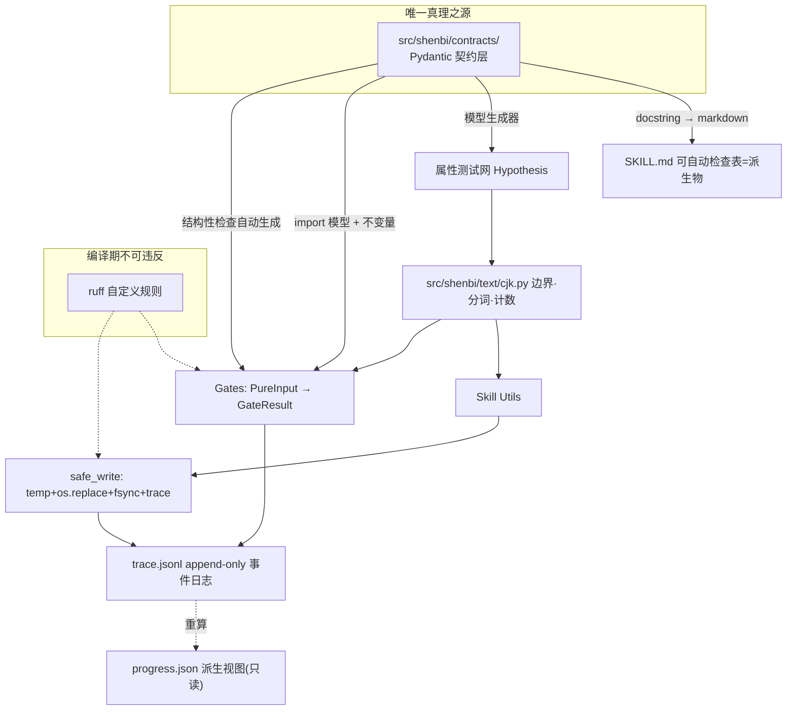

# 契约单源架构设计（Contract Single Source of Truth）

**状态**：草案待审阅
**日期**：2026-06-29
**作者**：brainstorming 协作产出
**关联**：基于 2026-06-29 全项目批判性审核（13 个并行 agent，整体 74/100）

## 背景与目标

### 起因

2026-06-29 对 shenbi 全项目（69 skills + G0–G7 gates + dispatcher + 10 skill_utils + 测试/CI/文档）做了 13 路并行高精度批判性审核，整体评分 74/100。审核在几乎每个审核片反复发现同一类问题：**凡是框架需要确定性的地方，它都在信任散文（自己的、和 skills 的），而它本该强制类型化契约。**

### 五条结构性根因

把 50+ 条表面发现回溯因果链，剥到 5 条彼此独立的结构性根因：

1. **散文是真理之源，不是机器可读契约。** SKILL.md 里的"可自动检查不变量、数值阈值、输出 schema、严重性词汇、生命周期状态、字段所有权"都是自然语言。gates 和 helpers 是另一个人根据散文重新实现一遍的代码，必然漂移。解释：SKILL↔gate 契约漂移、`评分 X/10` 无定义、严重性词汇分裂、伏笔/节奏示例算术错误、tropeInventory 产消冲突、score_arc/stratum/volume 三连复制。

2. **溯源（provenance）不是一等公民。** agent_id、评分者身份、写入所有权、门执行历史全部隐式，没有一个是轮次状态模型里的一等字段。解释：G3.4 空转、"single-writer progress.json" 无法执行、跨技能写冲突不可检测。

3. **测试验证输出，不验证不变量。** 单元测试测 `f(x)==y`；属性测试只覆盖 gates，不覆盖数值 helpers。解释：P50≠median、标点双重计数、drift 排除泄漏、熵不归一、三份门登记表漂移。

4. **框架主语言（CJK）没有一等工具包。** 每个文本操作用 Python 正则默认值重新实现，假设空白边界。解释：G6.12 敏感词门对中文失效、过渡词误判"果然/既然"、破折号逐字符计数。

5. **纯度和崩溃安全是写下的规矩，不是强制的契约。** "门必须纯"、"progress.json 单写者"是 AGENTS.md 散文，没有类型/lint/测试验证。解释：G1 写 .bak、G7 改 summary.json、update_progress 裸 write_text。

**元根因**：凡是框架需要确定性的地方，它都在信任散文而非强制类型化契约。5 条都是这个元根因的切面。

### 目标

1. 在不考虑开发成本、以产出最高质量小说为唯一目标的前提下，彻底修复五条根因。
2. 所有 skill、gate、helper 达到独立 agent 审核的 9/10 以上（0–10 制）。
3. 整个 skill workflow 配合使用达到最优；workflow 级独立 agent 自评达 9/10 以上。
4. 漂移在物理上不可能发生（不只是被 CI 偶尔抓到）。

### 非目标

- 不改变框架的领域范围（仍是 LLM 驱动的中文小说写作框架）。
- 不替换现有 Python 类型化栈（mypy strict / basedpyright）。
- 不引入非 Python 的运行时（保持 pathlib + json + jsonl）。
- 不在本 spec 范围内做 skill 内容的领域性改写（只做结构性/契约性修复）。

## 总体架构：契约单源

**一句话定性**：凡框架需要确定性的地方，都不再信任散文，而是从一份类型化契约派生 gates、helpers、文档、溯源——漂移在物理上不可能发生。

这是六根支柱咬合的闭环，不是六个独立补丁。

### 架构总图



### 五支柱 ↔ 五根因对应

| 根因 | 支柱 | 如何物理消除 |
|---|---|---|
| 一·散文是真理之源 | 契约层 + 文档派生 | SKILL.md 的"可自动检查"表从 Pydantic docstring 生成；改契约→文档自动变 |
| 二·溯源非一等公民 | trace.jsonl + 写所有权类型 | 每次写留 actor；写所有权矩阵是类型，safe_write 拦截越权 |
| 三·测输出不测不变量 | 属性测试网 | Hypothesis 穷举；P50==median 等是 model_validator，错值编译期拒收 |
| 四·CJK 无一等工具 | 集中 cjk.py + 双语义计数 | 所有文本操作一处定义，属性测试覆盖；word_count 偏差一并修 |
| 五·纯度/原子是散文 | PureInput 类型 + safe_write + lint | 门拿不到写能力；写不经 safe_write 被 ruff 拒绝 |

### 对"最高质量小说"的直接杠杆

- 契约消除漂移 → 门"绿"真的等于合规 → review 技能判定可证伪 → 评分可信 → tier 升级/卷推进基于真实质量信号。
- 写所有权 + trace → 跨技能状态永不冲突 → 不再有"伏笔丢失""角色状态错乱""tropeInventory 产消矛盾"这类破坏读者沉浸的 bug。
- CJK 工具包准确 → 中文文体判断不误杀好文、不放过 AI 味。
- 属性测试 → 节奏熵/张力曲线/伏笔密度的数值数学正确 → pacing/score-arc 不会因 P50 算错误导叙事。

### 已定的承重决策

1. **机器可读契约** → Pydantic 模型（`src/shenbi/contracts/skills/<name>.py`）。
2. **契约完整性边界** → C 层：输出 schema + 算法不变量 + 协议契约（生命周期状态机 + 写所有权 + 产消依赖图）。
3. **门与契约关系** → 混合：结构性检查零代码生成，语义检查手写但 import 契约模型 + 受属性测试约束。
4. **溯源机制** → append-only 事件日志（trace.jsonl），progress.json 降级为派生视图。
5. **CJK 工具包** → 集中模块 + 属性测试 + word_count 双语义，分词用 jieba + 领域词典定制。
6. **纯度/原子强制** → 类型层拒绝（PureInput + safe_write）+ ruff lint 编译期禁止。

## 支柱一：契约层（src/shenbi/contracts/）

每个技能一个模型文件，三件事都在此声明：输出 schema、算法不变量、跨技能关系。

### 目录结构

```
src/shenbi/contracts/
├── __init__.py            # 自动发现注册表（REGISTRY）
├── base.py                # PureInput, GateResult 基类型
├── enums.py               # 全框架单一词表
├── ownership.py           # 写所有权矩阵
├── lifecycle.py           # 跨技能状态机
├── events.py              # TraceEvent 模型 + 动作词表
└── skills/                # 69 个技能模型，__init__ 自动收集 → REGISTRY
```

### 核心设计原则

1. **派生量是 @property，不是字段。** zone 从 cp、verdict 从阈值都是只读属性，不接受手填。消除"手填派生值与原始值矛盾"。
2. **不变量用 `@model_validator(mode="after")`。** 对象创建后校验，违反即抛异常→门 fail。
3. **枚举用 `Literal`**：Severity/Verdict/CPZone 全在 enums.py，全框架 import 同一份。收掉 `评分 X/10` 无定义。
4. **数值阈值是具名模块常量**（CP_THRESHOLDS、SUB_FLOOR、PASS_THRESHOLD），门 import，ruff 禁裸魔法数。

### 用真实 bug 展示：foreshadowing_resolve CP 算术错误根治

审核三错：CP=80 标 RED（定义 RED≥100）、hook-001 三个 CP 值、>200 vs ≥100 边界不收敛。

```python
CP_THRESHOLDS = {"GREEN_MAX": 50, "RED_NOW": 100, "FORCE_NEXT_CHAPTER": 200}

class HookCP(BaseModel):
    hook_id: str
    cp: int = Field(ge=0)
    @property
    def zone(self) -> CPZone:
        if self.cp >= CP_THRESHOLDS["RED_NOW"]: return "RED"
        elif self.cp >= CP_THRESHOLDS["GREEN_MAX"]: return "ORANGE"
        return "GREEN"
    @property
    def must_resolve_next_chapter(self) -> bool:
        return self.cp > CP_THRESHOLDS["FORCE_NEXT_CHAPTER"]

class ResolveReport(BaseModel):
    hooks: list[HookCP]
    debt_level: Literal["GREEN", "ORANGE", "RED"]
    @model_validator(mode="after")
    def _debt_consistent(self):
        # debt 必须从 hooks 最大 cp 推导，拒收手填矛盾
        ...
    @model_validator(mode="after")
    def _hook_cp_single_value(self):
        # 同一 hook_id 单一 cp，拒收 80/45/180
        ...
```

三个 bug 物理不可能：zone 是 @property 不接受手填；debt 不变量校验聚合一致性；单值不变量校验同 id 单 cp。

### 写所有权矩阵（收 tropeInventory 冲突）

```python
WRITE_OWNERSHIP: dict[tuple[str, str], set[str]] = {
    ("shenbi-genre-config", "genre-config.json"): {"...", "tropeInventory"},
    ("shenbi-foundation-review", "genre-config.json"): set(),  # 只读
    ("shenbi-foreshadowing-plant", "truth/pending_hooks.md"): {"id","state","notes",...},
    ("shenbi-foreshadowing-track", "truth/pending_hooks.md"): {"state","last_reinforced"},
    ("shenbi-foreshadowing-resolve", "truth/pending_hooks.md"): {"state"},
}
```

tropeInventory 冲突根治：genre-config 显式声明 tropeInventory 合法，foundation-review 只读，safe_write 拦截越权。

### 生命周期状态机（收 ARCHIVED 未定义、所有权混乱）

```python
FORESHADOWING_TRANSITIONS = {
    PLANTED:   ({RELEVANT},  "shenbi-foreshadowing-track"),
    RELEVANT:  ({TRIGGERED}, "shenbi-foreshadowing-track"),
    TRIGGERED: ({RESOLVED},  "shenbi-foreshadowing-resolve"),
    RESOLVED:  ({ARCHIVED},  "shenbi-foreshadowing-track"),
}
```

收掉 track 自称唯一推进者但 resolve 也推进 RESOLVED 的矛盾。safe_write 改 state 前查转移表。

### 自动注册表（收三表漂移 28/22/20）

REGISTRY 自动发现。G4_CHECKER_SKILLS、参数化测试、G0 覆盖率全部从 REGISTRY 派生。漂移物理不可能。

## 支柱二：门的生成与验证（src/shenbi/gates/）

门是契约的消费者，不再重新实现。

### 结构层：零代码生成

```python
def check_structural(skill_name, output_paths):
    model = REGISTRY[skill_name]
    for fp in output_paths:
        model.model_validate(parse_output(fp))  # 一行做完全部检查
```

score_arc/stratum/volume 三连塌缩成一个函数 + 三行注册。结构层不接触文件系统写（PureInput）。

### 语义层：手写但三铁律

1. **SHB001**：阈值/枚举必须 from contracts import，禁裸魔法数。
2. **SHB002**：门输入 PureReport(frozen)，禁 import safe_write。
3. 语义逻辑受属性测试约束（双射性质必测）。

### 其他门改造

- G3.4 fail-closed + 读 trace。
- G5/G6 顶层 jload 加守卫，G6.12 用 cjk.find_terms。
- G1/G7 删写副作用，G7 改读 trace。
- G0 覆盖率从 REGISTRY 派生。

28 个手写检查器 ~24 个塌缩进结构层，代码量从 ~2000 行降到 ~400 行。

## 支柱三：CJK 工具包（src/shenbi/text/cjk.py）

全框架唯一文本操作真理之源（ruff SHB003 禁自实现）。

- `find_terms`：CJK 边界词项查找（治 G6.12 + 过渡词误判）
- `count_punctuation`：多字符标点整体计数（治破折号双重计数）
- `count_words(mode)`：双语义字数（治 length-normalizing 偏差）
- `tokenize`：jieba + 领域词典（治 review-dialogue/style-learning）

分词用 jieba + 领域词典（从契约层 tropeInventory/worldbuilding 自动派生）。

## 支柱四：事件溯源与状态原子性

trace.jsonl（append-only）为新真相之源；progress.json 降级为派生视图。

- TraceEvent 强类型化（actor/actor_role 一等字段）→ 收 G3.4 空转。
- append + fsync + fcntl.flock → 崩溃安全 + 并发安全。
- progress.json 只能由 materialize_progress 从 trace 重算写入。
- safe_write 三合一：写所有权 + 原子 + trace。
- ruff SHB004：禁 src/shenbi/（除 safe_write.py）直接 write_text。
- G7 改为只读 trace 做篡改审计，回归纯函数。

## 支柱五：属性测试网（tests/property/）

```
tests/property/
├── contracts/   # 契约不变量对所有合法输入成立
├── cjk/         # CJK 行为对所有 CJK 文本成立
├── state/       # 事件溯源/状态机不变量
└── gates/       # 门双射性质
```

Pydantic model_json_schema() + hypothesis-jsonschema = 免费生成器。

算术 bug 全覆盖：P50==median、标点 count==text.count、drift 排除不泄漏、熵 sum==1、volume_decline 持续下降必触发、G6.12 CJK 内嵌必检出、G3.4 无 SCORE 必 fail、门纯度、三表一致。

纯度运行时兜底：任意门任意输入不修改文件系统。

## 支柱六：文档派生

SKILL.md"可自动检查"表从契约模型自动生成（扩展已有 AUTO-GENERATED 段）。改契约→文档自动变；手改被 CI 拒绝。散文变契约派生物。

## 审核发现 → 根因 → 支柱 追溯矩阵

| 审核 Top 缺陷 | 根因 | 支柱 |
|---|---|---|
| G3.4 空转 | 二 | 四 |
| G6.12 中文敏感词失效 | 四 | 三 |
| progress.json 非原子写 | 三/五 | 四 |
| SKILL↔gate 契约漂移 | 一 | 一/二 |
| compute_stats/drift 算术错误 | 三 | 五 |
| score_* 三连复制 | 一 | 二 |
| 三表登记漂移 28/22/20 | 一 | 一 |
| tropeInventory 产消冲突 | 一 | 一 |
| 伏笔 CP 算术/示例错误 | 一 | 一 |
| `评分 X/10` 无定义 | 一 | 一 |
| 严重性词汇分裂 | 一 | 一 |
| G1 写 .bak / G7 改 summary | 五 | 二/四 |
| gate 顶层 jload crash | 三/五 | 二 |
| 破折号双重计数 | 四 | 三 |
| word_count CJK-only 偏差 | 四 | 三 |
| drift 排除泄漏 / 熵不归一 / P50≠median | 三 | 五 |
| anti-detect 伦理缺口 | 内容层 | 不在本 spec；建议补 scope/disclosure |
| review 大量无专用 gate | 一 | 二 |

## 实现顺序（高杠杆优先）

1. 契约层骨架 + enums + REGISTRY（69 个技能逐步迁移）。
2. CJK 工具包 + 属性测试（独立、可并行）。
3. trace.jsonl + safe_write + progress 降级。
4. 门契约化改造（结构生成 + 语义拴住 + G3.4/G5/G6/G7）。
5. 文档派生 + ruff 规则（收尾锁死漂移）。
6. 属性测试网全面铺开。

每步完成后跑独立 agent 审核，确认该层达 9+ 再进下一步。

## 风险与缓解

| 风险 | 缓解 |
|---|---|
| 69 个契约迁移工作量大 | 不考虑成本；结构生成消除 ~24 手写门，净代码量下降 |
| jieba 运行时依赖 | 纯 Python wheel 无二进制；加载 ~5ms 可接受 |
| trace.jsonl 体积 | 每事件 < 500B；提供 compaction |
| 大改引入回归 | 属性测试网 + 1231 单测兜底；分步迁移 |
| fcntl Windows 不可用 | CI 已是 ubuntu/macos；Windows 非门控 |

## 成功判据

1. 13 个审核片重跑，每片均分 ≥ 9.0/10。
2. workflow 级独立 agent 自评 ≥ 9.0/10。
3. 审核 Top 缺陷全部有支柱根治，可追溯。
4. `rg "write_text" src/shenbi/ --glob '!**/safe_write.py'` 返回空。
5. 三份门登记表从单一源派生，diff 为空。
6. 属性测试 CI 必过，覆盖全部算术 bug 性质。
