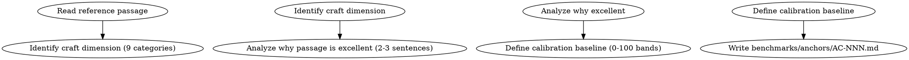

<!-- AUTO-CHECK-START -->

## auto-check (generated -- do not edit)

<!-- AUTO-CHECK-END -->

<!-- AUTO-GENERATED from frontmatter — do not edit -->

## 数据契约

- **Reads:** import/source/*.txt
- **Writes:** benchmarks/anchors/AC-NNN.md
- **Updates:** none

<!-- END AUTO-GENERATED -->

# 锚点策展

从授权参考作品提取工艺分析，生成评分锚点。锚点存储工艺分析（文学批评），不存储大段原文。

## 流程

## 铁律

1. **工艺分析非原文复制** — 只分析手法，不复制大段原文。版权边界严格遵守
2. **9 类槽位映射** — 每个锚点必须映射到 spec §4.3 的 9 类之一
3. **校准基准必须具体** — 88-97/75-87/<75 三档，禁止模糊区间
4. **source_ref 精确** — 标注作品名 + 具体位置（卷/章/场景）

## 输出格式

参照 `benchmarks/anchors/AC-001.md` 格式（id/category/source_work/source_ref/calibrates + 工艺分析 + 评分校准基准）。
