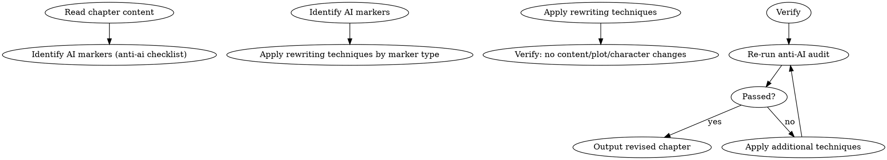

# 反检测改写

应用 9 种改写手法降低 AI 可检测性标记。

## 流程



## 数据契约

- **Reads:** `chapters/chapter-N.md`, anti-AI audit report
- **Writes:** none (edits chapter in-place)
- **Updates:** `chapters/chapter-N.md`

## 铁律

1. **不改叙事内容** — anti-detect 是表达层变换，不碰情节/角色/伏笔
2. **每种标记有对应手法** — 不是笼统重写，是靶向替换
3. **改写后重新审计** — anti-ai + sensitivity 两个审计必须重新通过
4. **不错杀好文** — 如果某句话的表述已经是优选，不要为改而改

## 9 种改写手法

1. **打破句式规律** — 连续相同句式 → 变换句子结构
2. **口语化** — 书面语痕迹 → 口头语表达
3. **了字降频** — 连续"了"字句 → 用动作替代完成态
4. **转折词降频** — 然而/不过/突然 → 用场景转换自然过渡
5. **情绪外化** — "感到愤怒" → 身体反应/动作描写
6. **感官锚定** — 抽象描述 → 具体感官细节
7. **对话差异化** — 扁平对话 → 注入角色声音指纹
8. **打破段落等长** — 均匀段落 → 长短交错
9. **替换分析术语** — "由此可见"等 → 自然叙述过渡

## Anti-Rationalization

| Excuse | Reality |
|--------|---------|
| "改过的文字不如原文好" | 优先自然表达，"为掩藏而损害文字"是本末倒置 |
| "每句话都改写一遍" | 只改写检测标记点，不过度改写 |
| "AI检测不重要" | 平台AIGC检测直接关联推荐权重和收入 |
| "全章都该重写" | 只改检测标记点，保留优选句子 |
| "改写后失去作者味" | 靶向改写 = 不影响作者风格；笼统重写 = 才失味 |
| "审计不通过就再改" | 3 次后未通过 = 回退到改写前（最佳版本） |
| "AI 检测会误判好文" | 检测是统计指标；通过 + 自然度双优才是目标 |

## 输出格式

```markdown
# 反检测改写后的第N章

[完整的改写后章节正文]

---

## 改写报告

**应用手法**:
| 手法 | 改写位置 | 原文标记 |
|------|---------|---------|
| 打破句式规律 | 第3段 | 连续3句相同结构 |
| 了字降频 | 第5段 | 4个"了" → 2个 |

**审计对比**: 改写前 N 个 error/warning → 改写后 M 个 error/warning
```

## 反检测改写汇总

```markdown
## 反检测改写汇总

**章节**: 第N章
**触发原因**: anti-ai 审计发现 X 个 AI 标记

### 改写统计

| 手法 | 应用次数 | 命中标记数 | 状态 |
|------|---------|----------|------|
| 打破句式规律 | X | Y | ✓ |
| 口语化 | X | Y | ✓ |
| 了字降频 | X | Y | ✓ |
| 转折词降频 | X | Y | ✓ |
| 情绪外化 | X | Y | ✓ |
| 感官锚定 | X | Y | ✓ |
| 对话差异化 | X | Y | ✓ |
| 打破段落等长 | X | Y | ✓ |
| 替换分析术语 | X | Y | ✓ |
| **合计** | X | Y | — |

### 审计前后对比

| 审计维度 | 改写前 | 改写后 | 变化 |
|---------|--------|--------|------|
| anti-ai blocking | N | M | ↓X |
| anti-ai critical | N | M | ↓X |
| anti-ai warning | N | M | ↓X |
| sensitivity blocking | N | M | = |
| sensitivity critical | N | M | = |

### 保留不改的"好句"

[列出审计后判定为优选的句子，确认未误改]

### 复核

- [ ] 改写后情节/角色/伏笔完整
- [ ] 风格指纹未失
- [ ] 未引入新的 AI 标记
```
