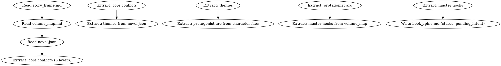

<!-- AUTO-CHECK-START -->

## auto-check (generated -- do not edit)

<!-- AUTO-CHECK-END -->

<!-- AUTO-GENERATED from frontmatter — do not edit -->

## 数据契约

- **Reads:** outline/story_frame.md, outline/volume_map.md, novel.json
- **Writes:** truth/book_spine.md
- **Updates:** none

<!-- END AUTO-GENERATED -->

# 书脊初始化

HARD-GATE: 在创世层（worldbuilding + character + story-architecture + volume-outlining）完成后、逐章循环开始前执行。（worldbuilding + character + story-architecture + volume-outlining）完成后、逐章循环开始前执行。初始化全书的常青书脊（L5），后续由 memory-distill 滚动复核。

## 流程



## 铁律

1. **不读 author_intent.md** — 创世层末尾 author_intent 尚未由 intent-management 填充。书脊的 themes 从 novel.json 读取，author_intent 字段初始化为空，标记 `status: pending_intent`。memory-distill 在后续卷/大弧边界滚动合并 author_intent。
2. **声明值只初始化不臆造** — 核心冲突/themes/主角弧终点从 story_frame.md + novel.json 真实继承，不臆造。
3. **master hooks 从 volume_map 提取** — 跨卷级别的钩子（卷尾实体钩子的跨卷延续线）作为 master hooks 初始入库。
4. **status: pending_intent 是合法初始态** — 第一卷定稿后由 memory-distill 合并 author_intent 并改 status 为 active。

## 输出格式

写 `truth/book_spine.md`：

```markdown
---
updated: YYYY-MM-DD
total_chapters: 0
status: pending_intent
---

# 书脊

## 核心冲突三层（声明值，从 story_frame.md 继承）
- surface_conflict: "[从 story_frame.md frontmatter surface_conflict]"
- personal_conflict: "[从 story_frame.md frontmatter personal_conflict]"
- deep_conflict: "[从 story_frame.md frontmatter deep_conflict]"

## 全书 themes（声明值，从 novel.json 继承）
- [theme 1]: 探索进度: 未开始
- [theme 2]: 探索进度: 未开始

## 主角弧（声明终点，从 characters/protagonist.md 继承）
- arc_type: [GROWTH/REDEMPTION/FALL]
- arc_starting: "[从 protagonist.md]"
- arc_turning: "[从 protagonist.md，若已声明]"
- arc_ending: "[从 protagonist.md arc_ending]"
- 当前进度: 0%

## 主线钩子（master hooks，从 volume_map 跨卷钩子提取）
- MH01: [内容] | 状态: PLANTED | 最后推进章: — | 声明兑现卷: [从 volume_map]
- MH02: [内容] | 状态: PLANTED | 最后推进章: — | 声明兑现卷: [从 volume_map]

## 世界铁律滚动快照（从 world/rules.md 同步前5条）
- [rule 1]
- [rule 2]
```

## Anti-Rationalization

| Excuse | Reality |
|--------|---------|
| "author_intent 还没填，书脊先空着" | themes 从 novel.json 来，不是 author_intent；空书脊 = context-composing 无上级目标 = 每章漂移 |
| "书脊以后再补" | 没有书脊的 context-composing P2 为空 = 第一卷就开始上下文不足 |
| "master hooks 等埋了伏笔再说" | 跨卷钩子在 volume_map 已声明，必须初始入库追踪 |
