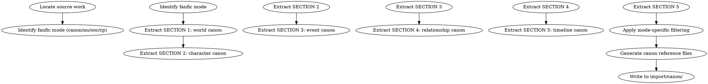

<!-- AUTO-CHECK-START -->

## auto-check (generated -- do not edit)

<!-- AUTO-CHECK-END -->

<!-- AUTO-GENERATED from frontmatter — do not edit -->

## 数据契约

- **Reads:** source_canon/*
- **Writes:** import/canon/*.md
- **Updates:** none

<!-- END AUTO-GENERATED -->

# 正典导入

为同人小说（fanfic）导入原作正典。负责从原作提取 5 个 SECTION，支持 4 种同人模式。

## 流程



## 铁律

1. **5 SECTION 必全** — world / character / event / relationship / timeline 缺一不可
2. **模式过滤透明** — 不同模式保留/排除的部分必须显式标注，不能静默
3. **证据必带出处** — 每条正典必须标注原作章节/集数/段落
4. **不混用模式** — 选定一种模式后不掺杂其他模式的元素（除非显式声明 crossover）
5. **OOC 模式必声明偏离** — OOC 模式下需明确哪些点偏离原作

## 4 种同人模式

| 模式 | 保留 | 偏离 | 适用 |
|------|------|------|------|
| canon | 全部正典 | 无 | 续写/补完原作 |
| au | 主体正典 | 至少 1 个核心设定变更 | 平行世界（"如果 X 没发生"） |
| ooc | 性格正典 | 至少 1 个核心性格/关系变化 | "如果 X 性格相反" |
| cp | 关系正典 | 配对/CP 关系变化 | "如果两人相遇时间不同" |

模式选定后必须明确列出"保留什么、改变什么"。

## 5 SECTION 内容

### SECTION 1: World Canon（世界正典）

- 地点列表 + 关键描述
- 势力/组织
- 力量体系（如有）
- 世界规则（魔法/科技/社会规则）
- 历史背景

### SECTION 2: Character Canon（角色正典）

- 主角/主要/次要角色档案
- 性格标签（原文证据）
- 声音指纹
- 目标 + 恐惧 + 弧线

### SECTION 3: Event Canon（事件正典）

- 关键事件时间线
- 主角参与的转折点
- 历史重大事件
- 当前故事的起点状态

### SECTION 4: Relationship Canon（关系正典）

- 主要关系矩阵
- 关系演化轨迹
- 隐藏关系（需在文本中暗示但未明示）

### SECTION 5: Timeline Canon（时间线正典）

- 故事内时间
- 关键事件的时间锚点
- 时间跨度的总览
- 时序关系（"X 之前是 Y"）

## 输出格式

每个 SECTION 一个文件，写入 `import/canon/`：

```markdown
# SECTION N: [名称] — [模式]

**正典模式**: canon / au / ooc / cp
**源**: [原作名/作者/版本]
**导入时间**: YYYY-MM-DD

## 保留范围

[本模式下保留的正典部分]

## 偏离声明

[本模式下改变/忽略的部分]

## 内容

[正典条目，每个带证据出处]

## 引用格式

- 引用: [原作名] 第N章 [摘录]
- 引用: [原作名] 第M章 [摘录]
```

### 模式声明文件

另需 `import/canon/MODE.md`：

```markdown
# 模式声明

**选定模式**: [canon/au/ooc/cp]

## 模式说明

[该模式的定义 + 适用范围]

## 保留清单

- 全部正典（canon）
- 主体正典 + 设定变更（au: [X 设定变更为 Y]）
- 性格正典 + 关系偏离（ooc: [X 性格变更为 Y]）
- 关系正典 + CP 变化（cp: [X Y 关系变更为 Z]）

## 偏离清单

- [明确列出的偏离点]

## 不混用

- 本作品不与其他模式混用（除非显式声明 crossover）
```

## 汇总

```markdown
## 正典导入汇总

**选定模式**: [canon/au/ooc/cp]
**源作品**: [名/作者]
**导入时间**: YYYY-MM-DD
**写入目录**: `import/canon/`

### 5 SECTION 完成情况

| SECTION | 名称 | 完整性 | 证据数 | 模式过滤 |
|---------|------|--------|--------|---------|
| 1 | World Canon | X% | N | [保留/偏离] |
| 2 | Character Canon | X% | N | [保留/偏离] |
| 3 | Event Canon | X% | N | [保留/偏离] |
| 4 | Relationship Canon | X% | N | [保留/偏离] |
| 5 | Timeline Canon | X% | N | [保留/偏离] |

### 偏离清单

- [偏离点 1] → [新设定]
- [偏离点 2] → [新设定]

### 引用总数

- 总引用数: N
- 章节覆盖: 第X章 - 第Y章
- 模式内引用: M
- 模式外引用: K（标记为偏离前证据）

### 待人类确认

- [ ] 模式选择是否正确？
- [ ] 偏离点是否清晰？
- [ ] 是否需要补充遗漏的正典？
```

## Anti-Rationalization

| Excuse | Reality |
|--------|---------|
| "不用 5 SECTION，3 个够" | 缺 SECTION = 后续 fanfic 出现违反正典但无法定位 |
| "模式随便选" | 模式 = 写作约束；选错 = 偏离原作粉丝期待 |
| "偏离不声明" | 偏离不声明 = 读者预期管理失败 = 弃书 |
| "原作太长，不用引用证据" | 引用证据 = 后续 fanfic 行为有锚点；无引用 = 自由发挥 = 不是 fanfic |
