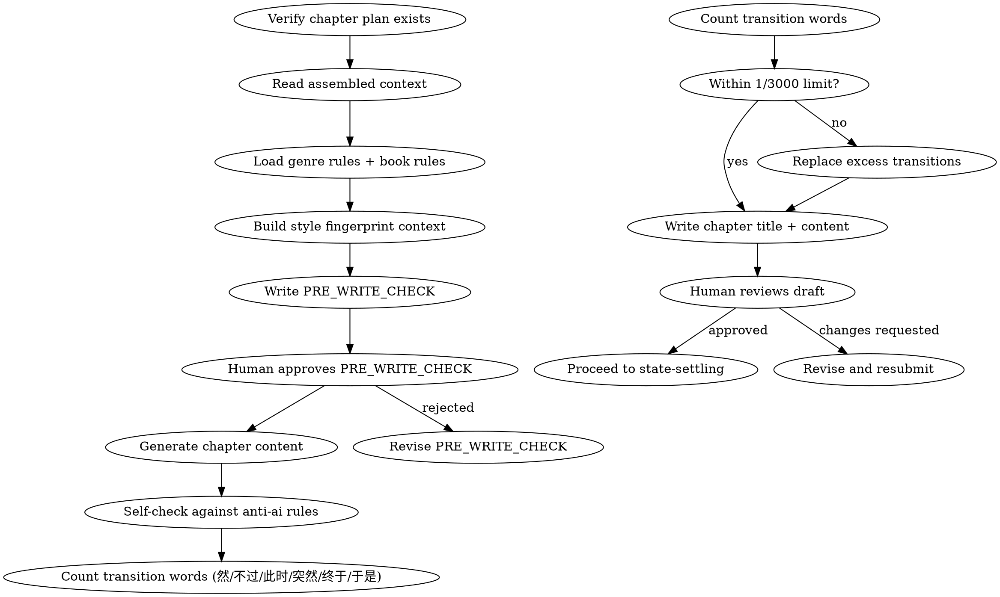

<!-- AUTO-CHECK-START -->

## auto-check (generated -- do not edit)

<!-- AUTO-CHECK-END -->

<!-- AUTO-GENERATED from frontmatter — do not edit -->

## 数据契约

- **Reads:** plans/chapter-N-plan.md, style/style_profile.md, genre-config.json, truth/audit_drift.md
- **Writes:** chapters/chapter-N.md
- **Updates:** none

<!-- END AUTO-GENERATED -->

# 章节起草

HARD-GATE: 不得在没有章节备忘的情况下起草正文。

## 流程



## 铁律

1. **NO CHAPTER WITHOUT A PLAN** — 没有章节备忘（`plans/chapter-N-plan.md`）就动笔 = 删除重来
2. **PRE_WRITE_CHECK 必写** — 起草前列出：本章核心任务、使用的伏笔、要避免的错误。PRE_WRITE_CHECK 必须作为章节文件的第一个区块输出，位于正文之前，人类批准后才写正文
3. **叙述者不替读者下结论** — 严禁"让人...感悟"、"引人...深思"类反思句
4. **正文严禁分析报告式语言** — 不出现 hook_id、账本数据、元叙事
5. **转折词密度 ≤ 1/3000字** — 然/不过/此时/突然/终于/于是
6. **参考 anti-ai-reference.md** — 所有 AI 味检查清单在 `anti-ai-reference.md`

## 写作自检表 (PRE_WRITE_CHECK)

起草前完成以下自检：

```
PRE_WRITE_CHECK:
- 本章核心任务: [从备忘第1段]
- 要兑现的伏笔: [从备忘第3段]
- 本章禁忌: [从备忘第8段]
- 近3章结尾方式: [避免重复]
- AI味重点防范: [根据最近的 audit_drift]
- 共鸣短板（读 truth/audit_drift）: [本章重点防范的体验轴短板]
```

## 创作原则

1. **场景驱动而非叙述驱动** — 用动作和对话推进，不是内心独白
2. **Show don't tell** — 情绪用行为表现，不直接说"他感到愤怒"
3. **80/20 断章** — 章尾 20% 必须重新点燃好奇心
4. **段落呼吸** — 长短交替，不让视觉节奏单调
5. **对话指纹** — 角色说话必须匹配 voice_profile

## 输出格式

写 `chapters/chapter-N.md`：

```markdown
<!--META-BEGIN-->
## PRE_WRITE_CHECK

- 本章核心任务: [从备忘第1段]
- 要兑现的伏笔: [从备忘第3段]
- 本章禁忌: [从备忘第8段]
- 近3章结尾方式: [避免重复]
- AI味重点防范: [根据最近的 audit_drift]
- 共鸣短板（读 truth/audit_drift）: [本章重点防范的体验轴短板]
- 转折词预算: ≤ [字数/3000] 个
<!--META-END-->

# 章节标题

[正文内容]

<!--META-BEGIN-->
## POST_WRITE_SELF_CHECK

- [ ] 转折词密度: X / Y字 = Z (≤ 1/3000)
- [ ] 章尾好奇心点燃: [是/否]
- [ ] 无反思句/元叙事: [是/否]
<!--META-END-->
```

章节标题不要包含章节号（如"第一章"），文件名已编码章节号。

## 元数据与正文分离（新增铁律）

章节文件中的 PRE_WRITE_CHECK 和 POST_WRITE_SELF_CHECK 必须用 `<!--META-BEGIN-->` 和 `<!--META-END-->` 包裹。下游解析器（字数统计、审计、评分）必须剥离 META 块后处理纯正文。

## Anti-Rationalization

| Excuse | Reality |
|--------|---------|
| "这章太简单了，不需要自检" | 越简单的章越容易暴露 AI 味 |
| "PRE_WRITE_CHECK 浪费时间" | 5分钟自检省30分钟返工 |
| "AI味读者看不出来" | 平台检测算法看得很清楚 |
| "先写完再检查" | 写完再改 = 重写。边写边注意 = 一次过 |
