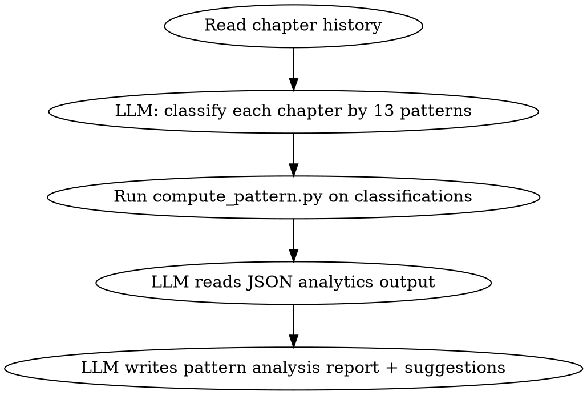

<!-- AUTO-CHECK-START -->

## auto-check (generated -- do not edit)

<!-- AUTO-CHECK-END -->

<!-- AUTO-GENERATED from frontmatter — do not edit -->

## 数据契约

- **Reads:** chapters/*.md, truth/chapter_summaries.md, genre-config.json
- **Writes:** outline/chapter_patterns.md
- **Updates:** none

<!-- END AUTO-GENERATED -->

# 章节模式检测

13 种章节模式识别与分类。负责模式识别、单调性检测、章型分布监控。

## 流程



**模式分类由 LLM 执行（判断性工作）。分类结果以 JSON 输入 `compute_pattern.py`（计算性工作），脚本输出熵、分布、连续运行等确定性分析。LLM 基于脚本输出撰写报告和建议。**

## 铁律

1. **独立评分** — 本 skill 产出评分/审核判断，必须在 context-cleaned 独立 subagent 执行；drafting/planning agent 不得执行本 skill（spec §8.1）
2. **13 模式全识别** — 任何章节必须能归入至少 1 种模式；不可识别的标注"未分类"
3. **单调性阈值硬性** — 连续 N 章同模式 ≥ genre-config 中定义必须报警
4. **分布检测必看** — 不仅看连续，还看整体分布（10 章内 13 模式必须覆盖 ≥ 5 种）
5. **不重写章节** — 本技能只检测不修订；发现问题建议下章调整
6. **建议可执行** — 模式建议必须具体到下一章该用哪种模式

## 13 种章节模式

| 编号 | 模式 | 标志特征 |
|------|------|---------|
| 1 | 引入 | 建立新角色/新地点/新信息 |
| 2 | 升级 | 冲突或张力累积，无重大事件 |
| 3 | 转折 | 关键事件触发，状态显著变化 |
| 4 | 揭示 | 真相/秘密/隐藏信息揭露 |
| 5 | 决战 | 高强度冲突/战斗/对决 |
| 6 | 沉淀 | 战后/事件后情绪与关系消化 |
| 7 | 日常 | 低冲突生活/修炼/工作 |
| 8 | 训练 | 能力提升/技能学习 |
| 9 | 探索 | 新地点/新势力/新规则的发现 |
| 10 | 阴谋 | 计谋/政治/布局推进 |
| 11 | 逃亡 | 危机/追击/逃命 |
| 12 | 回忆 | 角色过去/历史事件 |
| 13 | 总结 | 阶段性回顾/章节式回顾 |

每章可标注 1-2 种主模式 + 0-1 种副模式。

## 单调性检测

### 1. 连续检测

| 模式 | 默认 maxConsecutive | 警告阈值 |
|------|---------------------|---------|
| 决战 | 2 | 3 |
| 转折 | 2 | 3 |
| 升级 | 4 | 5 |
| 日常 | 3 | 4 |
| 训练 | 3 | 4 |
| 其他 | 3 | 4 |

### 2. 分布检测

最近 N 章（N=10）必须覆盖的最小模式数：

| N | 最小模式数 |
|---|----------|
| 5 | 3 |
| 10 | 5 |
| 20 | 8 |
| 30 | 10 |

### 3. 熵检测

最近 N 章模式分布的香农熵：
- 熵 > 2.0：分布健康
- 熵 1.5-2.0：轻度单调
- 熵 < 1.5：严重单调

### 4. 开篇/收束重复

| 维度 | 警告阈值 |
|------|---------|
| 连续 N 章同开篇方式 | N=3 |
| 连续 N 章同收束方式 | N=3 |
| 连续 N 章同情感基调 | N=4 |

## 输出格式

```markdown
# 章节模式分析

**分析时间**: YYYY-MM-DD
**样本范围**: 第N章 - 第M章（共 X 章）

---

## 模式分布

| 模式 | 出现次数 | 占比 | 连续最长 |
|------|---------|------|---------|
| 1 引入 | X | Y% | A |
| 2 升级 | X | Y% | A |
| ... | ... | ... | ... |
| 13 总结 | X | Y% | A |

## 单调性检测结果

### 连续检测

- [pass/warn] 决战: 最长连续 A 章（阈值 2）
- [pass/warn] 转折: ...

### 分布检测

- [pass/warn] 最近 10 章覆盖模式: X 种（最小 5）

### 熵检测

- 最近 10 章熵: N (评级: 健康/轻度单调/严重单调)
- 最近 20 章熵: N
- 最近 30 章熵: N

### 开篇/收束检测

- [pass/warn] 开篇: 最长重复 A 章
- [pass/warn] 收束: 最长重复 A 章
- [pass/warn] 情感基调: 最长重复 A 章

## 警告清单

| 类型 | 章节范围 | 模式 | 描述 |
|------|---------|------|------|
| 连续超限 | 第A-B章 | 决战 | 连续 4 章决战，超阈值 |
| 分布不足 | 第C-12章 | — | 缺少模式 7-13 中的任意一种 |
| 熵过低 | 第D-13章 | — | 整体单调 |
```

## 下章建议

```markdown
## 下一章（第N+1章）模式建议

**当前累计**: 上一章模式 + 连续状态

### 推荐主模式

- [建议模式] - 原因: [打破连续 + 平衡分布]

### 推荐副模式

- [建议副模式] - 原因: [平衡情感/推进某线索]

### 不建议

- [不建议模式] - 原因: [与上一章重复 / 累计超限]

### 开篇/收束建议

- 开篇: [与上一章不同]
- 收束: [避免重复上一章]
```

## 汇总

```markdown
## 章节模式检测汇总

**分析时间**: YYYY-MM-DD
**样本**: X 章

### 整体评级

- 单调性: 健康 / 轻度 / 严重
- 分布: 良好 / 不均 / 缺失

### 警告

| 类型 | 数量 | 严重度 |
|------|------|--------|
| 连续超限 | X | high/med/low |
| 分布不足 | Y | med |
| 熵过低 | Z | high |
| 开篇/收束重复 | W | low |

### 下一章模式建议

- 主模式: [X]
- 副模式: [Y]
- 避免: [Z]

### 整改建议

- 立即整改: [列出高严重度项]
- 后续关注: [列出中严重度项]
- 当前可接受: [列出低严重度项]
```

## 多章节模式

当输入为多章时，除单章分类外还需执行以下检测：

### 批量分类模式

```markdown
## 多章模式分类

| 章节 | 标题 | 主模式 | 副模式 | 开篇方式 | 收束方式 | 情感基调 |
|------|------|--------|--------|---------|---------|---------|
| 1 | [标题] | [模式编号+名称] | [编号+名称] | [对话/描写/动作/内心/概述] | [悬念/闭合/反射/预告/意象] | [紧张/轻松/沉重/希望/日常] |
| 2 | ... | ... | ... | ... | ... | ... |
| ... | ... | ... | ... | ... | ... | ... |
```

### 模式转移矩阵

```markdown
## 模式转移矩阵（N章 → N+1章）

| 从 → 到 | 引入 | 升级 | 转折 | 揭示 | 决战 | 沉淀 | 日常 | 训练 | 探索 | 阴谋 | 逃亡 | 回忆 | 总结 |
|----------|------|------|------|------|------|------|------|------|------|------|------|------|------|
| 引入 | — | ✓ | ✓ | ✓ | ✗ | ✗ | ✓ | ✓ | ✓ | ✓ | ✗ | ✗ | ✗ |
| 升级 | ✗ | — | ✓ | ✓ | ✓ | ✗ | ✓ | ✓ | ✓ | ✓ | ✗ | ✗ | ✗ |
| 转折 | ✗ | ✗ | — | ✓ | ✓ | ✓ | ✗ | ✗ | ✗ | ✗ | ✗ | ✗ | ✗ |
| 揭示 | ✗ | ✓ | ✓ | — | ✓ | ✓ | ✓ | ✗ | ✓ | ✓ | ✗ | ✓ | ✗ |
| 决战 | ✗ | ✗ | ✗ | ✗ | — | ✓ | ✗ | ✗ | ✗ | ✗ | ✗ | ✗ | ✗ |
| 沉淀 | ✓ | ✓ | ✓ | ✓ | ✗ | — | ✓ | ✓ | ✓ | ✓ | ✗ | ✓ | ✗ |
| 日常 | ✓ | ✓ | ✓ | ✓ | ✗ | ✓ | — | ✓ | ✓ | ✓ | ✗ | ✗ | ✗ |
| 训练 | ✗ | ✓ | ✓ | ✓ | ✓ | ✓ | ✓ | — | ✗ | ✗ | ✗ | ✗ | ✗ |
| 探索 | ✓ | ✓ | ✓ | ✓ | ✗ | ✓ | ✓ | ✗ | — | ✓ | ✗ | ✗ | ✗ |
| 阴谋 | ✗ | ✓ | ✓ | ✓ | ✗ | ✓ | ✓ | ✗ | ✓ | — | ✗ | ✗ | ✗ |
| 逃亡 | ✗ | ✗ | ✓ | ✗ | ✓ | ✓ | ✗ | ✗ | ✗ | ✗ | — | ✗ | ✗ |
| 回忆 | ✓ | ✓ | ✓ | ✓ | ✗ | ✓ | ✓ | ✗ | ✓ | ✓ | ✗ | — | ✗ |
| 总结 | ✓ | ✓ | ✓ | ✓ | ✗ | ✓ | ✓ | ✓ | ✓ | ✓ | ✗ | ✗ | — |

图例: ✓ = 推荐转移方向, ✗ = 避免转移方向, — = 自身
```

### 跨章开篇/收束检测

```markdown
## 跨章开篇/收束重复检测

### 开篇方式序列
| 章 | 开篇方式 | 与前章相同? |
|----|---------|-----------|
| N | [方式] | — |
| N+1 | [方式] | ✓/✗ |
| N+2 | [方式] | ✓/✗ (连续 X 章同开篇 ⚠) |

### 收束方式序列
| 章 | 收束方式 | 与前章相同? |
|----|---------|-----------|
| N | [方式] | — |
| N+1 | [方式] | ✓/✗ |
| ... | ... | ... |
```

## 熵计算公式

### 香农熵计算

对最近 N 章的模式分布计算香农熵：

```
H = -Σ(p_i × log₂(p_i))

其中:
- p_i = 模式 i 在最近 N 章中出现的频率（出现次数 / N）
- 求和范围: 13 种模式中实际出现的所有模式
- log₂ 以 2 为底
```

### 计算示例

```markdown
## 熵计算示例（最近 10 章）

假设模式分布为:
- 升级: 3次 (p=0.3)
- 日常: 2次 (p=0.2)
- 转折: 2次 (p=0.2)
- 引入: 1次 (p=0.1)
- 揭示: 1次 (p=0.1)
- 沉淀: 1次 (p=0.1)
- 其他 7 种: 0次

H = -(0.3×log₂(0.3) + 0.2×log₂(0.2) + 0.2×log₂(0.2) + 0.1×log₂(0.1) + 0.1×log₂(0.1) + 0.1×log₂(0.1))
  = -(0.3×(-1.737) + 0.2×(-2.322) + 0.2×(-2.322) + 0.1×(-3.322) + 0.1×(-3.322) + 0.1×(-3.322))
  = -(-0.521 + -0.464 + -0.464 + -0.332 + -0.332 + -0.332)
  = -(-2.446)
  = 2.446

评级: 健康（> 2.0）
```

### 熵评级阈值

| 熵值 | 评级 | 含义 | 建议 |
|------|------|------|------|
| H > 2.5 | 优秀 | 模式分布高度多样 | 维持当前策略 |
| 2.0 < H ≤ 2.5 | 健康 | 分布合理 | 可以接受 |
| 1.5 < H ≤ 2.0 | 轻度单调 | 开始出现模式集中 | 下1-2章引入缺失模式 |
| 1.0 < H ≤ 1.5 | 中度单调 | 模式明显集中 | 需要规划模式轮换 |
| H ≤ 1.0 | 严重单调 | 几乎单一模式 | 立即调整，至少轮换3种模式 |

### 熵计算公式输入文档化要求

**每次输出熵计算结果时，必须同时输出送入公式的原始输入数据**，确保计算结果可复现、可审计：

- 模式频率分布表（各模式出现次数 + 频率 p_i）
- 使用的窗口大小 N
- 每个非零项的 p_i × log₂(p_i) 中间值
- 最终 H 值

缺少上述任一输入数据的熵计算结果为**无效输出**。

### 熵计算输出模板

```markdown
## 熵计算结果

| 窗口 | 章范围 | 出现模式数 | 总模式数 | 熵值 | 评级 |
|------|--------|----------|---------|------|------|
| 5章 | 第A-E章 | X | 13 | X.XXX | [评级] |
| 10章 | 第A-J章 | X | 13 | X.XXX | [评级] |
| 20章 | 第A-T章 | X | 13 | X.XXX | [评级] |
| 30章 | 第A-Ⓣ章 | X | 13 | X.XXX | [评级] |

### 模式频率分布
| 模式 | 出现次数(N=10) | 频率 p_i | p_i × log₂(p_i) |
|------|---------------|---------|-----------------|
| 1 引入 | X | 0.X | -X.XXX |
| 2 升级 | X | 0.X | -X.XXX |
| ... | ... | ... | ... |
| **合计** | **10** | **1.0** | **-H = -X.XXX** |

**熵值 H**: X.XXX
```

## Anti-Rationalization

| Excuse | Reality |
|--------|---------|
| "模式不重要，写得好就行" | 模式重复 = 读者疲劳 = 弃书；与"写得好"正交 |
| "战斗就是爽，连续 5 章决战" | 连续决战 = 失去张力 = 后 3 章失去意义 |
| "日常章穿插一下就好" | 日常章应有功能（关系/伏笔），无功能 = 浪费 |
| "熵检测是数学游戏" | 熵 = 读者客观感受的量化；低熵 = 主观感觉"无聊" |
| "多章模式没必要，一章一章看就行" | 单章视角看不到模式转移的健康度，等于只见树木不见森林 |
