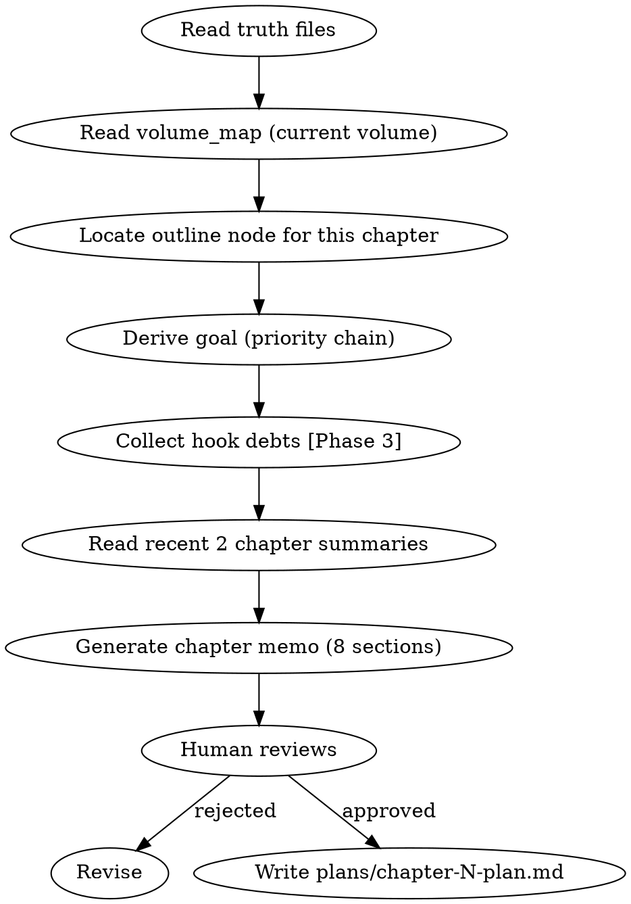

# 章节规划

HARD-GATE: 不得在没有章节备忘的情况下起草正文。

## 流程



## 数据契约

- **Reads:** `truth/current_state.md`, `truth/pending_hooks.md`, `truth/chapter_summaries.md`, `outline/volume_map.md`, `outline/story_frame.md`, `truth/current_focus.md`, `truth/author_intent.md`
- **Writes:** `plans/chapter-N-plan.md`
- **Updates:** none

## 铁律

1. **NO CHAPTER WITHOUT A MEMO** — 没有章节备忘就动笔 = 删除重来
2. **目标推导必须走优先级链** — 外部指令 > 局部覆盖 > 卷纲 Key Result > current_focus > author_intent
3. **黄金三章不降级** — 前 N 章的特殊纪律不可跳过

## 目标推导优先级链

```
外部指令 > 局部覆盖 > 卷纲 Key Result > current_focus.md > author_intent.md
```

高优先级覆盖低优先级。如果人类合作者给了具体指示，以指示为准。

## 章节备忘 8 段式

1. **当前任务** — 本章主角要完成的具体动作
2. **读者此刻在等什么** — 制造/延迟/兑现读者期待
3. **该兑现的 / 暂不掀的** — 伏笔兑现清单 + 压住不掀的底牌
4. **日常/过渡承担什么任务** — 非冲突段落的功能映射
5. **关键抉择过三连问** — Why / Interest / Persona
6. **章尾必须发生的改变** — 1-3条具体改变（信息/关系/物理/权力）
7. **本章 hook 账** — open / advance / resolve / defer 四种操作
8. **不要做** — 本章必须避免的事项（"无" / "N/A" 合法）

## 黄金三章纪律

前 N 章适用额外约束，N = `novel.json.golden_opening_chapters`（默认 3）：
- 第1章：三面墙（建立世界观约束）+ 信息钩子（结尾给出读者必须知道的答案的线索）
- 第2章：验证主角特殊性 + 建立第一个对手
- 第3章：第一次小高潮 + 打开大主线钩子
- 若 N > 3: Ch4+ 延续特殊纪律，直到第 N 章后转入常规流程

## Hook 账本硬规则

> **Phase 1 限制**: 在 foreshadowing-plant/track/resolve 实现前（Phase 3），`pending_hooks.md` 不存在或为空伏笔池。本章节 hook 账规则在 Phase 1 为**占位声明**——规划器输出 hook 账各段为占位符，context-composing 跳过 P3 伏笔简报，state-settling 不推进 hook 状态。Phase 3 引入伏笔系统后，以下规则从占位升级为可执行。

- `pressured` 或 `near_payoff` 状态且沉默 ≥5 章的 hook 必须 advance 或 resolve
- `core_hook=true` 且过期 >10 章升级为 critical
- 每章 hook 操作总量建议 ≤8（密度预算）

## Anti-Rationalization

| Excuse | Reality |
|--------|---------|
| "这章不需要备忘，直接写" | 没有备忘的章节 = 随意漂移的章节 |
| "备忘太死板了" | 备忘是地图，不是牢笼。有地图的旅程更快 |
| "读者不会注意到备忘偏离" | 备忘偏离 = 承诺未兑现 = 读者信任下降 |
| "hook 账本太麻烦" | 不追踪伏笔 = 伏笔遗忘 = Chase Power 债务暴增 |

## 输出

写 `plans/chapter-N-plan.md`，格式参见设计规范 Section 4.5。
