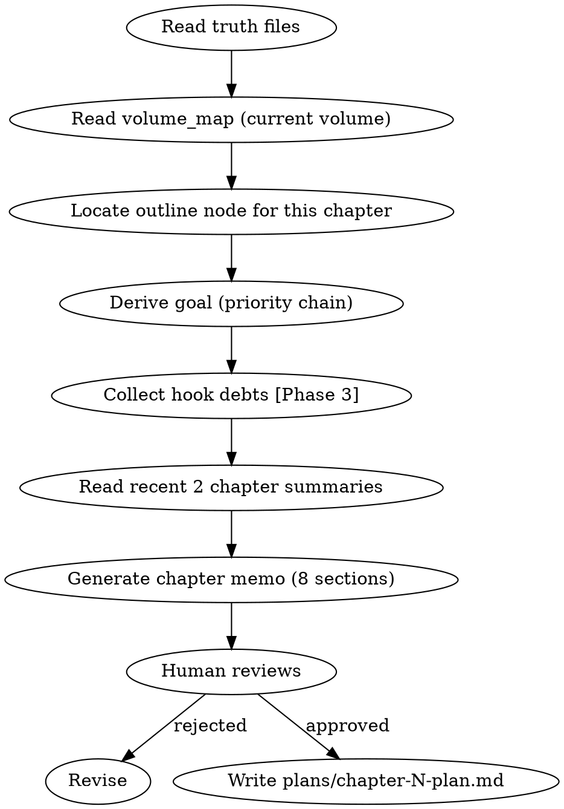

<!-- AUTO-CHECK-START -->

## auto-check (generated -- do not edit)

<!-- AUTO-CHECK-END -->

<!-- AUTO-GENERATED from frontmatter — do not edit -->

## 数据契约

- **Reads:** truth/current_state.md, truth/pending_hooks.md, truth/chapter_summaries.md, outline/volume_map.md, outline/story_frame.md, truth/current_focus.md, truth/author_intent.md
- **Writes:** plans/chapter-N-plan.md
- **Updates:** none

<!-- END AUTO-GENERATED -->

# 章节规划

HARD-GATE: 不得在没有章节备忘的情况下起草正文。

## 流程



## 铁律

1. **NO CHAPTER WITHOUT A MEMO** — 没有章节备忘就动笔 = 删除重来
2. **目标推导必须走优先级链** — 外部指令 > 局部覆盖 > 卷纲 Key Result > current_focus > author_intent
3. **黄金三章不降级** — 前 N 章的特殊纪律不可跳过
4. **每个备忘必须声明 chapter_role** — 驱动 review-resonance 校准阈值（spec §5.1）

## 目标推导优先级链

```
外部指令 > 局部覆盖 > 卷纲 Key Result > current_focus.md > author_intent.md
```

高优先级覆盖低优先级。如果人类合作者给了具体指示，以指示为准。

## 章节备忘 8 段式

1. **当前任务** — 本章主角要完成的具体动作，并显式声明目标来源优先级：
   - 输出中必须注明目标由哪个优先级层驱动（外部指令 / 局部覆盖 / 卷纲 Key Result / current_focus / author_intent）
   - 如果高层级给出的指令与低层级冲突，必须说明为何选择当前层级（如"外部指令要求本章引入新角色X，但与 current_focus 的'主角独自探索'冲突，以外部指令为准"）
   - 未注明优先级来源的备忘视为不完整
   - 首行必须声明 `chapter_role`（合法值：高潮/兑现 | 推进/转折 | 过渡/铺垫），驱动 review-resonance 校准阈值（spec §5.1）
2. **读者此刻在等什么** — 制造/延迟/兑现读者期待
3. **该兑现的 / 暂不掀的** — 伏笔兑现清单 + 压住不掀的底牌
4. **日常/过渡承担什么任务** — 非冲突段落的功能映射
5. **关键抉择过三连问** — Why / Interest / Persona
6. **章尾必须发生的改变** — 1-3条具体改变（信息/关系/物理/权力）
7. **本章 hook 账** — open / advance / resolve / defer 四种操作
8. **不要做** — 本章必须避免的事项（"无" / "N/A" 合法）

## 黄金三章纪律

前 N 章适用额外约束，N = `novel.json.golden_opening_chapters`（默认 3）：
- 第1章：三面墙（建立世界观约束）+ 信息钩子（结尾给出读者必须知道的答案的线索）
- 第2章：验证主角特殊性 + 建立第一个对手
- 第3章：第一次小高潮 + 打开大主线钩子
- 若 N > 3: Ch4+ 延续特殊纪律，直到第 N 章后转入常规流程

## Hook 账本硬规则

> **Phase 1 限制**: 在 foreshadowing-plant/track/resolve 实现前（Phase 3），`pending_hooks.md` 不存在或为空伏笔池。本章节 hook 账规则在 Phase 1 为**占位声明**——规划器输出 hook 账各段为占位符，context-composing 跳过 P3 伏笔简报，state-settling 不推进 hook 状态。Phase 3 引入伏笔系统后，以下规则从占位升级为可执行。

- `pressured` 或 `near_payoff` 状态且沉默 ≥5 章的 hook 必须 advance 或 resolve
- `core_hook=true` 且过期 >10 章升级为 critical
- 每章 hook 操作总量建议 ≤8（密度预算）
- **沉默推进铁律**: 如果存在处于沉默状态（连续 N>3 章仅执行 defer 操作）的活跃伏笔，本章必须对其中至少 1 条执行 advance（而非继续 defer）。连续 defer 超过 3 章的伏笔视为"僵尸伏笔"，应在 hook 账中标注并给出激活方案或 ABANDON 审批请求

## Anti-Rationalization

| Excuse | Reality |
|--------|---------|
| "这章不需要备忘，直接写" | 没有备忘的章节 = 随意漂移的章节 |
| "备忘太死板了" | 备忘是地图，不是牢笼。有地图的旅程更快 |
| "读者不会注意到备忘偏离" | 备忘偏离 = 承诺未兑现 = 读者信任下降 |
| "hook 账本太麻烦" | 不追踪伏笔 = 伏笔遗忘 = Chase Power 债务暴增 |

## 输出格式

输出到 `plans/chapter-N-plan.md`，使用以下 EXACT 8 段式结构。缺任意一段即为不合格输出。

**段标题校验规则**：输出必须包含以下 8 个段，且标题精确匹配：
1. `## 1. 当前任务`
2. `## 2. 读者此刻在等什么`
3. `## 3. 该兑现的 / 暂不掀的`
4. `## 4. 日常/过渡承担什么任务`
5. `## 5. 关键抉择过三连问`
6. `## 6. 章尾必须发生的改变`
7. `## 7. 本章 hook 账`
8. `## 8. 不要做`

### 段 1 模板：当前任务（必含优先级来源声明）

```markdown
## 1. 当前任务

chapter_role: 高潮

> 合法值：高潮/兑现 | 推进/转折 | 过渡/铺垫

**优先级来源**: [外部指令 / 局部覆盖 / 卷纲 Key Result / current_focus / author_intent]

**冲突说明**: [若高层级指令与低层级冲突，说明为何选择当前层级。无冲突则填"无"]

**本章主角要完成的具体动作**:
- [动作 1]
- [动作 2]
```

**不合格条件**: 未注明优先级来源。

> 注：未声明 `chapter_role` 或使用非合法值，视为不合格（G4.cp.missing_chapter_role）。

### 段 2 模板：读者此刻在等什么

```markdown
## 2. 读者此刻在等什么

**制造期待**: [本章新建的读者期待]
**延迟期待**: [本章故意不满足的期待]
**兑现期待**: [本章应兑现的已有期待]
```

### 段 3 模板：该兑现的 / 暂不掀的

```markdown
## 3. 该兑现的 / 暂不掀的

**兑现清单**:
- [伏笔/线索]: [兑现方式]

**压住的底牌**:
- [底牌]: [为何继续压住]
```

### 段 4 模板：日常/过渡承担什么任务

```markdown
## 4. 日常/过渡承担什么任务

- [任务]: [功能映射（信息铺设/角色塑造/气氛调节/节奏缓冲）]
```

### 段 5 模板：关键抉择过三连问

```markdown
## 5. 关键抉择过三连问

- **Why**: [角色为什么做这个选择？]
- **Interest**: [这个选择背后展现了什么利益/情感？]
- **Persona**: [这个选择是否符合角色人格？若偏离，为何偏离？]
```

### 段 6 模板：章尾必须发生的改变

```markdown
## 6. 章尾必须发生的改变

**至少列出 1 条，理想 2-3 条。第 3 章起至少包含 1 条 advance（推进）型改变**：

- [改变 1]: [类型: 信息/关系/物理/权力] [具体变化]
- [改变 2]: [类型: 信息/关系/物理/权力] [具体变化]
```

**可自动检查规则**：章号 > 3 时，至少 1 条改变的类型在 {信息, 关系, 物理, 权力} 中且非空。

### 段 7 模板：本章 hook 账（EXACT 表格列名）

使用以下 EXACT 列名。列名不匹配即为不合格：

```markdown
## 7. 本章 hook 账

| ID | 操作 | 推进方式 | 沉默章数 |
|----|------|---------|---------|
| H01 | advance | [本章如何推进此伏笔] | 0 |
| H02 | defer | [为何延迟] | 3 |
| H03 | resolve | [本章如何收束此伏笔] | 5 |
| H04 | open | [新种植伏笔] | — |
```

**列校验规则**:
- `操作` 仅允许：open / advance / resolve / defer
- `沉默章数` 为数字，open 操作填 "—"
- 全表至少 1 行，建议 ≤ 8 行（密度预算）

**可自动检查的沉默规则**：若存在 `操作=defer` 且 `沉默章数 ≥ 4` 的行，段 7 末尾必须附激活方案或 ABANDON 标注。

### 段 8 模板：不要做

```markdown
## 8. 不要做

- [事项 1]
- [事项 2]

若无则填"无"（"无" 和 "N/A" 为合法值）
```

**可自动检查的计数规则**：
| 检查项 | 规则 | 不合格条件 |
|--------|------|----------|
| 段完整性 | 8/8 段全部存在 | 缺任意段 |
| 段标题精确性 | 8 个段标题精确匹配规定字符串 | 标题偏差 |
| 优先级来源声明 | 段 1 含"优先级来源"字段且非空 | 缺失或为空 |
| chapter_role 声明 | 段含 `chapter_role:` + 合法值（高潮/兑现/推进/转折/过渡/铺垫） | 缺失或值非法 |
| 章尾改变数 | ≥ 1 条（第 3 章起 ≥ 1 条 advance 型） | 无改变或全为其他型 |
| hook 账列名 | ID/操作/推进方式/沉默章数 四列 | 列名不匹配 |
| hook 操作有效性 | 仅使用 open/advance/resolve/defer | 使用不允许值 |
| 沉默检测 | 无 defer + 沉默 ≥ 4 章的行（或已附激活方案） | 存在僵尸伏笔 |
