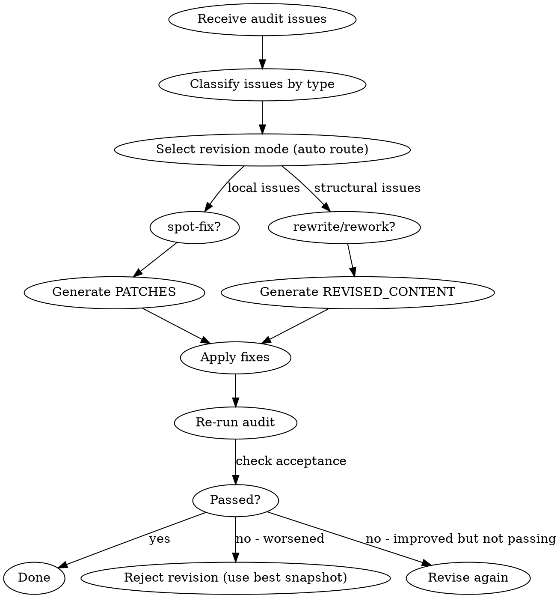

# 章节修订

## 流程



## 铁律

1. **只修审计发现的问题** — 不顺手改进无关内容
2. **修订不能恶化** — blocking/critical/AI痕迹三项均不能增加
3. **不超过 ±15% 长度变化** — 修订不是重写整章
4. **最多重试 3 次** — 3次修订后仍未通过，回退到最佳版本

## 修订模式选择

参考 `revision-modes.md` 获取完整的模式说明和路由规则。

默认使用 `auto` 模式，自动根据问题类型路由：
- 局部问题 → spot-fix（PATCHES）
- 结构问题 → rewrite（REVISED_CONTENT）
- 混合 → rewrite（保守策略）

## 修订接受条件

```markdown
## Acceptance Criteria

- [ ] blocking_count ≤ 修前值
- [ ] critical_count ≤ 修前值
- [ ] ai_tell_count ≤ 修前值
- [ ] 至少一项有改善
```

## 回退到最佳版本

3 次修订后仍未通过审计，按以下优先级选择最佳版本回退：
1. **审计分数最高** — blocking + critical + ai_tell 加权总和最低的版本
2. **分数相同时选最新** — 同等分数下选最近一次修订（更贴近人类合作者的最新意图）
3. **标记为 manual** — 回退后在章节文件中追加 `<!-- REVISION_FAILED: 3次修订未通过，已回退至最佳版本 -->`，通知人类合作者手动介入

## 输出

如果是 spot-fix：输出 PATCHES 格式，人类批准后应用到原文。
如果是 rewrite/rework：输出完整修订正文，人类批准后替换原章节文件。

## Anti-Rationalization

| Excuse | Reality |
|--------|---------|
| "修订会让文章更差" | 修订有严格的接受条件，恶化会被拒绝 |
| "直接全部重写更快" | 全部重写 = ±15% 限制失效 = 可能引入新问题 |
| "3次修不好就放弃" | 回退到最佳版本比继续恶化好 |
| "修订太慢了" | 修1章30分钟 vs 读者弃书无价 |
