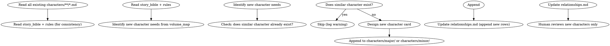

<!-- AUTO-CHECK-START -->

## auto-check (generated -- do not edit)

<!-- AUTO-CHECK-END -->

<!-- AUTO-GENERATED from frontmatter — do not edit -->

## 数据契约

- **Reads:** world/story_bible.md, world/rules.md
- **Writes:** characters/protagonist.md, characters/major/*.md, characters/minor/*.md, characters/relationships.md
- **Updates:** none

<!-- END AUTO-GENERATED -->

# Character Design Protocol

You must complete ALL FOUR phases in order. Each phase produces specific files.
No phase is optional. No character explicitly named in `outline/chapter_outline.md`
or `outline/three_act.md` may be omitted.

**职责边界**：本 skill **正向创建**角色档案（新小说，从 story_bible/story_frame 设计角色）。`shenbi-character-extraction` **反向提取**角色档案（已有手稿，从章节分析反推）。两者都写 `characters/*.md`，但方向相反——新小说用本 skill，导入已有作品用 extraction。

---

## Phase 1: Protagonist Depth Portrait
**Output:** `characters/protagonist.md`

Create a comprehensive protagonist profile with these required YAML frontmatter fields:
- name, role, personality_tags (>= 5), core_value, goal_surface, goal_deep
- fear, arc_type, arc_starting, arc_turning, arc_ending
- voice_profile: speech_patterns (>= 2), catchphrases (>= 1), avoid_patterns (>= 1)
- archetype_sources (see Archetype Requirements below)

### 角色档案格式

```markdown
---
name: 角色名
role: protagonist | major | minor
personality_tags: ["标签1", "标签2", "标签3"]
core_value: "核心价值观"
goal_surface: "表面目标"
goal_deep: "深层动机"
fear: "核心恐惧"
arc_type: GROWTH | FALL | FLAT | REDEMPTION
arc_starting: "起始状态"
arc_turning: "转折事件"
arc_ending: "终态（可为TBD）"
voice_profile:
  speech_patterns: ["模式1", "模式2"]
  catchphrases: ["口头禅"]
  avoid_patterns: ["避免的模式"]
archetype_sources:
  - name: <historical figure name>
    period: <era, e.g. "1930s Shanghai">
    traits_borrowed: [>= 3 specific traits]
    traits_discarded: [>= 2 specific traits]
    adaptation_rationale: <>= 100 characters explaining why this archetype
      was chosen and how it was adapted to the novel's world>
---
```

### 询问流程

1. 你的主角是什么样的人？（性格关键词）
2. 主角最想要什么？（表面 vs 深层）
3. 主角最害怕什么？
4. 有重要配角吗？他们和主角的关系是什么？
5. 有反派吗？反派的动机是什么？

**铁律 — 主角弧线单一权威**: 主角的成长弧线只写在 `characters/protagonist.md`，不在 story_bible 中重复。

---

## Phase 2: Major Supporting Character Portraits
**Output:** `characters/major/{slug}.md` (one per major character)

A character is MAJOR if they appear in >= 3 chapters with an independent arc.
Generate one `.md` file per major character identified from chapter_outline.md
and three_act.md.

Each major character file must include:

```yaml
name: <character name>
role: <e.g., mentor, antagonist, ally>
slug: <lowercase-hyphenated>
first_appearance_chapter: <number>
total_appearance_chapters: <count>
arc_summary: <one-line arc description>
archetype_sources:
  - name: <historical figure name>
    period: <era, e.g. "1930s Shanghai">
    traits_borrowed: [>= 3 specific traits]
    traits_discarded: [>= 2 specific traits]
    adaptation_rationale: <>= 100 characters explaining why this archetype
      was chosen and how it was adapted to the novel's world>
personality_tags: [>= 5]
relationship_to_protagonist: <description>
current_state: active
```

### Archetype Requirements (applies to ALL character files)
1. Prefer specific historical figures over abstract archetypes
   - GOOD: "Zhou Enlai 1930s Shanghai underground period"
   - BAD: "wise elder archetype"
2. 1-2 archetypes per character
3. Explicit borrow/discard: character is NOT a copy of the historical figure
4. Adapt to novel's world (skills -> world equivalents, social roles -> caste system mapping)
5. Avoid: overused figures (Napoleon, Caesar), mythological/fictional figures, living public figures

**铁律 — voice_profile 必填**: 每个主要角色必须有说话风格指纹（speech_patterns, catchphrases, avoid_patterns）。没有声音指纹的配角说话都一个味。

**铁律 — 一人一卡**: 每个角色独立文件，不把多个角色塞进同一个文件。

---

## Phase 3: Minor Character Registration
**Output:** `characters/minor/{slug}.md` (one per minor character)

A character is MINOR if they appear in 1-2 chapters or serve a functional role.
Generate one `.md` file per minor character.

Each minor character file must include at minimum:
```yaml
name: <character name>
slug: <lowercase-hyphenated>
first_appearance_chapter: <number>
role: <functional description>
personality_tags: [>= 3]
archetype_sources:
  - name: <historical figure name>
    period: <era>
    traits_borrowed: [>= 3]
    traits_discarded: [>= 2]
    adaptation_rationale: <>= 100 characters>
```

**铁律 — 去重原则**: 角色的性格底色只写在角色卡，不在关系文件中重复。minor 角色降智 = 毒点。

---

## Phase 4: Relationship Graph
**Output:** `characters/relationships.md`

Map all character-character relationships using slug-based references.
Each relationship pair must include:
- character_a (slug), character_b (slug)
- relationship_type (e.g., mentor-student, rivalry, alliance)
- intensity (1-5)
- key_exchange_summary (one paragraph)
- first_active_chapter
- last_active_chapter (or "ongoing")

Generate >= 3 relationship pairs. Include protagonist with each major character.

### relationships.md 格式

关系矩阵以表格形式维护：

```markdown
# 角色关系矩阵

| 角色 | 对主角 | 对反派 | 对师姐 |
|------|--------|--------|--------|
| 主角 | — | 敌对/竞争 | 信任/师徒 |
| 反派 | 蔑视/利用 | — | 昔日同门 |
```

---

## IRON LAW: Character Completeness

Before declaring completion, verify:
1. Every character explicitly named in `outline/chapter_outline.md` has a
   corresponding archive in either `characters/major/` or `characters/minor/`
2. Every character explicitly named in `outline/three_act.md` has an archive
3. `characters/major/` contains >= 3 `.md` files
4. `characters/minor/` contains >= 2 `.md` files
5. Every archive includes `archetype_sources` with >= 1 historical archetype,
   >= 3 borrowed traits, >= 2 discarded traits, and >= 100 char rationale

If any of these fail, go back and create the missing archives.

---

## Anti-Rationalization

| Excuse | Reality |
|--------|---------|
| "配角不需要 voice_profile" | 没有声音指纹的配角说话都一个味 |
| "角色关系后面自然就知道了" | 不写下来 = 3章后关系混乱，auditor 报 OOC |
| "主角弧线可以先不定义" | 没有弧线的主角 = 流水账主角 |
| "minor 角色随便写就行" | minor 角色降智 = 毒点 |

---

## 扩展模式 (--mode expand)

当 pipeline 在卷边界需要引入新角色时使用。与 genesis 模式 (全量创建) 不同:

- **reads 已有角色卡**: 读取 `characters/**/*.md` 全部已有角色,避免重复
- **只追加新角色**: 新角色 append 到 `characters/major/*.md` 或 `characters/minor/*.md`
- **更新关系矩阵**: 追加新关系到 `characters/relationships.md`
- **不碰已有角色**: 已有角色的弧线/voice_profile 不修改

### expand 模式流程



### expand 模式铁律

1. **只追加不修改** — 已有角色文件的任何字段不可修改
2. **去重检查** — 新角色不得与已有角色在性格/功能上高度重叠
3. **关系矩阵只追加行** — 不重写已有关系行
