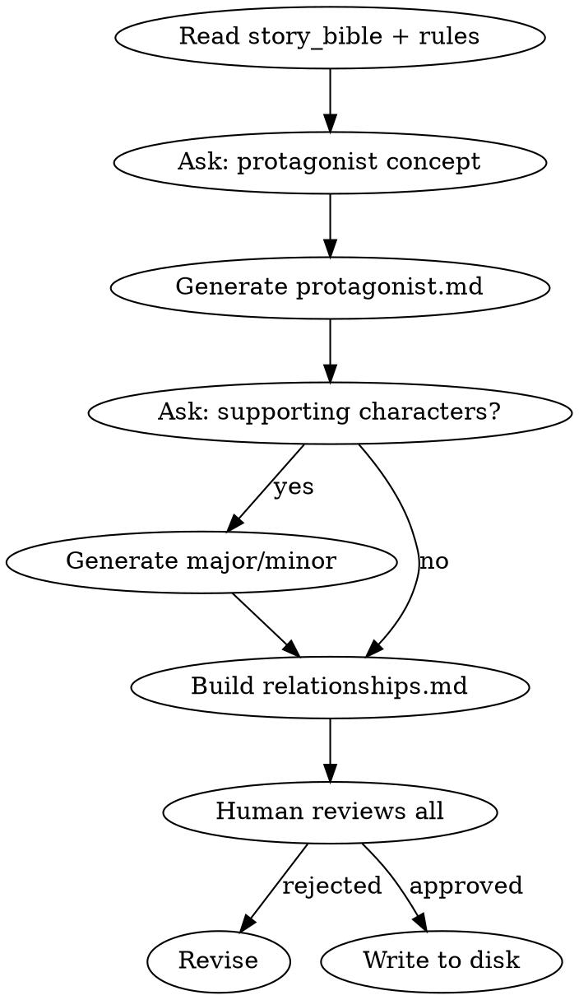

# 角色设计

## 流程



## 铁律

1. **一人一卡** — 每个角色独立文件，不把多个角色塞进同一个文件
2. **主角弧线单一权威** — 主角的成长弧线只写在 `characters/protagonist.md`，不在 story_bible 中重复
3. **voice_profile 必填** — 每个主要角色必须有说话风格指纹（speech_patterns, catchphrases, avoid_patterns）
4. **去重原则** — 角色的性格底色只写在角色卡，不在关系文件中重复

## 输出文件

| 文件 | 内容 |
|------|------|
| `characters/protagonist.md` | 主角档案（含 voice_profile） |
| `characters/major/*.md` | 主要角色档案（含 voice_profile） |
| `characters/minor/*.md` | 次要角色档案（简化版） |
| `characters/relationships.md` | 角色关系矩阵 |

### 角色档案格式

```markdown
---
name: 角色名
role: protagonist | major | minor
personality_tags: ["标签1", "标签2", "标签3"]
core_value: "核心价值观"
goal_surface: "表面目标"
goal_deep: "深层动机"
fear: "核心恐惧"
arc_type: GROWTH | FALL | FLAT | REDEMPTION
arc_starting: "起始状态"
arc_turning: "转折事件"
arc_ending: "终态（可为TBD）"
voice_profile:
  speech_patterns: ["模式1", "模式2"]
  catchphrases: ["口头禅"]
  avoid_patterns: ["避免的模式"]
---
```

### relationships.md 格式

关系矩阵以表格形式维护：

```markdown
# 角色关系矩阵

| 角色 | 对主角 | 对反派 | 对师姐 |
|------|--------|--------|--------|
| 主角 | — | 敌对/竞争 | 信任/师徒 |
| 反派 | 蔑视/利用 | — | 昔日同门 |
```

## Anti-Rationalization

| Excuse | Reality |
|--------|---------|
| "配角不需要 voice_profile" | 没有声音指纹的配角说话都一个味 |
| "角色关系后面自然就知道了" | 不写下来 = 3章后关系混乱，auditor 报 OOC |
| "主角弧线可以先不定义" | 没有弧线的主角 = 流水账主角 |
| "minor 角色随便写就行" | minor 角色降智 = 毒点 |

## 询问流程

1. 你的主角是什么样的人？（性格关键词）
2. 主角最想要什么？（表面 vs 深层）
3. 主角最害怕什么？
4. 有重要配角吗？他们和主角的关系是什么？
5. 有反派吗？反派的动机是什么？
