# 角色反向提取

从已分析章节反向提取角色档案。负责角色识别、性格还原、声音指纹、行为模式、关系网络。

## 流程

```dot
digraph character_extraction {
    "Read import/analysis/02_characters.md" -> "Read source chapters (per character appearances)";
    "Read source chapters" -> "For each character: extract identity + appearances";
    "For each character: extract identity + appearances" -> "Extract personality traits (from behavior + dialogue)";
    "Extract personality traits" -> "Extract speech patterns (catchphrases, sentence endings, register)";
    "Extract speech patterns" -> "Extract goal + fear + arc (from action patterns)";
    "Extract goal + fear + arc" -> "Extract relationship network (with other characters)";
    "Extract relationship network" -> "Generate character card";
    "Generate character card" -> "Cross-check with relationship_map for consistency";
    "Cross-check" -> "Write to characters/";
}
```



## 数据契约

- **Reads:** `import/analysis/02_characters.md`, 源 `chapters/*.md`, `import/analysis/04_plot.md`
- **Writes:** `characters/protagonist.md`, `characters/major/*.md`, `characters/minor/*.md`, `characters/relationships.md`
- **Updates:** 无（导入阶段写新文件，不修改原 `characters/`）

## 铁律

1. **基于行为，不基于评价** — 性格标签必须能从角色在文中的行为/对话推导出
2. **声音指纹必须有原文证据** — 每个 speech_patterns 至少 1 个原文例句
3. **主角弧线必须有变化证据** — 弧线起点/终点都需要从章节行为中找证据
4. **关系必须有互动证据** — 每对关系至少 1 次明确的互动场景
5. **未确认项必标** — 推不出的填"未确认"，不编造

## 提取维度

### 1. 身份与外貌

- 姓名、称谓、身份（职业/地位/关系）
- 外貌特征（仅限文中明确描写）

### 2. 性格标签

从以下证据反推：
- 行动选择（在压力下的反应）
- 对话方式（用词、句式、语气）
- 内心独白（如有）
- 他人评价

每个标签 3-5 个，不超 8 个。

### 3. 声音指纹

| 维度 | 提取方法 |
|------|---------|
| 句长偏好 | 该角色所有对话的句长均值 |
| 词汇倾向 | 高频用词 + 避用词 |
| 句末习惯 | 句末常用语气词 |
| 修辞 | 比喻/反问/直白/含蓄 |
| 称呼 | 对不同对象的称呼 |
| 口头禅 | catchphrases 列表 |

### 4. 目标与恐惧

- 表面目标：从角色的主动行动反推
- 深层动机：从角色在关键时刻的选择反推
- 核心恐惧：从角色回避的事/反应过度的事反推

### 5. 弧线

| 阶段 | 证据 |
|------|------|
| 起点 | 第 X 章的状态 |
| 转折 | 第 Y 章的关键事件 |
| 终点 | 末章状态（若已完结） |

### 6. 关系网络

每对关系记录：
- 关系类型
- 首次互动章节
- 关键互动章节
- 关系状态变化轨迹

## 输出格式

### 主角档案

写入 `characters/protagonist.md`：

```markdown
---
name: 角色名
role: protagonist
personality_tags: ["标签1", "标签2", "标签3"]
core_value: "核心价值观（从行为反推）"
goal_surface: "表面目标"
goal_deep: "深层动机"
fear: "核心恐惧"
arc_type: GROWTH | FALL | FLAT | REDEMPTION
arc_starting: "起始状态"
arc_turning: "转折事件"
arc_ending: "终态（若已完结，否则 TBD）"
voice_profile:
  speech_patterns: ["模式1", "模式2"]
  catchphrases: ["口头禅"]
  avoid_patterns: ["避免的模式"]
evidence:
  - claim: "性格标签 X"
    chapter: N
    quote: "原文摘录"
---

# 角色名

[基于提取结果的散文式角色描述]

## 关键行为轨迹

- 第N章: [关键行为 + 对应性格证据]
- 第M章: ...

## 声音指纹

[句长均值、词汇倾向、句末习惯等的客观描述]

## 关系网络

- 角色A: [关系类型] [首次互动] [关键互动]
- 角色B: ...
```

### 主要/次要角色

类似主角档案，但 personality_tags 较少（2-3 个），voice_profile 可简化（minor 可省略 catchphrases）。

### 关系矩阵

写入 `characters/relationships.md`：

```markdown
# 角色关系矩阵（反向提取）

## 来源

基于 `import/analysis/02_characters.md` 反向提取

## 主要关系

| 角色A | 角色B | 关系类型 | 首次互动 | 关键互动 | 当前状态 |
|-------|-------|---------|---------|---------|---------|
| 主角 | 反派 | 敌对 | 第3章 | 第15章 | 升温 |
| 主角 | 师姐 | 师徒 | 第1章 | 第8章 | 信任 |

## 关系演化

[按章节列出的关系变化时间线]
```

## 汇总

```markdown
## 角色反向提取汇总

**写入文件**: `characters/*.md`, `characters/relationships.md`
**提取时间**: YYYY-MM-DD

### 角色统计

| 角色 | role | 性格标签数 | 声音指纹 | 弧线 |
|------|------|----------|---------|------|
| [名] | protagonist | N | 完整 | 完整 |
| [名] | major | N | 完整 | 完整 |
| [名] | minor | N | 简化 | 简化 |

### 证据完整度

- 完整（所有标签有原文证据）: X 个
- 部分（部分标签有证据）: Y 个
- 待补: Z 个

### 关系矩阵

- 总关系对: N
- 有原文证据的: M 对

### 待人类确认

- [ ] 性格标签是否符合阅读感受？
- [ ] 声音指纹是否能与原文对话匹配？
- [ ] 弧线终点是否准确？
```

## Anti-Rationalization

| Excuse | Reality |
|--------|---------|
| "LLM 直接写角色卡更快" | LLM 写 = 编造；反向提取 = 可验证 |
| "声音指纹凭印象" | 凭印象 = 复制不准确 = 后续写作失真 |
| "性格标签不用每条都有证据" | 无证据的标签 = 后续章节的 OOC 隐患 |
| "主角弧线后补" | 弧线 = 主角的灵魂；后补 = 角色失魂 |
