<!-- AUTO-CHECK-START -->

## auto-check (generated -- do not edit)

### invariants

- hook debt has paths
- nine sections
- no 3 consecutive endings

<!-- AUTO-CHECK-END -->

<!-- AUTO-GENERATED from frontmatter — do not edit -->

## 数据契约

- **Reads:** plans/chapter-N-plan.md, truth/book_spine.md, truth/book_strata.md, truth/volume_summaries.md, truth/arcs/arc-N.md, truth/chapter_summaries.md, truth/pending_hooks.md, truth/audit_drift.md, world/rules.md, truth/character_matrix.md, style/style_profile.md, chapters/chapter-N.md
- **Writes:** none
- **Updates:** none

<!-- END AUTO-GENERATED -->

# 上下文组装

HARD-GATE: chapter-drafting 的输入**必须**是 context-composing 产出的上下文包，不可直接读扁平 outline 文件。绕过 context-composing = 丢失分层记忆 = 长程失忆。

分层记忆架构下，上下文按层（L5→L1）组装，使窗口大小有界，与全书总字数无关。

## 上下文优先级（按层组装）

分层记忆架构下，上下文按层加载，使窗口大小有界（与全书总字数无关）：

| 优先级 | 层 | 来源 | 裁剪规则 |
|--------|----|------|---------|
| P1 | - | plans/chapter-N-plan.md | 不裁剪 |
| P2 | L5 | truth/book_spine.md | 不裁剪（常青，~1页） |
| P3 | L4 | truth/book_strata.md（当前大弧段） | 不裁剪 |
| P4 | L3 | truth/volume_summaries.md（当前卷） | 不裁剪 |
| P5 | L2 | truth/arcs/arc-N.md（当前弧） | 不裁剪 |
| P6 | L1 | truth/chapter_summaries.md（近8章拍点） | 仅取近8章 |
| P7 | - | world/rules.md（最多5条）+ style/style_profile.md | nice，先裁剪 |

## 流程

```dot
digraph context_composing {
    "Read chapter plan (P1)" -> "Load L5: book_spine.md (P2)";
    "Load L5: book_spine.md (P2)" -> "Load L4: book_strata.md current stratum (P3)";
    "Load L4 (P3)" -> "Load L3: volume_summaries.md current volume (P4)";
    "Load L3 (P4)" -> "Load L2: arcs/arc-N.md current arc (P5)";
    "Load L2 (P5)" -> "Load L1: chapter_summaries.md near 8 chapters (P6)";
    "Load L1 (P6)" -> "Load P7: world/rules.md (max 5) + style/style_profile.md";
    "Load P7" -> "Check near-chapter endings (avoid repetition)";
    "Check near-chapter endings" -> "Present context to human";
    "Present context to human" -> "Proceed to chapter-drafting";
}
```



## Pipeline 集成模式

当由 pipeline 编排时,`context/chapter-N-context.md` 已由 `pipeline-context-assemble` 预先组装 (三路检索 + 确定性重排)。本 skill 在 pipeline 模式下:

1. **接收预检索包**: 读取 `context/chapter-N-context.md` 作为主要输入
2. **策展层职责**: 去重 (残留重复) / 冲突检测 / 按 budget 裁剪
3. **不重复检索**: 不再自行从 truth files 加载 (orchestrator 已完成)
4. **输出**: 策展后的上下文包覆写到 `context/chapter-N-context.md`

非 pipeline 模式 (直接 dispatch) 时,保持现有行为:自行按 P1-P7 加载。

## 铁律

1. **优先级严格递减** — P1 不可省略，P7 最先被裁剪。L5-L2 缺失层跳过加载（爬坡期，§3.2.1），不报错
2. **近章结尾轨迹** — 收集近 3 章的结尾方式（从 `chapters/chapter-(N-3).md` 到 `chapters/chapter-(N-1).md` 的末段），避免连续相同结尾结构（如连续3个崩塌式结尾）。此检查独立于 P6 拍点收集——拍点提供叙事脉络，结尾轨迹检查章尾模式多样性
3. **不自动检索** — 这是手动组装指南，由 AI 或人类按优先级从文件读取
4. **结尾分析必读原文** — 近章结尾多样性检查必须读取实际章节文件（`chapters/chapter-(N-3).md` 到 `chapters/chapter-(N-1).md`）的末段文本，严禁以摘要（`chapter_summaries.md`）作为结尾分析的代理。摘要不包含结尾结构信息，无法判断连续闭环/开放型结尾模式
5. **伏笔数据溯源** — Hook 债务简报的跨弧主线钩子（MH*）来自 P2 书脊（`truth/book_spine.md` 的 master hooks），弧内本地钩子（H*）来自 P5 当前弧段（`truth/arcs/arc-N.md`）。爬坡期书脊尚未产出 master hooks 时，从 `truth/pending_hooks.md` 读取。不得从章节计划（`plans/chapter-N-plan.md`）中提取伏笔信息

## 爬坡期处理（章节 1-35）

前36章内，L2/L3/L4 尚未产出（首个L2在第12章，首个L4在第36章，首个L3在卷边界）。爬坡期规则：

- **缺失层不报错，跳过加载。** 按层逐层尝试加载，若文件不存在则跳过（不填充占位）。
- **爬坡期用 L1 近章拍点补偿。** 前12章无 L2 时，L1 取近章范围扩大到近12章（而非8章）。
- **爬坡期窗口较小（~3000-6000字），非缺陷。** 稳态窗口（~10,700字）从第36章起达成。

## Hook 债务简报

分层模型下，伏笔分两级追踪：

- **跨弧主线钩子（MH*）** — 来自 P2 书脊 `truth/book_spine.md` 的 master hooks，追踪跨大弧的长程钩子状态。
- **弧内本地钩子（H*）** — 来自 P5 当前弧段 `truth/arcs/arc-N.md` 的弧内伏笔兑现/推进记录。
- **爬坡期回退** — 书脊 master hooks 尚未产出时（章节 < 首个卷边界），从 `truth/pending_hooks.md` 读取全量 hook 作为回退。

以简报形式呈现：

```markdown
## Hook 债务简报

### 主线钩子（MH*，来源：book_spine）

| Hook ID | 内容 | 状态 | 最后推进章 | 声明兑现卷 | 沉默章数 | 操作建议 |
|---------|------|------|----------|----------|---------|---------|
| MH01 | 前穿越者失败教训 | ADVANCED | 12 | 第二卷 | 5 | advance |
| MH02 | 灵能金手指上限 | PLANTED | 5 | 第三卷 | 12 | URGENT advance |

### 弧内钩子（H*，来源：当前弧段）

| Hook ID | 内容 | 状态 | 最后推进章 | 沉默章数 | 操作建议 |
|---------|------|------|----------|---------|---------|
| H01 | 灵能知识驱动特性 | PLANTED | 3 | 14 | advance |
```

紧迫度 = (current_chapter - last_reinforced) / max_distance

## 输出格式

输出上下文组装结果，必须使用以下 EXACT 节标题。缺少任意一节 = 不合格。

### EXACT 节标题（9/9 必须）

输出的 markdown 必须包含以下 H2 标题，按此顺序：

1. `## P1 章节备忘`
2. `## P2 书脊（L5）`
3. `## P3 当前大弧（L4）`
4. `## P4 当前卷摘要（L3）`
5. `## P5 当前弧段（L2）`
6. `## P6 近章拍点（L1）`
7. `## P7 世界铁律与文风`
8. `## 近章结尾多样性`
9. `## Hook 债务简报`

**不合格条件**：缺任意一节，或使用旧的 P3 活跃伏笔/P5 世界铁律标题。

### ## 近章结尾多样性 模板

必须读取实际章节文件末段（铁律 4），不得以摘要替代。

| 章节 | 文件路径 | 结尾方式 | 末段首句（前 20 字） |
|------|---------|---------|-------------------|
| N-3 | `chapters/chapter-(N-3).md` | hook | ... |
| N-2 | `chapters/chapter-(N-2).md` | transition | ... |
| N-1 | `chapters/chapter-(N-1).md` | cliffhanger | ... |

**不合格条件**：连续 ≥ 3 章同结尾方式，或数据来源未引用实际章节文件。

### ## Hook 债务简报 模板

主线钩子（MH*）数据来源：`truth/book_spine.md`；弧内钩子（H*）数据来源：`truth/arcs/arc-N.md`。爬坡期回退数据来源：`truth/pending_hooks.md`。每行必须包含文件路径。

| Hook ID | 内容 | 状态 | 最后推进章 | 沉默章数 | 操作建议 | 数据来源 |
|---------|------|------|----------|---------|---------|---------|
| MH01 | 前穿越者失败教训 | ADVANCED | 12 | 5 | advance | `truth/book_spine.md` |
| H01 | 灵能知识驱动特性 | PLANTED | 3 | 14 | advance | `truth/arcs/arc-1.md` |

**数据来源列**：每行必须包含文件路径。缺失 = 不合格。

### 可自动检查的计数规则

| 检查项 | 规则 | 不合格条件 |
|--------|------|----------|
| 节标题数 | = 9 | < 9 |
| Hook 债务简报数据来源 | 每条有文件路径 | 任意条目缺失 |
| 主线钩子来源文件 | `truth/book_spine.md` | 使用章节计划文件 |
| 弧内钩子来源文件 | `truth/arcs/arc-N.md` 或爬坡期 `pending_hooks.md` | 使用章节计划文件 |
| 近章结尾来源 | 引用 chapters/chapter-*.md 原文 | 使用摘要文件替代 |
| 近章结尾连续同类型 | ≤ 2 | ≥ 3 |

## Anti-Rationalization

| Excuse | Reality |
|--------|---------|
| "不需要收集这么多上下文" | 上下文不足 = 每章都在重新发明设定 |
| "近章结尾不需要检查" | 不检查 = 连续3个"轰然崩塌"式结尾 |
| "hook 债务简报可以省略" | 不看债务 = 过期伏笔 = 读者信任流失 |
| "爬坡期没有 L4，跳过大弧层就行" | 缺失层跳过加载，但 L1 近章范围须扩大补偿 |
| "主线钩子和弧内钩子混着列就行" | MH* 来自书脊、H* 来自弧段，分级追踪才能定位长程债务 |
