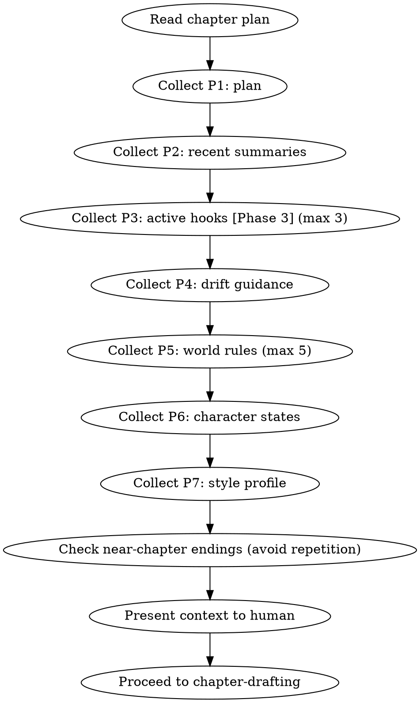

# 上下文组装

## 流程



## 数据契约

- **Reads:** `plans/chapter-N-plan.md`, `truth/chapter_summaries.md`, `truth/pending_hooks.md`, `truth/audit_drift.md`, `world/rules.md`, `truth/character_matrix.md`, `style/style_profile.md`, `chapters/chapter-(N-3).md` through `chapters/chapter-(N-1).md`
- **Writes:** none (assembles context for drafting)
- **Updates:** none

## 铁律

1. **优先级严格递减** — P1 不可省略，P7 最先被裁剪
2. **近章结尾轨迹** — 收集近 3 章的结尾方式（从 `chapters/chapter-(N-3).md` 到 `chapters/chapter-(N-1).md` 的末段），避免连续相同结尾结构（如连续3个崩塌式结尾）。此检查独立于 P2 摘要收集——摘要提供叙事脉络，结尾轨迹检查章尾模式多样性
3. **不自动检索** — 这是手动组装指南，由 AI 或人类按优先级从文件读取

## 上下文优先级

| 优先级 | 来源 | 文件位置 | 裁剪规则 |
|--------|------|---------|---------|
| P1 (must) | 章节备忘 | `plans/chapter-N-plan.md` | 不裁剪 |
| P2 (must) | 近 2 章摘要 | `truth/chapter_summaries.md` 末尾 | 不裁剪。第 1 章跳过此项，第 2 章只取近 1 章 |
| P3 (need) | 活跃伏笔 | `truth/pending_hooks.md` | 最多 3 条，按紧迫度排序 |
| P4 (need) | 纠偏指导 | `truth/audit_drift.md` | 不裁剪 |
| P5 (nice) | 世界铁律 | `world/rules.md` | 最多 5 条 |
| P6 (nice) | 角色状态 | `truth/character_matrix.md` | 仅本章出场角色 |
| P7 (nice) | 文风指纹 | `style/style_profile.md` | 仅摘要部分 |

## Hook 债务简报

从 pending_hooks.md 提取以下信息，以简报形式呈现：

```markdown
## Hook 债务简报

| Hook ID | 内容 | 状态 | 沉默章数 | 操作建议 |
|---------|------|------|---------|---------|
| hook-001 | 玉佩秘密 | PLANTED | 4/20 | advance |
| hook-002 | 老人预言 | RELEVANT | 2/15 | advance |
| hook-005 | 师姐身世 | PLANTED | 8/12 | URGENT advance |
```

紧迫度 = (current_chapter - last_reinforced) / max_distance

## Anti-Rationalization

| Excuse | Reality |
|--------|---------|
| "不需要收集这么多上下文" | 上下文不足 = 每章都在重新发明设定 |
| "近章结尾不需要检查" | 不检查 = 连续3个"轰然崩塌"式结尾 |
| "hook 债务简报可以省略" | 不看债务 = 过期伏笔 = 读者信任流失 |
