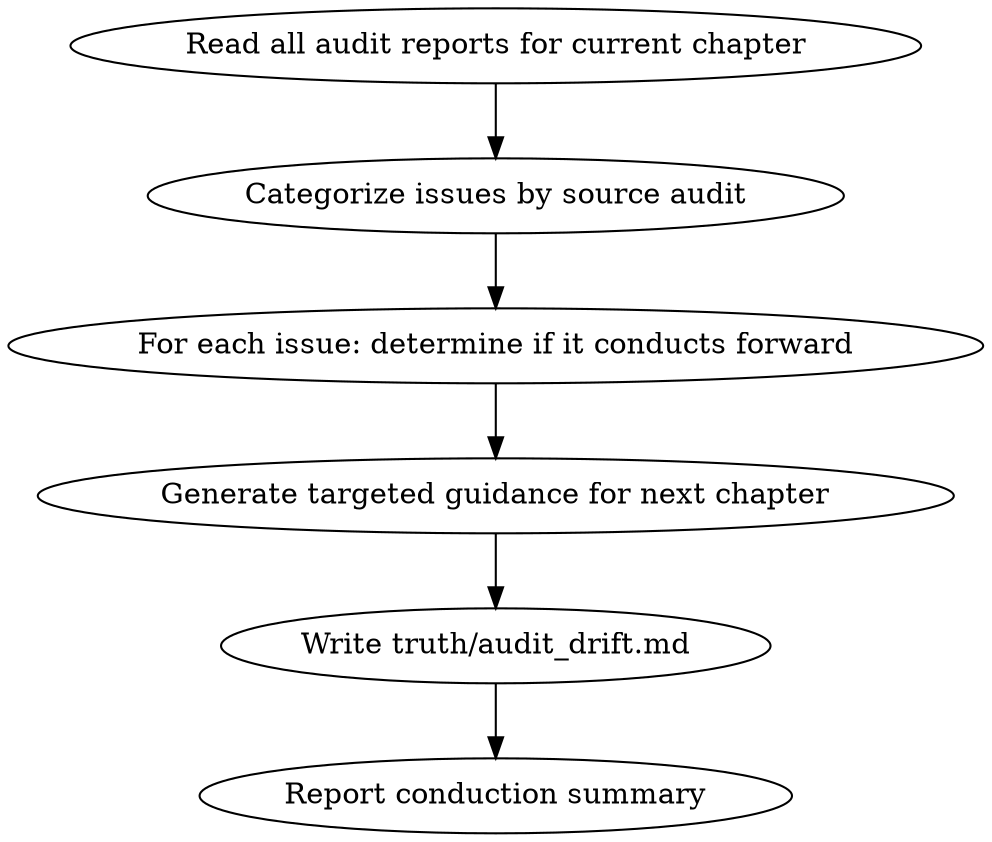

<!-- AUTO-GENERATED from frontmatter — do not edit -->

## 数据契约

- **Reads:** chapters/chapter-N.md, audits/chapter-N-*.md
- **Writes:** truth/drift_guidance.md
- **Updates:** truth/audit_drift.md

<!-- END AUTO-GENERATED -->

# 审计纠偏传导

把当前章节的审计问题转化为下一章的写作指导，写入 `truth/audit_drift.md`，在 context-composing 阶段自动导入。

## 流程



## 铁律

1. **独立评分** — 本 skill 产出评分/审核判断，必须在 context-cleaned 独立 subagent 执行；drafting/planning agent 不得执行本 skill（spec §8.1）
2. **error 级别不传导** — error 必须在当前章修订中修复，修复后不传导
3. **warning 级别传导** — warning 可以传导给下一章（如"转折词密度偏高→下章注意"）
4. **每条传导必须指定目标章节** — `targeted_chapter` 字段不可省略
5. **累积传导 ≤ 5 条** — 过多传导 = 审计噪音，下章无法消化

## 传导规则

### 不传导的类型（必须当前章修复）
- 破折号、错别字、具体措辞问题 → 当前章润色或修订
- 结构性问题（段落次序、场景缺失）→ 当前章修订
- 任何 error 级别问题 → 当前章修订

### 可传导的类型（可写入 audit_drift.md）
- 风格趋势（转折词偏高、段落偏长、句长变异不足）
- 伏笔提醒（某条伏笔下章需要强化或兑现）
- 节奏趋势（连续 N 章无爆发、连续 N 章为同一类型）
- 角色弧线（连续 N 章无情感变化、关系动态停滞）

## 执行步骤

1. 读取当前章节所有审计报告（continuity / character / pacing / foreshadowing / anti-ai 等）
2. 按来源审计归类所有问题
3. 对每条问题判断：是 error 还是 warning，是否属于可传导类型
4. 对可传导项生成具体写作指导（"下章应做什么"，而非"上章错在哪"）
5. 检查累积传导数量，若超过 5 条则按"影响下章质量风险"排序取前 5
6. 写入 `truth/audit_drift.md`（YAML frontmatter 格式）
7. 输出传导汇总，供 human partner 核对

## 输出格式

### 写入 `truth/audit_drift.md`

```markdown
---
chapter: 5
drift_items:
  - source_audit: review-pacing
    severity: warning
    issue: "连续3章无 FIRE，下章建议安排爆发点"
    guidance: "第6章建议在章中或章末安排一个读者可见的阶段性成果（如通过内门考核第一轮）"
    targeted_chapter: 6
  - source_audit: review-anti-ai
    severity: warning
    issue: "转折词密度偏高（4次/3000字）"
    guidance: "第6章起草时目标转折词 ≤ 3次，优先用动作推进替代然而/突然"
    targeted_chapter: 6
---
```

### 传导汇总（输出到 human partner）

```markdown
## 审计纠偏传导汇总

**当前章节**: 第N章
**写入文件**: `truth/audit_drift.md`
**传导条目数**: X / 5

### 已传导项

| # | 来源审计 | 严重度 | 目标章 | 摘要 |
|---|---------|--------|--------|------|
| 1 | review-pacing | warning | N+1 | 连续3章无FIRE |
| 2 | review-anti-ai | warning | N+1 | 转折词密度偏高 |

### 未传导项（已在当前章修订中处理）

- [ERROR] review-continuity 第3段时间矛盾 → 当前章修订
- [ERROR] review-character 林轩动机偏移 → 当前章修订
```

## Anti-Rationalization

| Excuse | Reality |
|--------|---------|
| "下章自然会注意这些问题" | 没有明确指导，问题会在下章重复出现 |
| "传导太多条了，反正也记不住" | 最多5条，每条指向具体改进项 |
| "warning不重要，不需要传导" | warning趋势持续 = 5章后变成error |
