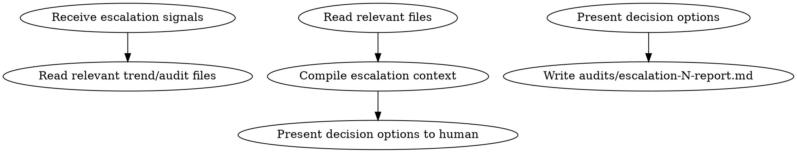

<!-- AUTO-GENERATED from frontmatter — do not edit -->

## 数据契约

- **Reads:** truth/resonance_trend.md, audits/volume-N-score.md, audits/arc-N-score.md, audits/stratum-N-score.md, audits/chapter-N-sensitivity.md
- **Writes:** audits/escalation-N-report.md
- **Updates:** none

<!-- END AUTO-GENERATED -->

# 人工升级审查

仅在 escalation_check 返回非空信号时触发。汇总升级原因 + 相关评分数据，呈交人工决策。

## 流程



## 铁律

1. **只读不评** — 不产生评分，只汇总升级上下文供人工决策
2. **决策选项明确** — 每个升级给出 2-3 个具体选项

## 输出格式

```markdown
## 升级审查报告

**触发信号**: [signal type]
**触发时间**: YYYY-MM-DD
**相关章节/卷/弧**: N

### 升级上下文
[触发条件的完整数据]

### 决策选项
1. 接受现状，继续自动批
2. 回滚到第N章快照，手动修订
3. 手动修订当前产出
```
