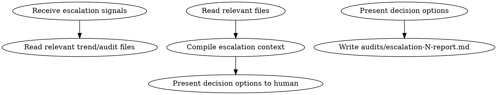

<!-- AUTO-CHECK-START -->

## auto-check (generated -- do not edit)

<!-- AUTO-CHECK-END -->

<!-- AUTO-GENERATED from frontmatter — do not edit -->

## 数据契约

- **Reads:** truth/resonance_trend.md, audits/chapter-N-sensitivity.md, truth/volume_score_trend.md, truth/arc_payoff_trend.md, audits/stratum-*-score.md
- **Writes:** audits/escalation-N-report.md
- **Updates:** none

<!-- END AUTO-GENERATED -->

# 人工升级审查

仅在 `run_escalation_check`（`src/shenbi/orchestration/escalation_bridge.py`）返回非空信号时触发。汇总升级原因 + 相关评分数据，呈交人工决策。

## 流程


```dot
digraph escalation_review {
    "Receive escalation signals" -> "Read relevant trend/audit files";
    "Read relevant files" -> "Compile escalation context";
    "Compile escalation context" -> "Present decision options to human";
    "Present decision options" -> "Write audits/escalation-N-report.md";
}
```

## 铁律

1. **只读不评** — 不产生评分，只汇总升级上下文供人工决策
2. **决策选项明确** — 每个升级给出 2-3 个具体选项

## Anti-Rationalization

| Excuse | Reality |
|--------|---------|
| "信号只是轻微超标，自动处理掉就行" | 升级信号 = 触发条件已满足。绕过人工审查 = 破坏升级桥契约 |
| "数据不全，先凭已有部分下结论" | 只读不评。你的职责是完整汇总上下文，决策权在人类伙伴 |
| "趋势文件看起来正常，不用读了" | 不读全 reads 清单 = 汇总缺角 = 人类基于残缺信息决策 |
| "报告里顺便给个建议评分" | 本技能不产生评分。评分归属 score-* 技能，越界 = 契约违规 |
| "决策选项太麻烦，列一个就行" | 每个升级必须给出 2-3 个具体选项。单一选项 = 伪决策 |

## 输出格式

```markdown
## 升级审查报告

**触发信号**: [signal type]
**触发时间**: YYYY-MM-DD
**相关章节/卷/弧**: N

### 升级上下文
[触发条件的完整数据]

### 决策选项
1. 接受现状，继续自动批
2. 回滚到第N章快照，手动修订
3. 手动修订当前产出
```
