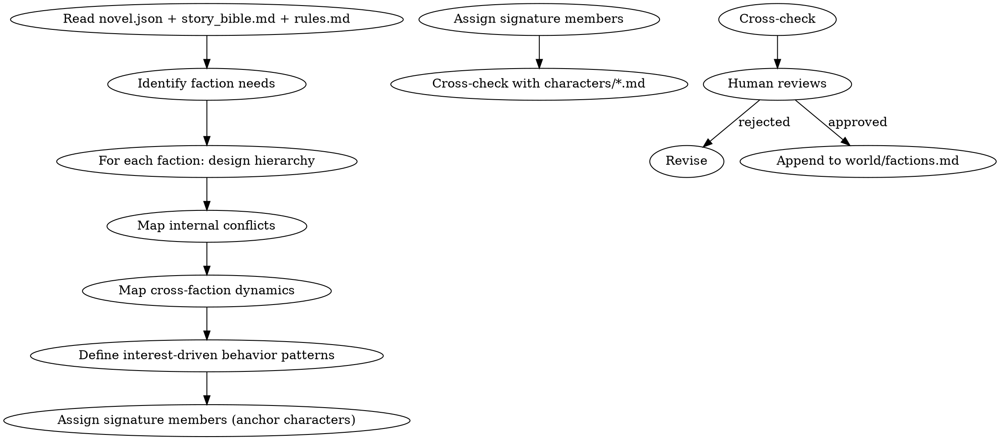

<!-- AUTO-GENERATED from frontmatter — do not edit -->

## 数据契约

- **Reads:** novel.json, world/story_bible.md, world/rules.md, characters/**/*.md, outline/story_frame.md
- **Writes:** none
- **Updates:** world/factions.md

<!-- END AUTO-GENERATED -->

# 势力构建

设计小说中的势力组织。负责层级结构、内部矛盾、跨势力动态、利益驱动行为。

## 流程



## 铁律

1. **利益驱动行为** — 势力的公开行为必须有可解释的利益逻辑，禁止"为反而反"
2. **内部必有矛盾** — 健康的势力必须存在至少 1 个内部派系分歧；铁板一块 = 失真
3. **跨势力动态必有** — 至少 2 个势力有明确的合作/竞争/中立关系
4. **散文描写 + 表格补充** — 主体以散文叙述，势力属性用表格压缩呈现

## 核心维度

### 1. 层级结构

- 顶层：领袖（教主/掌门/CEO）的权力来源和制衡
- 中层：核心长老/部门主管的派系归属
- 基层：普通成员的来源和晋升路径
- 暗层：隐藏的权力（影子议会/太上长老/外部股东）

### 2. 内部矛盾

至少 1 个持续的内部张力：

| 矛盾类型 | 示例 |
|---------|------|
| 路线之争 | 鹰派 vs 鸽派 |
| 继承之争 | 大弟子 vs 二弟子 |
| 资源之争 | 资源分配不公 |
| 派系之争 | 外来派 vs 本土派 |
| 理念之争 | 改革 vs 保守 |

### 3. 跨势力动态

至少 2 类显式关系：

- **盟友**: 利益一致或被绑定（同盟/附庸/联姻）
- **竞争**: 资源/地盘/理念冲突
- **中立**: 当前无利益纠葛
- **敌对**: 历史仇恨或根本利益冲突

### 4. 利益驱动行为模式

每个势力必须有"在 X 情况下会做 Y"的规则：

- 受到攻击 → 报复机制
- 内部危机 → 权力反应
- 外部机遇 → 扩张倾向
- 资源短缺 → 优先取舍

## 输出格式

### 文件 1: `world/factions.md`（每个势力独立一节）

每个势力使用以下 EXACT 节标题。缺任意一节即为不合格输出，可被 G4 检查器自动拒绝。

**节标题校验规则**：输出必须包含且仅按此顺序包含：
1. `## 势力：{name}` — H2，势力名替换 {name}
2. `### 层级结构` — H3
3. `### 内部矛盾` — H3
4. `### 跨势力动态` — H3
5. `### 利益驱动` — H3
6. `### 行为预测` — H3
7. `### 锚点角色` — H3

```markdown
---

## 势力：{name}

**类型**: [门派/公司/政府/帮派/...]
**总部**: [地点]
**实力评级**: [相对其他势力的位置]
**创建时间**: [设定内的历史时间]
**当前领袖**: [角色名]

### 层级结构

[描述顶层/中层/基层/暗层四层权力结构。必须列出每层的职衔、人数范围、派系归属]

### 内部矛盾

[至少 3 个持续的内部张力，每个注明：矛盾类型、激化程度、关键人物]

| # | 矛盾类型 | 激化程度 | 关键人物 | 潜在引爆点 |
|---|---------|---------|---------|----------|
| 1 | 路线/继承/资源/派系/理念 | 潜伏/升温/爆发 | [角色名] | [触发条件] |
| 2 | 路线/继承/资源/派系/理念 | 潜伏/升温/爆发 | [角色名] | [触发条件] |
| 3 | 路线/继承/资源/派系/理念 | 潜伏/升温/爆发 | [角色名] | [触发条件] |

### 跨势力动态

| 势力 | 关系类型 | 当前状态 | 历史关键事件（章节引用） |
|------|---------|---------|---------------------|
| [势力A] | 盟友 | 紧密 | 第N章联合抗敌 |
| [势力B] | 敌对 | 冷战 | 第M章血仇 |

**关系类型约束**: 仅允许 盟友 / 竞争 / 中立 / 敌对 四种值。A 视 B 为敌则 B 必须视 A 为敌（对称性可自动检测）。

### 利益驱动

[200-400字散文：该势力的核心利益是什么，如何驱动其公开行为。禁止泛泛而谈——必须写明具体利益（灵石矿脉/政治地位/血脉传承等有形或无形但可验证的利益）]

### 行为预测

**必须完整填写 4 个场景，任一留空即为不合格**：

- **受到攻击**: [报复机制：响应速度/报复强度/是否有第三方调停]
- **内部危机**: [权力反应：谁出手/谁观望/谁是替罪羊]
- **外部机遇**: [扩张倾向：扩张方式（吞并/联盟/渗透）/扩张上限]
- **资源短缺**: [取舍优先级：先保什么（地盘/人口/核心弟子）/牺牲什么]

### 锚点角色

- [角色名]: [在该势力中的位置] — [对情节的关键作用]
- [角色名]: [在该势力中的位置] — [对情节的关键作用]
```

**可自动检查的计数规则**：
| 检查项 | 规则 | 不合格条件 |
|--------|------|----------|
| 锚点角色数 | ≥ 2 名 | < 2，或任一角色不存在于 characters/*.md |
| 内部矛盾数 | ≥ 3 个 | < 3，或矛盾类型不在允许列表中 |
| 行为预测数 | = 4 个 | < 4，或任一预测为空 |
| 跨势力关系数 | ≥ 2 个 | < 2，或关系类型不在允许列表中 |
| 节标题完整性 | 7 个节标题全部存在 | 缺任意一个 |

### 文件 2: `world/faction-relations.md`（跨势力关系矩阵）

追加或创建关系矩阵，使用以下 EXACT 列名。列名不匹配即为不合格。

```markdown
| 势力A | 势力B | 关系类型 | 当前状态 | 历史关键事件 | 可破裂条件 | 升级路径 |
|-------|-------|---------|---------|------------|-----------|---------|
| [名] | [名] | 盟友 | 紧密 | 第N章联姻 | [条件] | [如何变敌对] |
| [名] | [名] | 敌对 | 冷战 | 第M章血仇 | [条件] | [如何变盟友] |
```

**列校验规则**：
- 七列全部非空，任一空值 = 不合格
- `关系类型` 仅允许：盟友 / 竞争 / 中立 / 敌对
- 每对势力关系只出现一次（A-B 即 B-A，重复可被自动检测）

## 汇总

```markdown
## 势力构建汇总

**更新文件**: `world/factions.md`, `world/faction-relations.md`
**新增势力数**: X

| 势力 | 类型 | 实力 | 内部矛盾 | 跨势力关系数 | 锚点角色数 | 行为预测 |
|------|------|------|---------|------------|----------|---------|
| [名] | [类] | [评] | ≥3 | ≥2 | ≥2 | 4/4 |

### 自动化检查清单

- [ ] 每个势力锚点角色 ≥ 2 且存在于 characters/*.md
- [ ] 每个势力内部矛盾 ≥ 3 且矛盾类型有效
- [ ] 每个势力行为预测 = 4/4 全部填写
- [ ] 跨势力关系矩阵对称（A 视 B 为敌 → B 视 A 为敌）
- [ ] faction-relations.md 七列全部非空
- [ ] 节标题精确匹配 7 个规定标题
- [ ] 利益驱动行为与 story_bible.md 的世界规则无矛盾
```

## Anti-Rationalization

| Excuse | Reality |
|--------|---------|
| "势力只是背景板" | 势力是集体主角，没有质感的势力撑不起大场面 |
| "铁板一块的势力更强大" | 失真的组织让读者立刻弃书 |
| "利益驱动太冷血" | 利益包含信仰、传承、面子等非物质形式 |
| "势力关系后面再说" | 势力关系网 = 主角立场的坐标系，缺位 = 主角行为无落点 |
