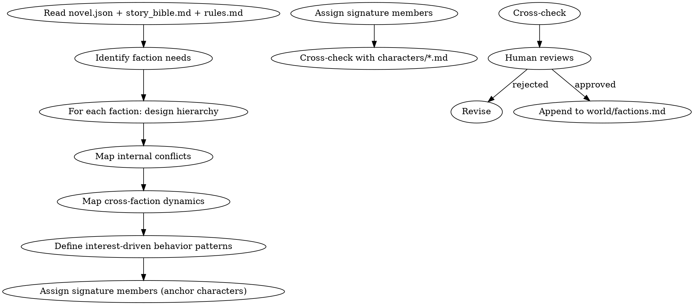

# 势力构建

设计小说中的势力组织。负责层级结构、内部矛盾、跨势力动态、利益驱动行为。

## 流程



## 数据契约

- **Reads:** `novel.json`, `world/story_bible.md`, `world/rules.md`, `characters/**/*.md`, `outline/story_frame.md`
- **Writes:** 无
- **Updates:** `world/factions.md`

## 铁律

1. **利益驱动行为** — 势力的公开行为必须有可解释的利益逻辑，禁止"为反而反"
2. **内部必有矛盾** — 健康的势力必须存在至少 1 个内部派系分歧；铁板一块 = 失真
3. **跨势力动态必有** — 至少 2 个势力有明确的合作/竞争/中立关系
4. **散文描写 + 表格补充** — 主体以散文叙述，势力属性用表格压缩呈现

## 核心维度

### 1. 层级结构

- 顶层：领袖（教主/掌门/CEO）的权力来源和制衡
- 中层：核心长老/部门主管的派系归属
- 基层：普通成员的来源和晋升路径
- 暗层：隐藏的权力（影子议会/太上长老/外部股东）

### 2. 内部矛盾

至少 1 个持续的内部张力：

| 矛盾类型 | 示例 |
|---------|------|
| 路线之争 | 鹰派 vs 鸽派 |
| 继承之争 | 大弟子 vs 二弟子 |
| 资源之争 | 资源分配不公 |
| 派系之争 | 外来派 vs 本土派 |
| 理念之争 | 改革 vs 保守 |

### 3. 跨势力动态

至少 2 类显式关系：

- **盟友**: 利益一致或被绑定（同盟/附庸/联姻）
- **竞争**: 资源/地盘/理念冲突
- **中立**: 当前无利益纠葛
- **敌对**: 历史仇恨或根本利益冲突

### 4. 利益驱动行为模式

每个势力必须有"在 X 情况下会做 Y"的规则：

- 受到攻击 → 报复机制
- 内部危机 → 权力反应
- 外部机遇 → 扩张倾向
- 资源短缺 → 优先取舍

## 输出格式

追加到 `world/factions.md`：

```markdown
---

## 势力：[势力名]

**类型**: [门派/公司/政府/帮派/...]
**总部**: [地点]
**实力评级**: [相对其他势力的位置]
**创建时间**: [设定内的历史时间]
**当前领袖**: [角色名]

### 势力概述

[200-400字散文：起源、当前定位、对外形象、对内气质]

### 层级结构

| 层级 | 职位 | 数量 | 派系归属 |
|------|------|------|---------|
| 顶层 | 掌门 | 1 | — |
| 中层 | 长老 | 3-5 | 鹰派2, 鸽派2, 中立1 |
| 基层 | 弟子 | N | — |

### 内部矛盾

[描述主要内部张力、当前激化程度、潜在引爆点]

### 跨势力关系

| 势力 | 关系类型 | 当前状态 | 历史关键事件 |
|------|---------|---------|------------|
| [势力A] | 盟友 | 紧密 | 第N章联合抗敌 |
| [势力B] | 敌对 | 冷战 | 第M章血仇 |

### 利益驱动行为

- **受到攻击**: [反应模式]
- **内部危机**: [权力反应]
- **外部机遇**: [扩张倾向]
- **资源短缺**: [取舍优先级]

### 锚点角色

- [角色名]: [位置] [作用]
- [角色名]: [位置] [作用]
```

## 汇总

```markdown
## 势力构建汇总

**更新文件**: `world/factions.md`
**新增势力数**: X

| 势力 | 类型 | 实力 | 内部矛盾 | 跨势力关系数 |
|------|------|------|---------|------------|
| [名] | [类] | [评] | [N] 个 | [N] 个 |

### 一致性检查

- [ ] 所有锚点角色存在于 characters/*.md
- [ ] 跨势力关系矩阵对称（若 A 视 B 为敌，B 应记录 A 为敌）
- [ ] 利益驱动行为与 story_bible.md 的世界规则无矛盾
```

## Anti-Rationalization

| Excuse | Reality |
|--------|---------|
| "势力只是背景板" | 势力是集体主角，没有质感的势力撑不起大场面 |
| "铁板一块的势力更强大" | 失真的组织让读者立刻弃书 |
| "利益驱动太冷血" | 利益包含信仰、传承、面子等非物质形式 |
| "势力关系后面再说" | 势力关系网 = 主角立场的坐标系，缺位 = 主角行为无落点 |
