# DEPRECATED: Superseded by shenbi-foreshadowing-lifecycle (2026-07-19).
# This skill is retained for reference. Do not dispatch.

<!-- AUTO-CHECK-START -->

## auto-check (generated -- do not edit)

<!-- AUTO-CHECK-END -->

<!-- AUTO-GENERATED from frontmatter — do not edit -->

## 数据契约

- **Reads:** plans/chapter-N-plan.md, outline/story_frame.md, outline/volume_map.md, truth/pending_hooks.md, genre-config.json
- **Writes:** none
- **Updates:** truth/pending_hooks.md

<!-- END AUTO-GENERATED -->

# 伏笔种植

HARD-GATE: 必须在章节备忘完成后、正文起草前执行。根据备忘 hook 账的 open 项种植新伏笔到伏笔池。

## 流程

```dot
digraph foreshadowing_plant {
    "Read plans/chapter-N-plan.md (hook ledger)" -> "Read truth/pending_hooks.md (existing hooks)";
    "Read truth/pending_hooks.md" -> "Check density budget (≤ 8 operations)";
    "Check density budget" -> "For each OPEN hook: design planting";
    "For each OPEN hook: design planting" -> "Assign type (GENUINE/SMOKESCREEN/SIDE_SHADOW)";
    "Assign type" -> "Assign dimension (THEMATIC/CHARACTER/SYMBOLIC/STRUCTURAL)";
    "Assign dimension" -> "Set subtlety (0.0-1.0) + cultivation_interval + max_distance";
    "Set subtlety" -> "Set escalation_curve (FLAT/RISING/EXPONENTIAL)";
    "Set escalation_curve" -> "Check cross-thread dependencies";
    "Check cross-thread dependencies" -> "Append new hooks to truth/pending_hooks.md";
    "Append new hooks to truth/pending_hooks.md" -> "Output 种植汇总";
}
```



## 铁律

1. **每章操作必须 ≤ 8 条** — 包括 plant、reinforce、trigger、resolve；超出预算的伏笔必须延迟到下章
2. **种植前必须读已有伏笔** — 不读 `truth/pending_hooks.md` 直接种植 = 重复或矛盾
3. **每个新伏笔必须定义完整的元数据** — type, dimension, subtlety, cultivation_interval, max_distance, escalation_curve 缺一不可
4. **跨线程依赖必须记录** — `depends_on` 字段绝不允许省略（无依赖填 `[]`）
5. **烟雾弹必须有退出策略** — 标记为 SMOKESCREEN 的伏笔必须在 `notes` 中写明何时/如何处理

## 种植指南

### 选择埋伏笔的位置

1. **日常段落** — 最佳位置，读者放松时最容易忽略暗示
2. **战斗段落** — 适合种植象征性伏笔（某件物品、某个动作）
3. **对话段落** — 适合种植信息型伏笔（角色的"随口一提"）
4. **避免章节末尾高潮段** — 读者注意力在已布置的爆点上，新笔画会被淹没

### 微妙度策略

- 主线伏笔: subtlety 0.4-0.6（需要能被部分读者注意到）
- 支线伏笔: subtlety 0.6-0.8（可以更深）
- 烟雾弹: subtlety 0.3-0.5（需要能被注意到才能误导）
- 侧面影: subtlety 0.7-0.9（极微妙，为回头重读准备）

完整的类型/维度/曲线/微妙度对照表见 `hook-types.md`。

## 输出格式

### 追加到 `truth/pending_hooks.md` 的 YAML frontmatter `hooks` 数组

```yaml
- id: hook-004
  content: "考核结束后，玉珮发出一声低鸣——只有主角听见"
  state: PLANTED
  operation: plant
  type: GENUINE
  dimension: CHARACTER
  subtlety: 0.6
  plant_chapter: 5
  cultivation_interval: 5
  last_reinforced: 5
  max_distance: 20
  escalation_curve: RISING
  depends_on: []
  core_hook: false
  promoted: false
```

### 种植汇总（输出到 human partner）

```markdown
## 伏笔种植汇总

**章节**: 第N章
**写入文件**: `truth/pending_hooks.md`
**种植条目数**: X / 8（密度预算）

### 已种植项

| Hook ID | 类型 | 维度 | 微妙度 | 升级曲线 | max_distance | 依赖 |
|---------|------|------|-------|---------|--------------|------|
| hook-004 | GENUINE | CHARACTER | 0.6 | RISING | 20 | — |
| hook-005 | SMOKESCREEN | SYMBOLIC | 0.4 | FLAT | 12 | hook-003 |

### 密度核算

| 操作类型 | 本章数量 |
|---------|---------|
| plant | X |
| reinforce | X |
| trigger | X |
| resolve | X |
| **合计** | X / 8 |
```

## Anti-Rationalization

| Excuse | Reality |
|--------|---------|
| "这章太简单了，不需要伏笔" | 简单章节恰好是埋伏笔的最佳时机——读者放松警惕 |
| "读者不会注意到这么细节的东西" | 网文读者的重读习惯和评论文化使细节容易被发掘 |
| "先种上再说，以后决定怎么用" | 无规划伏笔 = 最后不得不放弃 = Chase Power 债务 |
| "微妙度设高点没人会发现" | 伏笔的目的不是隐藏，是让读者在兑现时产生"啊原来如此" |

## 创世模式 (--mode genesis)

Genesis 阶段无章节备忘 (`plans/chapter-N-plan.md`)。genesis 模式从大纲提取跨卷 master hooks:

- **reads**: `outline/story_frame.md` + `outline/volume_map.md` (替代 chapter plan)
- **提取 master hooks**: 从 volume_map 的跨卷钩子提取,初始化为 PLANTED 状态
- **writes**: 同默认模式 (`truth/pending_hooks.md`)

### genesis 模式流程

1. 读 `outline/story_frame.md` 提取三幕结构中的跨卷承诺
2. 读 `outline/volume_map.md` 提取每卷的卷尾实体钩子
3. 对每个跨卷钩子: 分配 MH ID, 设为 PLANTED, 声明兑现卷
4. Append 到 `truth/pending_hooks.md`

genesis 模式不读 `plans/chapter-N-plan.md`,不处理 hook 账的 OPEN 项 (那是 per-chapter 模式的职责)。
