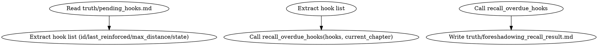

<!-- AUTO-CHECK-START -->

## auto-check (generated -- do not edit)

<!-- AUTO-CHECK-END -->

<!-- AUTO-GENERATED from frontmatter — do not edit -->

## 数据契约

- **Reads:** truth/pending_hooks.md
- **Writes:** truth/foreshadowing_recall_result.md
- **Updates:** none

<!-- END AUTO-GENERATED -->

# 伏笔召回

封装 RAG 召回层 + 确定性阈值过滤。对调用方透明——review-foreshadowing 和评分 skill 调用本 skill 获取超期 hook 列表，无需关心 RAG 实现细节。

> **MVP 说明（spec §3.6）**：本 skill 当前实现为确定性全量扫描 + max_distance 阈值过滤（`recall_overdue_hooks` helper）。spec §3.6 的 SQLite + bge-large-zh 向量索引增量维护为**后续增强**（post-node-1），在验证节点 1 通过后作为独立 task 加入。当前 MVP 在 chapter < 500 时性能可接受；向量索引在更大规模时启用。

## 触发

- 每章 state-settling 后（增量更新索引）
- review-foreshadowing 在 current_chapter > 50 时调用

## 流程



## 铁律

1. **确定性阈值过滤** — 最终判定（超期/未超期）由 `recall_overdue_hooks` 纯数值比较决定，不受嵌入不确定性影响
2. **排除 RESOLVED** — 已解决的伏笔不召回
3. **输出可溯源** — 每个超期 hook 标注 last_reinformed/max_distance/沉默章数

## 输出格式

写 `truth/foreshadowing_recall_result.md`：

```markdown
---
current_chapter: N
recall_at: YYYY-MM-DD
overdue_count: X
---

# 伏笔召回结果（第N章）

## 超期伏笔

| Hook ID | 内容 | 最后推进章 | max_distance | 沉默章数 | 状态 |
|---------|------|----------|-------------|---------|------|
| H01 | ... | 3 | 20 | 17 | OVERDUE |
| H02 | ... | 40 | 15 | 16 | OVERDUE |

## 无超期伏笔时
（空表，标记"无超期伏笔"）
```
