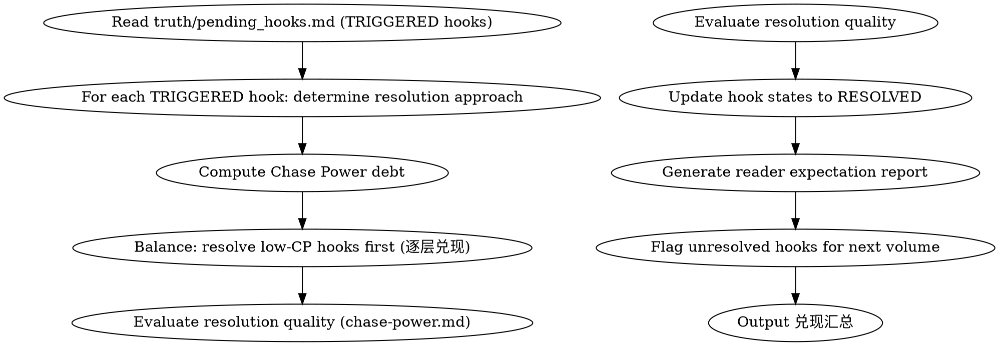

<!-- AUTO-GENERATED from frontmatter — do not edit -->

## 数据契约

- **Reads:** truth/pending_hooks.md, truth/chapter_summaries.md
- **Writes:** none
- **Updates:** truth/pending_hooks.md

<!-- END AUTO-GENERATED -->

# 伏笔兑现管理

管理伏笔的兑现质量、读者期望债务（Chase Power）、卷尾伏笔盘点。

## 流程



## 铁律

1. **Chase Power 红区 = 立即行动** — CP > 200 必须在下章内兑现至少一条伏笔
2. **核心伏笔兑现不能是 FLAT_PAYOFF** — core_hook 的兑现至少达到 PARTIAL_PAYOFF 质量
3. **卷尾必须盘点所有活跃伏笔** — 生成"本卷未兑现伏笔"清单
4. **放弃伏笔必须有人类批准** — ABANDON 操作需要人类合作者确认
5. **CP 公式必须写入输出** — 每次兑现报告必须记录所用 CP 公式及参数值，缺少公式的输出视为无效

## Chase Power 计算公式

```
CP = hook_power × time_since_plant × escalation_factor
```

| 参数 | 说明 | 取值范围 |
|------|------|---------|
| hook_power | 伏笔基础威力（core_hook=10, main=5, side=2） | 1-10 |
| time_since_plant | 自埋设以来的沉默章数 | ≥1 |
| escalation_factor | 兑现方式放大系数（FULL_PAYOFF=1.0, PARTIAL_PAYOFF=0.7, TWIST_PAYOFF=0.8, FLAT_PAYOFF=0.3） | 0-1.0 |

计算示例（输出中必须展示）:
- hook-001: CP = 10 × 8 × 1.0 = 80 (RED 区)
- hook-003: CP = 2 × 4 × 0.7 = 5.6 (GREEN 区)

## 兑现策略

### 逐层兑现
1. 先兑现低 CP 支线伏笔 → 释放小量期待，保持读者满足
2. 再兑现中等主线伏笔 → 推动剧情
3. 最后兑现高 CP 核心伏笔 → 高潮

### 反转兑现
- 烟雾弹 (SMOKESCREEN) 兑现时必须伴随真相揭示
- TWIST_PAYOFF 要求：意外但合理、有文本证据支撑、不破坏已有设定

## 输出格式

输出必须包含以下两个部分。缺任意部分 = 不合格。

### 第一部分：伏笔兑现报告

```markdown
## 伏笔兑现报告

**范围**: 第N章 / 第M卷
**Chase Power 债务**: XX (GREEN/YELLOW/ORANGE/RED)

### CP 计算工作表（铁律 5 强制要求）

每条伏笔必须按以下公式展示完整计算过程。缺少公式或参数 = 不合格。

```
CP = hook_power × time_since_plant × escalation_factor

| Hook ID | 等级 | hook_power | time_since_plant | escalation_factor | CP 值 | 区间 |
|---------|------|-----------|-----------------|-------------------|-------|------|
| hook-001 | core_hook | 10 | 8 | 1.0 (FULL_PAYOFF) | 80 | RED |
| hook-003 | side | 2 | 4 | 0.7 (PARTIAL_PAYOFF) | 5.6 | GREEN |
```

区间判定：GREEN < 20, YELLOW 20-50, ORANGE 50-100, RED ≥ 100

### 兑现计划

每条伏笔必须填写。使用以下 EXACT 列名，列名不匹配 = 不合格。

| ID | 当前CP | 计划章 | 计划事件 | PAYOFF类型 | 质量门 |
|----|--------|--------|---------|-----------|--------|
| hook-001 | 80 | 第25章 | 玉佩显灵救主角 | FULL_PAYOFF | 前 3 章有线索铺垫 + 兑现时有主角反应描写 |
| hook-003 | 5.6 | 第22章 | 路人提及师姐去向 | PARTIAL_PAYOFF | 信息不得与已有设定冲突 |
| hook-004 | 18 | 第23章 | ... | FULL_PAYOFF | ... |

**质量门格式**：描述可验证的兑现成功条件（非主观感受）。

### 逐层兑现顺序

按 CP 从低到高排列，低 CP 先兑现。

| 顺序 | Hook ID | CP | PAYOFF类型 | 兑现章 |
|------|---------|-----|-----------|--------|
| 1 | hook-003 | 5.6 | PARTIAL_PAYOFF | 第22章 |
| 2 | hook-004 | 18 | FULL_PAYOFF | 第23章 |
| 3 | hook-001 | 80 | FULL_PAYOFF | 第25章 |
| 4 | hook-002 | 240 | FULL_PAYOFF | 第28章（高潮） |

### 本章兑现的伏笔

| Hook ID | 兑现类型 | CP 释放 | 质量评估 |
|---------|---------|---------|---------|
| hook-002 | FULL_PAYOFF | 100% | 满意 |
| hook-004 | PARTIAL_PAYOFF | 50% | 可接受，剩余转入 hook-005 |

### 卷尾未兑现清单

| Hook ID | 状态 | CP 贡献 | 建议 |
|---------|------|---------|------|
| hook-001 | RELEVANT | 45 | 下卷首章兑现 |
| hook-003 | PLANTED | 12 | 继续培育 |
```

### 第二部分：兑现汇总

```markdown
## 兑现汇总（第N章 / 第M卷）

**当前 CP 债务**: XX (GREEN/YELLOW/ORANGE/RED)
**本章/本卷兑现数**: X
**卷尾未兑现数**: Y

**质量分布**:
- FULL_PAYOFF: X 条
- PARTIAL_PAYOFF: X 条
- TWIST_PAYOFF: X 条
- FLAT_PAYOFF: X 条（须警惕）

**风险信号**:
- [RED区] 总 CP > 200
- [高CP悬挂] hook-001 (CP 180)
- [核心未兑现] hook-002 (core_hook, RELEVANT)
- [超过 max_distance] hook-005

**下一章/下卷建议动作**:
- hook-001 → 立即兑现（RED 区）
- hook-003 → 继续培育，下章可触发
- hook-005 → 已超期，必须 TRIGGER 或 EXPIRE
```

### 可自动检查的计数规则

| 检查项 | 规则 | 不合格条件 |
|--------|------|----------|
| 兑现计划表列名 | ID/当前CP/计划章/计划事件/PAYOFF类型/质量门 | 列名不匹配 |
| CP 工作表 | 每条伏笔有公式参数展示 | 缺少公式或参数 |
| 逐层兑现顺序 | CP 升序排列 | 降序或无序 |
| 兑现计划覆盖率 | 所有活跃伏笔在计划表中有一行 | 遗漏 |
| 质量门可验证性 | 质量门描述可验证条件 | 纯主观感受 |
| 核心伏笔兑现质量 | core_hook ≥ PARTIAL_PAYOFF | FLAT_PAYOFF

## Anti-Rationalization

| Excuse | Reality |
|--------|---------|
| "读者已经忘了这条伏笔" | 忘了 ≠ 不存在。突然兑现反而是惊喜，但放弃是违约 |
| "最后草草收一下就行" | FLAT_PAYOFF 对读者体验的伤害 > 不承兑 |
| "Chase Power 太高了，放弃几条减负" | 放弃伏笔瞬间的负面体验远超维持的成本 |
