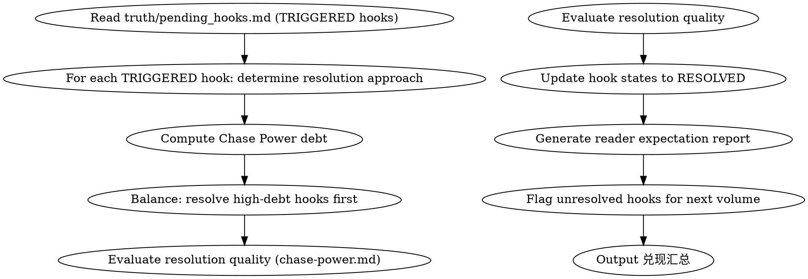

# 伏笔兑现管理

管理伏笔的兑现质量、读者期望债务（Chase Power）、卷尾伏笔盘点。

## 流程



## 数据契约

- **Reads:** `truth/pending_hooks.md`, `truth/chapter_summaries.md`
- **Writes:** none
- **Updates:** `truth/pending_hooks.md`

## 铁律

1. **Chase Power 红区 = 立即行动** — CP > 200 必须在下章内兑现至少一条伏笔
2. **核心伏笔兑现不能是 FLAT_PAYOFF** — core_hook 的兑现至少达到 PARTIAL_PAYOFF 质量
3. **卷尾必须盘点所有活跃伏笔** — 生成"本卷未兑现伏笔"清单
4. **放弃伏笔必须有人类批准** — ABANDON 操作需要人类合作者确认

## 兑现策略

### 逐层兑现
1. 先兑现低 CP 支线伏笔 → 释放小量期待，保持读者满足
2. 再兑现中等主线伏笔 → 推动剧情
3. 最后兑现高 CP 核心伏笔 → 高潮

### 反转兑现
- 烟雾弹 (SMOKESCREEN) 兑现时必须伴随真相揭示
- TWIST_PAYOFF 要求：意外但合理、有文本证据支撑、不破坏已有设定

## 输出格式

```markdown
## 伏笔兑现报告

**范围**: 第N章 / 第M卷
**Chase Power 债务**: XX (GREEN/YELLOW/ORANGE/RED)

### 本章兑现的伏笔

| Hook ID | 兑现类型 | CP 释放 | 质量评估 |
|---------|---------|---------|---------|
| hook-002 | FULL_PAYOFF | 100% | 满意 |
| hook-004 | PARTIAL_PAYOFF | 50% | 可接受，剩余转入 hook-005 |

### 卷尾未兑现清单

| Hook ID | 状态 | CP 贡献 | 建议 |
|---------|------|---------|------|
| hook-001 | RELEVANT | 45 | 下卷首章兑现 |
| hook-003 | PLANTED | 12 | 继续培育 |
```

## 兑现汇总

每次兑现完成，必须给出汇总便于 human partner 快速评估伏笔生态和读者期待状态：

```markdown
## 兑现汇总（第N章 / 第M卷）

**当前 CP 债务**: XX (GREEN/YELLOW/ORANGE/RED)
**本章/本卷兑现数**: X
**卷尾未兑现数**: Y

**质量分布**:
- FULL_PAYOFF: X 条
- PARTIAL_PAYOFF: X 条
- TWIST_PAYOFF: X 条
- FLAT_PAYOFF: X 条（须警惕）

**风险信号**:
- [RED区] 总 CP > 200
- [高CP悬挂] hook-001 (CP 180)
- [核心未兑现] hook-002 (core_hook, RELEVANT)
- [超过 max_distance] hook-005

**下一章/下卷建议动作**:
- hook-001 → 立即兑现（RED 区）
- hook-003 → 继续培育，下章可触发
- hook-005 → 已超期，必须 TRIGGER 或 EXPIRE
```

## Anti-Rationalization

| Excuse | Reality |
|--------|---------|
| "读者已经忘了这条伏笔" | 忘了 ≠ 不存在。突然兑现反而是惊喜，但放弃是违约 |
| "最后草草收一下就行" | FLAT_PAYOFF 对读者体验的伤害 > 不承兑 |
| "Chase Power 太高了，放弃几条减负" | 放弃伏笔瞬间的负面体验远超维持的成本 |
