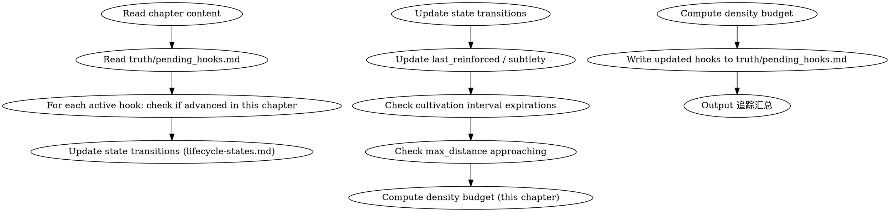

# DEPRECATED: Superseded by shenbi-foreshadowing-lifecycle (2026-07-19).
# This skill is retained for reference. Do not dispatch.

<!-- AUTO-CHECK-START -->

## auto-check (generated -- do not edit)

<!-- AUTO-CHECK-END -->

<!-- AUTO-GENERATED from frontmatter — do not edit -->

## 数据契约

- **Reads:** chapters/chapter-N.md, truth/pending_hooks.md, truth/chapter_summaries.md
- **Writes:** truth/bridge_tracker.md
- **Updates:** truth/pending_hooks.md

<!-- END AUTO-GENERATED -->

# 伏笔追踪

在每章起草并结算状态后，更新 `truth/pending_hooks.md` 中所有活跃伏笔的状态。
> **字段分工**：本 skill 是 `truth/pending_hooks.md` 中 **hook 生命周期状态**（PLANTED→RELEVANT→TRIGGERED→RESOLVED）的**唯一推进者**。`last_reinforced`/`subtlety` 字段由 `shenbi-state-settling` 维护；新增 hook 由 `shenbi-foreshadowing-plant`；兑现由 `shenbi-foreshadowing-resolve`。详见 state-settling 的 pending_hooks 字段分工声明。

## 流程



## 铁律

1. **每个活跃伏笔必须在本章被评估** — 不能跳过
2. **状态转换必须有文本证据** — 不能说"这条应该加强了"就改变状态，必须在正文中找到对应内容
3. **core_hook = true 绝不允许 ABANDON** — 核心伏笔放弃 = 故事断裂
4. **密度预算超限必须报告** — 说明哪些操作被推迟

## 操作指南

详见 `lifecycle-states.md`。

### 本章操作识别

1. 在正文中搜索每个活跃伏笔的 `content` 关键词
2. 如果出现 → 判断是强化/触发/兑现
3. 如果未出现 → 检查培育间隔是否过期
4. 记录所有操作，计入密度预算

### 状态更新规则

- 兑现后的小幅伏笔可以保持 RELEVANT（多层次伏笔）
- 主线伏笔兑现后必须 RESOLVED → ARCHIVED
- 超过 max_distance 的伏笔标记为 EXPIRED

## 输出格式

更新 `truth/pending_hooks.md` 的 YAML frontmatter。

同时输出本操作的追踪报告（markdown body 追加到 file）：

```markdown
## 第N章伏笔追踪

### 本章操作
| Hook ID | 操作 | 前状态 | 后状态 | 文本位置 |
|---------|------|--------|--------|---------|
| hook-002 | TRIGGER | RELEVANT | TRIGGERED | 第4段 |
| hook-004 | (新建) | — | PLANTED | 第7段 |

### 过期警告
| Hook ID | 上次强化 | 本章 | 间隔 |
|---------|---------|------|------|
| hook-001 | 3 | 8 | 5/5 OVERDUE |

### 距离上限逼近
| Hook ID | 种植章 | 本章 | max_distance | 状态 |
|---------|--------|------|-------------|------|
| hook-002 | 5 | 20 | 25 | OK (距上限 5 章) |
| hook-005 | 3 | 20 | 15 | WARNING (距上限 -5 章) |

### 密度账本: 3/8 操作
```

## 追踪汇总

每次追踪完成，必须给出汇总便于 human partner 快速评估本章伏笔生态健康度：

```markdown
## 追踪汇总（第N章）

**活跃伏笔数**: X
**本章操作数**: Y / 8（密度预算）
**状态分布**:
- PLANTED: X 条
- RELEVANT: X 条
- TRIGGERED: X 条

**风险信号**:
- [OVERDUE] hook-001, hook-003
- [EXPIRED] hook-005
- [距离逼近] hook-002（距上限 5 章）

**下一章建议动作**:
- hook-001 → 建议 REINFORCE（培育间隔已过）
- hook-005 → 必须 TRIGGER 或 EXPIRE 处理
```

## Anti-Rationalization

| Excuse | Reality |
|--------|---------|
| "这章伏笔都没出现，就跳过更新" | 不更新 → 培育间隔检查失效 → 伏笔默默死去 |
| "手动追踪太麻烦" | 不追踪 → 200章后忘了种了哪些伏笔 → 大量未兑现 |
| "小伏笔不追踪也没事" | 小伏笔 = 故事肌理，肌理断裂读者能感知 |

## 缺陷证据格式

每条缺陷/发现报告必须遵循四要素格式：

1. **位置** — `文件路径` L行号-行号（如 `chapters/chapter-5.md` L23-27）
2. **原文引述** — 用 `>` 标记引述原文，≥20 字上下文
3. **违反规则** — 引用 SKILL.md 中的精确规则名（逐字匹配）
4. **严重度** — BLOCKING | CRITICAL | MINOR

缺少任一要素的缺陷报告视为不合格。

## Cross-Volume Bridge Tracking (NEW)

After updating foreshadowing_ledger.md, also check `truth/bridge_tracker.md`:

1. Read the current chapter text
2. For each bridge in PENDING state: if the chapter contains the bridge's key
   terms (character name, item name, event description), mark it ACTIVATED
   with the current chapter number as Actual Activation Ch
3. If a bridge was expected to activate by this chapter but has not, mark it
   DEFERRED with a note
4. Write updated bridge_tracker.md back to disk
