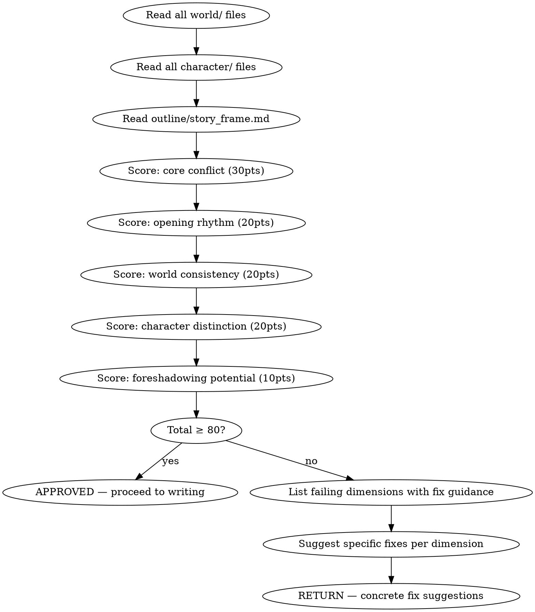

# 基础设定审核

HARD-GATE: 在基础设定未通过审核（总分 ≥ 80）前，不得进入逐章写作。

审核创世层输出（worldbuilding + character-design + story-architecture），对五个维度打分。

## 流程



## 数据契约

- **Reads:** `world/*.md`, `characters/**/*.md`, `outline/*.md`, `truth/current_state.md`, `truth/chapter_summaries.md`
- **Writes:** report only
- **Updates:** none

## 铁律

1. **总分 80 = 最低门槛** — < 80 必须返回修改，不商量
2. **核心冲突 < 18 = 自动不通过** — 无论其他维度多高
3. **只审核已生成的内容** — 不为缺失的内容假设分数
4. **每个扣分必须附带具体改进建议** — 不让人类合作者猜测如何改进

## 审核清单

参见 `scoring-rubric.md` 获取详细评分标准。

执行顺序：
1. 读完 `world/`（规则、地理、势力、设定集）
2. 读完 `characters/`（主角档案 + 主要配角 + 关系矩阵）
3. 读完 `outline/story_frame.md`（故事框架 / 三幕结构 / 主线节拍）
4. 按 5 个维度逐项打分（每维度单独读，再写分数）
5. 汇总总分，对照铁律判断通过/不通过

## 输出格式

```markdown
## 基础设定审核报告

**项目**: 《XXX》
**日期**: YYYY-MM-DD
**结果**: 通过 (XX分) / 不通过 (XX分)

### 评分明细

| 维度 | 得分 | 满分 | 评价 |
|------|------|------|------|
| 核心冲突 | XX | 30 | ... |
| 开篇节奏 | XX | 20 | ... |
| 世界一致性 | XX | 20 | ... |
| 角色区分度 | XX | 20 | ... |
| 伏笔潜力 | XX | 10 | ... |
| **总分** | **XX** | **100** | |

### 不通过维度改进建议

[具体建议，每条指向具体文件/段落]

### 建议修复

- [ERROR] [维度名] [问题描述]：[修复方案 — 改哪个文件哪个段落、修改什么]
```

## 输出格式

### 证据引用格式

所有评分扣分和修改建议必须使用精确证据引用格式：

```
文件:段落:具体问题 → 修改建议
```

**引用规范**:
- 文件：相对于项目根目录的路径，如 `world/magic-system.md`
- 段落：章节标题（如 `## 灵能修炼机制`）或行号范围（如 `L45-52`）或关键标识短语（如 `第3段"庶民不能..."`）
- 具体问题：一句客观描述（不评价，只说缺失/矛盾/模糊）
- 修改建议：一句可执行的指令（动词开头：改为/补充/删除/在X与Y之间建立连接）

**引用示例**:

```markdown
### 核心冲突扣分明细

- [扣-5] `outline/story_frame.md:## 第二幕:L120-145:反派目标为"扩张势力"→过于泛化，缺乏与主角的私人关联` → 补充：反派扩张的具体行动中至少一项直接威胁主角已建立的羁绊（如 [具体角色/地点] 位于扩张路径上）

- [扣-3] `characters/villain.md:## 动机:"追求力量"未解释为何追求` → 补充：用 ≤3 句话说明反派追求力量的根本原因（恐惧/创伤/信念），并建立与世界观中某个具体设定的关联

- [扣-2] `world/world-rules.md:## 灵能代价:缺少资源极限` → 补充：灵能消耗的物理/精神极限上限（每日最大使用次数/量）及超额使用的惩罚机制
```

### 评分工作表

每位审核员必须填写完整评分工作表：

```markdown
## 基础设定审核评分工作表

**项目**: 《XXX》
**审核日期**: YYYY-MM-DD
**审核员**: [agent name]

### 一、核心冲突（满分30，最低门槛18）

| 评分项 | 满分 | 得分 | 证据引用 | 裁判理由 |
|--------|------|------|---------|---------|
| 冲突清晰度（对抗双方+赌注明确） | 10 | X | [文件:段落] | [≤1句] |
| 冲突推动力（冲突驱动主角行动而非被动卷入） | 8 | X | [文件:段落] | [≤1句] |
| 私人关联（冲突与主角有个人层面的利害关系） | 7 | X | [文件:段落] | [≤1句] |
| 三级递进（显性→潜在→哲学三层冲突均已定义） | 5 | X | [文件:段落] | [≤1句] |
| **小计** | **30** | **XX** | | |

### 二、开篇节奏（满分20）

| 评分项 | 满分 | 得分 | 证据引用 | 裁判理由 |
|--------|------|------|---------|---------|
| 钩子强度（前500字建立好奇心） | 8 | X | [文件:段落] | [≤1句] |
| 信息密度（前3章必要世界观信息分布合理不倾泻） | 7 | X | [文件:段落] | [≤1句] |
| 进度速度（前3章事件驱动而非设定驱动） | 5 | X | [文件:段落] | [≤1句] |
| **小计** | **20** | **XX** | | |

### 三、世界一致性（满分20）

| 评分项 | 满分 | 得分 | 证据引用 | 裁判理由 |
|--------|------|------|---------|---------|
| 规则内部一致性（A规则不违反B规则） | 8 | X | [文件:段落] | [≤1句] |
| 经济合理性（资源/货币/权力分布可自洽运转） | 6 | X | [文件:段落] | [≤1句] |
| 技术/魔法边界（能力上限+代价已定义） | 6 | X | [文件:段落] | [≤1句] |
| **小计** | **20** | **XX** | | |

### 四、角色区分度（满分20）

| 评分项 | 满分 | 得分 | 证据引用 | 裁判理由 |
|--------|------|------|---------|---------|
| 声音区分（≥3主要角色语音/措辞/节奏可互盲辨） | 8 | X | [文件:段落] | [≤1句] |
| 动机独立性（每个主要角色有独立于主角的目标） | 6 | X | [文件:段落] | [≤1句] |
| 缺陷真实（每个主要角色有影响决策的真实缺陷） | 6 | X | [文件:段落] | [≤1句] |
| **小计** | **20** | **XX** | | |

### 五、伏笔潜力（满分10）

| 评分项 | 满分 | 得分 | 证据引用 | 裁判理由 |
|--------|------|------|---------|---------|
| 可种植空间（设定中≥3处可发展长线伏笔的模糊点） | 5 | X | [文件:段落] | [≤1句] |
| 呼应可能性（设定元素存在跨卷呼应潜力） | 5 | X | [文件:段落] | [≤1句] |
| **小计** | **10** | **XX** | | |

### 总评

| 维度 | 得分 | 满分 | 占比 |
|------|------|------|------|
| 核心冲突 | XX | 30 | XX% |
| 开篇节奏 | XX | 20 | XX% |
| 世界一致性 | XX | 20 | XX% |
| 角色区分度 | XX | 20 | XX% |
| 伏笔潜力 | XX | 10 | XX% |
| **总分** | **XX** | **100** | **XX%** |

### 铁律检查

- [ ] 总分 ≥ 80（通过门槛）
- [ ] 核心冲突 ≥ 18（自动通过子条件）

**判定**: 通过 / 不通过

### 不通过维度修复处方

_（如通过则此节留空）_

| 优先级 | 维度 | 问题 | 修复处方 | 预期提分 |
|--------|------|------|---------|---------|
| P0 | [维度] | [文件:段落:问题] | [具体修改步骤+目标状态] | +X |
| P1 | [维度] | [文件:段落:问题] | [具体修改步骤+目标状态] | +Y |
```

## Anti-Rationalization

| Excuse | Reality |
|--------|---------|
| "60分也差不多可以开始写了" | 基础不牢，写到20章必崩 |
| "核心冲突以后补上" | 没有核心冲突的故事没有灵魂，读者能感受到 |
| "角色区分度不重要，故事好就行" | 同质化角色 = 读者分不清谁是谁 = 弃书 |
| "这些维度太严格了" | 5维度 ×简单评分 = 最简单的系统性质量把控 |
| "证据引用太费事，大致说一下就行" | 无精确引用的扣分 = 不可验证 = human partner 无法定位修复 |
