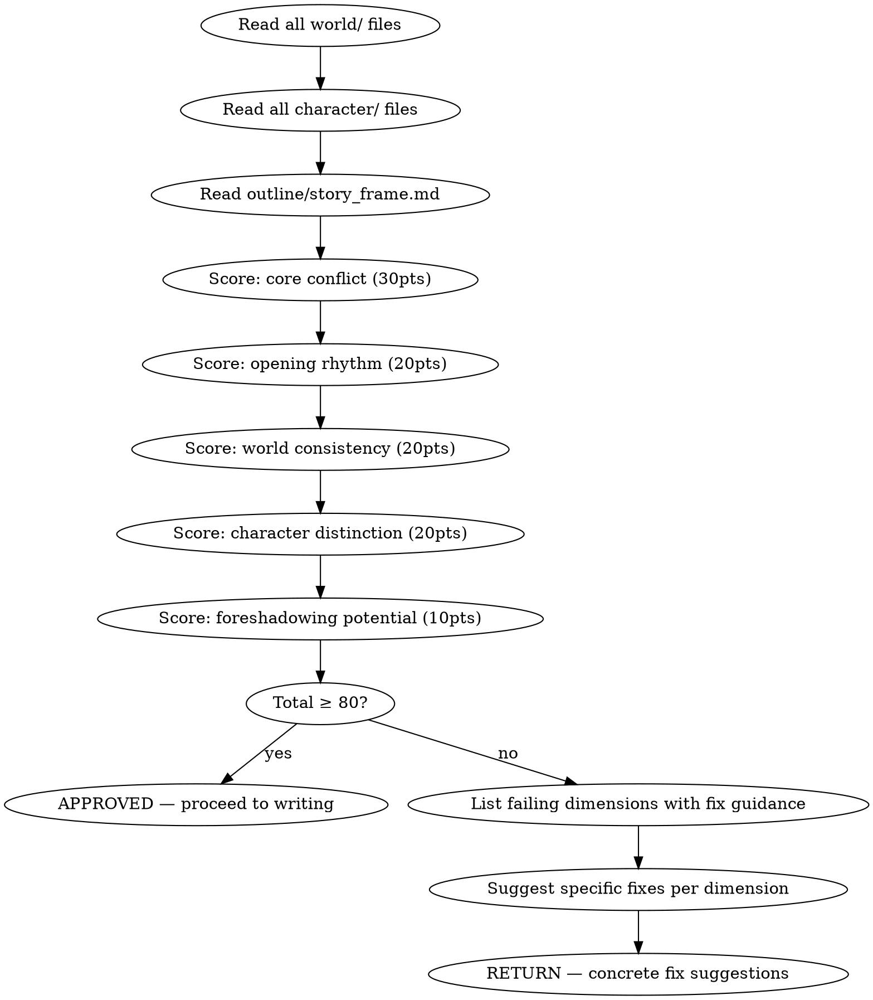

# 基础设定审核

HARD-GATE: 在基础设定未通过审核（总分 ≥ 80）前，不得进入逐章写作。

审核创世层输出（worldbuilding + character-design + story-architecture），对五个维度打分。

## 流程



## 数据契约

- **Reads:** `world/*.md`, `characters/**/*.md`, `outline/*.md`, `truth/current_state.md`, `truth/chapter_summaries.md`
- **Writes:** report only
- **Updates:** none

## 铁律

1. **总分 80 = 最低门槛** — < 80 必须返回修改，不商量
2. **核心冲突 < 18 = 自动不通过** — 无论其他维度多高
3. **只审核已生成的内容** — 不为缺失的内容假设分数
4. **每个扣分必须附带具体改进建议** — 不让人类合作者猜测如何改进

## 审核清单

参见 `scoring-rubric.md` 获取详细评分标准。

执行顺序：
1. 读完 `world/`（规则、地理、势力、设定集）
2. 读完 `characters/`（主角档案 + 主要配角 + 关系矩阵）
3. 读完 `outline/story_frame.md`（故事框架 / 三幕结构 / 主线节拍）
4. 按 5 个维度逐项打分（每维度单独读，再写分数）
5. 汇总总分，对照铁律判断通过/不通过

## 输出格式

```markdown
## 基础设定审核报告

**项目**: 《XXX》
**日期**: YYYY-MM-DD
**结果**: 通过 (XX分) / 不通过 (XX分)

### 评分明细

| 维度 | 得分 | 满分 | 评价 |
|------|------|------|------|
| 核心冲突 | XX | 30 | ... |
| 开篇节奏 | XX | 20 | ... |
| 世界一致性 | XX | 20 | ... |
| 角色区分度 | XX | 20 | ... |
| 伏笔潜力 | XX | 10 | ... |
| **总分** | **XX** | **100** | |

### 不通过维度改进建议

[具体建议，每条指向具体文件/段落]

### 建议修复

- [ERROR] [维度名] [问题描述]：[修复方案 — 改哪个文件哪个段落、修改什么]
```

## Anti-Rationalization

| Excuse | Reality |
|--------|---------|
| "60分也差不多可以开始写了" | 基础不牢，写到20章必崩 |
| "核心冲突以后补上" | 没有核心冲突的故事没有灵魂，读者能感受到 |
| "角色区分度不重要，故事好就行" | 同质化角色 = 读者分不清谁是谁 = 弃书 |
| "这些维度太严格了" | 5维度 ×简单评分 = 最简单的系统性质量把控 |
