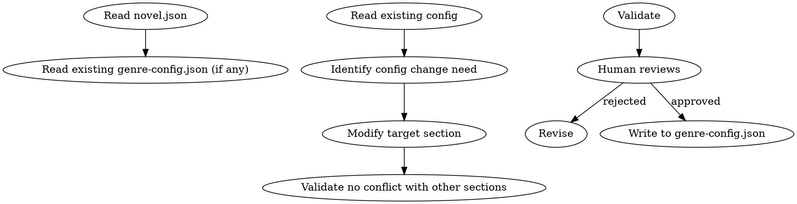

# 题材配置管理

管理 `genre-config.json`。负责疲劳词、节奏规则、章节类型、审计维度、自定义规则。

## 流程



## 数据契约

- **Reads:** `novel.json`, `genre-config.json` (existing)
- **Writes:** 无
- **Updates:** `genre-config.json`

## 铁律

1. **改前必读** — 修改前必须读完整文件，避免冲突
2. **改后必验** — 修改后必须与已有 audit_drift 对比，避免覆盖已确认的纠偏
3. **人类必批** — 配置变更需人类合作者确认
4. **可回滚** — 修改前必须先备份（cp genre-config.json genre-config.json.bak）
5. **格式一致** — 修改必须保持 JSON 格式与字段结构

## 配置文件结构

`genre-config.json` 通常包含以下 section：

```json
{
  "version": "1.0",
  "updated": "YYYY-MM-DD",
  "fatigueWords": {
    "禁用": ["心中暗道", "不由得想到", "..."],
    "慎用": ["眼中闪过一丝", "不禁感慨", "..."],
    "替换建议": {
      "微微一笑": ["嘴角轻扬", "唇角微勾"]
    }
  },
  "pacing": {
    "softRange": 0.15,
    "hardRange": 0.30,
    "minChaptersPerCycle": 8,
    "maxChaptersPerCycle": 15
  },
  "chapterTypes": {
    "battle": { "maxConsecutive": 2, "warningThreshold": 3 },
    "dialogue": { "maxConsecutive": 3, "warningThreshold": 4 },
    "...": "..."
  },
  "auditDimensions": {
    "antiAi": true,
    "character": true,
    "motivation": true,
    "pacing": true,
    "continuity": true,
    "...": "..."
  },
  "customRules": [
    {
      "id": "rule-001",
      "description": "...",
      "enforcement": "warning | blocking",
      "example": "..."
    }
  ]
}
```

## 配置操作

### 1. 疲劳词管理

#### 禁用词

出现即报错。规则：
- 每条禁用词必须可定位
- 禁用词总数建议 ≤ 50（过多 = 写作束缚）
- 禁用词来源于审计累积，非凭空添加

#### 慎用词

每章超 3 次报警。规则：
- 慎用词应给出 1-3 个替换建议
- 慎用词可累积（不轻易删）
- 慎用词数量无上限

#### 替换建议

每条替换建议必须可被作者接受（即"自然得不像替换"）。

### 2. 节奏规则

| 字段 | 默认 | 说明 |
|------|------|------|
| softRange | 0.15 | 字数软区间 ±15% |
| hardRange | 0.30 | 字数硬上限 ±30% |
| minChaptersPerCycle | 8 | 节奏循环最小章节数 |
| maxChaptersPerCycle | 15 | 节奏循环最大章节数 |

### 3. 章节类型

每个章节类型定义：
- `maxConsecutive`: 连续出现该类型章节的最大数
- `warningThreshold`: 触发警告的连续数

### 4. 审计维度

每个维度可启用/禁用：

| 维度 | 启用后影响 |
|------|----------|
| antiAi | 反 AI 检测审计 |
| character | 角色 OOC 审计 |
| motivation | 主角动机审计 |
| pacing | 节奏审计 |
| continuity | 跨章连续性审计 |
| foreshadowing | 伏笔审计 |
| sensitivity | 敏感内容审计 |
| worldRules | 世界规则审计 |
| dialogue | 对话质量审计 |
| texture | 文字质感审计 |

### 5. 自定义规则

项目级规则：
- `id`: 唯一标识
- `description`: 规则描述
- `enforcement`: warning / blocking
- `example`: 违规示例

## 修改流程

### 1. 备份

```bash
cp genre-config.json genre-config.json.bak.YYYYMMDD
```

### 2. 修改

按目标 section 修改，保留其他 section 不变。

### 3. 验证

- JSON 格式合法
- 与已有 audit_drift 不冲突
- 字段结构正确

### 4. 人工审批

- 列出修改点（diff）
- 说明修改原因
- 人类批准后写入

### 5. 写入

写入 `genre-config.json`，更新 `updated` 字段为当前日期。

## 输出格式

修改时输出 diff：

```markdown
## 配置修改建议

**修改时间**: YYYY-MM-DD
**备份**: genre-config.json.bak.YYYYMMDD

### 变更 diff

```json
{
  "fatigueWords": {
    "禁用": {
      "before": ["心中暗道"],
      "after": ["心中暗道", "眸光一闪"]
    }
  },
  "auditDimensions": {
    "foreshadowing": {
      "before": false,
      "after": true
    }
  }
}
```

### 修改原因

- 禁用词: [来源 audit_drift 第N章，X 词出现 Y 次]
- 审计维度: [新增伏笔审计以匹配 Phase 3 引入]

### 冲突检查

- [ ] 不与 audit_drift 中已确认纠偏矛盾
- [ ] 不破坏已有自定义规则
- [ ] 不与 novel.json 的题材标记矛盾

### 待人类确认

- [ ] 禁用词增删是否同意？
- [ ] 审计维度变更是否同意？
- [ ] 自定义规则是否同意？
```

## 汇总

```markdown
## 题材配置修改汇总

**更新时间**: YYYY-MM-DD
**修改项数**: X

| Section | 字段 | 变更类型 | 原因 |
|---------|------|---------|------|
| fatigueWords | 禁用 | 新增 | audit_drift X |
| auditDimensions | foreshadowing | 启用 | Phase 3 |
| ... | ... | ... | ... |

### 配置一致性

- [ ] JSON 格式合法
- [ ] 字段结构一致
- [ ] 备份文件存在
- [ ] 人类批准已确认

### 后续影响

- 启用新审计维度 → 下次审计自动包含
- 新增禁用词 → 下次写作实时检测
- 修改节奏阈值 → 影响 length-normalizing 与 chapter-pattern
```

## Anti-Rationalization

| Excuse | Reality |
|--------|---------|
| "改配置前不用备份" | 备份 = 回滚的最后手段；不备份 = 改坏无法恢复 |
| "禁用词越多越好" | 过多禁用词 = 写作束缚 = 创作质量下降 |
| "审计全开" | 全开 = 误报率上升 + 审计耗时 = 写作流程被淹没 |
| "自定义规则随便加" | 自定义规则 = 项目级硬约束；滥用 = 规则相互冲突 |
