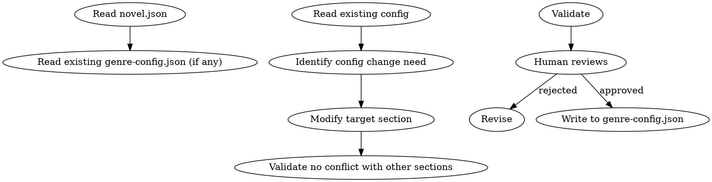

<!-- AUTO-CHECK-START -->

## auto-check (generated -- do not edit)

### invariants

- approval decision valid
- audit dimension count
- banned words have replacements
- cautioned words have replacements
- chapter type count
- disabled dimensions have rules
- fatigue word count

<!-- AUTO-CHECK-END -->

<!-- AUTO-GENERATED from frontmatter — do not edit -->

## 数据契约

- **Reads:** novel.json, genre-config.json
- **Writes:** none
- **Updates:** genre-config.json

<!-- END AUTO-GENERATED -->

# 题材配置管理

**职责边界**：worldbuilding 创建 `genre-config.json` 的初始 stub（仅含题材/语言/基本审计维度）。本 skill 负责细化为完整配置：疲劳词列表、节奏规则、章节类型、审计维度激活、自定义禁忌词。如果 `genre-config.json` 已由 worldbuilding 创建，本 skill 读取并细化；如果不存在，本 skill 创建。

管理 `genre-config.json`。负责疲劳词、节奏规则、章节类型、审计维度、自定义规则。

## 流程



## 铁律

1. **改前必读** — 修改前必须读完整文件，避免冲突
2. **改后必验** — 修改后必须与已有 audit_drift 对比，避免覆盖已确认的纠偏
3. **人类必批** — 配置变更需人类合作者确认
4. **可回滚** — 修改前必须先备份（cp genre-config.json genre-config.json.bak）
5. **格式一致** — 修改必须保持 JSON 格式与字段结构
6. **审批留痕** — 每次配置变更输出必须包含审批决定区块，列出：(a) 变更内容、(b) 变更原因、(c) 冲突检查结果、(d) 明确的批准/驳回复选框。缺少审批区块的输出视为无效

## 配置文件结构

`genre-config.json` 通常包含以下 section：

```json
{
  "version": "1.0",
  "updated": "YYYY-MM-DD",
  "fatigueWords": {
    "禁用": ["心中暗道", "不由得想到", "..."],
    "慎用": ["眼中闪过一丝", "不禁感慨", "..."],
    "替换建议": {
      "微微一笑": ["嘴角轻扬", "唇角微勾"]
    }
  },
  "pacing": {
    "softRange": 0.15,
    "hardRange": 0.30,
    "minChaptersPerCycle": 8,
    "maxChaptersPerCycle": 15
  },
  "chapterTypes": {
    "battle": { "maxConsecutive": 2, "warningThreshold": 3 },
    "dialogue": { "maxConsecutive": 3, "warningThreshold": 4 },
    "...": "..."
  },
  "auditDimensions": {
    "antiAi": true,
    "character": true,
    "motivation": true,
    "pacing": true,
    "continuity": true,
    "...": "..."
  },
  "customRules": [
    {
      "id": "rule-001",
      "description": "...",
      "enforcement": "warning | blocking",
      "example": "..."
    }
  ]
}
```

## 配置操作

### 1. 疲劳词管理

#### 禁用词

出现即报错。规则：
- 每条禁用词必须可定位
- 禁用词总数建议 ≤ 50（过多 = 写作束缚）
- 禁用词来源于审计累积，非凭空添加

#### 慎用词

每章超 3 次报警。规则：
- 慎用词应给出 1-3 个替换建议
- 慎用词可累积（不轻易删）
- 慎用词数量无上限

#### 替换建议

每条替换建议必须可被作者接受（即"自然得不像替换"）。

### 2. 节奏规则

| 字段 | 默认 | 说明 |
|------|------|------|
| softRange | 0.15 | 字数软区间 ±15% |
| hardRange | 0.30 | 字数硬上限 ±30% |
| minChaptersPerCycle | 8 | 节奏循环最小章节数 |
| maxChaptersPerCycle | 15 | 节奏循环最大章节数 |

### 3. 章节类型

每个章节类型定义：
- `maxConsecutive`: 连续出现该类型章节的最大数
- `warningThreshold`: 触发警告的连续数

### 4. 审计维度

每个维度可启用/禁用：

| 维度 | 启用后影响 |
|------|----------|
| antiAi | 反 AI 检测审计 |
| character | 角色 OOC 审计 |
| motivation | 主角动机审计 |
| pacing | 节奏审计 |
| continuity | 跨章连续性审计 |
| foreshadowing | 伏笔审计 |
| sensitivity | 敏感内容审计 |
| worldRules | 世界规则审计 |
| dialogue | 对话质量审计 |
| texture | 文字质感审计 |

### 5. 自定义规则

项目级规则：
- `id`: 唯一标识
- `description`: 规则描述
- `enforcement`: warning / blocking
- `example`: 违规示例

## 修改流程

### 1. 备份

```bash
cp genre-config.json genre-config.json.bak.YYYYMMDD
```

### 2. 修改

按目标 section 修改，保留其他 section 不变。

### 3. 验证

- JSON 格式合法
- 与已有 audit_drift 不冲突
- 字段结构正确

### 4. 人工审批

- 列出修改点（diff）
- 说明修改原因
- 人类批准后写入

### 5. 写入

写入 `genre-config.json`，更新 `updated` 字段为当前日期。

## 输出格式

修改时输出 diff：

```markdown
## 配置修改建议

**修改时间**: YYYY-MM-DD
**备份**: genre-config.json.bak.YYYYMMDD

### 变更 diff

```json
{
  "fatigueWords": {
    "禁用": {
      "before": ["心中暗道"],
      "after": ["心中暗道", "眸光一闪"]
    }
  },
  "auditDimensions": {
    "foreshadowing": {
      "before": false,
      "after": true
    }
  }
}
```

### 修改原因

- 禁用词: [来源 audit_drift 第N章，X 词出现 Y 次]
- 审计维度: [新增伏笔审计以匹配 Phase 3 引入]

### 冲突检查

- [ ] 不与 audit_drift 中已确认纠偏矛盾
- [ ] 不破坏已有自定义规则
- [ ] 不与 novel.json 的题材标记矛盾

### 人类审批（铁律 6 强制要求）

**变更内容**:
- 禁用词: [具体列出增/删/改项]
- 审计维度: [具体列出启用/禁用项]
- 自定义规则: [具体列出增/删/改项]
- 其他: [节奏阈值/章节类型等]

**变更原因**: [每条变更的理由，如"来源于 audit_drift 第N章反馈"]

**冲突检查通过项**:
- [ ] 不与 audit_drift 中已确认纠偏矛盾
- [ ] 不破坏已有自定义规则
- [ ] 不与 novel.json 的题材标记矛盾

**审批决定**（必须勾选其一）:
- [ ] **批准** — 应用全部变更，写入 genre-config.json
- [ ] **驳回** — 不应用，需要修改以下项: _______
```

### genre-config.json 字段规范

输出文件必须通过以下自动化检查。不通过 = 不合格。

| 字段 | 类型 | 必填 | 约束 |
|------|------|------|------|
| version | string | 是 | 格式 `"N.N"` |
| updated | string | 是 | 格式 `"YYYY-MM-DD"` |
| fatigueWords.禁用 | string[] | 是 | ≤ 50 项，每项在替换建议中有 ≥ 1 替换 |
| fatigueWords.慎用 | string[] | 是 | 每项在替换建议中有 ≥ 1 替换 |
| fatigueWords.替换建议 | object | 是 | key 对应禁用/慎用词，value 为 string[] |
| pacing.softRange | number | 是 | 0-1 |
| pacing.hardRange | number | 是 | 0-1 |
| pacing.minChaptersPerCycle | integer | 是 | ≥ 1 |
| pacing.maxChaptersPerCycle | integer | 是 | ≥ minChaptersPerCycle |
| chapterTypes | object | 是 | 6-10 个类型，每个含 maxConsecutive + warningThreshold |
| auditDimensions | object | 是 | 5-10 个维度，值均为 boolean |
| customRules | array | 否 | 每项含 id/description/enforcement/example，enforcement ∈ {warning, blocking} |
| approval | object | 是 | **REQUIRED**。含 reviewer/decision/date，decision ∈ {approved, rejected}。缺失即不合格 |

**顶层字段数**：恰好 8 个（version, updated, fatigueWords, pacing, chapterTypes, auditDimensions, customRules, approval）。

### 可自动检查的计数规则

| 检查项 | 规则 | 不合格条件 |
|--------|------|----------|
| 顶层字段数 | = 8 | ≠ 8 |
| approval 字段存在 | 必须 | 缺失 |
| approval.decision | approved 或 rejected | 其他值 |
| 禁用词数 | ≤ 50 | > 50 |
| 禁用词替换全覆盖 | 每条禁用词在替换建议中有 ≥ 1 替换项 | 存在无替换的禁用词 |
| 慎用词替换全覆盖 | 每条慎用词在替换建议中有 ≥ 1 替换项 | 存在无替换的慎用词 |
| 章节类型数 | 6-10 | < 6 或 > 10 |
| 审计维度数 | 5-10 | < 5 或 > 10 |
| 禁用维度理由 | auditDimensions 中每个设为 false 的维度必须在 customRules 中有对应的禁用理由规则 | 存在 false 维度无对应规则 |

## 汇总

```markdown
## 题材配置修改汇总

**更新时间**: YYYY-MM-DD
**修改项数**: X

| Section | 字段 | 变更类型 | 原因 |
|---------|------|---------|------|
| fatigueWords | 禁用 | 新增 | audit_drift X |
| auditDimensions | foreshadowing | 启用 | Phase 3 |
| ... | ... | ... | ... |

### 配置一致性

- [ ] JSON 格式合法
- [ ] 字段结构一致
- [ ] 备份文件存在
- [ ] 人类批准已确认

### 后续影响

- 启用新审计维度 → 下次审计自动包含
- 新增禁用词 → 下次写作实时检测
- 修改节奏阈值 → 影响 length-normalizing 与 chapter-pattern
```

## Anti-Rationalization

| Excuse | Reality |
|--------|---------|
| "改配置前不用备份" | 备份 = 回滚的最后手段；不备份 = 改坏无法恢复 |
| "禁用词越多越好" | 过多禁用词 = 写作束缚 = 创作质量下降 |
| "审计全开" | 全开 = 误报率上升 + 审计耗时 = 写作流程被淹没 |
| "自定义规则随便加" | 自定义规则 = 项目级硬约束；滥用 = 规则相互冲突 |
