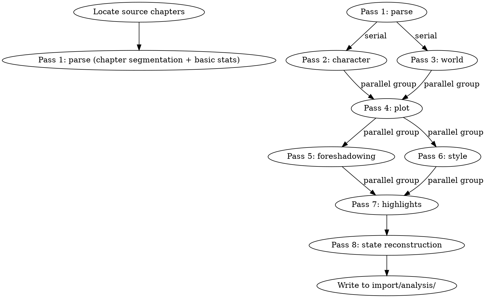

<!-- AUTO-CHECK-START -->

## auto-check (generated -- do not edit)

<!-- AUTO-CHECK-END -->

<!-- AUTO-GENERATED from frontmatter — do not edit -->

## 数据契约

- **Reads:** import/source/*.txt
- **Writes:** import/analysis/*.md
- **Updates:** none

<!-- END AUTO-GENERATED -->

# 导入分析

8 通道分析管线。负责解析 → 角色 → 世界 → 情节 → 伏笔 → 风格 → 高光 → 状态重建。

## 流程



## 铁律

1. **8 通道串并混合** — Pass 1 解析必须最先完成；Pass 2-3 串行；Pass 4-7 可并行；Pass 8 收尾
2. **零猜测** — 提取内容必须能在源文中找到对应片段；无法定位的标注为"未确认"
3. **不直接修改 truth/** — 状态重建是"建议态"，需经人工审批后由 truth-sync 写入
4. **风格学习零 LLM** — Pass 6 调用 `shenbi-style-learning`（纯统计），不调用语言模型
5. **输出可追溯** — 每个分析结论必须能定位到源章节号 + 段落

## 8 通道说明

### Pass 1: 解析

- 输入：源目录
- 输出：`import/analysis/01_parse.md`
- 任务：章节切分、字数统计、章节摘要列表、关键节点识别

### Pass 2: 角色

- 输入：解析结果
- 输出：`import/analysis/02_characters.md`
- 任务：识别登场角色、初步归类（主角/主要/次要）、角色密度分布

### Pass 3: 世界

- 输入：解析结果
- 输出：`import/analysis/03_world.md`
- 任务：识别地点、势力、力量体系、关键规则

### Pass 4: 情节

- 输入：角色 + 世界
- 输出：`import/analysis/04_plot.md`
- 任务：识别主线/支线、关键转折、章节级时间线

### Pass 5: 伏笔

- 输入：情节
- 输出：`import/analysis/05_foreshadowing.md`
- 任务：识别已埋伏笔、已兑现伏笔、未兑现伏笔、埋没伏笔

### Pass 6: 风格

- 输入：解析结果
- 输出：`import/analysis/06_style.md`（来自 `shenbi-style-learning`）
- 任务：句长/段长统计、TTR、高频模式、修辞特征

### Pass 7: 高光

- 输入：情节 + 风格
- 输出：`import/analysis/07_highlights.md`
- 任务：识别"高光章节"（信息密度+情感密度双高）

### Pass 8: 状态重建

- 输入：所有前序结果
- 输出：`import/analysis/08_state_reconstruction.md`
- 任务：从已读完章节反推当前状态（位置/资源/关系/伏笔），作为 truth/ 重建的参考输入

## 并行策略

Pass 4-7 之间有数据依赖但无强顺序：

- Pass 4 (情节) 依赖 Pass 2+3
- Pass 5 (伏笔) 依赖 Pass 4
- Pass 6 (风格) 独立（只依赖 Pass 1）
- Pass 7 (高光) 依赖 Pass 4+6

实际执行：
- Pass 6 可与 Pass 4-5 并行（最重，应早开始）
- Pass 7 需在 Pass 4-6 全部完成后启动

## 输出格式

每个 Pass 输出独立文件，结构：

```markdown
# Pass N: [通道名]

**输入**: [依赖文件]
**输出**: 本文件
**运行时间**: YYYY-MM-DD HH:MM

## 处理结果

[本通道的核心发现]

## 数据清单

| 类别 | 数量 | 样本 |
|------|------|------|
| ... | N | [示例] |

## 待人工确认

- [不确定项] [原因]
```

## 汇总

```markdown
## 导入分析汇总

**源目录**: [路径]
**分析时间**: YYYY-MM-DD
**写入目录**: `import/analysis/`

### 8 通道完成情况

| Pass | 名称 | 状态 | 输出文件 | 行数 |
|------|------|------|---------|------|
| 1 | 解析 | ✓ | 01_parse.md | N |
| 2 | 角色 | ✓ | 02_characters.md | N |
| 3 | 世界 | ✓ | 03_world.md | N |
| 4 | 情节 | ✓ | 04_plot.md | N |
| 5 | 伏笔 | ✓ | 05_foreshadowing.md | N |
| 6 | 风格 | ✓ | 06_style.md | N |
| 7 | 高光 | ✓ | 07_highlights.md | N |
| 8 | 状态重建 | ✓ | 08_state_reconstruction.md | N |

### 关键统计

- 章节总数: N
- 字数总计: X
- 角色数: Y
- 地点数: Z
- 伏笔数（含已兑现/未兑现）: W
- 高光章节数: V

### 下游任务

- [ ] 调用 `shenbi-character-extraction` 基于 Pass 2 生成角色卡
- [ ] 调用 `shenbi-world-extraction` 基于 Pass 3 生成世界观文件
- [ ] 调用 `shenbi-style-learning` 基于 Pass 6 验证风格画像
- [ ] 经人工审批后用 truth-sync 写入 truth/ 状态
```

## Anti-Rationalization

| Excuse | Reality |
|--------|---------|
| "8 通道太多，3 个够了" | 简化 = 关键信号丢失 = 后续提取质量差 |
| "Pass 之间不能并行" | 风格分析（统计）天然独立，不并行就是浪费时间 |
| "提取的'未确认'项无所谓" | 未确认项是后续必须人工仲裁的标记，跳过 = 错误传播 |
| "直接全部串行最快" | 串行 8 个 LLM 调用 > 1 小时；并行 4 通道 = 20 分钟 |
