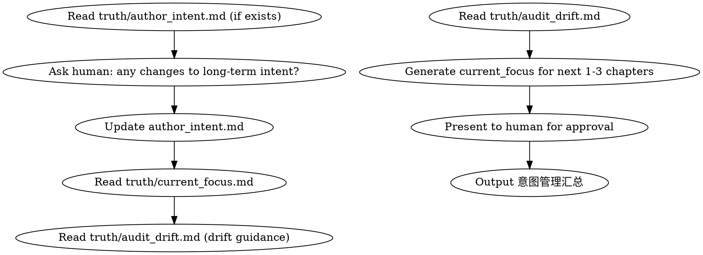

<!-- AUTO-GENERATED from frontmatter — do not edit -->

## 数据契约

- **Reads:** truth/author_intent.md, truth/audit_drift.md
- **Writes:** none
- **Updates:** truth/author_intent.md, truth/current_focus.md

<!-- END AUTO-GENERATED -->

# 意图管理

维护 `truth/author_intent.md`（长期意图）和 `truth/current_focus.md`（1-3章关注点）。

## 流程



## 铁律

1. **author_intent 由人类口述，AI 整理** — AI 不得替作者做创作决策
2. **current_focus 每次 chapter-planning 前必须更新** — 不更新 = 章节备忘脱离关注点
3. **drift guidance 必须自动合并到 current_focus** — 纠偏遗漏 = 问题在下一章重复出现

## 文件格式

### truth/author_intent.md

```markdown
---
updated: 2026-06-15
current_volume: 1
long_term_goals:
  - "主角最终要成为最强，但不走常规路线"
  - "暗线：玉佩的来源与上古传承的关系"
  - "第一女主线：苏晴在卷末面临抉择"
narrative_principles:
  - "不忘初心——主角的所有行动最终服务于'守护'主题"
  - "拒绝龙傲天——每次胜利都有代价"
status: active
---
```

### truth/current_focus.md

```markdown
---
next_3_chapters: [6, 7, 8]
focus_items:
  - priority: P0
    item: "控制转折词密度 ≤ 3次/章（来自第5章drift）"
    source: audit_drift
  - priority: P1
    item: "推进 hook-002 预言兑现"
    source: foreshadowing
  - priority: P1
    item: "展示主角领导力成长"
    source: character_arc
  - priority: P2
    item: "引入新反派线索"
    source: plot
status: draft
---

# 当前关注点 (第6-8章)

[人类可读的叙事化描述]
```

## 执行步骤

1. 读取 `truth/author_intent.md`（若不存在则提示人类口述）
2. 询问人类：长期意图是否有变化？
3. 若有变化则更新 `author_intent.md`（YAML frontmatter 格式）
4. 读取 `truth/current_focus.md` 和 `truth/audit_drift.md`
5. 根据 audit_drift 自动合并纠偏项到 current_focus
6. 生成下一 1-3 章的 current_focus（按 P0/P1/P2 优先级）
7. 提交人类批准
8. 写入 `truth/current_focus.md`，状态置为 active
9. 输出意图管理汇总

## 意图管理汇总

每次意图更新完成，必须给出汇总便于 human partner 确认意图对齐：

```markdown
## 意图管理汇总

**更新时间**: YYYY-MM-DD
**author_intent 状态**: active
**current_focus 范围**: 第N-M章

### author_intent 变更

| 维度 | 变更 |
|------|------|
| 长期目标 | 新增/修改/删除 X 项 |
| 叙事原则 | 新增/修改/删除 X 项 |
| 当前卷号 | 第X卷 |

### current_focus 关注项

| 优先级 | 数量 | 来源分布 |
|--------|------|---------|
| P0 | X | audit_drift: A, foreshadowing: B, character_arc: C, plot: D |
| P1 | X | audit_drift: A, foreshadowing: B, character_arc: C, plot: D |
| P2 | X | audit_drift: A, foreshadowing: B, character_arc: C, plot: D |

### drift guidance 合并情况

- 已合并纠偏项: X 条
- 忽略纠偏项: 0 条（全部必须合并）

### 待人类确认

- [ ] author_intent.md 更新是否符合本意？
- [ ] current_focus.md 优先级排序是否同意？
```

## Anti-Rationalization

| Excuse | Reality |
|--------|---------|
| "我记住作者意图了，不用写" | 50章后你还能记住第3章的意图细节？ |
| "1-3章范围太窄了" | 精确的近期关注点 > 模糊的长期规划 |
| "drift 是 agent 推的，作者不一定认可" | drift 写入时已有人类确认；不合并 = 漏掉已确认的纠偏 |
