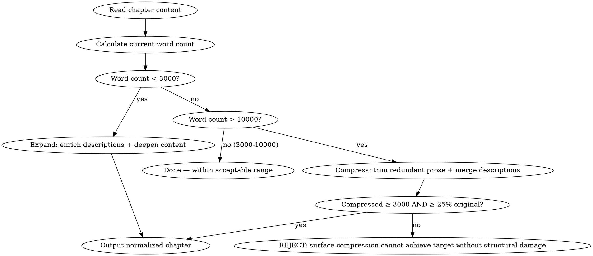

# 字数治理

HARD-GATE: 正文 < 3000 字 → 触发扩写，必须达到 ≥ 3000 字。正文 > 10000 字 → 触发压缩，压缩后不得 < 3000 字且不得 < 原始长度的 25%（取更严格者）。3000-10000 字不触发。

## 流程



## 数据契约

- **Reads:** `chapters/chapter-N.md`, `novel.json`
- **Writes:** none (edits chapter in-place)
- **Updates:** `chapters/chapter-N.md`

## 铁律

1. **不改变叙事内容** — 压缩/扩写不能增删事件、改变角色行为、影响伏笔
2. **3000 字扩写线** — 正文 < 3000 字触发扩写，必须达到 ≥ 3000 字
3. **10000 字压缩线** — 正文 > 10000 字触发压缩。3000-10000 为可接受范围，不触发任何操作
4. **压缩双底线** — 压缩后必须同时满足 ≥ 3000 字且 ≥ 原始长度的 25%。违反任一 → 拒绝压缩
5. **保持声音指纹** — 扩写/压缩不能引入 AI 味句式

## 压缩策略

- 合并功能重复的描写
- 剪除冗余修饰（删形容词不删信息）
- 压缩过渡段落
- 合并相邻的同类场景描述

注意：表面压缩安全范围约为原始长度的 15-20%。超过此范围需要结构性编辑（拆分章节、合并场景），不在本 skill 范围内。

## 扩写策略

- 展开角色内心活动
- 丰富环境描写（感官细节）
- 深化对话潜台词
- 增加场景过渡的衔接段落
- 扩充关键决策时刻的心理过程

## 输出格式

```markdown
# 归一化后的第N章

[完整的归一化后章节正文]

---

## 归一化报告

**原始字数**: N
**触发条件**: N < 3000（扩写）/ N > 10000（压缩）
**归一化后字数**: M (变化: ±Z, ±X%)
**策略**: 扩写 / 压缩
**底线检查**: M ≥ 3000 ✓/✗ | M ≥ 25%×N ✓/✗（压缩时）
- 段落处理: N处
- 用词调整: N处
- 总字数变化: +N/-N (X%)
```

## 字数归一化汇总

```markdown
## 字数归一化汇总

**章节**: 第N章
**触发原因**: 正文 < 3000（扩写）/ 正文 > 10000（压缩）

### 字数对比

| 阶段 | 字数 | 说明 |
|------|------|------|
| 原始 | N | < 3000 扩写 / > 10000 压缩 |
| 扩写线 | 3000 | 低于此触发扩写 |
| 可接受区间 | 3000-10000 | 不触发任何操作 |
| 压缩线 | 10000 | 超过此触发压缩 |
| 25% 底线 | N×0.25 | 压缩时结构保护阈值 |
| 归一化后 | K | 扩写：K ≥ 3000；压缩：K ≥ max(3000, N×0.25) |

### 策略应用

- 压缩点: [段落号 + 处理方式]
- 扩写点: [段落号 + 添加内容]
- 跳过点: [无法在不改变叙事的前提下处理的位置]

### 一致性检查

- [ ] 事件序列未变
- [ ] 角色行为未变
- [ ] 伏笔提及未变
- [ ] 3000 字底线已满足
- [ ] 25% 底线已满足
- [ ] 两条底线均满足（或已触发 REJECT）
```

## Anti-Rationalization

| Excuse | Reality |
|--------|---------|
| "字数差一点没关系" | 目标平台对字数有明确区间，不符合 = 章节不被推荐 |
| "直接删掉一段就行" | 删段落 = 丢失信息 = 叙事断裂 |
| "扩写就是多写几句" | 无目的扩写 = 灌水 = AI 味；必须深化内容 |
| "反正读者不会数" | 平台和编辑会计数；签约审核也会计数 |
