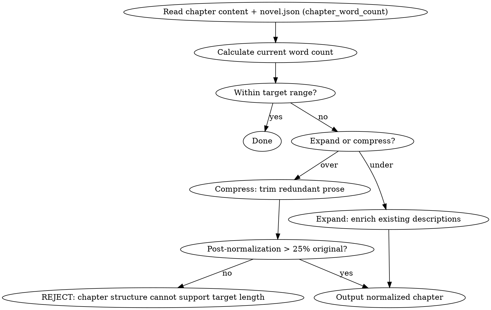

# 字数治理

HARD-GATE: 如果归一化后正文长度 < 原始长度的 25%，拒绝归一化（原章节结构无法支撑目标字数）。

## 流程



## 数据契约

- **Reads:** `chapters/chapter-N.md`, `novel.json` (target_word_count), `genre-config.json`
- **Writes:** none (edits chapter in-place)
- **Updates:** `chapters/chapter-N.md`

## 铁律

1. **不改变叙事内容** — 压缩/扩写不能增删事件、改变角色行为、影响伏笔
2. **软区间优先** — target_word_count ± 15% 是软区间，± 30% 是硬上限
3. **25% 底线** — 压缩后 < 25% 原始长度 → 章节需要重写，不做表面压缩
4. **保持声音指纹** — 扩写不能引入 AI 味句式

## 压缩策略

- 合并功能重复的描写
- 剪除冗余修饰（删形容词不删信息）
- 压缩过渡段落

## 扩写策略

- 展开角色内心活动
- 丰富环境描写
- 深化对话潜台词
- 增加感官细节

## 输出格式

```markdown
# 归一化后的第N章

[完整的归一化后章节正文]

---

## 归一化报告

**原始字数**: N
**目标区间**: [X, Y] (soft: ±15%, hard: ±30%)
**归一化后字数**: M (变化: +N/-N, X%)
**策略**: 压缩 / 扩写
- 段落处理: N处
- 用词调整: N处
- 总字数变化: +N/-N (X%)
```

## 字数归一化汇总

```markdown
## 字数归一化汇总

**章节**: 第N章
**触发原因**: [超出软区间 / 低于硬下限 / 平台要求]

### 字数对比

| 阶段 | 字数 | 与目标差距 |
|------|------|-----------|
| 原始 | N | +/-X% |
| 目标 | M | 0% (基准) |
| 软上限 | M×1.15 | +15% |
| 硬上限 | M×1.30 | +30% |
| 软下限 | M×0.85 | -15% |
| 硬下限 | M×0.70 | -30% |
| 25% 底线 | 原始×0.25 | (保护阈值) |
| 归一化后 | K | +/-X% |

### 策略应用

- 压缩点: [段落号 + 处理方式]
- 扩写点: [段落号 + 添加内容]
- 跳过点: [无法在不改变叙事的前提下处理的位置]

### 一致性检查

- [ ] 事件序列未变
- [ ] 角色行为未变
- [ ] 伏笔提及未变
- [ ] 25% 底线已满足（或已触发 REJECT）
```

## Anti-Rationalization

| Excuse | Reality |
|--------|---------|
| "字数差一点没关系" | 目标平台对字数有明确区间，不符合 = 章节不被推荐 |
| "直接删掉一段就行" | 删段落 = 丢失信息 = 叙事断裂 |
| "扩写就是多写几句" | 无目的扩写 = 灌水 = AI 味；必须深化内容 |
| "反正读者不会数" | 平台和编辑会计数；签约审核也会计数 |
