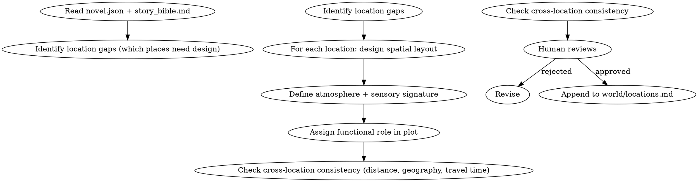

# 地点构建

设计小说中的具体地点。负责空间布局、氛围描写、功能定位、跨地点空间一致性。

## 流程



## 数据契约

- **Reads:** `novel.json`, `world/story_bible.md`, `world/rules.md`, `world/locations.md` (existing), `outline/story_frame.md`
- **Writes:** 无（增量追加）
- **Updates:** `world/locations.md`

## 铁律

1. **散文描写，非条目列表** — 每个地点以连贯段落描述，禁止"特征1/特征2/特征3"式条目
2. **空间一致性** — A 地点到 B 地点的距离、方向、行程时间必须与已设定一致；矛盾时人类仲裁
3. **氛围与题材匹配** — 仙侠/玄幻/都市/历史各有空间氛围惯例，不可错位
4. **功能定位必填** — 每个地点必须明确：剧情功能（藏匿点/决战地/信息枢纽/情感锚点）

## 核心维度

### 1. 空间布局

- 内部结构：入口、主厅、侧室、隐蔽通道
- 周边环境：相邻地点、地理屏障、视野
- 尺度感：能让读者在脑中"走一遍"

### 2. 氛围锚点

- 主导感官：视觉（光影/色彩）、听觉（背景音）、嗅觉（气味记忆）
- 时间感：固定时间色彩（晨雾/夜雨/黄昏）作为地点标签
- 不写氛围 = 地点沦为舞台道具

### 3. 功能定位

| 类型 | 剧情作用 |
|------|---------|
| 起点 | 主角初始活动范围 |
| 转折 | 重大事件发生地 |
| 决战场 | 高潮冲突的物理空间 |
| 情感锚 | 角色情感记忆的载体 |
| 信息枢纽 | 消息汇聚/分发节点 |

一个地点可承担多种功能，但主功能必须唯一。

### 4. 跨地点一致性

- 距离矩阵：A→B 的相对距离一旦确定不可轻易改动
- 地理逻辑：山、河、湖、城的位置关系必须自洽
- 行程时间：步行/骑行/飞行的合理时间

## 输出格式

追加到 `world/locations.md`：

```markdown
---

## 地点：[地点名]

**类型**: [城市/建筑/秘境/野外/...]
**功能定位**: [起点/转折/决战/情感锚/信息枢纽]
**所属**: [国家/势力/野外]
**首次出场**: 第N章
**空间坐标**: [相对其他地点的方位]

### 布局描述

[200-400字散文：入口/主厅/侧翼/特殊区域，空间逻辑清晰]

### 氛围锚点

[150-300字散文：主导感官、时间感、给读者的整体情绪]

### 功能事件

- 第N章: [事件]
- 第M章: [事件]

### 关联地点

- [相邻地点A]: [方向] [距离/行程]
- [相邻地点B]: [方向] [距离/行程]
```

## 汇总

每次地点构建完成必须输出汇总：

```markdown
## 地点构建汇总

**更新文件**: `world/locations.md`
**新增地点数**: X

| 地点 | 类型 | 功能定位 | 首次出场 | 跨地点引用 |
|------|------|---------|---------|-----------|
| [名] | [类] | [功能] | 第N章 | [关联数] |

### 一致性检查

- [ ] 与已有地点的距离/方向无矛盾
- [ ] 与 story_bible.md 的世界规则一致
- [ ] 与 outline 的章节事件时序一致
```

## Anti-Rationalization

| Excuse | Reality |
|--------|---------|
| "地点就是场景，随便写写" | 空间模糊 = 读者无法脑内建模 = 沉浸感断裂 |
| "不需要氛围，纯功能就行" | 氛围是地点的记忆点，无氛围 = 30章后读者记不住这地方发生过什么 |
| "跨地点一致性后面再核对" | 一旦 A→B 距离写错，所有依赖此距离的情节连锁崩塌 |
| "功能性地点不需要散文" | 功能≠无描写。决战地尤其需要空间感 |
