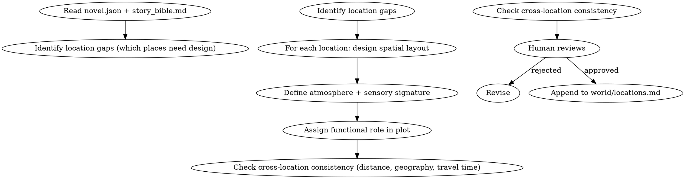

<!-- AUTO-GENERATED from frontmatter — do not edit -->

## 数据契约

- **Reads:** novel.json, world/story_bible.md, world/rules.md, world/locations.md, outline/story_frame.md
- **Writes:** none
- **Updates:** world/locations.md

<!-- END AUTO-GENERATED -->

# 地点构建

设计小说中的具体地点。负责空间布局、氛围描写、功能定位、跨地点空间一致性。
**职责边界**：`world/locations.md` 初始核心地点（3-5 个）由 `shenbi-worldbuilding` 创建；本 skill 负责后续**追加/扩展**具体地点（每个地点 append，不重写已有地点）。反向场景（从已有手稿提取地点）用 `shenbi-world-extraction`。

## 流程



## 铁律

1. **散文描写，非条目列表** — 每个地点以连贯段落描述，禁止"特征1/特征2/特征3"式条目
2. **空间一致性** — A 地点到 B 地点的距离、方向、行程时间必须与已设定一致；矛盾时人类仲裁
3. **氛围与题材匹配** — 仙侠/玄幻/都市/历史各有空间氛围惯例，不可错位
4. **功能定位必填** — 每个地点必须明确：剧情功能（藏匿点/决战地/信息枢纽/情感锚点）

## 核心维度

### 1. 空间布局

- 内部结构：入口、主厅、侧室、隐蔽通道
- 周边环境：相邻地点、地理屏障、视野
- 尺度感：能让读者在脑中"走一遍"

### 2. 氛围锚点

- 主导感官：视觉（光影/色彩）、听觉（背景音）、嗅觉（气味记忆）
- 时间感：固定时间色彩（晨雾/夜雨/黄昏）作为地点标签
- 不写氛围 = 地点沦为舞台道具

### 3. 功能定位

| 类型 | 剧情作用 |
|------|---------|
| 起点 | 主角初始活动范围 |
| 转折 | 重大事件发生地 |
| 决战场 | 高潮冲突的物理空间 |
| 情感锚 | 角色情感记忆的载体 |
| 信息枢纽 | 消息汇聚/分发节点 |

一个地点可承担多种功能，但主功能必须唯一。

### 4. 跨地点一致性

- 距离矩阵：A→B 的相对距离一旦确定不可轻易改动
- 地理逻辑：山、河、湖、城的位置关系必须自洽
- 行程时间：步行/骑行/飞行的合理时间

## 输出格式

追加到 `world/locations.md`，每个地点使用以下 EXACT 节标题。缺任意一节或节标题不匹配即为不合格输出。

**节标题校验规则**：输出必须包含且仅按此顺序包含：
1. `## 地点：{name}` — H2，地点名替换 {name}
2. `### 空间布局` — H3
3. `### 感官锚点` — H3
4. `### 时间光色` — H3
5. `### 功能事件` — H3
6. `### 地理位置` — H3

```markdown
---

## 地点：{name}

**类型**: [城市/建筑/秘境/野外/...]
**功能定位**: [起点/转折/决战/情感锚/信息枢纽]
**所属**: [国家/势力/野外]
**首次出场**: 第N章
**主导感官**: [视觉/听觉/嗅觉/触觉/味觉]（必填，五选一）
**最近地标**: [最近已知地点名]（必填）
**距离最近地标**: [数字] [单位]（必填）
**行程时间**: [步行/骑行/飞行 N时间]（必填）

### 空间布局

[200-400字散文：入口/主厅/侧翼/特殊区域，空间逻辑清晰。读者必须能在脑中"走一遍"]

### 感官锚点

[150-300字散文：主导感官的细腻描写。必须包含 ≥ 5 个独立感官细节（如：潮湿石壁的触感、铁锈味、远处钟声），每个细节标注所属感官类型]

**感官细节计数要求**：≥ 5 个独立感官细节。可用 `感官细节: N/5` 自检。

### 时间光色

[100-200字散文：该地点在不同时间的视觉特征（晨/午/暮/夜），至少覆盖 2 个时段。包括光线角度、色温、阴影特征]

### 功能事件

**必须列出 ≥ 3 个在该地点发生的剧情事件（章节引用）**：

| 章节 | 事件 | 功能类型 |
|------|------|---------|
| 第N章 | [事件描述] | 藏匿/决战/信息/情感 |
| 第M章 | [事件描述] | 藏匿/决战/信息/情感 |
| 第P章 | [事件描述] | 藏匿/决战/信息/情感 |

### 地理位置

- **相邻地点A**: [方向] [距离/行程] [地形特征]
- **相邻地点B**: [方向] [距离/行程] [地形特征]
```

**可自动检查的计数规则**：
| 检查项 | 规则 | 不合格条件 |
|--------|------|----------|
| 感官细节数 | ≥ 5 个独立细节 | < 5，或细节未标注感官类型 |
| 功能事件数 | ≥ 3 个 | < 3，或缺失章节引用 |
| 主导感官 | 必填，五选一 | 空值或值不在允许列表中 |
| 最近地标 | 必填 | 空值 |
| 距离最近地标 | 必填，含数字+单位 | 空值或无数值 |
| 行程时间 | 必填 | 空值 |
| 时间光色 | 覆盖 ≥ 2 个时段 | ≤ 1 个时段 |
| 节标题完整性 | 6 个节标题全部存在 | 缺任意一个 |

## 汇总

```markdown
## 地点构建汇总

**更新文件**: `world/locations.md`
**新增地点数**: X

| 地点 | 类型 | 功能定位 | 感官细节 | 功能事件 | 首次出场 |
|------|------|---------|---------|---------|---------|
| [名] | [类] | [功能] | ≥5 | ≥3 | 第N章 |

### 自动化检查清单

- [ ] 每个地点感官细节 ≥ 5 且标注感官类型
- [ ] 每个地点功能事件 ≥ 3 且含章节引用
- [ ] 每个地点主导感官已填且有效
- [ ] 每个地点最近地标/距离/行程时间已填
- [ ] 每个地点时间光色覆盖 ≥ 2 个时段
- [ ] 与已有地点的距离/方向无矛盾
- [ ] 与 story_bible.md 的世界规则一致
- [ ] 节标题精确匹配 6 个规定标题
```

## Anti-Rationalization

| Excuse | Reality |
|--------|---------|
| "地点就是场景，随便写写" | 空间模糊 = 读者无法脑内建模 = 沉浸感断裂 |
| "不需要氛围，纯功能就行" | 氛围是地点的记忆点，无氛围 = 30章后读者记不住这地方发生过什么 |
| "跨地点一致性后面再核对" | 一旦 A→B 距离写错，所有依赖此距离的情节连锁崩塌 |
| "功能性地点不需要散文" | 功能≠无描写。决战地尤其需要空间感 |
