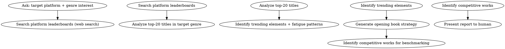

<!-- AUTO-GENERATED from frontmatter — do not edit -->

## 数据契约

- **Reads:** novel.json, genre-config.json
- **Writes:** none
- **Updates:** none

<!-- END AUTO-GENERATED -->

# 市场雷达

平台趋势扫描：排行榜数据、题材分析、开书建议、对标作品。

## 流程



## 铁律

1. **基于数据，不是直觉** — 所有建议必须有排行榜数据支撑
2. **识别趋势不是模仿** — 告诉作者什么在起势，不是教作者抄
3. **回避疲劳元素** — 如果某元素在 top-20 中出现 > 60%，标记为"饱和"
4. **尊重作者创意** — 建议是参考，作者决定是否采纳

## 数据引用铁律

**每条推荐必须引用具体数据行作为证据来源。** 不得使用"排行榜显示"、"数据显示"等模糊表述。

引用格式：
```markdown
- **推荐**: [建议内容]
  - **数据来源**: [平台名称] [榜单类型] 第 N 名: [书名] — [具体数据点]
```

若推荐无法关联到具体数据行，该推荐不得出现在最终报告中。

## 输出格式

```markdown
## 市场雷达报告

**平台**: 起点中文网
**题材**: 玄幻
**日期**: YYYY-MM-DD

### 排行榜快照 (Top 10)
[简要摘要]

### 趋势信号
- 上升: [元素1], [元素2]
- 饱和: [元素3]
- 衰退: [元素4]

### 开书建议
[差异化切入角度建议]

### 对标作品
[2-3部可参考的作品及分析]
```

## 汇总

报告末尾必须包含一节「**作者决策清单**」，把"哪些建议值得跟进"和"哪些建议需要警惕"以**可勾选**的形式列出，让你的 human partner 在 60 秒内决定下一步：

```markdown
### 作者决策清单

- [ ] **跟进**: [开书建议 #1] — 预期差异化优势: [一句话]
- [ ] **跟进**: [开书建议 #2] — 预期差异化优势: [一句话]
- [ ] **警惕**: [饱和元素 #1] — 回避方式: [一句话]
- [ ] **警惕**: [衰退元素 #1] — 回避方式: [一句话]
- [ ] **研究**: [对标作品 #1] — 重点看: [一句话]
- [ ] **研究**: [对标作品 #2] — 重点看: [一句话]
```

「汇总」不等于「总结」。总结是回顾，汇总是**下一步行动**。如果你的 human partner 读完报告后不知道"现在该做什么"，这一节就失败了。

## Anti-Rationalization

| Excuse | Reality |
|--------|---------|
| "追热点写最火的题材" | 热点 = 一年后你的书上架时已是红海 |
| "不用看市场，好故事自然有人看" | 好故事 + 正确平台策略 = 双倍效果 |
| "排行榜都是刷的，数据不可信" | 排行榜是相对信号；不可全信但可参考；剔除明显刷榜后仍有效 |
| "我比排行榜编辑更懂市场" | 你的数据样本是 0；排行榜编辑的样本是百万级读者行为 |
| "我这是创新题材，没法对标" | 没对标 ≠ 没市场；创新题材需要更大胆的开书策略 |
