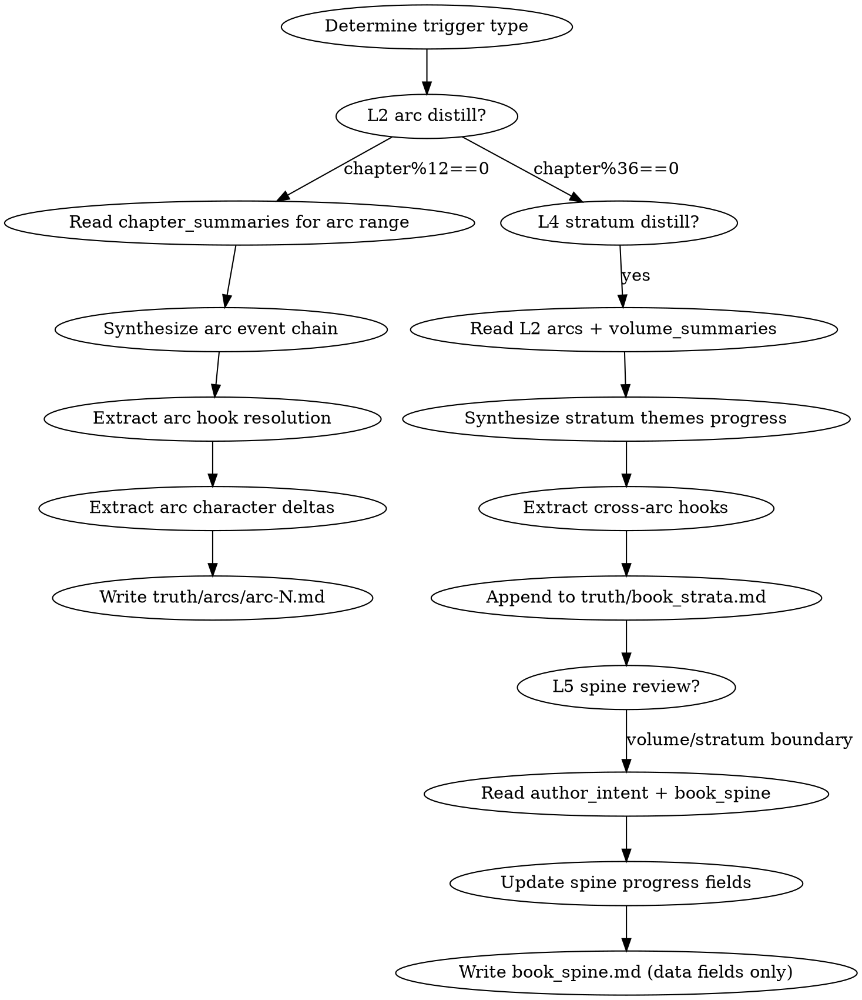

<!-- AUTO-CHECK-START -->

## auto-check (generated -- do not edit)

<!-- AUTO-CHECK-END -->

<!-- AUTO-GENERATED from frontmatter — do not edit -->

## 数据契约

- **Reads:** truth/chapter_summaries.md, truth/volume_summaries.md, truth/pending_hooks.md, truth/character_matrix.md
- **Writes:** truth/arcs/arc-N.md, truth/book_strata.md
- **Updates:** truth/book_spine.md

<!-- END AUTO-GENERATED -->

# 记忆蒸馏

泛化 volume-consolidation。产出 L2（弧段合成）、L4（大弧合成）、维护 L5（书脊滚动复核）。这是分层记忆架构的核心——让上下文窗口大小有界，与全书总字数无关。

## 触发规则（固定章数，确定性）

| 触发条件 | 动作 |
|---------|------|
| `chapter % 12 == 0` | L2 弧段蒸馏 → 写 `truth/arcs/arc-(chapter//12).md` |
| `chapter % 36 == 0` | L4 大弧蒸馏 → append 到 `truth/book_strata.md` |
| 卷边界（volume_map 声明的卷末章） | L3 卷摘要（复用 volume-consolidation 逻辑）+ L5 滚动复核 |
| 大弧边界（chapter % 36 == 0） | L5 滚动复核（合并 author_intent，更新进度） |

## 流程



## 铁律

1. **蒸馏可溯源** — 每条合成结论必须可追溯到具体章节（引用章号），例如"第23-25章：林轩获得传承 → 第26章：首次实战"
2. **增量产出** — L2/L4 只追加本弧/本大弧的合成，不重写历史层
3. **信息损失显式标注** — 蒸馏必然损失信息，未兑现的伏笔/悬置的张力必须在"未解决悬置"显式列出
4. **L5 滚动复核不破坏声明** — 书脊的核心冲突/themes/主角弧终点是声明值（book-spine-init 从 author_intent/novel.json 继承），复核只更新数据字段（当前位置/进度/themes探索深度），不改声明本身
5. **L5 字段分区所有权** — memory-distill 只写数据值（进度/状态）；诊断值（漂移/达成）由 score-stratum 写；声明值由 book-spine-init 初始化。三者用不同 YAML 字段

## L2 弧段合成输出格式

写 `truth/arcs/arc-N.md`（N = chapter // 12）：

```markdown
---
arc: N
chapter_range: [start]-[end]
volume: [从 volume_map 确定]
generated_at: YYYY-MM-DD
generated_by: shenbi-memory-distill
---

# 第N弧段合成

## 弧内事件链
[连续叙事摘要，~800字，可追溯到具体章节。每个关键事件标注章号。]

## 弧内伏笔兑现/推进
- [hook_id]: 第X章 [advance/resolve/plant] — [方式]
- ...

## 角色状态变化（弧段粒度）
- [角色]: [起点状态] → [终点状态]，关键转折章: N
- ...

## 张力曲线本弧段
[本弧段张力走向，对照卷节奏原则。标注高潮章和低谷章。]

## 未解决悬置（带入下一弧段）
- [悬置项]: 为何未解决，预期解决弧段
```

## L4 大弧合成输出格式

Append 到 `truth/book_strata.md`（每36章一段）：

```markdown
---
stratum: N
chapter_range: [start]-[end]
generated_at: YYYY-MM-DD
---

# 第N大弧合成

## 弧范围
第[start]章 - 第[end]章

## 本弧主题推进
- [theme]: 本弧如何推进此主题（具体事件链，引用大弧内章号）

## 跨弧伏笔账
- MH01: 第X章种植 → 第Y章推进 → 当前状态
- ...

## 角色弧弧段
- [角色]: [弧段起点状态] → [弧段终点状态]，关键转折章: N
- ...

## 未解决的张力悬置（带入下一大弧）
- [悬置项]: 为何未解决，预期解决弧段
```

## L5 书脊滚动复核

卷/大弧边界时更新 `truth/book_spine.md` 的**数据字段**（不改声明字段）：

- `status`: pending_intent → active（首次合并 author_intent 后）
- themes 探索进度：更新已探索章节范围
- 主角弧进度：更新当前位置百分比
- master hooks 状态：更新最后推进章、状态
- world 铁律快照：从 world/rules.md 同步前5条

## Anti-Rationalization

| Excuse | Reality |
|--------|---------|
| "弧段蒸馏就是摘要压缩" | 蒸馏必须提取事件链 + 伏笔 + 角色弧，不是压缩文字 |
| "信息损失无所谓" | 未兑现伏笔若不标注，下一弧段遗忘 = Chase Power 债务暴增 |
| "L5 复核时可以改 themes" | themes 是声明值，复核只更新进度；改 themes = 偏离 author_intent |
| "L4 大弧和 L3 卷摘要重复" | L4 是跨卷长程线（master hooks/角色弧段），L3 是单卷叙事；职责不同 |
