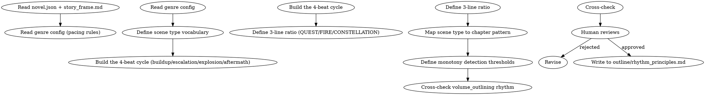

<!-- AUTO-CHECK-START -->

## auto-check (generated -- do not edit)

### invariants

- beat sum is 100
- constellation range
- eight scene types
- four beats present
- no three consecutive same
- three lines present

<!-- AUTO-CHECK-END -->

<!-- AUTO-GENERATED from frontmatter — do not edit -->

## 数据契约

- **Reads:** novel.json, outline/story_frame.md, outline/volume_map.md, genre-config.json
- **Writes:** none
- **Updates:** outline/rhythm_principles.md

<!-- END AUTO-GENERATED -->

# 节奏设计

**职责边界**：story-architecture 创建 `outline/rhythm_principles.md` 的节奏骨架（仅含整体哲学 + 比例粗设）。本 skill 负责细化为完整规则：详细的张力曲线、连续章数限制（maxConsecutiveQuest、maxGapQuest）、爆发频率控制。如果 `rhythm_principles.md` 已由 story-architecture 创建，本 skill 读取并细化；如果不存在，本 skill 创建。

设计小说的整体节奏原则。负责铺垫→升级→爆发→余波的循环、场景类型序列防单调、三线比例。

## 流程



## 铁律

1. **循环必有四拍** — 每个叙事循环必须包含 铺垫/升级/爆发/余波，缺一拍 = 节奏残缺
2. **三线比例必协调** — QUEST（火线/任务）/ FIRE（情线/关系）/ CONSTELLATION（星线/世界观）必须同时存在，缺一 = 偏科
3. **场景类型不重复超 3 章** — 连续 3 章以上同一类型场景 = 必须插入不同类型
4. **节奏原则不与题材冲突** — 仙侠长铺垫、都市快节奏、历史厚重感，原则需匹配

## 核心设计

### 1. 四拍循环

| 拍 | 占比 | 作用 |
|----|------|------|
| 铺垫 (buildup) | 30-40% | 日常、信息、世界观铺设 |
| 升级 (escalation) | 30-40% | 小冲突累积、张力递增 |
| 爆发 (explosion) | 10-20% | 重大冲突、决策、转折 |
| 余波 (aftermath) | 15-25% | 情绪沉淀、关系变化、伏笔种植 |

完整循环约 8-15 章一次。卷末的爆发段可以延长为卷高潮。

### 2. 三线比例

| 线 | 含义 | 典型比例 | 失衡后果 |
|----|------|---------|---------|
| QUEST | 任务/冒险/主线推进 | 50-60% | 太多=流水账；太少=停滞 |
| FIRE | 关系/情感/羁绊 | 25-35% | 太多=恋爱脑；太少=冷血 |
| CONSTELLATION | 世界观/设定/智斗 | 15-25% | 太多=说教；太少=扁平 |

比例可随卷调整：开卷 CONSTELLATION 偏高铺垫，情感卷 FIRE 偏高。

### 3. 场景类型

至少定义 6-8 种场景类型：

| 类型 | 标志 |
|------|------|
| 战斗 | 高强度冲突 |
| 对话 | 信息/情感交流 |
| 日常 | 角色互动/生活 |
| 探索 | 新地点/新信息 |
| 修炼 | 能力提升/突破 |
| 阴谋 | 算计/政治 |
| 逃亡 | 危机/追击 |
| 揭示 | 真相/揭露 |

每卷使用全部类型，单卷内不连续 3 章同类型。

### 4. 单调性检测阈值

可由 `shenbi-chapter-pattern` 自动检测的指标：

- 连续 N 章同章尾收束方式（hook/transition/cliffhanger）
- 连续 N 章同开篇方式（dialogue/action/exposition）
- 连续 N 章同主导场景类型
- 连续 N 章同情感基调

阈值默认 N=3，超出报警。

## 输出格式

输出到 `outline/rhythm_principles.md`，使用以下 EXACT 节标题。缺任意一节即为不合格。

**节标题校验规则**：输出必须包含：
1. `# 节奏原则` — H1
2. `## 四拍循环` — H2
3. `## 三线比例` — H2
4. `## 场景类型` — H2
5. `## 章尾收束方式` — H2
6. `## 单调性检测规则` — H2
7. `## 卷节奏分配` — H2（新增，每卷四拍占比）
8. `## 与题材的匹配` — H2

```markdown
# 节奏原则

**适用类型**: [玄幻/都市/历史/...]
**基调**: [快节奏/中节奏/慢节奏]
**单循环章节数**: 8-15
**创建时间**: YYYY-MM-DD

---

## 四拍循环

**可自动检查规则**：每卷必须包含铺垫/升级/爆发/余波四拍，缺一拍即不合格。四拍构成一个完整循环。

| 拍 | 目标占比 | 允许范围 | 超范围后果 |
|----|---------|---------|----------|
| 铺垫 (buildup) | 30% | 20-40% | >40%: 拖沓；<20%: 铺垫不足 |
| 升级 (escalation) | 35% | 30-45% | >45%: 中段疲软；<30%: 升级仓促 |
| 爆发 (explosion) | 15% | 10-20% | >20%: 高潮堆叠；<10%: 缺乏高潮 |
| 余波 (aftermath) | 20% | 15-25% | >25%: 余波过长；<15%: 沉淀不足 |

### 铺垫段

[描述：目的、典型场景、情绪基调、信息密度]

### 升级段

[描述：冲突累积方式、转折点密度]

### 爆发段

[描述：高潮类型、决战形式、决策压力]

### 余波段

[描述：沉淀方式、伏笔种植、关系固化]

## 三线比例

**可自动检查规则**：每卷必须填写三条线的实际百分比。CONSTELLATION 低于 20% 或高于 30% 触发警告。

使用以下 EXACT 列名：

| 卷 | QUEST% | FIRE% | CONSTELLATION% | 检查结果 |
|----|--------|-------|---------------|---------|
| 1 | XX% | XX% | XX% | PASS / WARN / FAIL |
| 2 | XX% | XX% | XX% | PASS / WARN / FAIL |
| 3 | XX% | XX% | XX% | PASS / WARN / FAIL |

**检查规则**：
- PASS: QUEST 40-60%, FIRE 25-35%, CONSTELLATION 15-30%
- WARN: 与目标偏差 ≤ 10%
- FAIL: 与目标偏差 > 10%

**目标比值（可随卷调整）**：
- 标准卷: QUEST 50-60%, FIRE 25-35%, CONSTELLATION 15-25%
- 开卷: QUEST 40-50%, FIRE 20-30%, CONSTELLATION 30-40%
- 情感卷: QUEST 30-40%, FIRE 40-50%, CONSTELLATION 15-25%
- 大战卷: QUEST 60-70%, FIRE 15-25%, CONSTELLATION 15-25%

## 场景类型

**可自动检查规则**：必须定义恰好 8 种场景类型，每卷使用全部 8 种，单卷内不连续 3 章同类型。

| 编号 | 类型 | 标志 | 在循环中的位置 | 单调性警告阈值 |
|------|------|------|--------------|--------------|
| 1 | 战斗 | 高强度冲突 | 升级/爆发 | ≤ 2 章连续 |
| 2 | 对话 | 信息/情感交流 | 铺垫/余波 | ≤ 3 章连续 |
| 3 | 日常 | 角色互动/生活 | 铺垫/余波 | ≤ 3 章连续 |
| 4 | 探索 | 新地点/新信息 | 铺垫/升级 | ≤ 2 章连续 |
| 5 | 修炼 | 能力提升/突破 | 铺垫/升级 | ≤ 2 章连续 |
| 6 | 阴谋 | 算计/政治 | 升级/爆发 | ≤ 2 章连续 |
| 7 | 逃亡 | 危机/追击 | 爆发/余波 | ≤ 2 章连续 |
| 8 | 揭示 | 真相/揭露 | 爆发/余波 | ≤ 1 章连续 |

**不合格条件**：场景类型 < 8 种，或连续同类型超阈值。

## 章尾收束方式

- **hook**: 信息差/悬念（防冷场）
- **transition**: 平滑过渡（防断裂）
- **cliffhanger**: 强断点（防疲劳）
- **reflection**: 沉淀反思（防过密）

**可自动检查规则**：每种方式不连续使用 > 3 章。

## 单调性检测规则

使用以下 EXACT 列名：

| 指标 | 检测对象 | 阈值 | 违规标记 |
|------|---------|------|---------|
| 连续同章尾收束方式 | 章尾 hook/transition/cliffhanger/reflection | N > 3 | MONOTONY_ENDING |
| 连续同开篇方式 | 章首 dialogue/action/exposition | N > 3 | MONOTONY_OPENING |
| 连续同主导场景类型 | 场景类型编号 1-8 | N > 3 | MONOTONY_SCENE |
| 连续同情感基调 | 悲/喜/怒/惧/平 | N > 3 | MONOTONY_TONE |

## 卷节奏分配

每卷四拍占比与章节范围。使用以下 EXACT 列名：

| 卷 | 铺垫段(章节) | 铺垫% | 上升段(章节) | 上升% | 爆发段(章节) | 爆发% | 余波段(章节) | 余波% | 偏差理由/跨卷补偿 |
|----|------------|-------|------------|-------|------------|-------|------------|-------|-----------------|
| 1 | 1-3 | 15 | 4-12 | 45 | 13-17 | 25 | 18-20 | 15 | — |
| 2 | 21-24 | 20 | 25-32 | 40 | 33-37 | 25 | 38-40 | 15 | — |

**可自动检查规则**：每卷四拍 % 之和必须 = 100%。

**跨卷补偿规则**：任一卷中四拍任意一段超出本表允许范围（铺垫 20-40%，升级 30-45%，爆发 10-20%，余波 15-25%），必须在相邻卷中对该拍段做反向补偿，并在"偏差理由/跨卷补偿"列中写明补偿方案。缺少补偿方案即不合格。偏差理由列空白但无超范围段 = PASS。

## 与题材的匹配

[说明该原则如何匹配当前题材的读者期待]
```

**可自动检查的计数规则**：
| 检查项 | 规则 | 不合格条件 |
|--------|------|----------|
| 场景类型数 | = 8 | < 8 |
| 每卷四拍完整性 | 4/4 | 缺任意拍 |
| CONSTELLATION% | 15-30% | < 10% 或 > 40% |
| 三线比例表列名 | 卷/QUEST%/FIRE%/CONSTELLATION%/检查结果 | 列名不匹配 |
| 单调性检测表列名 | 指标/检测对象/阈值/违规标记 | 列名不匹配 |
| 单调性阈值 | 连续同类型 ≤ 3 章 | 存在 N > 3 的违规标记 |
| 每卷四拍%之和 | = 100% | ≠ 100% |
| 跨卷补偿 | 超范围段 → 相邻卷反向补偿 + 偏差理由列填写 | 超范围且无补偿方案 |

## 汇总

```markdown
## 节奏设计汇总

**写入文件**: `outline/rhythm_principles.md`
**循环长度**: X 章
**场景类型数**: 8（必须）
**三线目标比例**: QUEST X% / FIRE Y% / CONSTELLATION Z%

### 自动化检查清单

- [ ] 定义了恰好 8 种场景类型
- [ ] 每卷四拍完整（铺垫/升级/爆发/余波）
- [ ] 每卷三线比例在目标范围内（CONSTELLATION 15-30%）
- [ ] 单调性检测阈值已设定（连续同类型 ≤ 3 章）
- [ ] 四拍循环与 volume_map 的张力曲线吻合
- [ ] 场景类型覆盖了所有 KR 节点

### 监控建议

- 每 10 章运行一次 `shenbi-chapter-pattern` 检测单调性
- 每卷末评估三线比例，调整下卷偏移
```

## Anti-Rationalization

| Excuse | Reality |
|--------|---------|
| "节奏凭感觉写就行" | 感觉 = 主观；原则 = 可检测可修正 |
| "战斗越多越爽" | 连续战斗 = 读者疲劳 = 弃书 |
| "三线平分最好" | 平分 = 没特色；不同卷应有不同侧重 |
| "节奏原则不用写" | 写下来才能跨章跨卷保持一致 |
