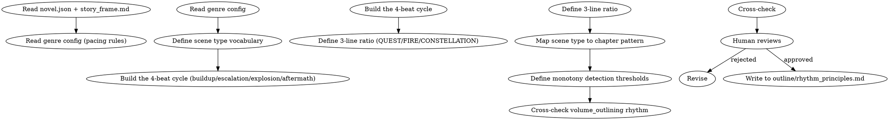

# 节奏设计

设计小说的整体节奏原则。负责铺垫→升级→爆发→余波的循环、场景类型序列防单调、三线比例。

## 流程



## 数据契约

- **Reads:** `novel.json`, `outline/story_frame.md`, `outline/volume_map.md`, `genre-config.json`
- **Writes:** 无
- **Updates:** `outline/rhythm_principles.md`

## 铁律

1. **循环必有四拍** — 每个叙事循环必须包含 铺垫/升级/爆发/余波，缺一拍 = 节奏残缺
2. **三线比例必协调** — QUEST（火线/任务）/ FIRE（情线/关系）/ CONSTELLATION（星线/世界观）必须同时存在，缺一 = 偏科
3. **场景类型不重复超 3 章** — 连续 3 章以上同一类型场景 = 必须插入不同类型
4. **节奏原则不与题材冲突** — 仙侠长铺垫、都市快节奏、历史厚重感，原则需匹配

## 核心设计

### 1. 四拍循环

| 拍 | 占比 | 作用 |
|----|------|------|
| 铺垫 (buildup) | 30-40% | 日常、信息、世界观铺设 |
| 升级 (escalation) | 30-40% | 小冲突累积、张力递增 |
| 爆发 (explosion) | 10-20% | 重大冲突、决策、转折 |
| 余波 (aftermath) | 15-25% | 情绪沉淀、关系变化、伏笔种植 |

完整循环约 8-15 章一次。卷末的爆发段可以延长为卷高潮。

### 2. 三线比例

| 线 | 含义 | 典型比例 | 失衡后果 |
|----|------|---------|---------|
| QUEST | 任务/冒险/主线推进 | 50-60% | 太多=流水账；太少=停滞 |
| FIRE | 关系/情感/羁绊 | 25-35% | 太多=恋爱脑；太少=冷血 |
| CONSTELLATION | 世界观/设定/智斗 | 15-25% | 太多=说教；太少=扁平 |

比例可随卷调整：开卷 CONSTELLATION 偏高铺垫，情感卷 FIRE 偏高。

### 3. 场景类型

至少定义 6-8 种场景类型：

| 类型 | 标志 |
|------|------|
| 战斗 | 高强度冲突 |
| 对话 | 信息/情感交流 |
| 日常 | 角色互动/生活 |
| 探索 | 新地点/新信息 |
| 修炼 | 能力提升/突破 |
| 阴谋 | 算计/政治 |
| 逃亡 | 危机/追击 |
| 揭示 | 真相/揭露 |

每卷使用全部类型，单卷内不连续 3 章同类型。

### 4. 单调性检测阈值

可由 `shenbi-chapter-pattern` 自动检测的指标：

- 连续 N 章同章尾收束方式（hook/transition/cliffhanger）
- 连续 N 章同开篇方式（dialogue/action/exposition）
- 连续 N 章同主导场景类型
- 连续 N 章同情感基调

阈值默认 N=3，超出报警。

## 输出格式

```markdown
# 节奏原则

**适用类型**: [玄幻/都市/历史/...]
**基调**: [快节奏/中节奏/慢节奏]
**单循环章节数**: 8-15
**创建时间**: YYYY-MM-DD

---

## 四拍循环

### 铺垫段（占 X%）

[描述：目的、典型场景、情绪基调、信息密度]

### 升级段（占 X%）

[描述：冲突累积方式、转折点密度]

### 爆发段（占 X%）

[描述：高潮类型、决战形式、决策压力]

### 余波段（占 X%）

[描述：沉淀方式、伏笔种植、关系固化]

## 三线比例

| 线 | 目标比例 | 第1卷实际 | 第2卷实际 | ... |
|----|---------|----------|----------|-----|
| QUEST | 50-60% | — | — | — |
| FIRE | 25-35% | — | — | — |
| CONSTELLATION | 15-25% | — | — | — |

## 场景类型序列

| 编号 | 类型 | 在循环中的位置 | 单调性警告阈值 |
|------|------|--------------|--------------|
| 1 | 战斗 | 升级/爆发 | ≤ 2 章连续 |
| 2 | 对话 | 铺垫/余波 | ≤ 3 章连续 |
| ... | ... | ... | ... |

## 章尾收束方式

- **hook**: 信息差/悬念（防冷场）
- **transition**: 平滑过渡（防断裂）
- **cliffhanger**: 强断点（防疲劳）
- **reflection**: 沉淀反思（防过密）

每种方式不连续使用超 3 章。

## 单调性检测规则

[详细列出触发报警的指标和阈值]

## 与题材的匹配

[说明该原则如何匹配当前题材的读者期待]
```

## 汇总

```markdown
## 节奏设计汇总

**写入文件**: `outline/rhythm_principles.md`
**循环长度**: X 章
**场景类型数**: Y
**三线目标比例**: QUEST X% / FIRE Y% / CONSTELLATION Z%

### 与已有大纲的一致性

- [ ] 四拍循环与 volume_map 的张力曲线吻合
- [ ] 三线比例与 story_frame 的三层冲突呼应
- [ ] 场景类型覆盖了所有 KR 节点

### 监控建议

- 每 10 章运行一次 `shenbi-chapter-pattern` 检测单调性
- 每卷末评估三线比例，调整下卷偏移
```

## Anti-Rationalization

| Excuse | Reality |
|--------|---------|
| "节奏凭感觉写就行" | 感觉 = 主观；原则 = 可检测可修正 |
| "战斗越多越爽" | 连续战斗 = 读者疲劳 = 弃书 |
| "三线平分最好" | 平分 = 没特色；不同卷应有不同侧重 |
| "节奏原则不用写" | 写下来才能跨章跨卷保持一致 |
